# ETHAGT01 — Sugestões de Diagramas

> 15 diagramas necessários para a apresentação.
> 7 já existem em `12-Diagrams/ETHAGT01/`. 8 novos a produzir.

---

## Diagramas Existentes (7)

| # | Slide | Arquivo | Descrição |
|---|---|---|---|
| D2 | 12 | `augmented-llm.mmd` | LLM + retrieval + tools + memory |
| D6 | 18 | `agent-loop.mmd` | Thought → Action → Observation em loop |
| D7 | 24 | `workflow-vs-agent.mmd` | Árvore de decisão workflow vs agente |
| D12 | 31/32 | `framework-comparison.mmd` | Python puro vs Framework (estrutura) |

> **Nota**: Os 4 diagramas existentes cobrem 4 dos 15 necessários. Os demais (D1, D3, D4, D5, D8, D9, D10, D11, D13, D14, D15) são novos.

---

## Diagramas Novos (8)

### D1 — Taxonomia Unificada (Slide 9)

**Tipo**: Mind map radial
**Descrição**: Hexágono com Brain no centro e 5 componentes ao redor (Perception, Planning, Action, Tool Use, Collaboration)
**Mermaid**:
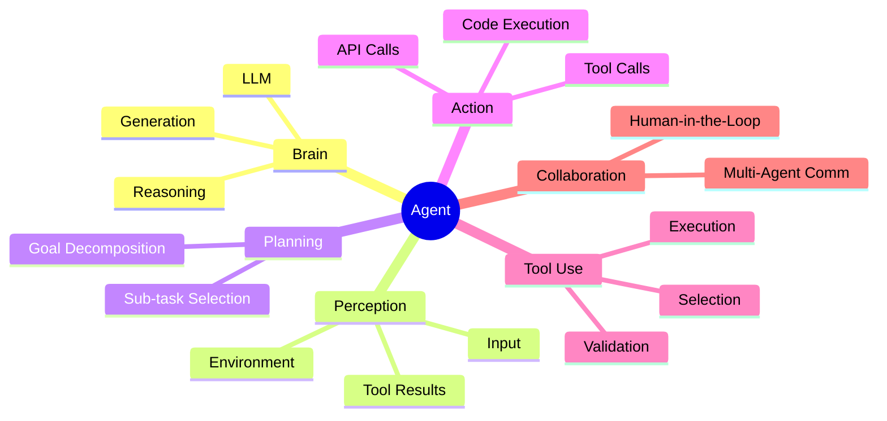
**Estilo**: Cada ramo em cor diferente. Centro em `etho-primary`.

---

### D3 — RAG Fixo vs RAG Agêntico (Slide 13)

**Tipo**: Comparação lado a lado
**Descrição**: Esquerda: pipeline linear (query → retrieve → generate). Direita: loop com decisão (query → modelo decide → retrieve ou resposta → generate)
**Mermaid**:
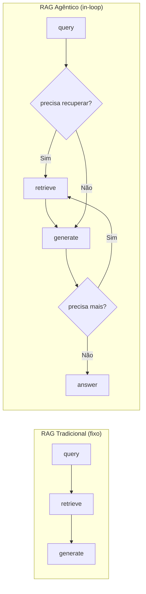

---

### D4 — Fluxo de Tool Calling (Slide 14)

**Tipo**: Diagrama de sequência
**Descrição**: LLM → tool_call (JSON) → execução → observation → LLM
**Mermaid**:
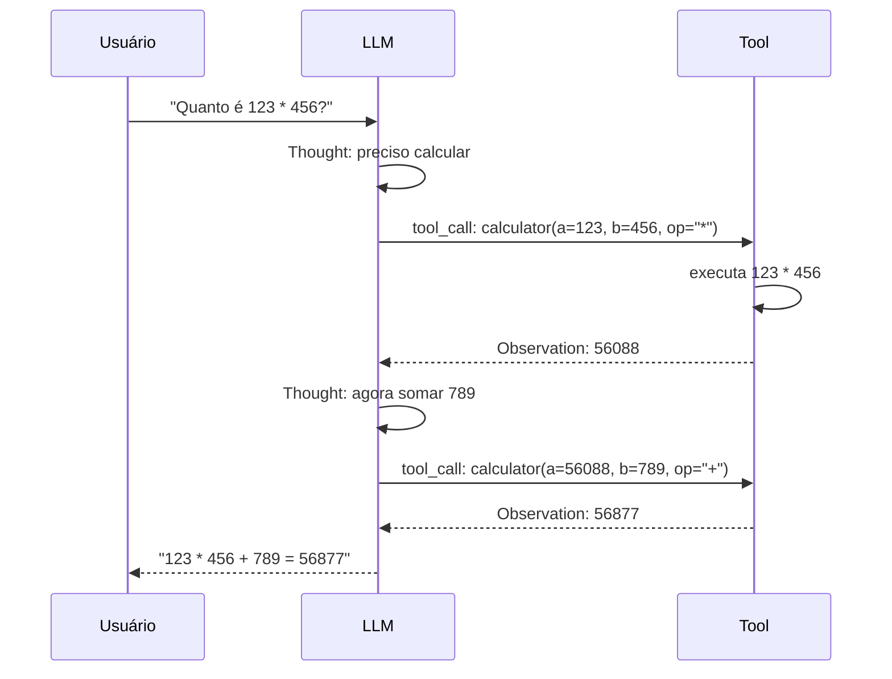

---

### D5 — Working vs Persistente Memory (Slide 15)

**Tipo**: Comparação
**Descrição**: Duas caixas: Context Window (efêmera) ↔ Checkpointer (persistente)
**Mermaid**:
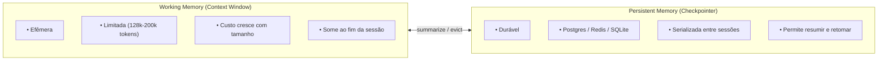

---

### D8 — 5 Workflows Canônicos (Slide 25)

**Tipo**: Grid de mini-diagramas
**Descrição**: 5 padrões em grade 2x3 (cada um com fluxo simples)
**Mermaid** (cada um separado):

**Prompt Chaining**:
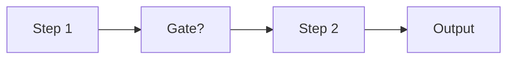

**Routing**:
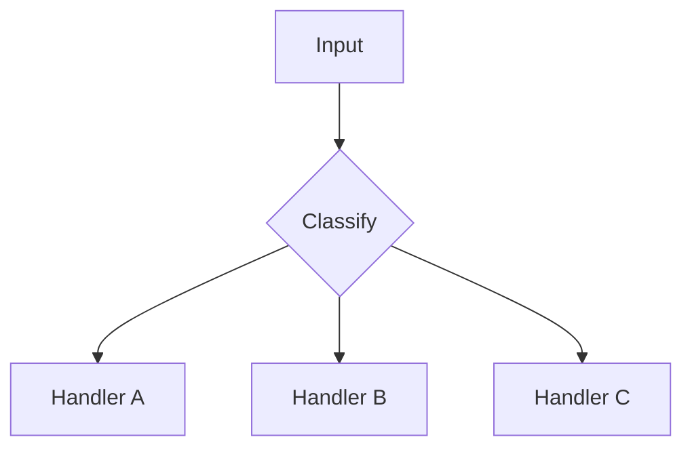

**Parallelization**:
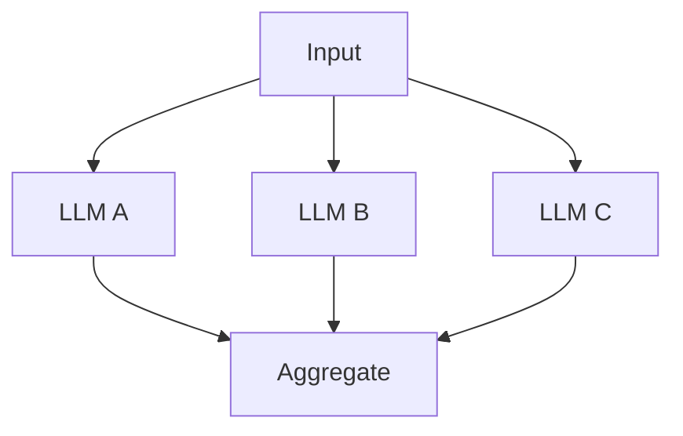

**Orchestrator-Workers**:
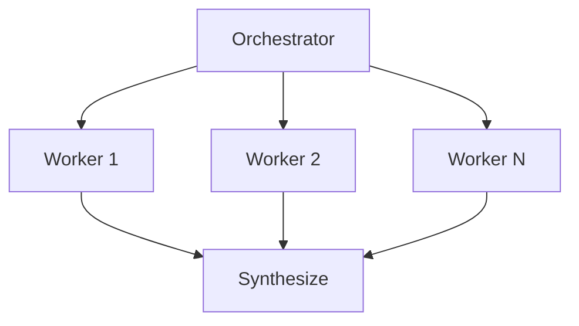

**Evaluator-Optimizer**:
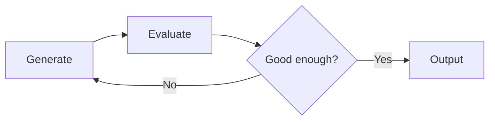

---

### D9 — Árvore de Decisão Detalhada (Slide 26)

**Tipo**: Fluxograma de decisão
**Descrição**: Árvore detalhada para decidir workflow vs agente vs agente+HITL
**Mermaid**:
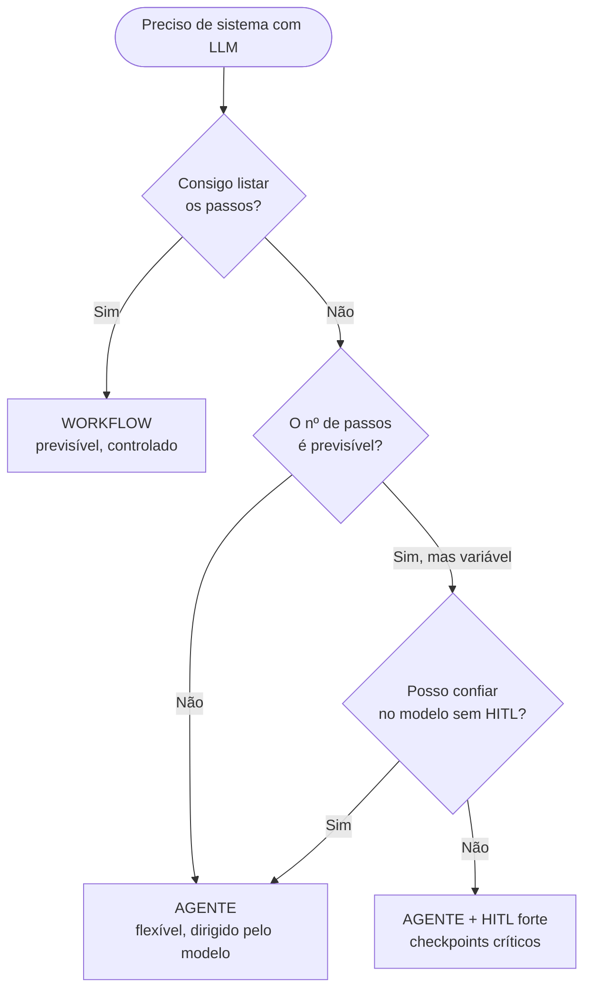

> **Nota**: Este diagrama já existe como `workflow-vs-agent.mmd`. Reutilizar.

---

### D10 — Pirâmide de Complexidade (Slide 27)

**Tipo**: Pirâmide
**Descrição**: 5 níveis de complexidade, do mais simples (base) ao mais complexo (topo)
**Mermaid**:
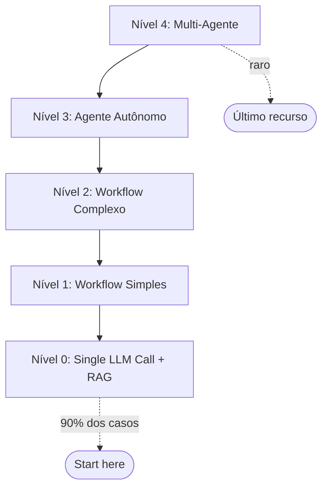

---

### D11 — Comparação 3 Implementações (Slide 30)

**Tipo**: 3 colunas comparativas
**Descrição**: Python puro (50 linhas), LangGraph (20 linhas), OpenAI SDK (15 linhas)
**Mermaid**:
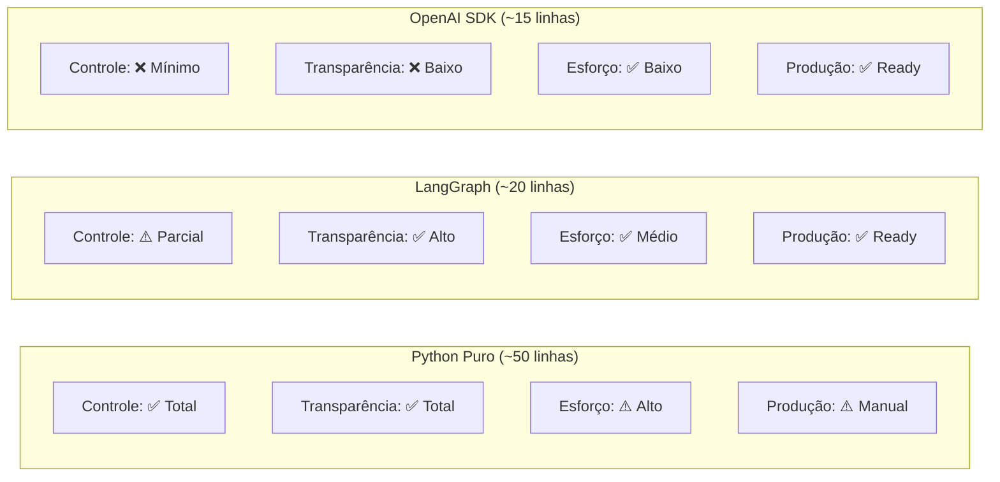

---

### D13 — Trace Tree / Spans (Slide 40)

**Tipo**: Árvore de spans com timeline
**Descrição**: Root span (Agent Run) com child spans (LLM calls, tool calls) em timeline
**Mermaid**:
```mermaid
flowchart TB
    Root["Agent Run (root span)"]
    Root --> S1["LLM Call #1 (step 0)"]
    S1 --> T1["Tool: calculator(123, 456, *)"]
    Root --> S2["LLM Call #2 (step 1)"]
    S2 --> T2["Tool: calculator(56088, 789, +)"]
    Root --> S3["LLM Call #3 (step 2 — answer)"]
    
    T1 -. 2.1s .- Timeline
    T2 -. 1.8s .- Timeline
    S3 -. 0.9s .- Timeline
```

---

### D14 — Arquitetura Coding Agent SWE-bench (Slide 45)

**Tipo**: Flowchart
**Descrição**: issue → Augmented LLM (Claude + tools + memory) → Agent Loop → patch
**Mermaid**:
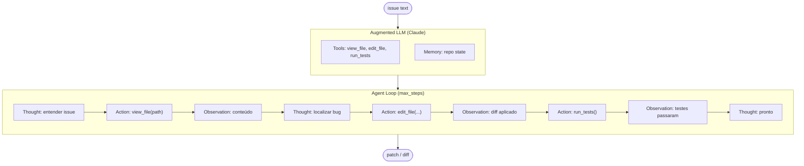

---

### D15 — Mapa da Especialização (Slide 56)

**Tipo**: Mind map radial
**Descrição**: ETHAGT01 no centro com conexões para módulos futuros
**Mermaid**:
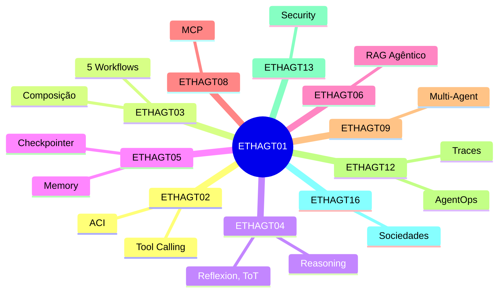

---

## Resumo de Produção

| # | Nome | Tipo | Status | Slide |
|---|---|---|---|---|
| D1 | Taxonomia unificada | Mind map | 🆕 Novo | 9 |
| D2 | Augmented LLM | Flowchart | ✅ Existe | 12 |
| D3 | RAG fixo vs agêntico | Comparação | 🆕 Novo | 13 |
| D4 | Tool calling sequence | Sequência | 🆕 Novo | 14 |
| D5 | Working vs persistent memory | Comparação | 🆕 Novo | 15 |
| D6 | Agent loop (ReAct) | Flowchart | ✅ Existe | 18 |
| D7 | Workflow vs agente | Fluxograma | ✅ Existe | 24 |
| D8 | 5 workflows canônicos | Grid | 🆕 Novo | 25 |
| D9 | Árvore de decisão | Fluxograma | ✅ = D7 | 26 |
| D10 | Pirâmide de complexidade | Pirâmide | 🆕 Novo | 27 |
| D11 | Comparação 3 implementações | Colunas | 🆕 Novo | 30 |
| D12 | Framework comparison | Flowchart | ✅ Existe | 31/32 |
| D13 | Trace tree (spans) | Árvore | 🆕 Novo | 40 |
| D14 | Coding agent SWE-bench | Flowchart | 🆕 Novo | 45 |
| D15 | Mapa da especialização | Mind map | 🆕 Novo | 56 |

**Total**: 4 existentes + 1 reutilizado + 8 novos = 13 diagramas únicos a produzir/manter.
