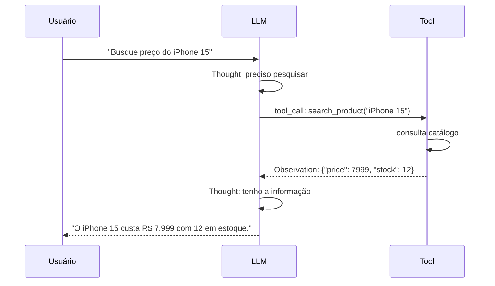
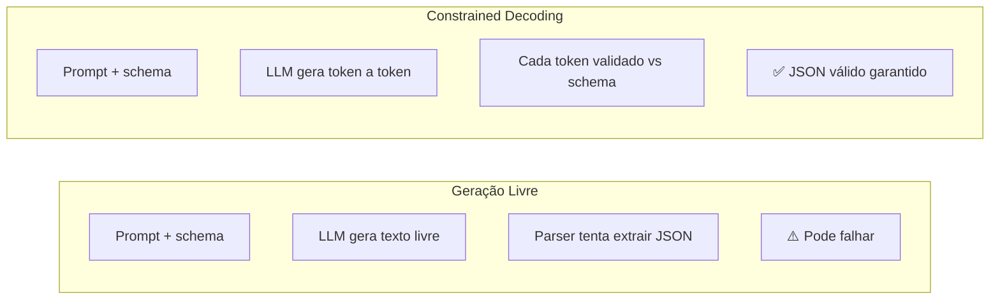
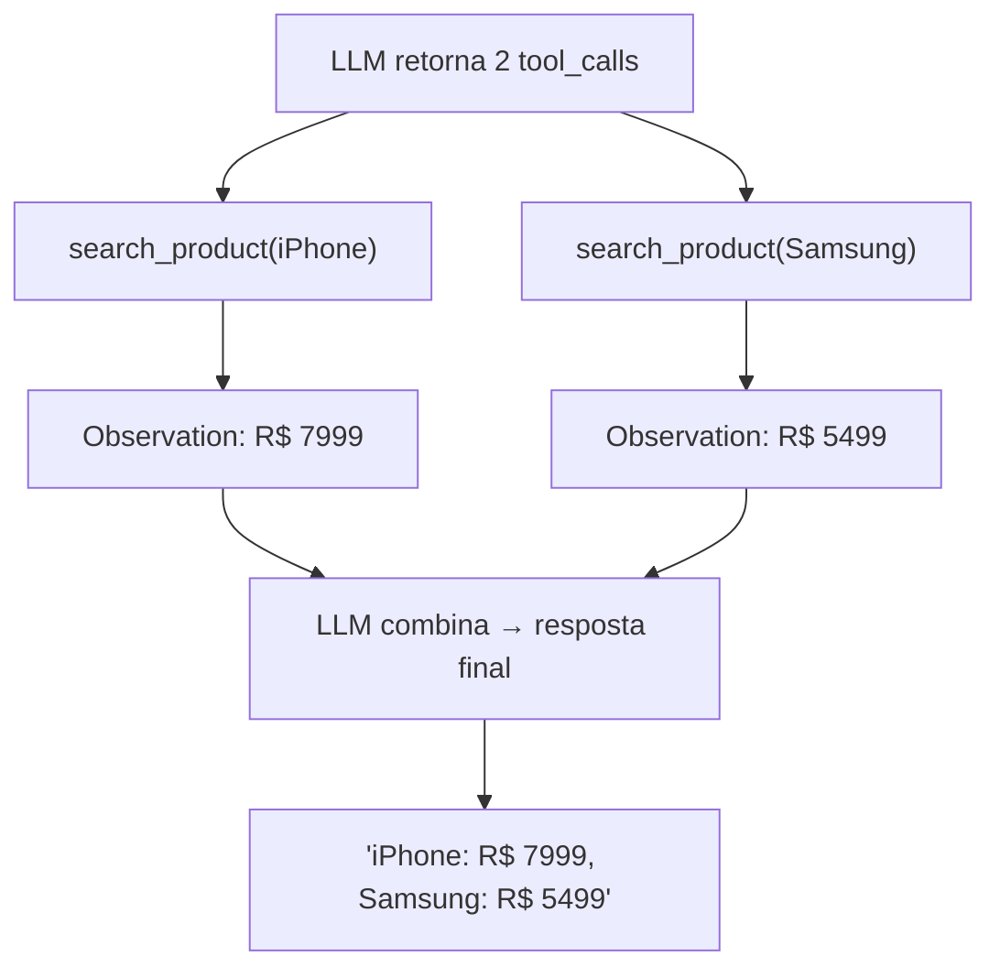
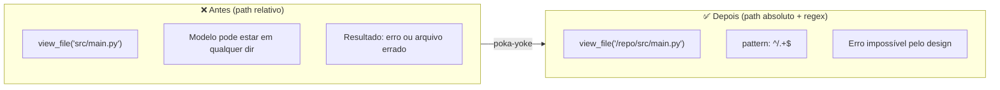
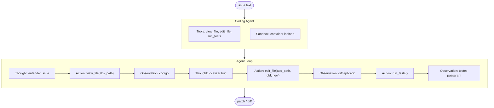
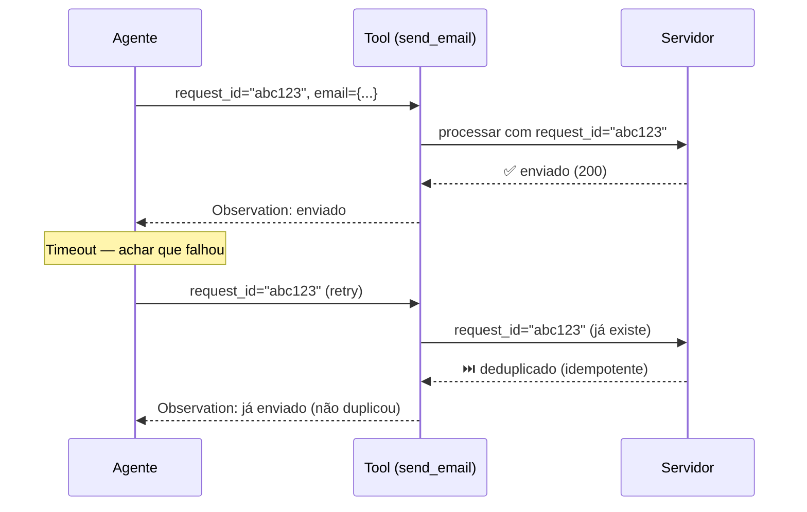
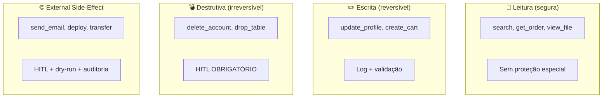
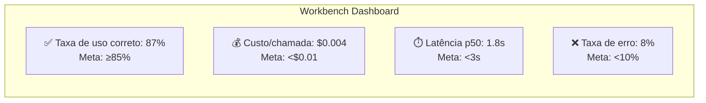

# ETHAGT02 — Sugestões de Diagramas

> 11 diagramas necessários para a apresentação.
> 3 já existem em `12-Diagrams/ETHAGT02/`. 8 novos a produzir.

---

## Diagramas Existentes (3)

| # | Slide | Arquivo | Descrição |
|---|---|---|---|
| D8 | 35 | `risk-matrix.mmd` | Matriz de risco 2×2 (reversibilidade × impacto) |
| D9 | 36 | `hitl-flow.mmd` | Fluxo HITL para tool destrutiva (agente → runtime → humano → tool real) |
| D10 | 42 | `aci-iteration-loop.mmd` | Loop de iteração ACI (design → workbench → medir → diagnosticar) |

> **Nota**: Os 3 diagramas existentes cobrem as seções E e F. Os demais são novos.

---

## Diagramas Novos (8)

### D1 — Fluxo de Function Calling (Slide 8)

**Tipo**: Diagrama de sequência
**Descrição**: Usuário → LLM → tool_call (JSON) → execução → observation → LLM → resposta
**Mermaid**:

---

### D2 — Structured Outputs / Constrained Decoding (Slide 10)

**Tipo**: Comparação
**Descrição**: Esquerda: geração livre (pode produzir JSON inválido). Direita: constrained decoding (token a token forçado ao schema)
**Mermaid**:

---

### D3 — Multi-tool Calls em Paralelo (Slide 11)

**Tipo**: Fluxograma
**Descrição**: Uma resposta do LLM com 2 tool_calls executadas em paralelo
**Mermaid**:

---

### D4 — Poka-yoke: Path Relativo → Absoluto (Slide 21)

**Tipo**: Antes/Depois
**Descrição**: Tool `view_file` antes aceitava paths relativos (erro possível). Depois exige path absoluto (erro impossível).
**Mermaid**:

---

### D5 — Arquitetura Coding Agent SWE-bench (Slide 25)

**Tipo**: Flowchart
**Descrição**: issue → agente com tools (view_file, edit_file, run_tests) em loop → patch
**Mermaid**:

---

### D6 — Idempotência com request_id (Slide 29)

**Tipo**: Fluxo de sequência
**Descrição**: Retry com mesma request_id → servidor detecta duplicata → retorna cache
**Mermaid**:

---

### D7 — Tipologia de Tools: 4 Tipos (Slide 31)

**Tipo**: Tabela visual
**Descrição**: 4 quadrantes com tipo de tool, exemplo, nível de proteção
**Mermaid**:

---

### D11 — Dashboard de Métricas (Slide 43)

**Tipo**: Mockup de dashboard
**Descrição**: 4 cards de métricas: taxa de uso correto, custo por chamada, latência, taxa de erro
**Mermaid**:

---

## Resumo de Produção

| # | Nome | Tipo | Status | Slide |
|---|---|---|---|---|
| D1 | Fluxo de function calling | Sequência | 🆕 Novo | 8 |
| D2 | Structured outputs | Comparação | 🆕 Novo | 10 |
| D3 | Multi-tool em paralelo | Fluxograma | 🆕 Novo | 11 |
| D4 | Poka-yoke path relativo→absoluto | Antes/Depois | 🆕 Novo | 21 |
| D5 | Coding agent SWE-bench | Flowchart | 🆕 Novo | 25 |
| D6 | Idempotência com request_id | Sequência | 🆕 Novo | 29 |
| D7 | Tipologia de 4 tipos de tools | Tabela visual | 🆕 Novo | 31 |
| D8 | Matriz de risco 2×2 | Matriz | ✅ Existe | 35 |
| D9 | HITL flow | Flowchart | ✅ Existe | 36 |
| D10 | Workbench iteration loop | Loop | ✅ Existe | 42 |
| D11 | Dashboard de métricas | Mockup | 🆕 Novo | 43 |

**Total**: 3 existentes + 8 novos = 11 diagramas a produzir/manter.
