# ETHAGT03 — Sugestões de Diagramas

> 30 diagramas necessários para a apresentação.
> 6 já existem em `12-Diagrams/ETHAGT03/`. 1 reutilizado de `12-Diagrams/ETHAGT01/`. 23 novos a produzir.

---

## Diagramas Existentes (7)

| # | Slide | Arquivo | Descrição |
|---|---|---|---|
| D2 | 8 | `ETHAGT01/workflow-vs-agent.mmd` | Árvore de decisão workflow vs agente (recap) |
| D5 | 12 | `prompt-chaining.mmd` | Cadeia LLM → gate → LLM com fallback |
| D9 | 19 | `routing.mmd` | Classifier → N handlers especializados + fallback |
| D12 | 25 | `parallelization.mmd` (lado sectioning) | Input → particionar → N LLMs → aggregator |
| D13 | 26 | `parallelization.mmd` (lado voting) | Input → replicar → N tentativas → aggregator |
| D19 | 36 | `orchestrator-workers.mmd` | Orchestrator decompõe → N workers → synthesizer |
| D21 | 41 | `evaluator-optimizer.mmd` | Generator → evaluator → loop de refinamento |
| D25 | 48 | `composition-routing-parallel-evaluator.mmd` | Composição de 3 camadas |

> **Nota**: Os diagramas existentes cobrem 8 dos 30 necessários. Os demais são novos.

---

## Diagramas Novos (23)

### D1 — Pirâmide de Níveis de Complexidade (Slide 7)

**Tipo**: Pirâmide
**Descrição**: 5 níveis de complexidade, do mais simples (base) ao mais complexo (topo)
**Mermaid**:
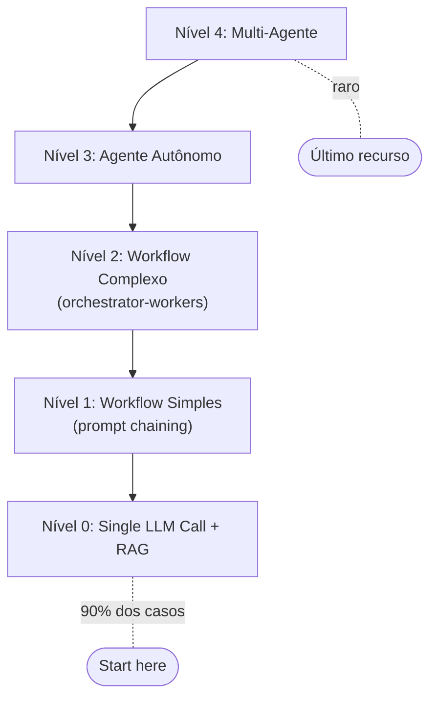
**Estilo**: Base larga em `etho-success`, topo em `etho-danger`. "Start here" em `etho-accent`.

---

### D3 — 5 Workflows Canônicos em Grid (Slide 9)

**Tipo**: Grid de mini-diagramas
**Descrição**: 5 padrões em grade 2x3 (cada um com fluxo simples) + 1 célula de legenda
**Mermaid** (cada um como mini-card):

**Prompt Chaining**: `A[Step 1] --> B{Gate} --> C[Step 2] --> D[Output]`
**Routing**: `I[Input] --> C{Classify} --> A[Handler A] / B[Handler B] / C[Handler C]`
**Parallelization**: `I[Input] --> A[LLM A] / B[LLM B] / C[LLM C] --> Agg[Aggregate]`
**Orchestrator-Workers**: `O[Orchestrator] --> W1[W1] / W2[W2] / W3[WN] --> S[Synthesize]`
**Evaluator-Optimizer**: `G[Generate] --> E{Evaluate} -->|No| G -->|Yes| O[Output]`

**Estilo**: Cada mini-diagrama em cor própria. Grid em fundo `etho-light`.

---

### D4 — Tabela "Quando Cada Padrão Brilha" (Slide 10)

**Tipo**: Tabela 5×3
**Descrição**: 5 padrões × (quando usar, quando evitar)
**Estilo**: Colorida por intensidade. Coluna "usar" em `etho-success`, "evitar" em `etho-danger`.

---

### D6 — Checklist de Tipos de Gate (Slide 13)

**Tipo**: Checklist com ícones
**Descrição**: 4 tipos de gate (validação estrutural, classificação, formatação, filtro de qualidade)
**Mermaid**:
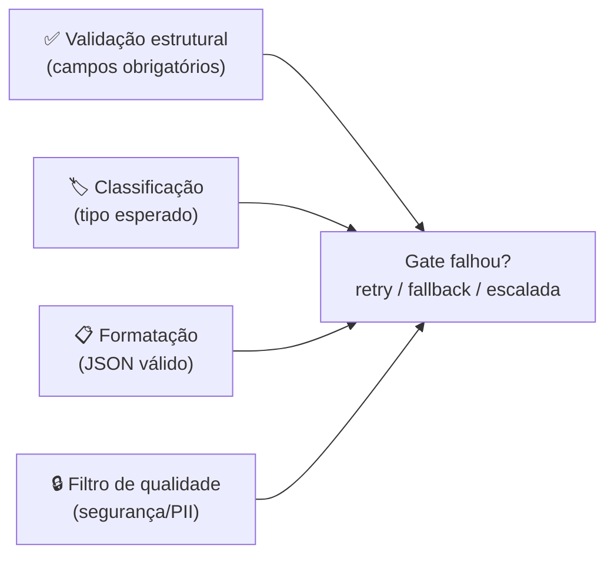

---

### D7 — Gráfico Latência vs Accuracy (Slide 14)

**Tipo**: Gráfico de linha
**Descrição**: Curva de ganho marginal — latência cresce, accuracy atinge platô
**Estilo**: Eixo X = latência (s), Eixo Y = accuracy (%). Curva cresce e estabiliza. Marcar "ponto ótimo".

---

### D8 — Funil de Routing (Slide 18)

**Tipo**: Funil
**Descrição**: Input → router → N caminhos especializados
**Mermaid**:
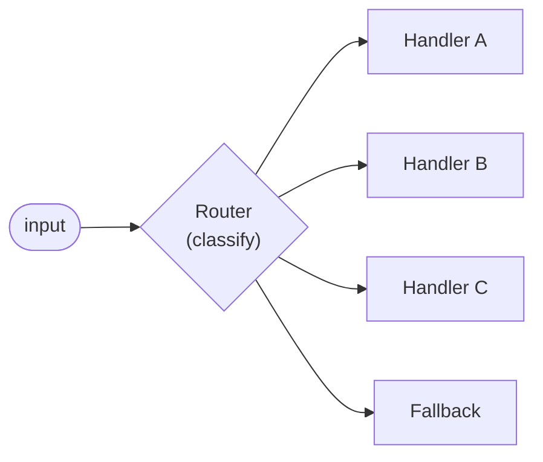

---

### D10 — Router com Diferentes Toolsets (Slide 20)

**Tipo**: Flowchart
**Descrição**: Router → 3 paths com diferentes conjuntos de tools
**Mermaid**:
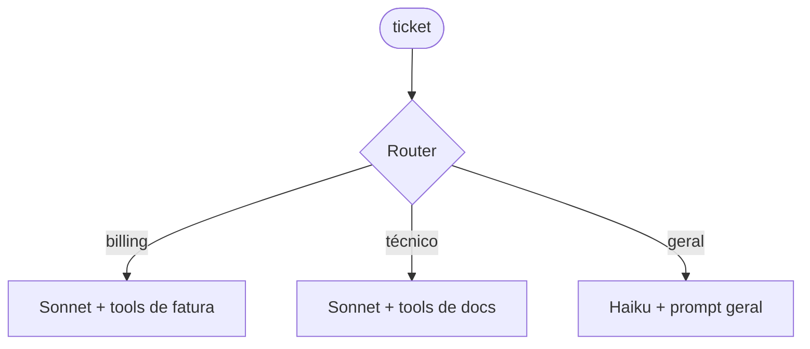

---

### D11 — Matriz de Confusão 3×3 (Slide 21)

**Tipo**: Matriz
**Descrição**: Matriz de confusão para classificador de tickets (técnico/billing/geral)
**Estilo**: Diagonal (acertos) em `etho-success`, off-diagonal (erros) em `etho-danger`.

---

### D14 — Guardrails em Paralelo (Slide 27)

**Tipo**: Comparação de 2 lanes
**Descrição**: Lane 1: modelo gera resposta; Lane 2: guardrail filtra — em paralelo
**Mermaid**:
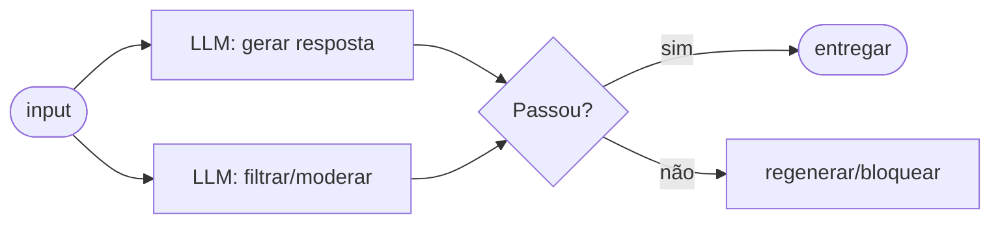

---

### D15 — LLM-as-Judge em Paralelo (Slide 28)

**Tipo**: Flowchart
**Descrição**: Saída → N juízes em paralelo → agregação de scores
**Mermaid**:
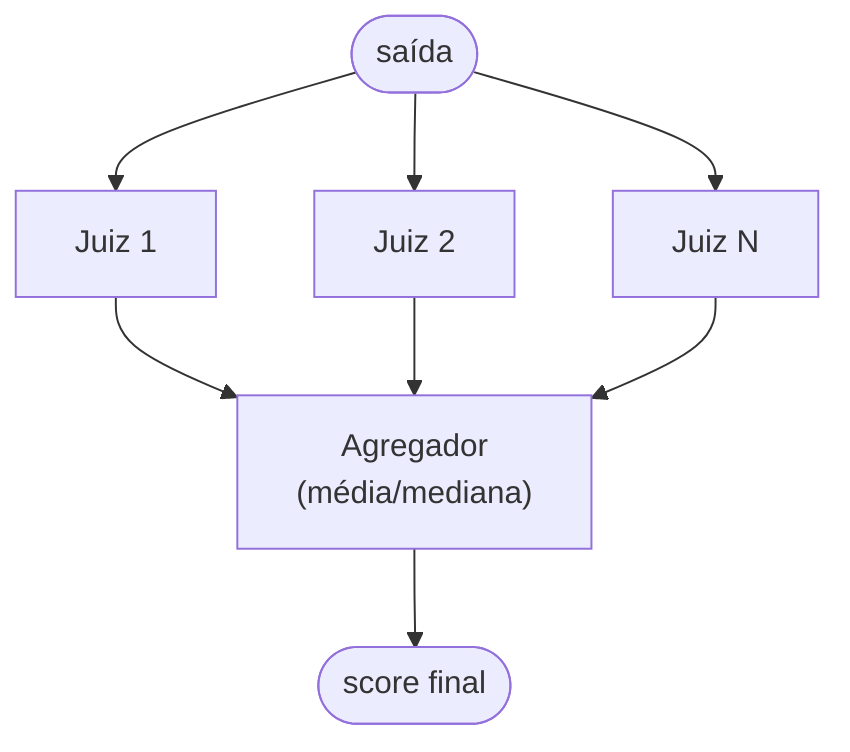

---

### D16 — Erros Comuns (4 ícones) (Slide 29)

**Tipo**: Ícones de perigo
**Descrição**: 4 armadilhas de parallelization
**Estilo**: 4 cards em `etho-danger` com ícones: elo quebrado (dependência oculta), explosão (custo), funil entupido (reducer ruim), ampulheta (timeout).

---

### D17 — Parallelization Fixa vs Dinâmica (Slide 34)

**Tipo**: Comparação lado a lado
**Descrição**: Esquerda: parallelization com subtarefas fixas; Direita: orchestrator-workers com subtarefas dinâmicas
**Mermaid**:
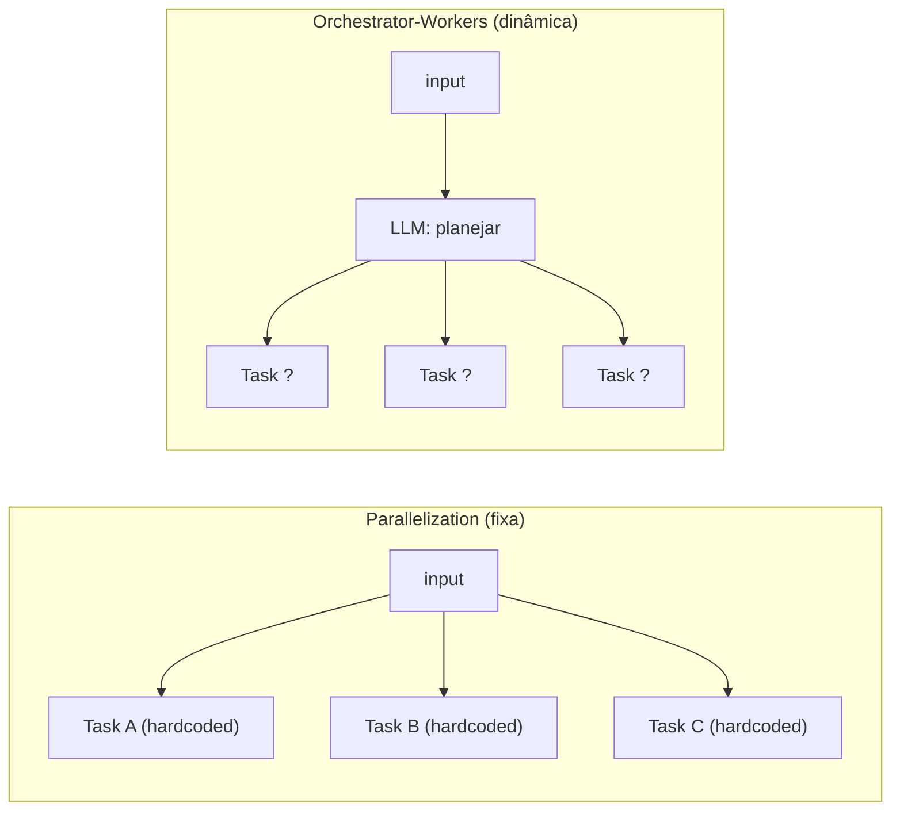

---

### D18 — Ciclo Planejar → Delegar → Sintetizar (Slide 35)

**Tipo**: Ciclo
**Descrição**: Ciclo das 3 fases do orquestrador
**Mermaid**:
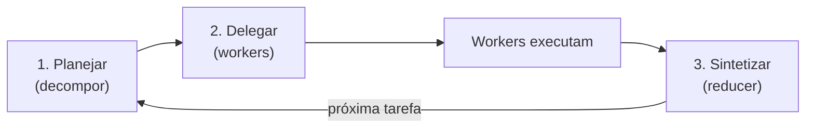

---

### D20 — 3 Casos de Uso em Cards (Slide 37)

**Tipo**: Cards
**Descrição**: 3 cenários reais de orchestrator-workers (coding multi-arquivo, search multi-fonte, relatório)
**Estilo**: 3 cards com ícones (código, busca, documento).

---

### D22 — Checklist de 3 Condições (Slide 42)

**Tipo**: Checklist
**Descrição**: 3 condições para evaluator-optimizer ter valor
**Mermaid**:
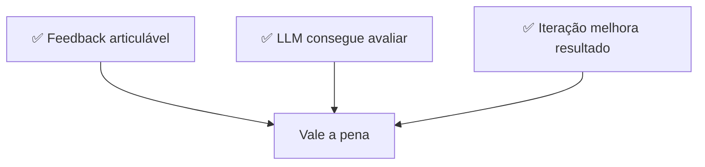

---

### D23 — Rubric de Tradução (Slide 43)

**Tipo**: Tabela
**Descrição**: Rubric estruturada para avaliação de tradução (fidelidade, fluência, terminologia)
**Estilo**: Tabela 3×6 (3 dimensões × 5 níveis + header). Cores graduadas de vermelho a verde.

---

### D24 — Gráfico de Convergência (Slide 44)

**Tipo**: Gráfico
**Descrição**: Score vs iteração com 3 linhas de parada (threshold, max iters, delta estagnado)
**Estilo**: Eixo X = iteração, Y = score. Curva cresce e estabiliza. Linhas horizontais (threshold) e vertical (max iters).

---

### D26 — Espectro Workflow ↔ Agente (Slide 49)

**Tipo**: Espectro/gradiente
**Descrição**: Workflow puro ←→ Workflow composto ←→ Agente
**Mermaid**:
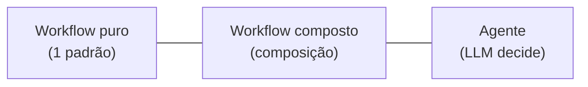
**Estilo**: Gradiente de `etho-info` (workflow) para `etho-accent` (agente).

---

### D27 — Sinais de Alerta (Slide 50)

**Tipo**: Checklist de perigo
**Descrição**: 5 sinais de que você está forçando workflow em problema que pede agente
**Estilo**: 5 itens em `etho-danger` com ícones de alerta.

---

### D28 — Trade-offs Consolidados (Slide 51)

**Tipo**: Tabela heatmap 5×4
**Descrição**: 5 padrões × 4 eixos (previsibilidade, flexibilidade, custo, latência)
**Estilo**: Colorida por intensidade: verde=baixo, amarelo=médio, vermelho=alto.

---

### D29 — Arquitetura Caso Coinbase/Intercom (Slide 53)

**Tipo**: Flowchart
**Descrição**: Arquitetura real de suporte ao cliente: routing → parallelization → evaluator-optimizer
**Estilo**: Baseado em `composition-routing-parallel-evaluator.mmd` com labels do caso real.

---

### D30 — Mapa da Especialização (Slide 62)

**Tipo**: Mind map radial
**Descrição**: ETHAGT03 no centro com conexões para ETHAGT04, ETHAGT09, ETHAGT10, ETHAGT90
**Mermaid**:
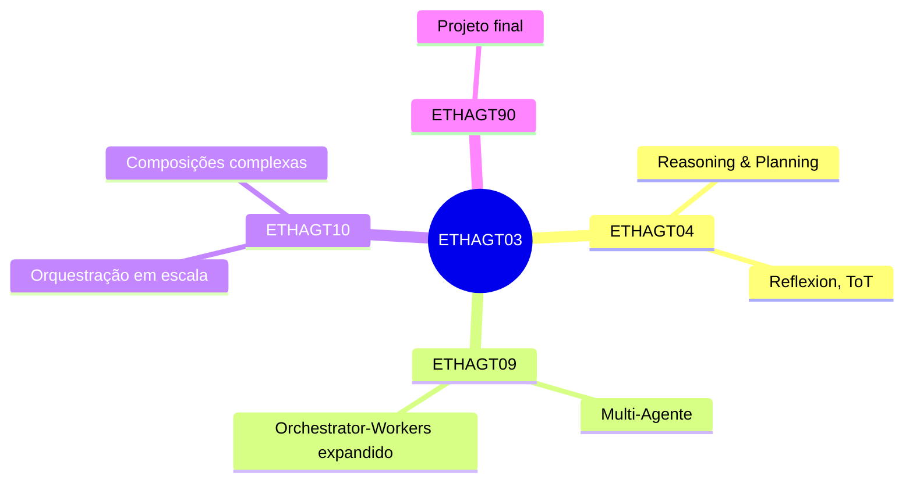

---

## Resumo de Produção

| # | Nome | Tipo | Status | Slide |
|---|---|---|---|---|
| D1 | Pirâmide de níveis | Pirâmide | 🆕 Novo | 7 |
| D2 | Workflow vs agente (recap) | Fluxograma | ✅ Existe (ETHAGT01) | 8 |
| D3 | 5 workflows canônicos (grid) | Grid | 🆕 Novo | 9 |
| D4 | Tabela quando brilha | Tabela | 🆕 Novo | 10 |
| D5 | Prompt chaining | Flowchart | ✅ Existe | 12 |
| D6 | Checklist de gates | Checklist | 🆕 Novo | 13 |
| D7 | Latência vs accuracy | Gráfico | 🆕 Novo | 14 |
| D8 | Funil de routing | Funil | 🆕 Novo | 18 |
| D9 | Routing | Flowchart | ✅ Existe | 19 |
| D10 | Router com toolsets | Flowchart | 🆕 Novo | 20 |
| D11 | Matriz de confusão 3×3 | Matriz | 🆕 Novo | 21 |
| D12 | Parallelization — sectioning | Flowchart | ✅ Existe | 25 |
| D13 | Parallelization — voting | Flowchart | ✅ Existe | 26 |
| D14 | Guardrails em paralelo | Comparação | 🆕 Novo | 27 |
| D15 | LLM-as-judge em paralelo | Flowchart | 🆕 Novo | 28 |
| D16 | Erros comuns (4 ícones) | Ícones | 🆕 Novo | 29 |
| D17 | Parallelization vs dinâmica | Comparação | 🆕 Novo | 34 |
| D18 | Ciclo orquestrador | Ciclo | 🆕 Novo | 35 |
| D19 | Orchestrator-workers | Flowchart | ✅ Existe | 36 |
| D20 | 3 casos de uso | Cards | 🆕 Novo | 37 |
| D21 | Evaluator-optimizer | Flowchart | ✅ Existe | 41 |
| D22 | Checklist de 3 condições | Checklist | 🆕 Novo | 42 |
| D23 | Rubric de tradução | Tabela | 🆕 Novo | 43 |
| D24 | Gráfico de convergência | Gráfico | 🆕 Novo | 44 |
| D25 | Composição routing→parallel→evaluator | Flowchart | ✅ Existe | 48 |
| D26 | Espectro workflow↔agente | Espectro | 🆕 Novo | 49 |
| D27 | Sinais de alerta | Checklist | 🆕 Novo | 50 |
| D28 | Trade-offs consolidados | Tabela | 🆕 Novo | 51 |
| D29 | Arquitetura Coinbase/Intercom | Flowchart | 🆕 Novo | 53 |
| D30 | Mapa da especialização | Mind map | 🆕 Novo | 62 |

**Total**: 8 existentes (7 de ETHAGT03 + 1 reutilizado de ETHAGT01) + 23 novos = 31 entradas (30 únicos).
