# ETHAGT04 — Sugestões de Diagramas

> 16 diagramas necessários para a apresentação.
> 4 já existem em `12-Diagrams/ETHAGT04/`. 12 novos a produzir.

---

## Diagramas Existentes (4)

| # | Slide | Arquivo | Descrição |
|---|---|---|---|
| D3 | 9 | `reasoning-spectrum.mmd` | Espectro do raciocínio: CoT → ReAct → ToT/LATS → reasoning nativo |
| D6 | 21 | `plan-execute.mmd` | Planner → plano → Executor → Replanner (loop) |
| D8 | 33 | `tot-search-tree.mmd` | Árvore de busca ToT com avaliação de estados e poda |
| D10 | 48 | `reflexion-loop.mmd` | Tentativa → Evaluator → Reflector → memória → nova tentativa |

> **Nota**: Os 4 diagramas existentes cobrem os fluxos centrais. Os demais aprofundam cada técnica.

---

## Diagramas Novos (12)

### D1 — Taxonomia Linear vs Árvore vs Grafo (Slide 11)

**Tipo**: Comparação lado a lado
**Descrição**: Três estruturas de raciocínio: linear (cadeia), árvore (ramificações com poda), grafo (nós interconectados com revisit)
**Mermaid**:
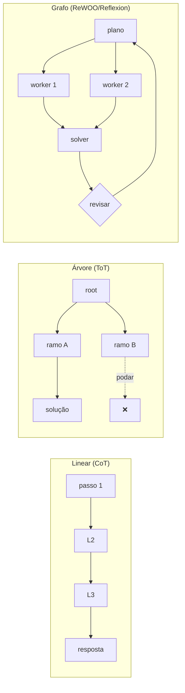

---

### D2 — Chain-of-Thought: Zero-shot vs Few-shot (Slide 13)

**Tipo**: Comparação
**Descrição**: Esquerda: prompt direto sem exemplo de raciocínio. Direita: prompt com exemplo "pensando passo a passo"
**Mermaid**:
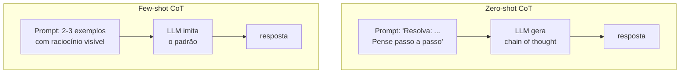

---

### D4 — Self-Consistency (Slide 15)

**Tipo**: Diagrama de fluxo
**Descrição**: Mesmo prompt → N amostras (temperatura alta) → N cadeias de pensamento → votação da maioria
**Mermaid**:
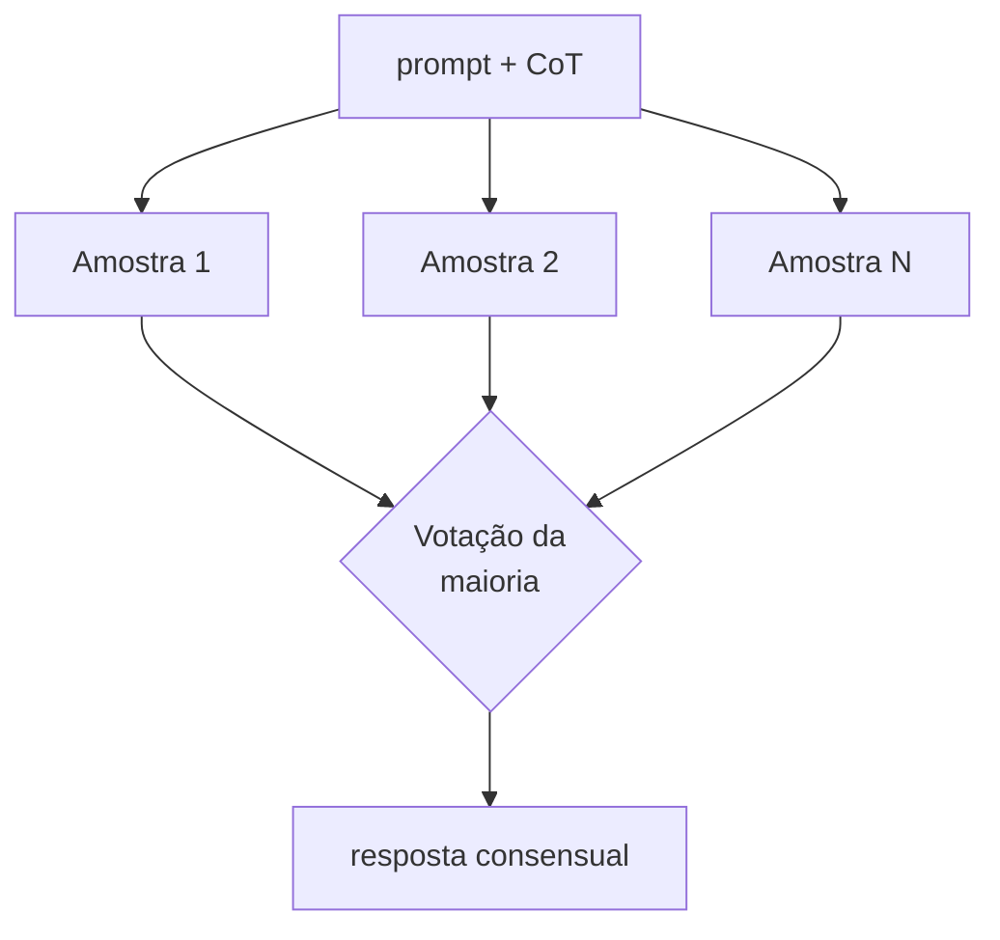

---

### D5 — Raciocínio Antes vs Durante a Ação (Slide 16)

**Tipo**: Comparação lado a lado
**Descrição**: Esquerda: planeja tudo antes (Plan-and-Execute). Direita: raciocina a cada step (ReAct)
**Mermaid**:
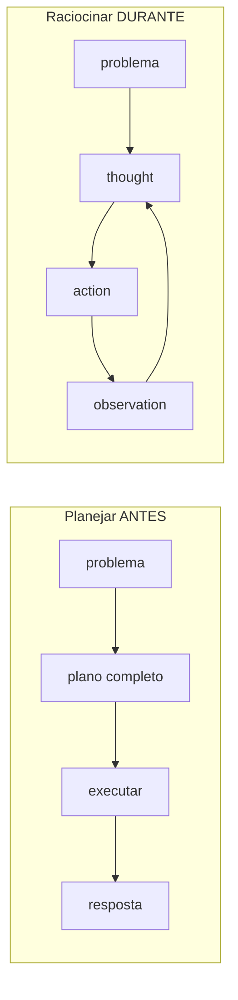

---

### D7 — ReWOO: Plano Cego + Evidências Paralelas (Slide 24)

**Tipo**: Flowchart
**Descrição**: Planner gera plano com variáveis (#E1, #E2...) → Workers executam em paralelo → Solver substitui variáveis com evidências
**Mermaid**:
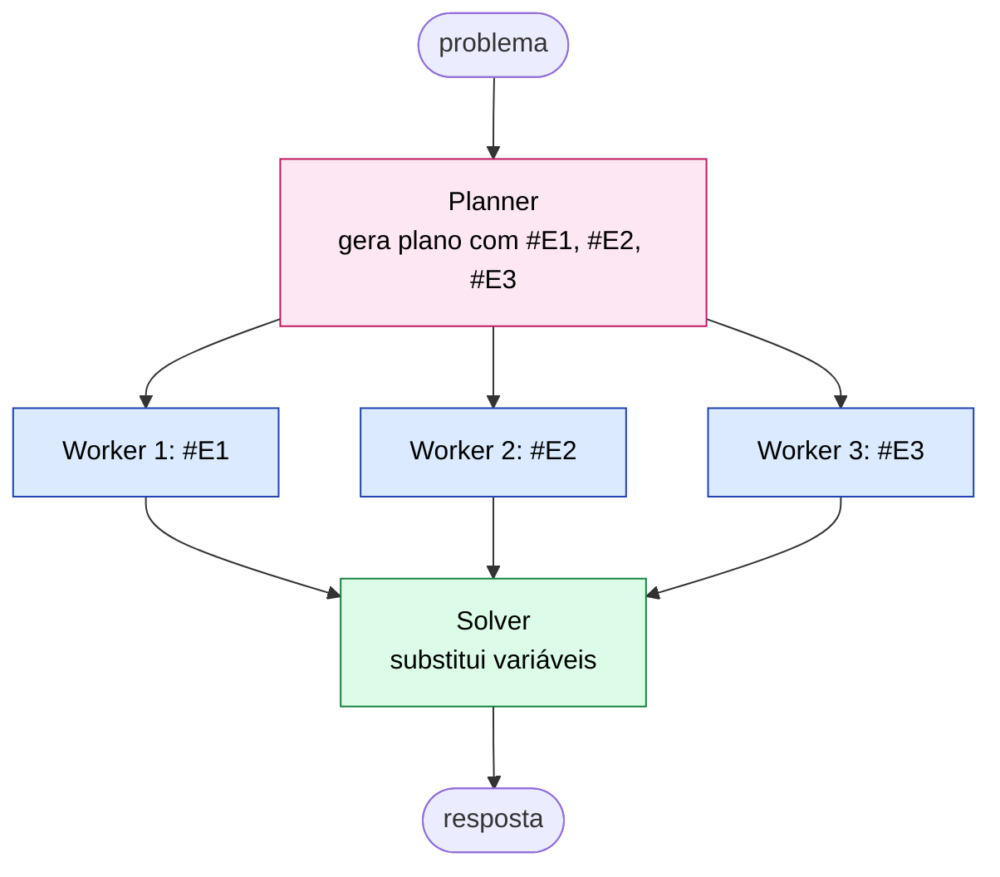

---

### D9 — LATS: MCTS + LLM (Slide 37)

**Tipo**: Flowchart
**Descrição**: Seleção → Expansão → Avaliação (LLM) → Simulação → Backpropagation, com memória externa
**Mermaid**:
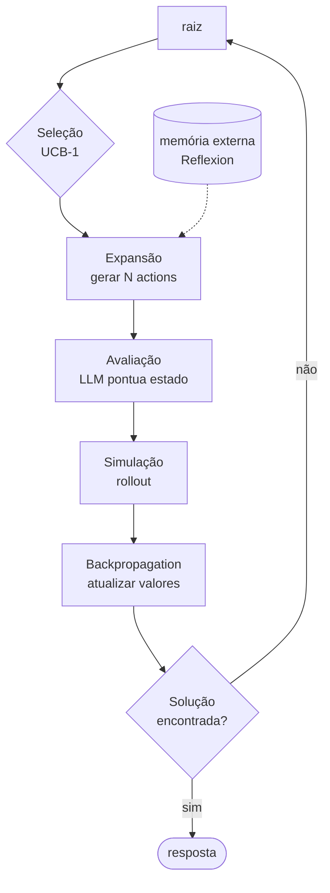

---

### D11 — Reflexion: Estrutura de Memória (Slide 49)

**Tipo**: Diagrama de dados
**Descrição**: Estrutura da memória episódica de reflexões — cada tentativa gera uma reflexão verbal armazenada
**Mermaid**:
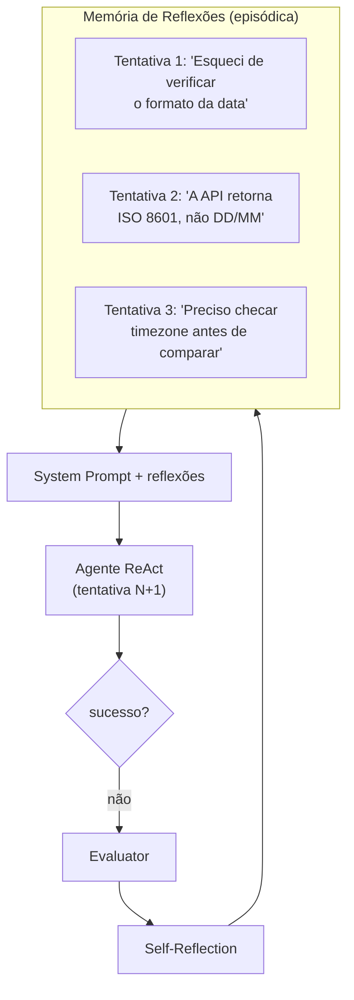

---

### D12 — Reflexion vs Reflection Pattern Simples (Slide 52)

**Tipo**: Comparação
**Descrição**: Esquerda: reflection simples (critica e reescreve na mesma sessão). Direita: Reflexion (memória persiste entre tentativas, aprende com falhas anteriores)
**Mermaid**:
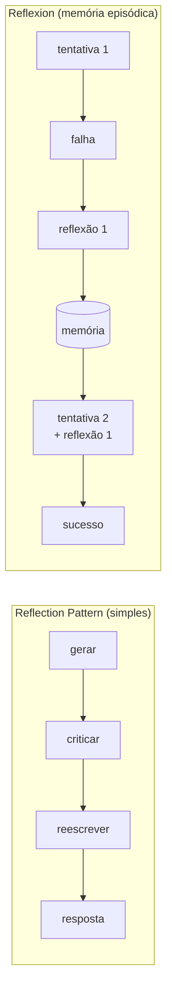

---

### D13 — Self-Discover: Composição de Primitivas (Slide 58)

**Tipo**: Flowchart
**Descrição**: Fase 1 (Select) escolhe primitivas → Fase 2 (Adapt) adapta ao problema → Fase 3 (Implement) compõe reasoning module
**Mermaid**:
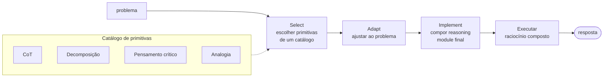

---

### D14 — Inference-Time Reasoning: Promptado vs Nativo (Slide 66)

**Tipo**: Comparação
**Descrição**: Esquerda: CoT promptado (você escreve "pense passo a passo"). Direita: reasoning model nativo (modelo pensa internamente, hidden chain)
**Mermaid**:
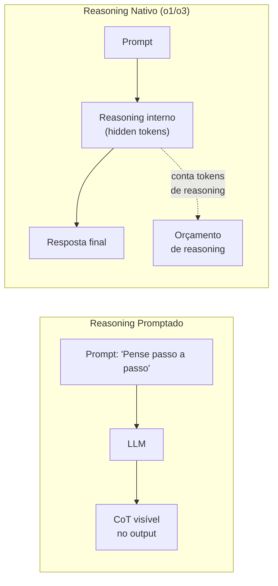

---

### D15 — Detecção de Loops (Slide 77)

**Tipo**: Diagrama de estado
**Descrição: Como detectar e quebrar loops: janela deslizante, hash de actions, contador de repetição
**Mermaid**:
```mermaid
flowchart TD
    Action[action atual] --> Hash{hash(action)<br/>em janela<br/>das últimas K?}
    Hash -- sim, ≥3x --> Alert[⚠️ LOOP detectado]
    Alert --> Break["Quebrar:<br/>1. Injetar reflexão<br/>2. Forçar replanejamento<br/>3. Escalar para HITL"]
    Hash -- não --> Continue[continuar execução]
    Break --> Result[nova action]
```

---

### D16 — Mapa de Decisão: Qual Técnica Usar? (Slide 85)

**Tipo**: Fluxograma de decisão
**Descrição**: Árvore de decisão para escolher a técnica de raciocínio
**Mermaid**:
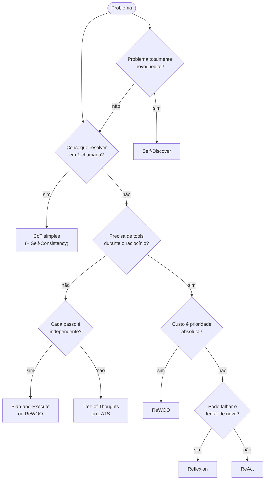

---

## Resumo de Produção

| # | Nome | Tipo | Status | Slide |
|---|---|---|---|---|
| D1 | Linear vs árvore vs grafo | Comparação | 🆕 Novo | 11 |
| D2 | CoT zero-shot vs few-shot | Comparação | 🆕 Novo | 13 |
| D3 | Espectro do raciocínio | Flowchart | ✅ Existe | 9 |
| D4 | Self-Consistency | Fluxo | 🆕 Novo | 15 |
| D5 | Antes vs durante a ação | Comparação | 🆕 Novo | 16 |
| D6 | Plan-and-Execute | Flowchart | ✅ Existe | 21 |
| D7 | ReWOO (plano cego) | Flowchart | 🆕 Novo | 24 |
| D8 | ToT search tree | Árvore | ✅ Existe | 33 |
| D9 | LATS (MCTS + LLM) | Flowchart | 🆕 Novo | 37 |
| D10 | Reflexion loop | Flowchart | ✅ Existe | 48 |
| D11 | Memória de Reflexion | Dados | 🆕 Novo | 49 |
| D12 | Reflexion vs Reflection simples | Comparação | 🆕 Novo | 52 |
| D13 | Self-Discover composição | Flowchart | 🆕 Novo | 58 |
| D14 | Promptado vs nativo | Comparação | 🆕 Novo | 66 |
| D15 | Detecção de loops | Estado | 🆕 Novo | 77 |
| D16 | Árvore de decisão de técnica | Decisão | 🆕 Novo | 85 |

**Total**: 4 existentes + 12 novos = 16 diagramas.
