# ETHAGT05 — Sugestões de Diagramas

> 16 diagramas necessários para a apresentação.
> 3 já existem em `12-Diagrams/ETHAGT05/`. 13 novos a produzir.

---

## Diagramas Existentes (3)

| # | Slide | Arquivo | Descrição |
|---|---|---|---|
| D3 | 14 | `memory-layers.mmd` | 4 camadas integradas (working, episódica, semântica, procedural) + checkpointer |
| D6 | 24 | `checkpointer-resume.mmd` | Fluxo pause/resume com thread_id e HITL |
| D9 | 36 | `eviction-flow.mmd` | Política de eviction: relevância × idade × entidade crítica |

> **Nota**: Os 3 diagramas existentes cobrem os fluxos centrais do módulo. Os demais (D1, D2, D4, D5, D7, D8, D10, D11, D12, D13, D14, D15, D16) são novos.

---

## Diagramas Novos (13)

### D1 — Recall Accuracy vs Posição no Contexto (Slide 9)

**Tipo**: Gráfico de linha (curva U)
**Descrição**: Acurácia de recall em função da posição do token no contexto. Curva em U: alta no início, baixa no meio, alta no fim.
**Mermaid**:
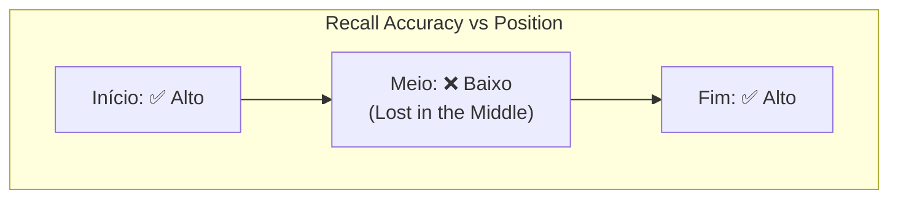
**Estilo**: Curva em U, início e fim em `etho-success`, meio em `etho-danger`.
**Fonte**: Liu et al. *Lost in the Middle* (arXiv:2307.03172).

---

### D2 — Comparação 4 Camadas de Memória (Slide 13)

**Tipo**: Tabela 4×4
**Descrição**: Grid comparativo das 4 camadas de memória (Working, Episódica, Semântica, Procedural) com eixos: o que armazena, onde, como recupera, quando usar.
**Mermaid**:
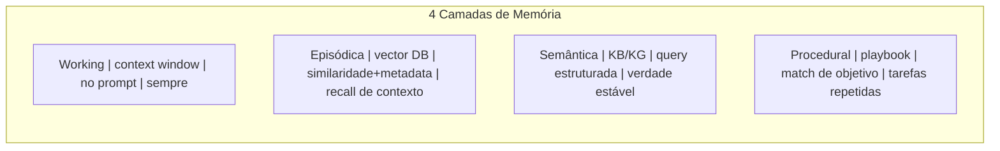
**Estilo**: Cada coluna em cor distinta (`etho-info`, `etho-accent`, `etho-success`, `etho-warning`).

---

### D4 — MemGPT: Analogia SO (Slide 16)

**Tipo**: Analogia visual
**Descrição**: Comparação lado a lado: Sistema Operacional (RAM + Disco + Gerenciamento de Memória) vs LLM (Context Window + Memória Persistente + Self-editing).
**Mermaid**:
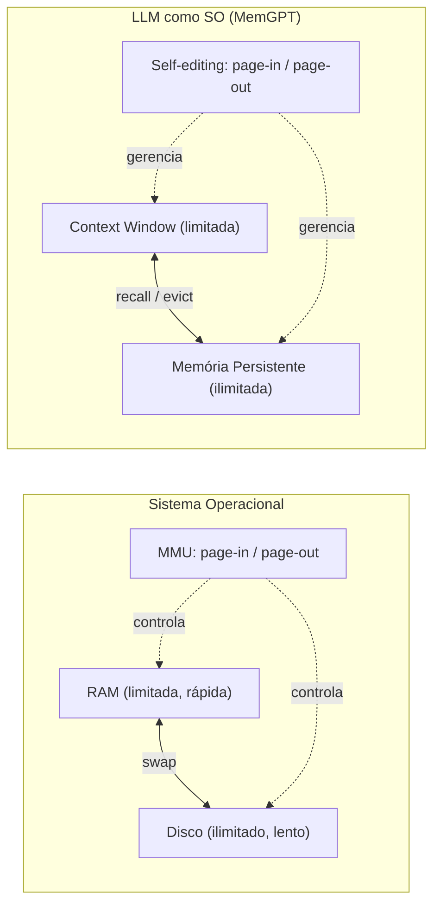
**Fonte**: Packer et al. *MemGPT* (arXiv:2310.08560).

---

### D5 — Comparação de Backends (Slide 22)

**Tipo**: Tabela comparativa 3 colunas
**Descrição**: Postgres vs SQLite vs Redis em 7 eixos: durabilidade, latência, multi-tenant, custo, operação, TTL, ACID.
**Mermaid**:
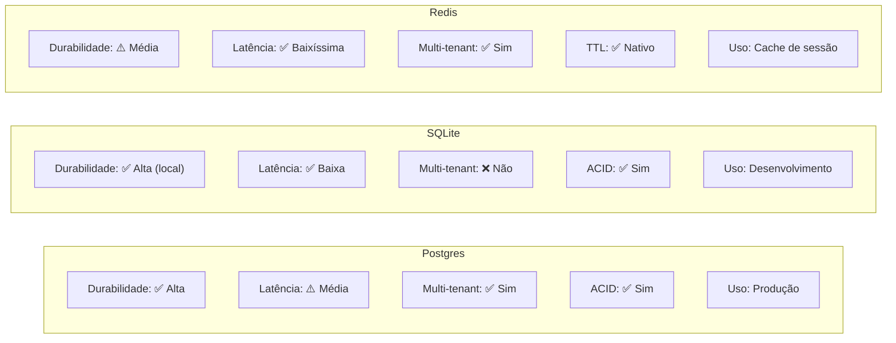

---

### D7 — Branching: Árvore de Checkpoints (Slide 26)

**Tipo**: Git graph
**Descrição**: Árvore de checkpoints estilo `git log --graph`, mostrando branch a partir de checkpoint anterior.
**Mermaid**:
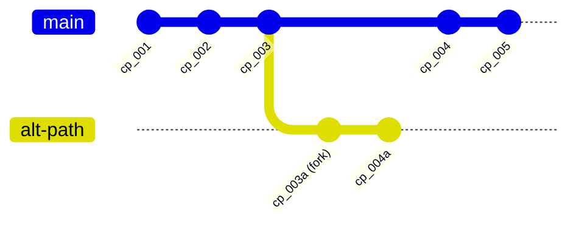

---

### D8 — Sumarização em Cascata (Slide 34)

**Tipo**: Pirâmide invertida
**Descrição**: Mensagens brutas → Sumário L1 → Sumário L2 → Sumário L3, cada nível com menos detalhe e mais abstração.
**Mermaid**:
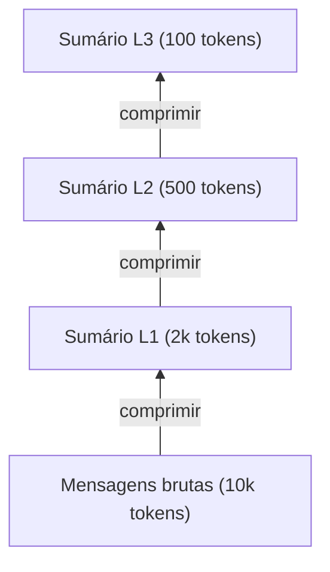
**Estilo**: Largura decrescente de baixo para cima (pirâmide invertida).

---

### D10 — Entity-Centric Memory (Slide 37)

**Tipo**: Diagrama de entidades com page-in/page-out
**Descrição**: Agente no centro, entidades como "pastas" de memória. Apenas a entidade ativa está page-in (na context window); as demais estão page-out.
**Mermaid**:
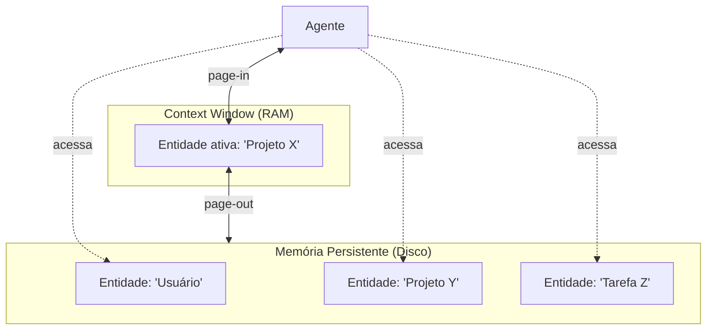
**Fonte**: MemGPT (Packer et al.); Zep.

---

### D11 — Pipeline Completo de Recall Vetorial (Slide 46)

**Tipo**: Pipeline horizontal
**Descrição**: 6 etapas do recall episódico: query → embedding → metadata filter → vector search → re-ranking → inserção no contexto.
**Mermaid**:
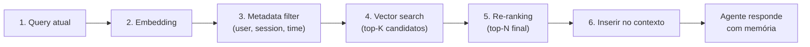

---

### D12 — Consolidação: Episódica → Semântica (Slide 52)

**Tipo**: Transformação
**Descrição**: Múltiplos eventos episódicos convergem, passam por processo de consolidação, e resultam em fatos semânticos.
**Mermaid**:
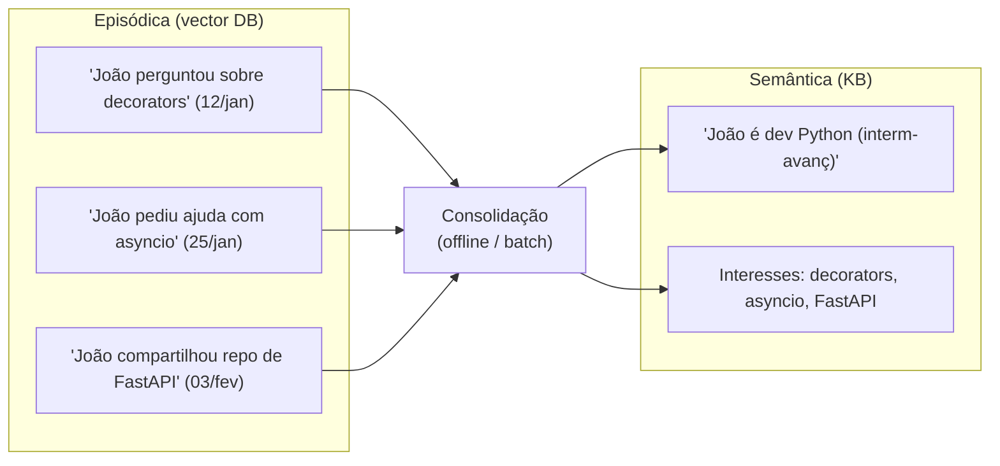

---

### D13 — Knowledge Graph como Memória (Slide 54)

**Tipo**: Grafo de entidades
**Descrição**: Mini KG com 5 nós (João, Projeto X, Python, Sprint 20, Backend) e relações (trabalha_em, usa, livre_em, é_tipo_de).
**Mermaid**:
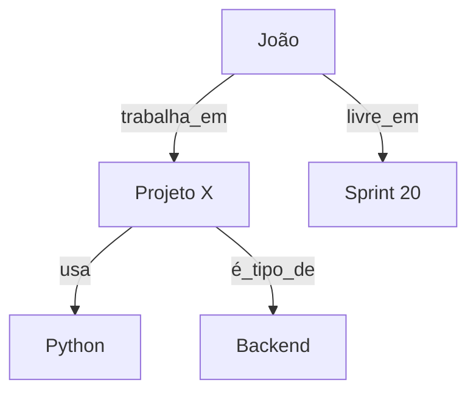

---

### D14 — Memory Stream de Generative Agents (Slide 56)

**Tipo**: Timeline
**Descrição**: Memory stream de um agente de Smallville com observações, timestamps, e scores de recência/importância/relevância.
**Mermaid**:
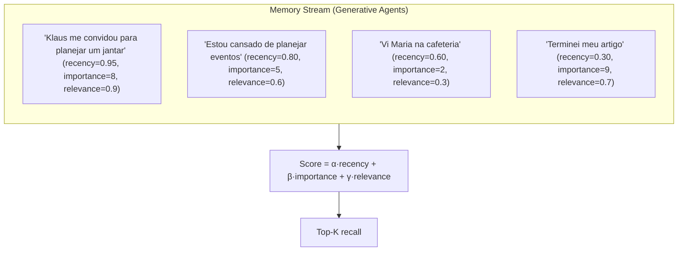
**Fonte**: Park et al. *Generative Agents* (arXiv:2304.03442).

---

### D15 — Consistência em Multi-Agente (Slide 59)

**Tipo**: Diagrama de concorrência
**Descrição**: 3 agentes compartilham memória. Race condition: agente A lê fato, B atualiza, A usa fato desatualizado.
**Mermaid**:
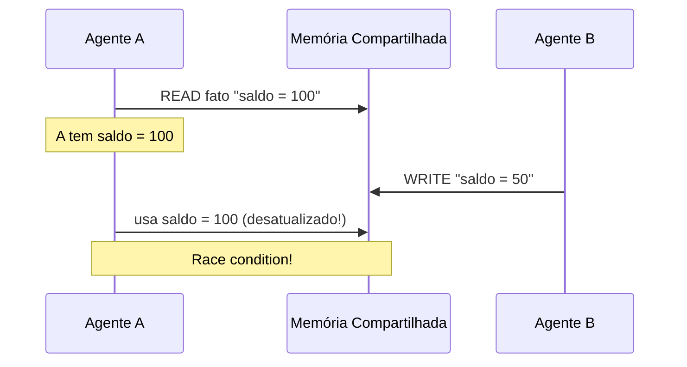

---

### D16 — Direito ao Esquecimento: 3 Estratégias (Slide 61)

**Tipo**: Comparação 3 colunas
**Descrição**: Três estratégias para implementar "esquecer usuário X" em memória vetorial: delete por metadata, re-embed, cryptographic erasure.
**Mermaid**:
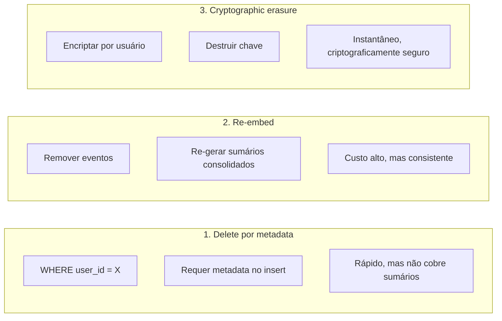

---

## Resumo de Produção

| # | Nome | Tipo | Status | Slide |
|---|---|---|---|---|
| D1 | Recall accuracy (curva U) | Gráfico | 🆕 Novo | 9 |
| D2 | Comparação 4 camadas | Tabela | 🆕 Novo | 13 |
| D3 | 4 camadas integradas | Flowchart | ✅ Existe | 14 |
| D4 | MemGPT analogia SO | Analogia | 🆕 Novo | 16 |
| D5 | Comparação backends | Tabela | 🆕 Novo | 22 |
| D6 | Checkpointer resume | Flowchart | ✅ Existe | 24 |
| D7 | Branching (git graph) | Git graph | 🆕 Novo | 26 |
| D8 | Sumarização em cascata | Pirâmide | 🆕 Novo | 34 |
| D9 | Eviction flow | Flowchart | ✅ Existe | 36 |
| D10 | Entity-centric memory | Entidades | 🆕 Novo | 37 |
| D11 | Pipeline recall vetorial | Pipeline | 🆕 Novo | 46 |
| D12 | Consolidação episódica→semântica | Transformação | 🆕 Novo | 52 |
| D13 | Knowledge graph como memória | Grafo | 🆕 Novo | 54 |
| D14 | Memory stream (Generative Agents) | Timeline | 🆕 Novo | 56 |
| D15 | Consistência multi-agente | Sequência | 🆕 Novo | 59 |
| D16 | Direito ao esquecimento | Comparação | 🆕 Novo | 61 |

**Total**: 3 existentes + 13 novos = 16 diagramas únicos a produzir/manter.

---

## Pendências de Produção

- [ ] Produzir 13 diagramas novos (D1, D2, D4, D5, D7, D8, D10, D11, D12, D13, D14, D15, D16)
- [ ] Validar 3 diagramas existentes (D3, D6, D9) com a versão final dos slides
- [ ] Screenshot do demo de checkpointer em Postgres (Slide 28)
- [ ] Gráfico "Lost in the Middle" — curva U original (Slide 9)
- [ ] Dashboard de observabilidade de memória (Slide 63)
