# ETHAGT06 — Sugestões de Diagramas

> 17 diagramas necessários para a apresentação.
> 3 já existem em `12-Diagrams/ETHAGT06/`. 14 novos a produzir.

---

## Diagramas Existentes (3)

| # | Slide | Arquivo | Descrição |
|---|---|---|---|
| D5 | 19 | `adaptive-rag.mmd` | Adaptive RAG: classificador → 3 caminhos |
| D7 | 28 | `crag-flow.mmd` | CRAG: avaliador → usar/corrigir/web |
| D16 | 72 | `eval-pipeline.mmd` | Pipeline de avaliação com métricas Ragas |

---

## Diagramas Novos (14)

### D1 — Evolução RAG Fixo → RAG Agêntico (Slide 7)

**Tipo**: Timeline horizontal
**Descrição**: Marcos históricos de 2020 a 2025 com 4 arquiteturas
**Mermaid**:
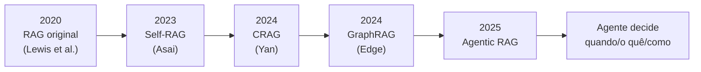
**Estilo**: Marcos em `etho-primary`, setas em `etho-accent`.

---

### D2 — Pipeline do RAG Ingênuo com Pontos de Falha (Slide 9)

**Tipo**: Flowchart com marcações
**Descrição**: Pipeline canônico com 4 pontos de falha destacados em vermelho
**Mermaid**:
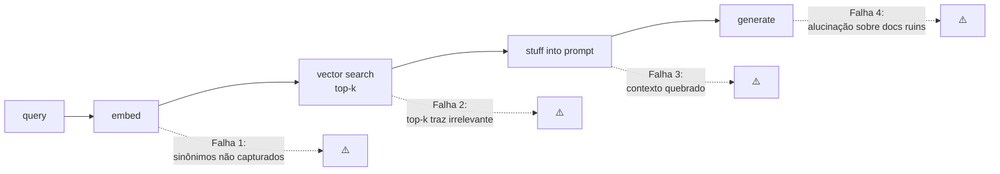

---

### D3 — 4 Tipos de Falha do RAG (Slides 10-13)

**Tipo**: Grid 2x2
**Descrição**: Chunking, embedding, re-rank, avaliação
**Mermaid**:
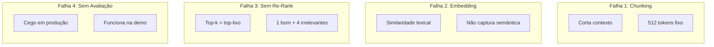

---

### D4 — Casos Problemáticos (Slide 14)

**Tipo**: Grid 3 colunas
**Descrição**: Dados tabulares, multilingual, multimodal
**Mermaid**:
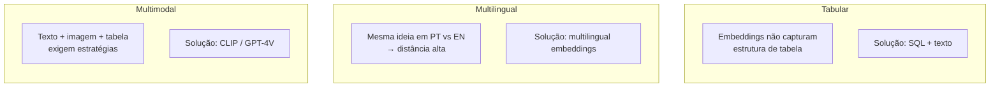

---

### D6 — Implementação Adaptive RAG em LangGraph (Slide 21)

**Tipo**: Flowchart
**Descrição**: StateGraph com nós e conditional edges
**Mermaid**:
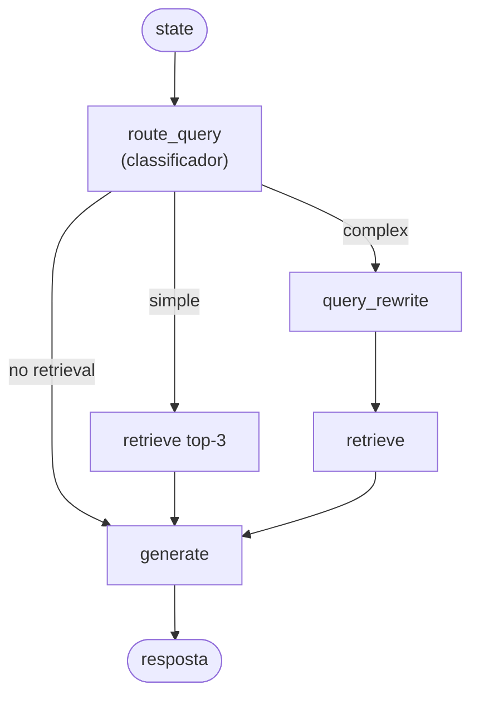
> **Nota**: Espelha o exemplo `adaptive_rag` do LangGraph.

---

### D8 — Self-RAG Flow com Tokens de Reflexão (Slide 38)

**Tipo**: Flowchart com tokens nos edges
**Descrição**: Fluxo controlado por tokens `[Retrieve]`, `[Relevant]`, `[Fully supported]`
**Mermaid**:
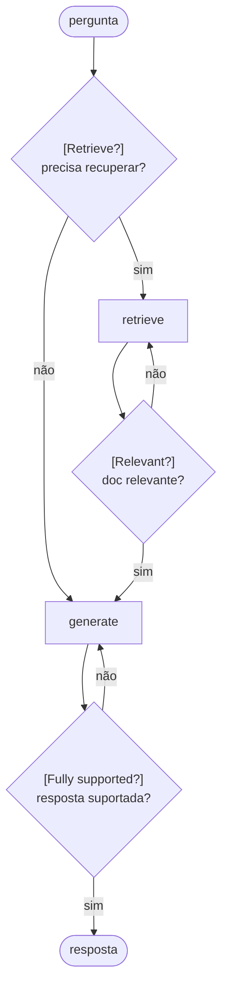

---

### D9 — Comparação Adaptive vs CRAG vs Self-RAG (Slide 42)

**Tipo**: Tabela 3 colunas
**Descrição**: Checkpoints destacados por arquitetura
**Mermaid**:
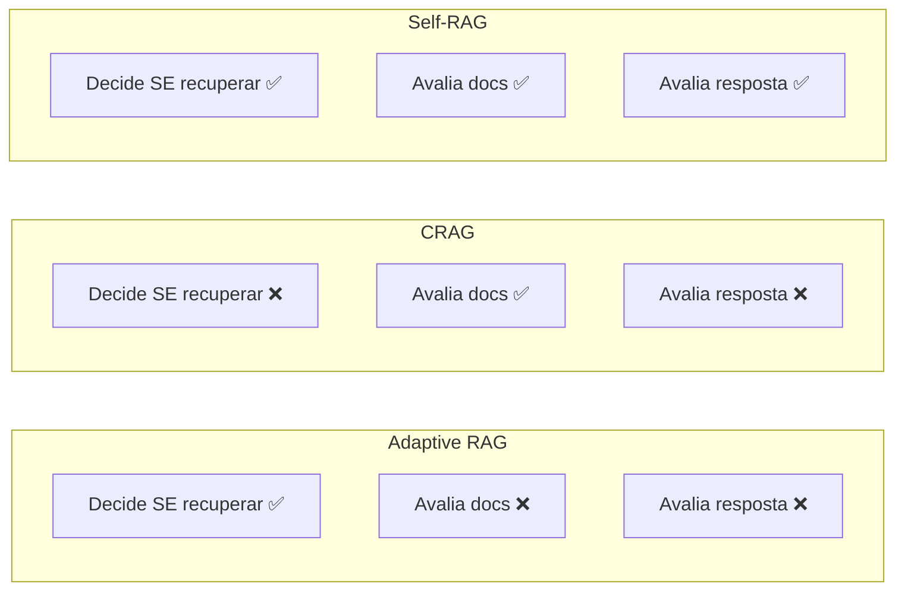

---

### D10 — Multi-Hop Retrieval (Slide 48)

**Tipo**: Sequência encadeada
**Descrição**: Cadeia de buscas dependentes
**Mermaid**:
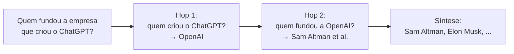

---

### D11 — GraphRAG: Do Local ao Global (Slide 52)

**Tipo**: Flowchart
**Descrição**: Pipeline de extração → comunidades → sumarização
**Mermaid**:
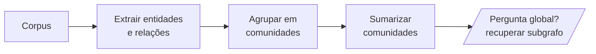

---

### D12 — Escalada Adaptive → CRAG → Self-RAG → Agentic (Slide 55)

**Tipo**: Escada/pirâmide
**Descrição**: 4 níveis crescentes em complexidade e controle
**Mermaid**:
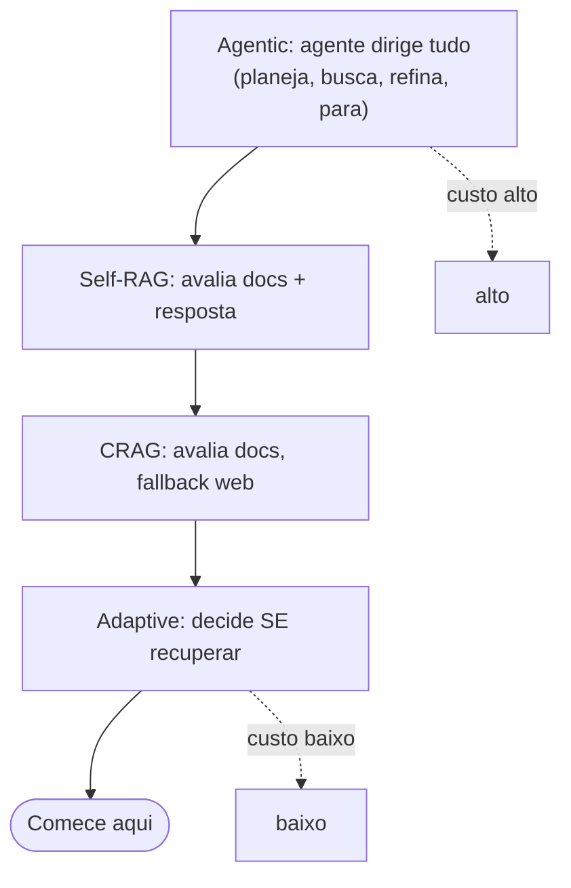

---

### D13 — Estratégias de Chunking (Slides 57-59)

**Tipo**: Comparação 4 colunas
**Descrição**: Fixo, semântico, hierárquico, late-chunking
**Mermaid**:
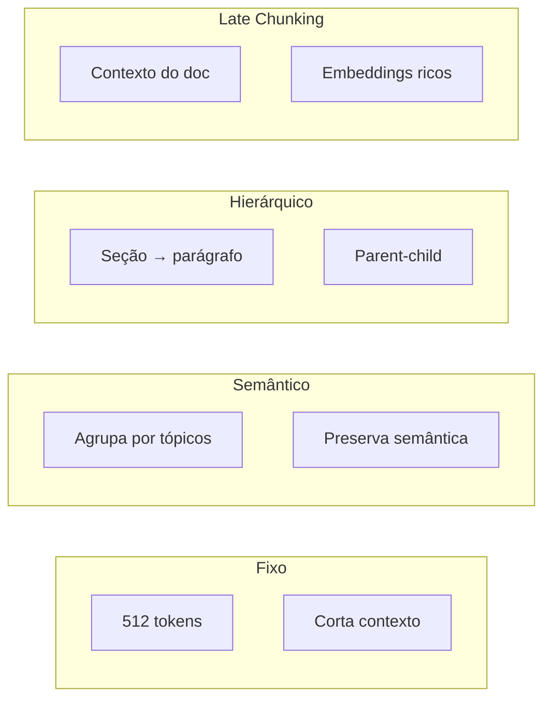

---

### D14 — HyDE Flow (Slide 62)

**Tipo**: Sequência
**Descrição**: pergunta → resposta hipotética → embed → search
**Mermaid**:
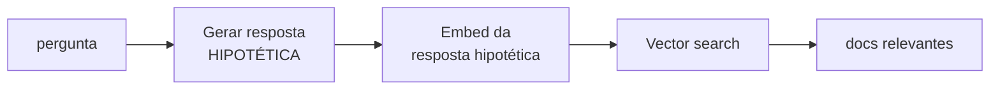

---

### D15 — Hybrid Search: BM25 + Densa (Slide 63)

**Tipo**: Flowchart com fusão
**Descrição**: Dois ramos (BM25 + densa) → reciprocal rank fusion
**Mermaid**:
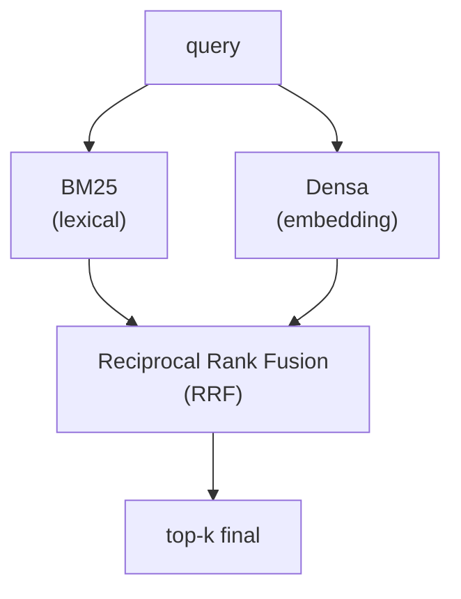

---

### D17 — Matriz Precision × Recall (Slide 73)

**Tipo**: Matriz 2x2
**Descrição**: Quadrantes de qualidade de retrieval com re-ranking
**Mermaid**:
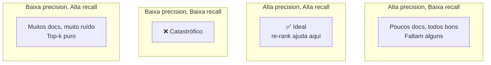

---

## Resumo de Produção

| # | Nome | Tipo | Status | Slide |
|---|---|---|---|---|
| D1 | Evolução RAG fixo → agêntico | Timeline | 🆕 Novo | 7 |
| D2 | Pipeline ingênuo com falhas | Flowchart | 🆕 Novo | 9 |
| D3 | 4 tipos de falha (grid) | Grid 2x2 | 🆕 Novo | 10-13 |
| D4 | Casos problemáticos | Grid 3 col | 🆕 Novo | 14 |
| D5 | Adaptive RAG | Flowchart | ✅ Existe | 19 |
| D6 | Adaptive RAG em LangGraph | Flowchart | 🆕 Novo | 21 |
| D7 | CRAG Flow | Flowchart | ✅ Existe | 28 |
| D8 | Self-RAG (tokens de reflexão) | Flowchart | 🆕 Novo | 38 |
| D9 | Comparação Adaptive/CRAG/Self-RAG | Tabela | 🆕 Novo | 42 |
| D10 | Multi-hop retrieval | Sequência | 🆕 Novo | 48 |
| D11 | GraphRAG (local → global) | Flowchart | 🆕 Novo | 52 |
| D12 | Escalada Adaptive→Agentic | Escada | 🆕 Novo | 55 |
| D13 | Estratégias de chunking | Comparação | 🆕 Novo | 57-59 |
| D14 | HyDE flow | Sequência | 🆕 Novo | 62 |
| D15 | Hybrid search (BM25 + densa) | Flowchart | 🆕 Novo | 63 |
| D16 | Eval pipeline | Flowchart | ✅ Existe | 72 |
| D17 | Matriz precision × recall | Matriz | 🆕 Novo | 73 |

**Total**: 3 existentes + 14 novos = 17 diagramas a produzir/manter.
