# ETHAGT07 — Sugestões de Diagramas

> 46 diagramas necessários para a apresentação.
> 3 já existem em `12-Diagrams/ETHAGT07/`. 43 novos a produzir.

---

## Diagramas Existentes (3)

| # | Slide | Arquivo | Descrição |
|---|---|---|---|
| D13 | 27 | `vector-vs-graph.mmd` | Árvore de decisão: vector DB vs knowledge graph vs híbrido |
| D22 | 39 | `graphrag-pipeline.mmd` | Pipeline GraphRAG (construção offline + query online) |
| D34 | 54 | `hybrid-retrieval.mmd` | Pipeline híbrido (vector + graph + SQL com fusão) |

> **Nota**: Os 3 diagramas existentes cobrem os pontos centrais. Os demais (D1-D12, D14-D21, D23-D33, D35-D46) são novos.

---

## Diagramas Novos (43)

### D1 — Arquitetura de Vector DB (Slide 8)

**Tipo**: Flowchart
**Descrição**: Collection → points (id, vector, payload) → index ANN → query top-k
**Mermaid**:
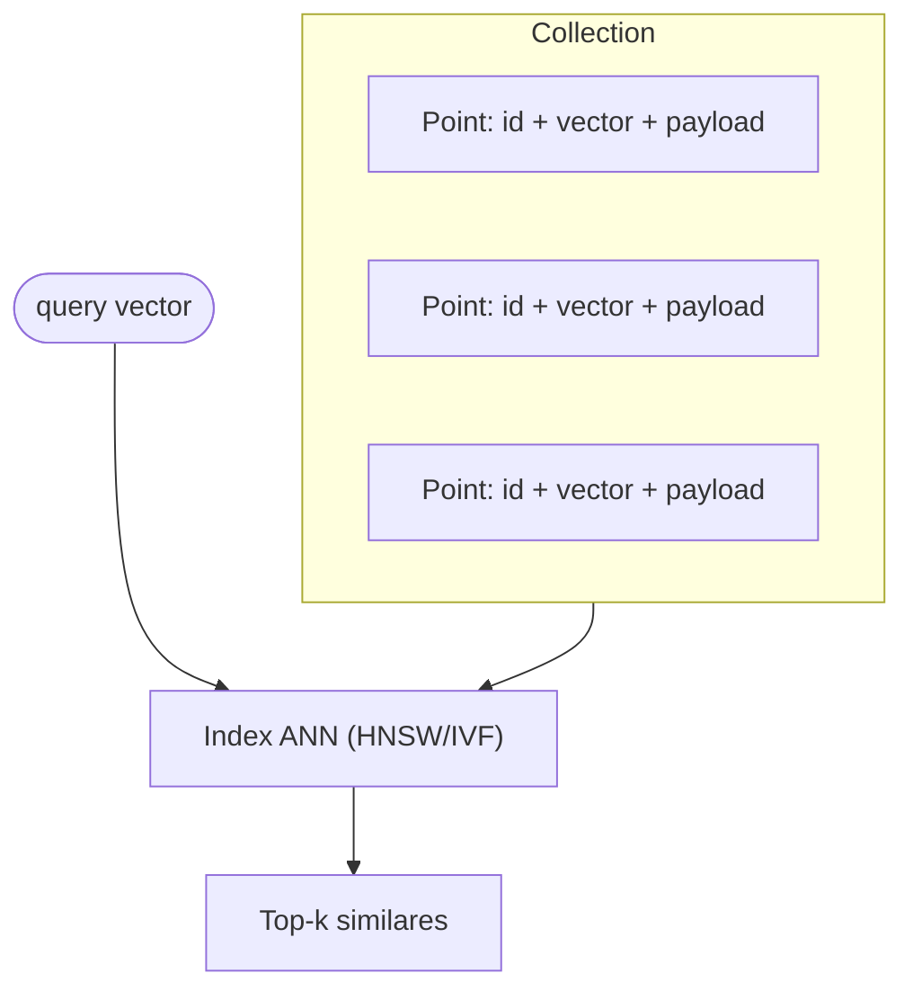
**Estilo**: Index em `etho-accent`.

---

### D2 — Embeddings → Espaço Vetorial (Slide 9)

**Tipo**: Visualização
**Descrição**: Texto → modelo → vetor denso → pontos próximos no espaço
**Mermaid**:
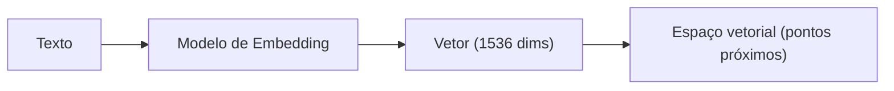

---

### D3 — Curva Recall vs Latência (Slide 10)

**Tipo**: Gráfico
**Descrição**: Eixo X: latência (ms). Eixo Y: recall@10. Curva côncava mostrando trade-off. Pontos HNSW e IVF marcados.
**Estilo**: Gráfico de linha, anotações em `ef_search` e `nprobe`.

---

### D4 — Estrutura Hierárquica HNSW (Slide 11)

**Tipo**: Flowchart de camadas
**Descrição**: 3 camadas (top sparse, middle, bottom dense) com nós conectados entre camadas
**Mermaid**:
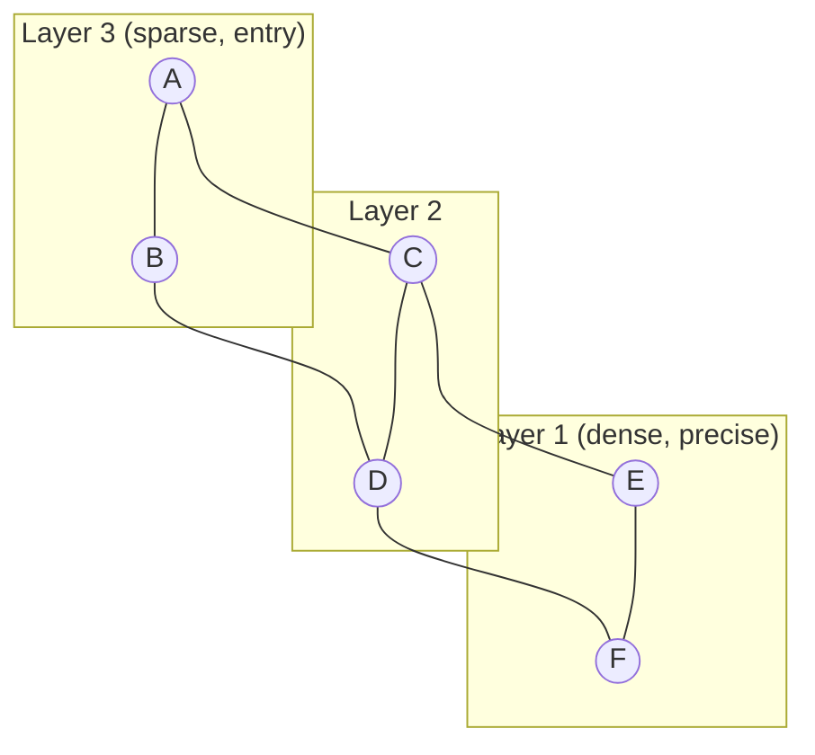
**Fonte**: Malkov & Yashunin, arXiv:1603.09320.

---

### D5 — Células de Voronoi / IVF (Slide 12)

**Tipo**: Visualização
**Descrição**: Espaço 2D particionado em células de Voronoi, cada uma com um centroide. Setas mostrando `nprobe` expandindo para células vizinhas.
**Estilo**: Células coloridas em tons de `etho-info`.

---

### D6 — Métricas: Cosine, Dot, Euclidean (Slide 13)

**Tipo**: 3 painéis lado a lado
**Descrição**: Esquerda: dois vetores no círculo unitário (cosine = ângulo). Centro: plano com projeção (dot product). Direita: distância geométrica L2.
**Mermaid**:
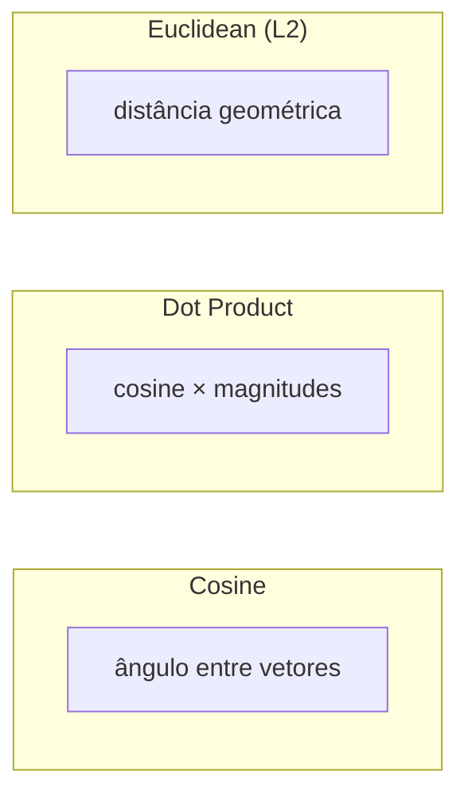

---

### D7 — Árvore de Decisão de Métrica (Slide 14)

**Tipo**: Fluxograma
**Descrição**: Embeddings normalizados? → dot. Não normalizados e texto? → cosine. Magnitude importa? → euclidean.
**Mermaid**:
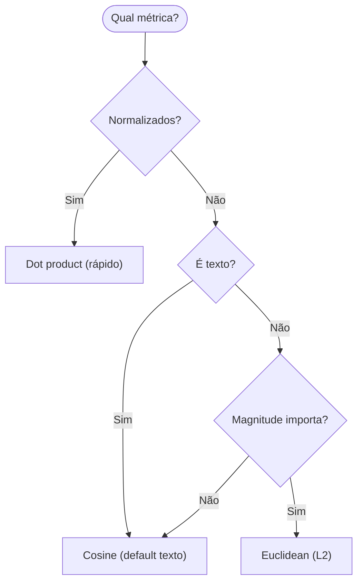

---

### D8 — Pre-filter vs Post-filter (Slide 15)

**Tipo**: Comparação
**Descrição**: Esquerda: filter → ANN (preciso, pode ser lento). Direita: ANN → filter (rápido, recall pode cair).
**Mermaid**:
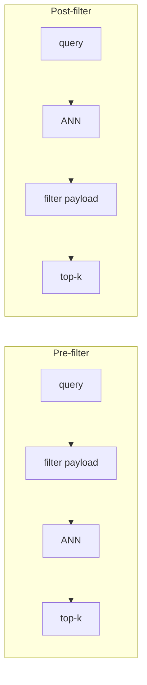

---

### D9 — Sparse + Dense → RRF (Slide 16)

**Tipo**: Sequência
**Descrição**: Query bifurca em BM25 (sparse) e dense embedding. Ambos retornam ranks. RRF funde. Saída final.
**Mermaid**:
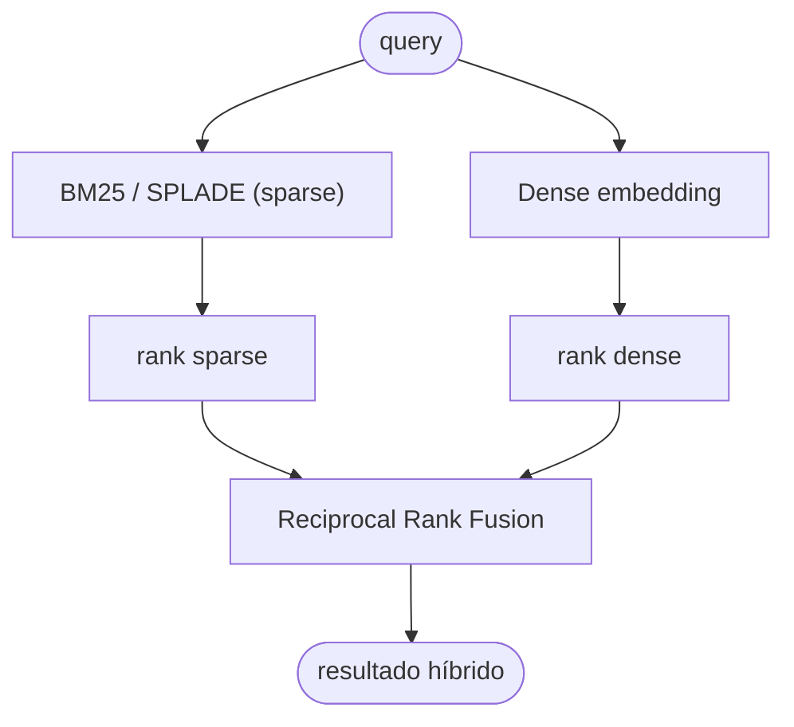

---

### D10 — Landscape de 5 Vector DBs (Slide 18)

**Tipo**: Grid 2x3
**Descrição**: 5 cards (Qdrant, Milvus, Weaviate, Chroma, pgvector) com logo + 1 linha de descrição cada
**Estilo**: Cada card em cor de destaque diferente.

---

### D11 — Tabela Comparativa (Heat Map) (Slide 24)

**Tipo**: Tabela colorida
**Descrição**: Linhas: 5 DBs. Colunas: linguagem, escala, filtering, híbrido, multi-tenancy, custo, curva, production-ready. Células em gradiente verde→amarelo→vermelho.

---

### D12 — Árvore "Preciso de Vector DB?" (Slide 25)

**Tipo**: Fluxograma de decisão
**Descrição**: Busca exata? → relacional. Relacionamentos? → grafo. <10k docs? → brute force. Latência crítica? → cache. Senão → vector DB.
**Mermaid**:
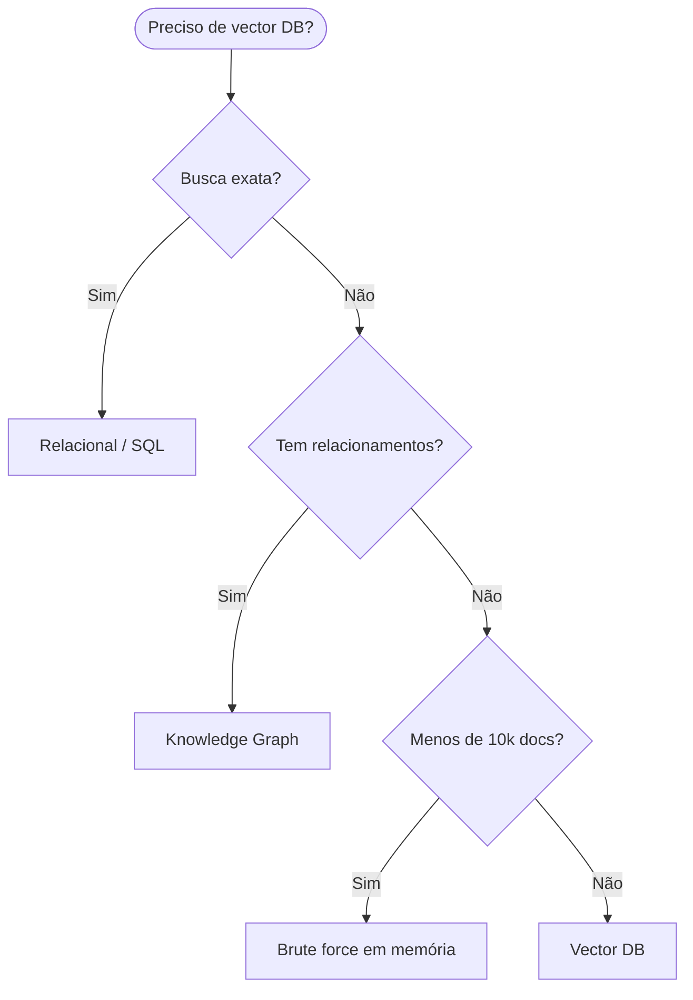

---

### D14 — Triplas (Sujeito → Predicado → Objeto) (Slide 28)

**Tipo**: Grafo
**Descrição**: 3 nós (Paciente X, Dr. Silva, Dipirona, Warfarin) conectados por arestas rotuladas (consultou, prescreveu, interage_com)
**Mermaid**:
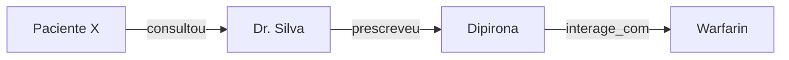

---

### D15 — Nó e Aresta com Propriedades (Slide 29)

**Tipo**: Diagrama
**Descrição**: Nó "Dipirona" com propriedades expandidas {tipo: Medicamento, classe: analgésico}. Aresta "interage_com" com {severidade: moderada, fonte: FDA}.
**Mermaid**:
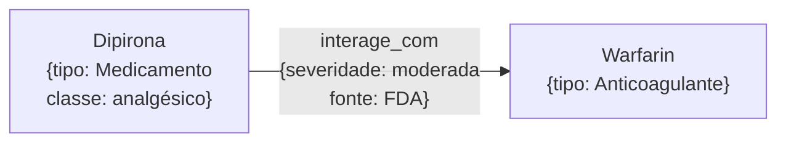

---

### D16 — Query Cypher + Grafo Resultante (Slide 31)

**Tipo**: Código + Grafo
**Descrição**: Esquerda: snippet Cypher. Direita: grafo resultante com Author X conectado a co-autores via Paper.
**Mermaid**:
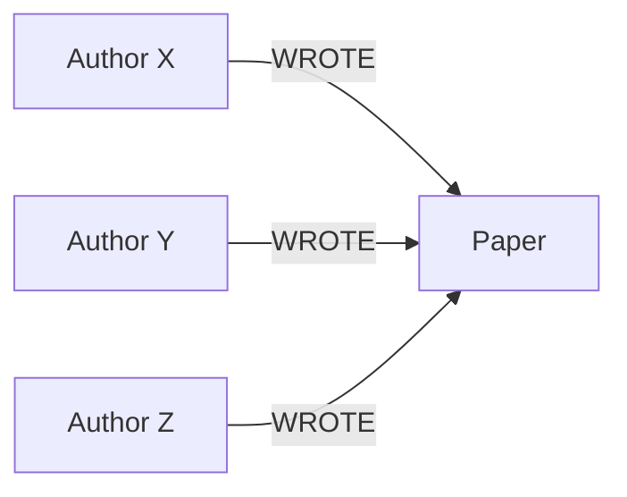

---

### D17 — Grafo Mal Modelado vs Bem Modelado (Slide 32)

**Tipo**: Comparação
**Descrição**: Esquerda: nós genéricos todos com "RELATED_TO" (confuso). Direita: labels específicos, relações tipadas (claro).
**Mermaid**:
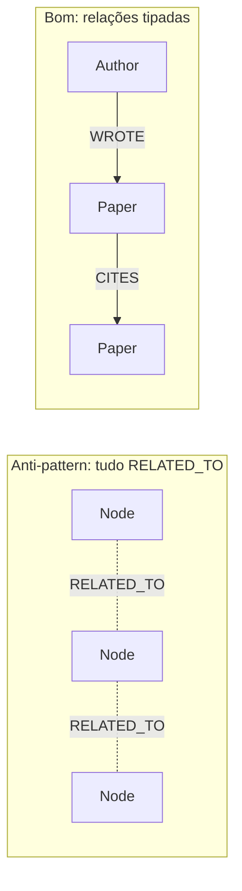

---

### D18 — Pipeline NER (Texto → LLM → Entidades) (Slide 33)

**Tipo**: Sequência
**Descrição**: Texto → LLM com prompt NER → JSON de entidades → nós do grafo
**Mermaid**:
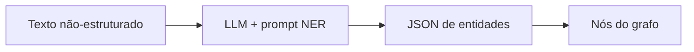

---

### D19 — Pipeline Extração de Relações (Slide 34)

**Tipo**: Sequência
**Descrição**: Par de entidades → LLM classifica relação → tripla → aresta do grafo
**Mermaid**:
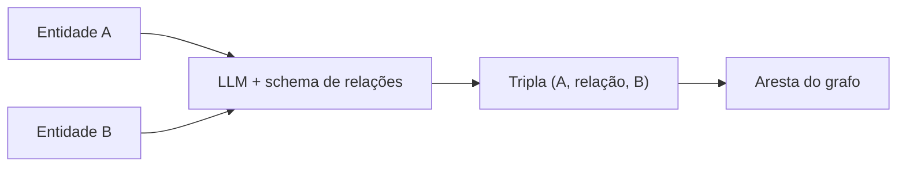

---

### D20 — Path Highlighting no Grafo (Slide 35)

**Tipo**: Grafo com path destacado
**Descrição**: Grafo com caminho A → B → C destacado em `etho-accent`, mostrando inferência multi-hop
**Mermaid**:
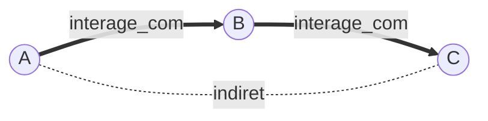

---

### D21 — Vector RAG vs GraphRAG (Slide 38)

**Tipo**: Comparação
**Descrição**: Esquerda: chunks isolados (vector RAG, sem visão global). Direita: grafo + comunidades (GraphRAG, síntese global).
**Mermaid**:
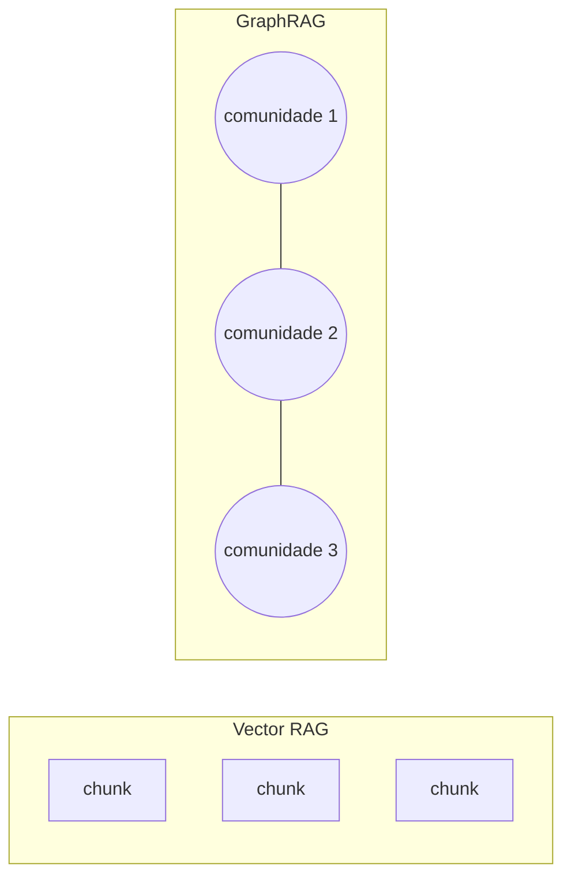

---

### D23 — Grafo Colorido por Comunidade (Leiden) (Slide 40)

**Tipo**: Grafo particionado
**Descrição**: Grafo de entidades com nós coloridos por comunidade (5 cores), mostrando estrutura hierárquica
**Estilo**: Comunidades em tons de `etho-info`, `etho-success`, `etho-accent`, `etho-warning`, `etho-danger`.

---

### D24 — Árvore de Sumários Hierárquicos (Slide 41)

**Tipo**: Árvore
**Descrição**: Folhas (sumários de subcomunidades) → nós intermediários → raiz (sumário global)
**Mermaid**:
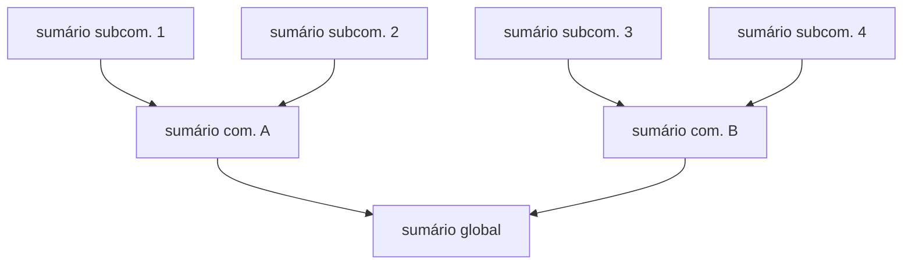

---

### D25 — Local Search (Subgrafo Local) (Slide 42)

**Tipo**: Grafo com subgrafo destacado
**Descrição**: Grafo grande com subgrafo local (entidade mencionada + vizinhança) destacado
**Mermaid**:
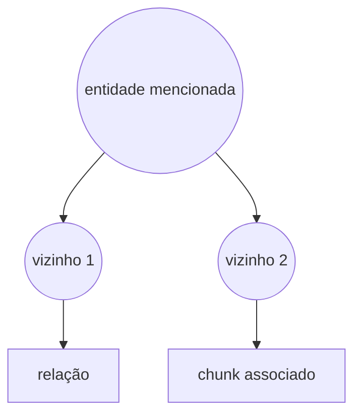

---

### D26 — Global Search (Map-Reduce) (Slide 43)

**Tipo**: Fluxograma
**Descrição**: Pergunta → Map (LLM por comunidade gera resposta parcial) → Reduce (LLM agrega) → resposta final
**Mermaid**:
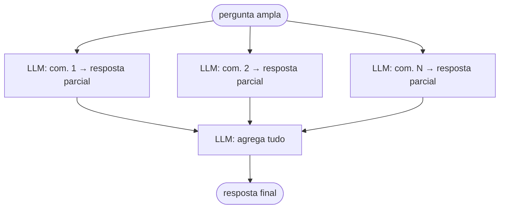

---

### D27 — Tabela Local vs Global (Slide 44)

**Tipo**: Tabela comparativa
**Descrição**: Local: pergunta específica, 1 entidade, subgrafo, baixa latência. Global: pergunta ampla, todas comunidades, map-reduce, alta latência.

---

### D28 — Vector RAG vs GraphRAG (Tabela) (Slide 45)

**Tipo**: Tabela
**Descrição**: Critérios: tipo de pergunta, hops, custo construção, latência, melhor para. Vector RAG vs GraphRAG.

---

### D29 — Breakdown de Custo por Etapa (Slide 48)

**Tipo**: Bar chart
**Descrição**: Barras: extração de entidades, extração de relações, sumarização de comunidades. Eixo Y: nº de chamadas LLM (estimativa para 1000 docs).
**Estilo**: Barras em `etho-accent`.

---

### D30 — Ciclo de Manutenção (Slide 49)

**Tipo**: Ciclo
**Descrição**: Add docs → extract entidades/relações → update grafo → re-detectar comunidades → re-sumarizar → (volta ao início)
**Mermaid**:


---

### D31 — Matriz Valor vs Custo (Slide 50)

**Tipo**: Matriz 2x2
**Descrição**: Eixo X: custo de manutenção (baixo → alto). Eixo Y: valor do raciocínio multi-hop (baixo → alto). Quadrantes: farmacêutica (alto valor, alto custo = vale), jurídico (vale), blog pessoal (não vale).

---

### D32 — Vector vs Graph vs GraphRAG (3 Colunas) (Slide 51)

**Tipo**: Comparação de 3 colunas
**Descrição**: Vector DB (similaridade, barato, rápido) | Knowledge Graph (relacionamentos, modelagem cara, multi-hop) | GraphRAG (KG + comunidades, caro construção, perguntas globais)
**Mermaid**:
```mermaid
flowchart LR
    subgraph V["Vector DB"]
        V1["similaridade semântica"]
        V2["barato · rápido"]
    end
    subgraph G["Knowledge Graph"]
        G1["relacionamentos estruturados"]
        G2["multi-hop · modelagem cara"]
    end
    subgraph GR["GraphRAG"]
        GR1["KG + comunidades"]
        GR2["perguntas globais · caro"]
    end
```

---

### D33 — Venn Diagram Vector ∩ Graph (Slide 53)

**Tipo**: Venn diagram
**Descrição**: Círculo esquerdo: vector (semântica). Círculo direito: graph (relações). Interseção: híbrido.
**Estilo**: Círculos em `etho-info` e `etho-success`, interseção em `etho-accent`.

---

### D35 — RetrievalAgent Router (Slide 55)

**Tipo**: Fluxograma
**Descrição**: Pergunta → classificar intenção → {vector | graph | híbrido} → resultado
**Mermaid**:
```mermaid
flowchart TD
    Q([pergunta]) --> CL["Classificar estratégia (LLM)"]
    CL -->|"O que é X?"| V[vector search]
    CL -->|"Quem conecta a X?"| G[graph traversal]
    CL -->|"Docs sobre entidades de X?"| H[híbrido]
    V --> R([resultado])
    G --> R
    H --> R
```

---

### D36 — Pipeline de Ingestão Dual (Slide 57)

**Tipo**: Sequência
**Descrição**: Novo documento → bifurca: embedding → vector DB | extração entidades → grafo. Ambos com mesmo doc_id.
**Mermaid**:
```mermaid
flowchart TB
    D[novo documento] --> EM["embedding"]
    D --> EX["extração entidades/relações"]
    EM --> VDB[("Vector DB")]
    EX --> KG[("Knowledge Graph")]
    VDB -.doc_id.- KG
```

---

### D37 — Chain of Provenance (Slide 58)

**Tipo**: Sequência
**Descrição**: Resposta → tripla do grafo → documento origem (com doc_id)
**Mermaid**:
```mermaid
flowchart LR
    R["Resposta do agente"] --> T["Tripla do grafo<br/>{doc_id: 42}"]
    T --> DOC["Documento #42<br/>(origem)"]
```

---

### D38 — Caso: Base de Conhecimento Técnica (Slide 59)

**Tipo**: Flowchart
**Descrição**: Corpus (docs + issues + changelogs) → pipeline híbrido (vector + graph) → agente → resposta
**Mermaid**:
```mermaid
flowchart LR
    C["Corpus técnico"] --> V["Vector DB (como fazer X)"]
    C --> G["Grafo (X depende de Y)"]
    V --> AG["Agente (escolhe estratégia)"]
    G --> AG
    AG --> R([resposta justificada])
```

---

### D39 — Escada de Complexidade (Slide 61)

**Tipo**: Escada
**Descrição**: Degraus: Vector → Graph → Híbrido → GraphRAG (cada degrau mais complexo e custoso)
**Mermaid**:
```mermaid
flowchart LR
    V["Vector (simples)"] --> G["Graph"]
    G --> H["Híbrido"]
    H --> GR["GraphRAG (complexo)"]
```

---

### D40 — Benchmark (Barras + Tabela) (Slide 62)

**Tipo**: Gráfico de barras + tabela
**Descrição**: Barras: success rate (Vector 60%, Graph 75%, Híbrido 85%). Tabela: latência p50/p99, custo/query.
**Estilo**: Barras em `etho-success`, `etho-info`, `etho-accent`.

---

### D41 — Cluster com Shards e Réplicas (Slide 64)

**Tipo**: Diagrama
**Descrição**: Cluster com 3 shards, cada um com 2 réplicas
**Mermaid**:
```mermaid
flowchart TB
    subgraph Shard1["Shard 1"]
        R1[réplica 1] 
        R2[réplica 2]
    end
    subgraph Shard2["Shard 2"]
        R3[réplica 1]
        R4[réplica 2]
    end
    subgraph Shard3["Shard 3"]
        R5[réplica 1]
        R6[réplica 2]
    end
```

---

### D42 — Timeline de Reindexação (Dual Index) (Slide 66)

**Tipo**: Timeline
**Descrição**: T0: index velho ativo. T1: construir index novo em background. T2: swap (zero downtime). T3: remover velho.
**Mermaid**:
```mermaid
flowchart LR
    T0["T0: index velho ativo"] --> T1["T1: construir novo (background)"]
    T1 --> T2["T2: SWAP (zero downtime)"]
    T2 --> T3["T3: remover velho"]
```

---

### D43 — Tabela Quantização (Slide 67)

**Tipo**: Tabela
**Descrição**: Colunas: formato, tamanho relativo, perda de precisão. Linhas: float32 (100%, nenhuma), float16 (50%, mínima), PQ (10%, moderada), binary (3%, maior).

---

### D44 — Dashboard de Observabilidade (Slide 68)

**Tipo**: Dashboard mockup
**Descrição**: Grid de métricas: latência p50/p95/p99, recall@k, cache hit rate, index size, throughput, alertas
**Estilo**: Cards em `etho-light`, alertas em `etho-danger`.

---

### D45 — Caso GraphRAG Farmacêutica (Slide 72)

**Tipo**: Flowchart
**Descrição**: Corpus (50k docs) → vector DB + grafo + GraphRAG → resposta multi-hop (paciente + medicação → risco)
**Mermaid**:
```mermaid
flowchart LR
    C["Corpus farmacêutico<br/>(50k docs)"] --> V["Vector DB<br/>(efeito colateral)"]
    C --> G["Grafo<br/>(med → interage → med)"]
    C --> GR["GraphRAG<br/>(classes terapêuticas)"]
    V --> AG["Agente"]
    G --> AG
    GR --> AG
    AG --> R([risco clínico])
```

---

### D46 — Mapa da Especialização (Slide 78)

**Tipo**: Mind map radial
**Descrição**: ETHAGT07 no centro com conexões para ETHAGT05 (memória), ETHAGT12 (AgentOps), ETHAGT14 (escala), ETHAGT90 (capstone)
**Mermaid**:
```mermaid
mindmap
  root((ETHAGT07))
    ETHAGT05
      Memória semântica
      Vector DB como memória
    ETHAGT12
      Observabilidade híbrida
      Traces de retrieval
    ETHAGT14
      Multi-tenant
      Escala de produção
    ETHAGT90
      Capstone
      Integra vector + grafo
```

---

## Resumo de Produção

| # | Nome | Tipo | Status | Slide |
|---|---|---|---|---|
| D1 | Arquitetura vector DB | Flowchart | 🆕 Novo | 8 |
| D2 | Embeddings → espaço | Visualização | 🆕 Novo | 9 |
| D3 | Curva recall vs latência | Gráfico | 🆕 Novo | 10 |
| D4 | HNSW hierárquico | Flowchart | 🆕 Novo | 11 |
| D5 | Voronoi / IVF | Visualização | 🆕 Novo | 12 |
| D6 | Métricas (3 painéis) | Comparação | 🆕 Novo | 13 |
| D7 | Árvore de decisão métrica | Fluxograma | 🆕 Novo | 14 |
| D8 | Pre vs post-filter | Comparação | 🆕 Novo | 15 |
| D9 | Sparse + Dense → RRF | Sequência | 🆕 Novo | 16 |
| D10 | Landscape 5 DBs | Grid | 🆕 Novo | 18 |
| D11 | Tabela comparativa (heat map) | Tabela | 🆕 Novo | 24 |
| D12 | Árvore "preciso vector DB?" | Fluxograma | 🆕 Novo | 25 |
| D13 | Vector vs Graph (decisão) | Fluxograma | ✅ Existe | 27 |
| D14 | Triplas | Grafo | 🆕 Novo | 28 |
| D15 | Nó e aresta com propriedades | Diagrama | 🆕 Novo | 29 |
| D16 | Query Cypher + grafo | Código + Grafo | 🆕 Novo | 31 |
| D17 | Mal vs bem modelado | Comparação | 🆕 Novo | 32 |
| D18 | Pipeline NER | Sequência | 🆕 Novo | 33 |
| D19 | Pipeline extração relações | Sequência | 🆕 Novo | 34 |
| D20 | Path highlighting | Grafo | 🆕 Novo | 35 |
| D21 | Vector RAG vs GraphRAG | Comparação | 🆕 Novo | 38 |
| D22 | GraphRAG pipeline | Flowchart | ✅ Existe | 39 |
| D23 | Grafo por comunidade (Leiden) | Grafo | 🆕 Novo | 40 |
| D24 | Árvore de sumários | Árvore | 🆕 Novo | 41 |
| D25 | Local search (subgrafo) | Grafo | 🆕 Novo | 42 |
| D26 | Global search (map-reduce) | Fluxograma | 🆕 Novo | 43 |
| D27 | Tabela Local vs Global | Tabela | 🆕 Novo | 44 |
| D28 | Vector RAG vs GraphRAG (tabela) | Tabela | 🆕 Novo | 45 |
| D29 | Breakdown de custo | Bar chart | 🆕 Novo | 48 |
| D30 | Ciclo de manutenção | Ciclo | 🆕 Novo | 49 |
| D31 | Matriz valor vs custo | Matriz 2x2 | 🆕 Novo | 50 |
| D32 | Vector vs Graph vs GraphRAG | Comparação | 🆕 Novo | 51 |
| D33 | Venn vector ∩ graph | Venn | 🆕 Novo | 53 |
| D34 | Arquitetura híbrida | Flowchart | ✅ Existe | 54 |
| D35 | RetrievalAgent router | Fluxograma | 🆕 Novo | 55 |
| D36 | Ingestão dual | Sequência | 🆕 Novo | 57 |
| D37 | Chain of provenance | Sequência | 🆕 Novo | 58 |
| D38 | Caso base técnica | Flowchart | 🆕 Novo | 59 |
| D39 | Escada de complexidade | Escada | 🆕 Novo | 61 |
| D40 | Benchmark | Gráfico | 🆕 Novo | 62 |
| D41 | Cluster shards e réplicas | Diagrama | 🆕 Novo | 64 |
| D42 | Timeline reindexação | Timeline | 🆕 Novo | 66 |
| D43 | Tabela quantização | Tabela | 🆕 Novo | 67 |
| D44 | Dashboard observabilidade | Dashboard | 🆕 Novo | 68 |
| D45 | Caso farmacêutica | Flowchart | 🆕 Novo | 72 |
| D46 | Mapa da especialização | Mind map | 🆕 Novo | 78 |

**Total**: 3 existentes + 43 novos = 46 diagramas únicos a produzir/manter.
