# ETHAGT09 — Sugestões de Diagramas

> 18 diagramas necessários para a apresentação.
> 4 canônicos em `12-Diagrams/ETHAGT09/`. 14 novos a produzir.

---

## Diagramas Canônicos (4)

| # | Slide | Arquivo | Descrição |
|---|---|---|---|
| D6 | 22 | `handoff.mmd` | Handoff (Swarm) — transferência de controle |
| D8 | 29 | `blackboard.mmd` | Padrão blackboard — espaço compartilhado |
| D9 | 36 | `actor-model.mmd` | Actor model — atores com mailboxes |
| D12 | 49 | `negotiation.mmd` | Negociação — bargaining flow |

---

### handoff.mmd

**Tipo**: Flowchart
**Descrição**: Triager transfere controle para Sales/Billing/Support via handoff.

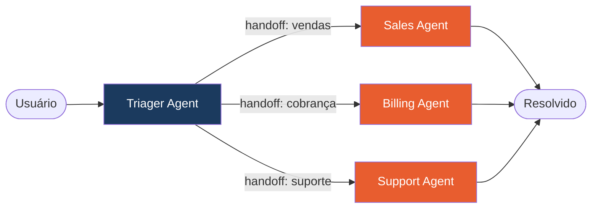

---

### blackboard.mmd

**Tipo**: Flowchart
**Descrição**: 3 agentes conectados a um blackboard central; leem e escrevem sem comunicação direta.

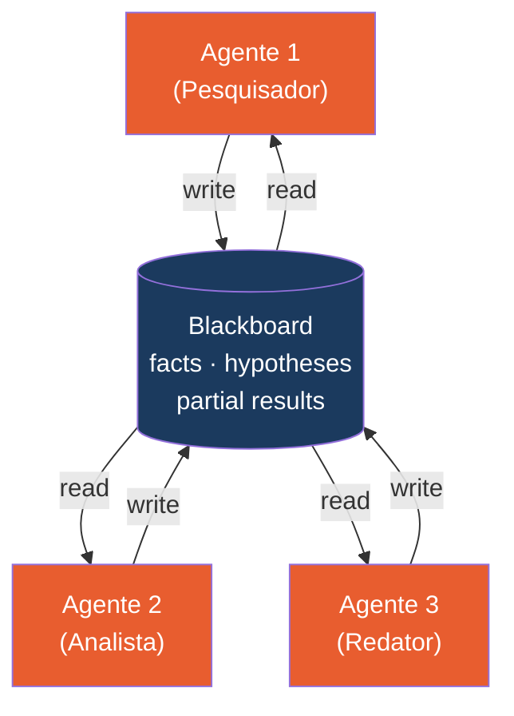

---

### actor-model.mmd

**Tipo**: Flowchart
**Descrição**: 3 atores com mailboxes individuais; comunicação assíncrona via mensagens; estado privado encapsulado.

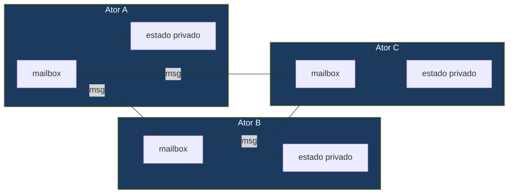

---

### negotiation.mmd

**Tipo**: Flowchart
**Descrição**: Comprador propõe 100 → Vendedor contrapropõe 150 → convergem em 120; fallback de timeout.

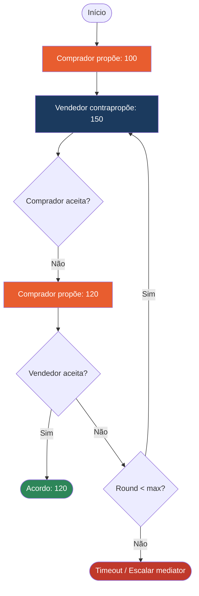

---

## Diagramas Novos (14)

### D1 — Topologias: Broadcast vs P2P vs Pub/Sub (Slide 9)

**Tipo**: Grid 1x3
**Descrição**: 3 topologias canônicas lado a lado.

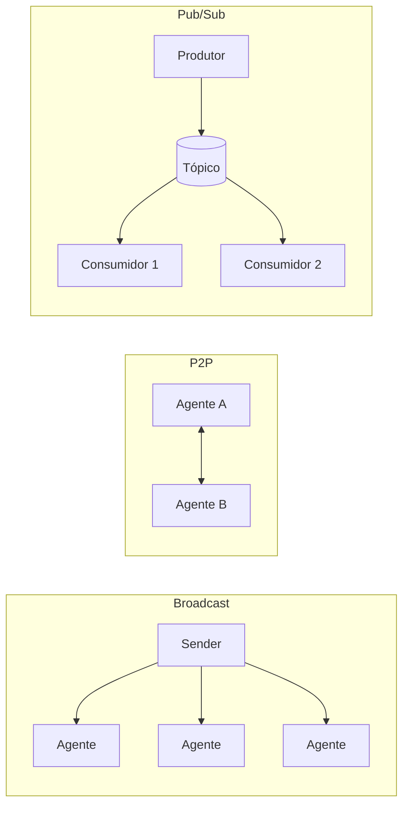

---

### D2 — Schema de Mensagem A2A (Slide 10)

**Tipo**: Código
**Descrição**: Exemplo de JSON schema para mensagem A2A com versionamento.

```json
{
  "message_id": "msg_abc123",
  "sender": "agent://researcher-01",
  "receiver": "agent://writer-02",
  "message_type": "task_result",
  "version": "1.2.0",
  "timestamp": "2026-07-07T14:30:00Z",
  "payload": {
    "task_id": "task_xyz",
    "result": "Resumo encontrado: ...",
    "confidence": 0.87
  },
  "in_reply_to": "msg_def456"
}
```

---

### D3 — 3 Padrões de Conversação (Slide 17)

**Tipo**: Grid 1x3
**Descrição**: Two-agent (CAMEL), Group chat (AutoGen), Handoff (Swarm).

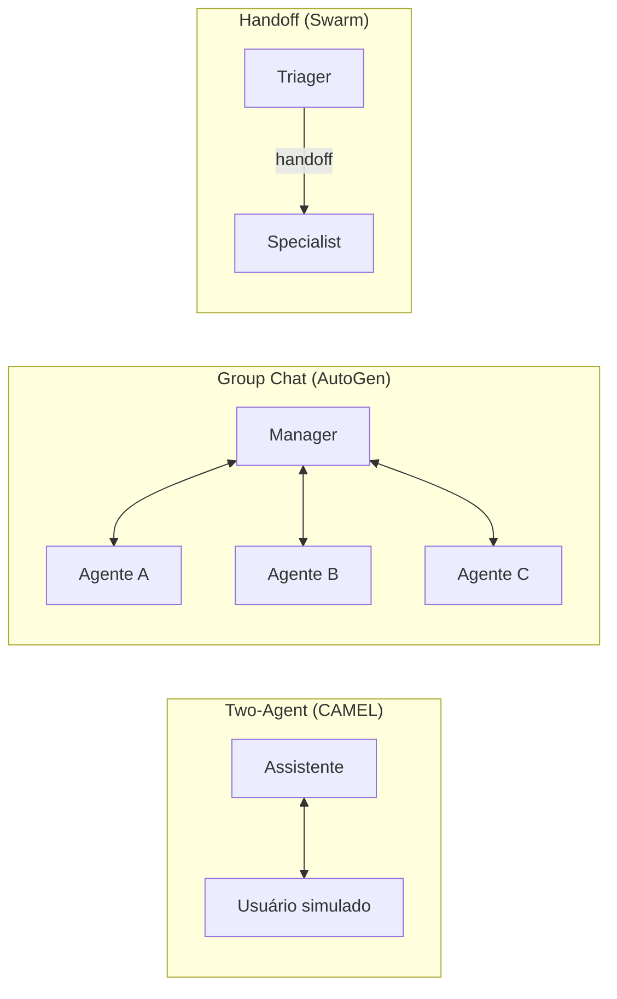

---

### D4 — CAMEL Role-Playing Trace (Slide 19)

**Tipo**: Console
**Descrição**: Trace de diálogo CAMEL com turnos alternados.

```
┌─────────────────────────────────────────────┐
│  Tarefa: Escrever artigo sobre energias     │
│  renováveis                                  │
├─────────────────────────────────────────────┤
│  [Usuário]   Turno 1: "Qual estrutura       │
│              você sugere?"                   │
│  [Assistente] Turno 2: "Introdução, 3        │
│              seções técnicas, conclusão."    │
│  [Usuário]   Turno 3: "Aprofunde a seção    │
│              solar."                         │
│  [Assistente] Turno 4: "Painéis fotovoltaic │
│              os convertem..."                │
└─────────────────────────────────────────────┘
```

---

### D5 — AutoGen GroupChat Hub-and-Spoke (Slide 20)

**Tipo**: Flowchart
**Descrição**: Manager no centro decide quem fala a seguir.

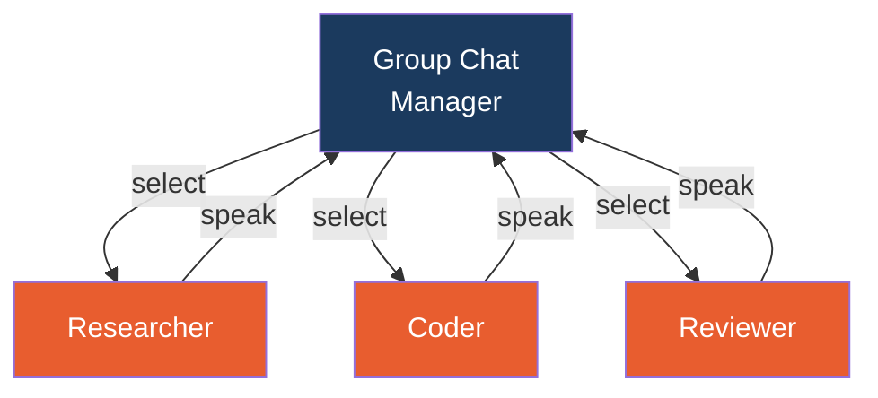

---

### D7 — Pipeline MetaGPT SOPs (Slide 24 / 63)

**Tipo**: Pipeline
**Descrição**: Papéis MetaGPT com artefatos estruturados como comunicação.

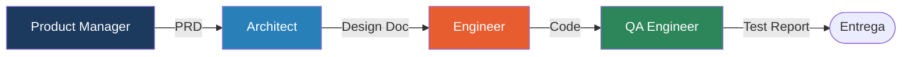

---

### D10 — Thread+Lock vs Actor (Slide 38)

**Tipo**: Comparação
**Descrição**: Shared state com locks vs actor model com mailbox.

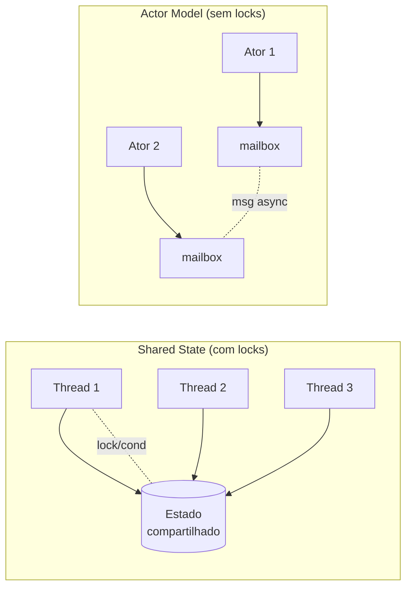

---

### D11 — DEMO: 2 Arquiteturas Lado a Lado (Slide 43)

**Tipo**: Comparação
**Descrição**: Group chat vs blackboard para a mesma tarefa.

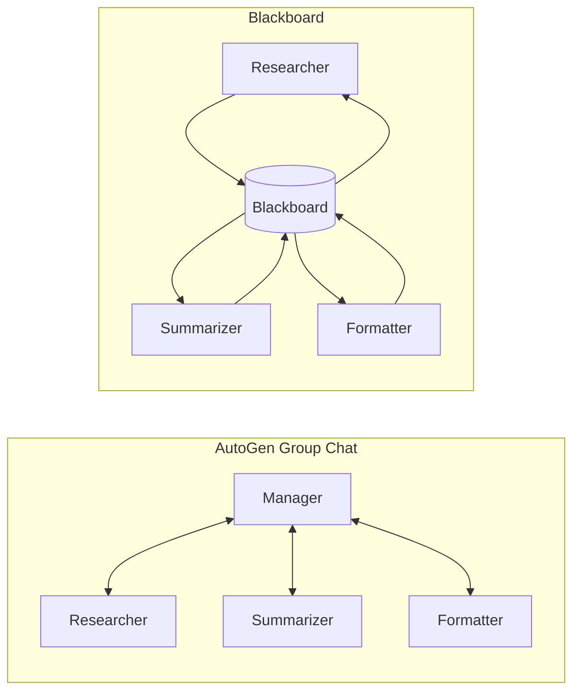

---

### D13 — Eixo Tempo × Qualidade (Slide 52)

**Tipo**: Gráfico
**Descrição**: Zona de acordo entre agente de velocidade e agente de qualidade.

```
Qualidade ↑
    │
 Q2 ····················· · Agente de Qualidade
    │              ╔══════╗
    │              ║ ZONA ║
    │              ║ DE   ║
    │              ║ACORDO║
    │              ╚══════╝
 Q1 · · Agente de Velocidade
    │
    └────────────────────────→ Tempo
    T1                      T2
```

---

### D14 — A2A Protocol Sequência (Slide 55)

**Tipo**: Sequência
**Descrição**: Descoberta de Agent Card → Task → processamento → resultado.

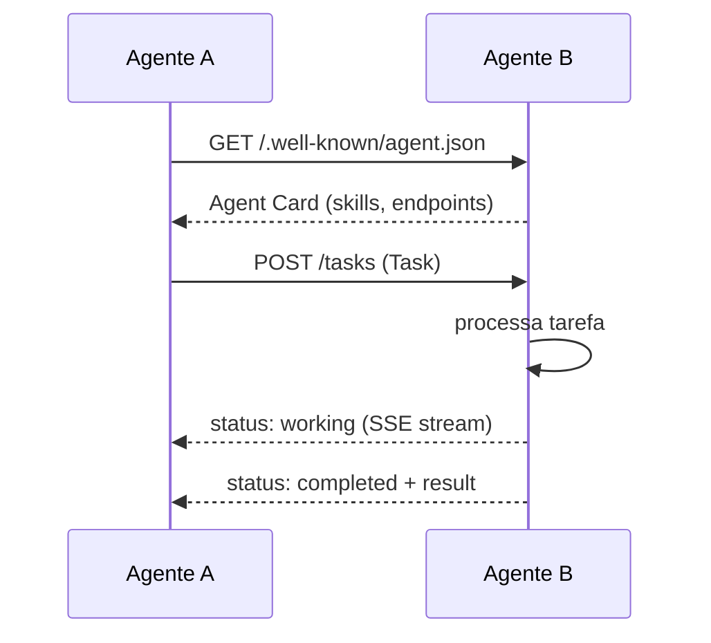

---

### D15 — MCP vs A2A Venn (Slide 56)

**Tipo**: Venn
**Descrição**: MCP = agent↔system; A2A = agent↔agent. Complementares.

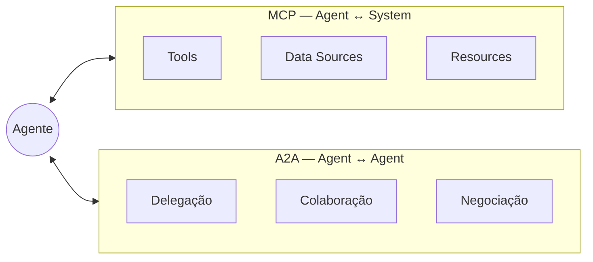

---

### D16 — 4 Topologias de Orquestração (Slide 57)

**Tipo**: Grid 2x2
**Descrição**: Centralizada, descentralizada, hierárquica, market-based.

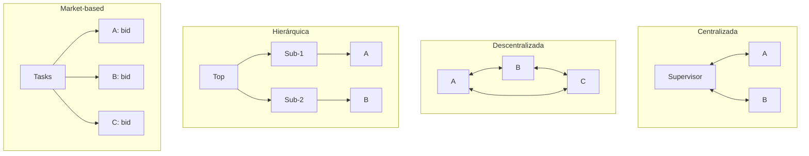

---

### D17 — Mapa da Especialização (Slide 71)

**Tipo**: Mind map radial
**Descrição**: ETHAGT09 no centro com conexões para módulos dependentes.

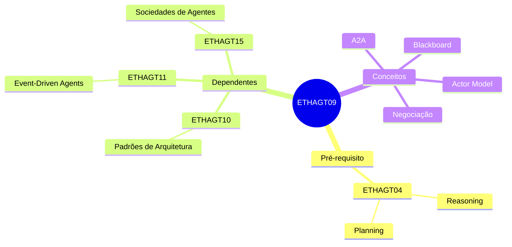

---

## Resumo de Produção

| # | Nome | Tipo | Status | Slide |
|---|---|---|---|---|
| D1 | Topologias (broadcast/p2p/pubsub) | Grid 1x3 | 🆕 Novo | 9 |
| D2 | Schema de mensagem A2A | Código JSON | 🆕 Novo | 10 |
| D3 | 3 padrões de conversação | Grid 1x3 | 🆕 Novo | 17 |
| D4 | CAMEL role-playing trace | Console | 🆕 Novo | 19 |
| D5 | AutoGen GroupChat hub-and-spoke | Flowchart | 🆕 Novo | 20 |
| D6 | Handoff (Swarm) | Flowchart | ✅ `handoff.mmd` | 22 |
| D7 | Pipeline MetaGPT SOPs | Pipeline | 🆕 Novo | 24/63 |
| D8 | Blackboard pattern | Flowchart | ✅ `blackboard.mmd` | 29 |
| D9 | Actor model | Flowchart | ✅ `actor-model.mmd` | 36 |
| D10 | Thread+lock vs Actor | Comparação | 🆕 Novo | 38 |
| D11 | DEMO: 2 arquiteturas | Comparação | 🆕 Novo | 43 |
| D12 | Negociação (bargaining) | Flowchart | ✅ `negotiation.mmd` | 49 |
| D13 | Eixo tempo × qualidade | Gráfico | 🆕 Novo | 52 |
| D14 | A2A Protocol sequência | Sequência | 🆕 Novo | 55 |
| D15 | MCP vs A2A (Venn) | Venn | 🆕 Novo | 56 |
| D16 | 4 topologias orquestração | Grid 2x2 | 🆕 Novo | 57 |
| D17 | Mapa da especialização | Mind map | 🆕 Novo | 71 |

**Total**: 4 canônicos (`.mmd`) + 13 novos = 17 diagramas a produzir/manter.
