# ETHAGT10 — Sugestões de Diagramas

> 32 diagramas necessários para a apresentação.
> 4 já existem em `12-Diagrams/ETHAGT10/`. 28 novos a produzir.

---

## Diagramas Existentes (4)

| # | Slide | Arquivo | Descrição |
|---|---|---|---|
| D9 | 18 | `supervisor-topology.mmd` | Supervisor (roteador) com workers especializados |
| D11 | 20 | `hierarchical-topology.mmd` | Hierarchical de 3 níveis (top → sub → workers) |
| D17 | 30 | `swarm-topology.mmd` | Swarm com handoffs descentralizados |
| D29 | 54 | `decision-matrix.mmd` | Matriz de decisão (previsível → flexível → distribuído) |

> **Nota**: Os 4 diagramas existentes cobrem as topologias centrais. Os demais são novos.

---

## Diagramas Novos (28)

### D1 — Grid 12 Topologias (Slide 8)

**Tipo**: Grid 4×3
**Descrição**: 12 mini-diagramas, um por topologia, em grid 4×3
**Mermaid**:
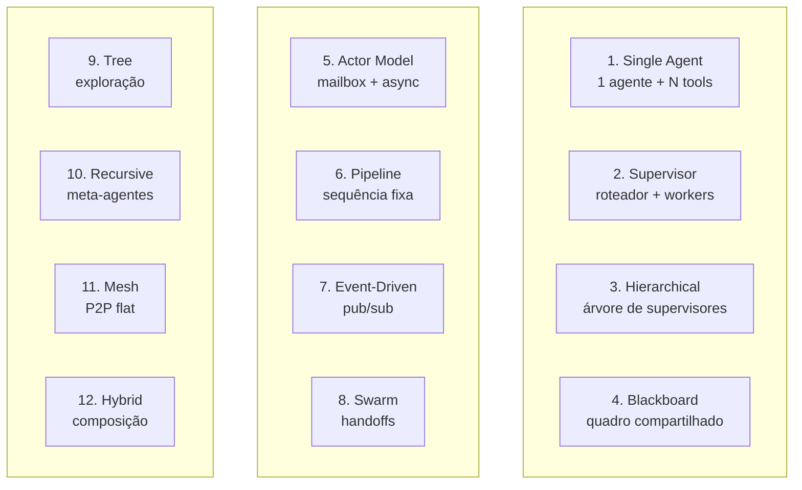
**Estilo**: Cada mini-diagrama com ícone representativo. Cores por categoria.

---

### D2 — Espectro Centralizado ↔ Descentralizado (Slide 9)

**Tipo**: Eixo horizontal
**Descrição**: Linha com topologias posicionadas do centralizado ao descentralizado
**Mermaid**:
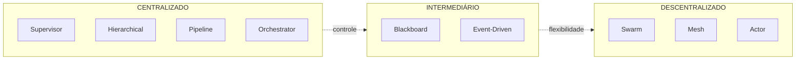

---

### D3 — Supervisor e Hierarchical Mini (Slide 10)

**Tipo**: Comparação lado a lado
**Descrição**: 2 mini-diagramas: supervisor (estrela) e hierarchical (árvore)
**Mermaid**: Reutilizar `supervisor-topology.mmd` e `hierarchical-topology.mmd` em versão compacta.

---

### D4 — Pipeline e Orchestrator-Workers Mini (Slide 11)

**Tipo**: Comparação lado a lado
**Descrição**: Esteira linear (pipeline) vs estrela com síntese (orchestrator)
**Mermaid**:
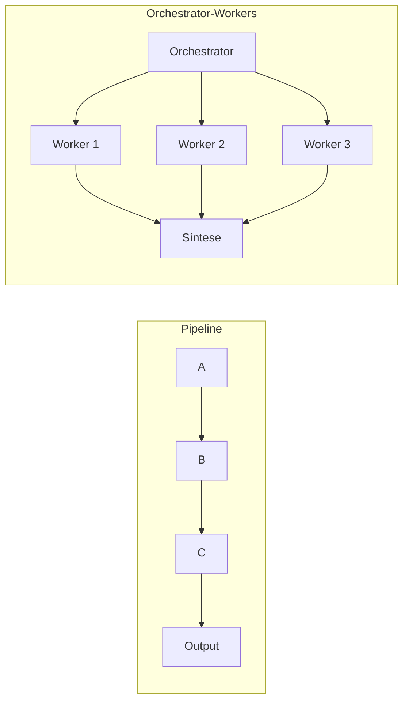

---

### D5 — Swarm, Mesh, Actor Model Mini (Slide 12)

**Tipo**: Comparação 3 colunas
**Descrição**: Handoffs em cadeia (swarm), grafo completo (mesh), círculos com mailbox (actor)
**Mermaid**: Reutilizar `swarm-topology.mmd` + 2 novos compactos.

---

### D6 — Tree e Recursive Mini (Slide 13)

**Tipo**: Comparação lado a lado
**Descrição**: Árvore de decisão com nós (tree) vs fractal auto-similar (recursive)
**Mermaid**:
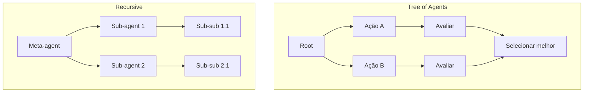

---

### D7 — Event-Driven, Blackboard, Hybrid Mini (Slide 14)

**Tipo**: Comparação 3 colunas
**Descrição**: Pub/sub com broker, quadro compartilhado, composição de ícones
**Mermaid**:
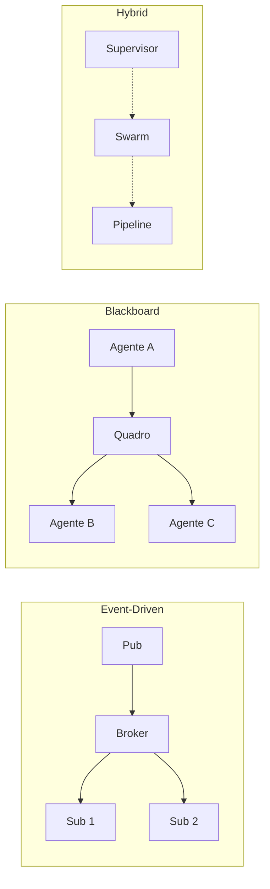

---

### D8 — Single Agent com N Tools (Slide 15)

**Tipo**: Estrela
**Descrição**: 1 agente no centro com múltiplas tools ao redor
**Mermaid**:
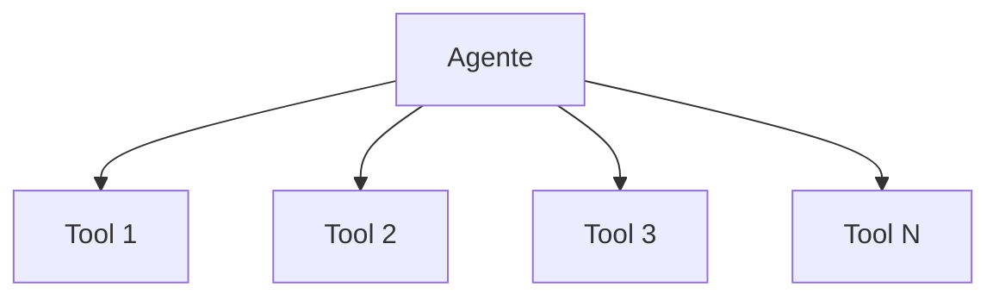

---

### D10 — Supervisor como Tool Calls (Slide 19)

**Tipo**: Sequência
**Descrição**: Supervisor → tool_call → worker → return → supervisor
**Mermaid**: Anotação sobre `supervisor-topology.mmd` com fluxo de tool calls.

---

### D12 — 3 Níveis vs Flat (Slide 21)

**Tipo**: 3 árvores lado a lado
**Descrição**: 1 nível (flat), 2 níveis, 3 níveis com métricas de latência
**Mermaid**:
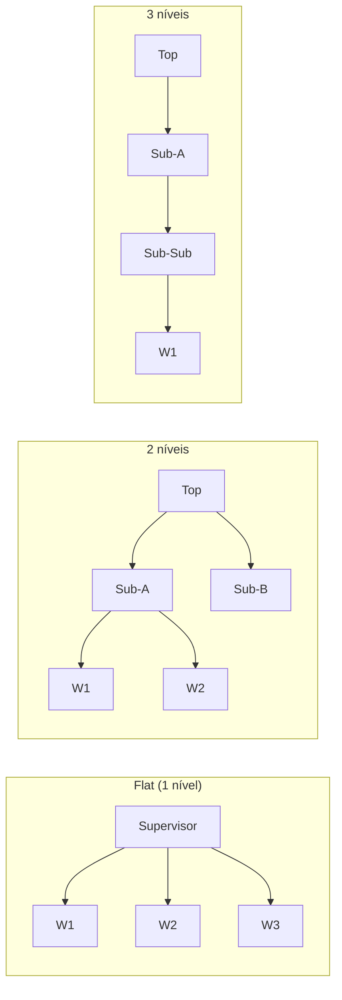

---

### D13 — Supervisor Gargalo (Funil) (Slide 22)

**Tipo**: Flowchart com gargalo
**Descrição**: Supervisor destacado em vermelho com setas convergindo (funil)
**Mermaid**:
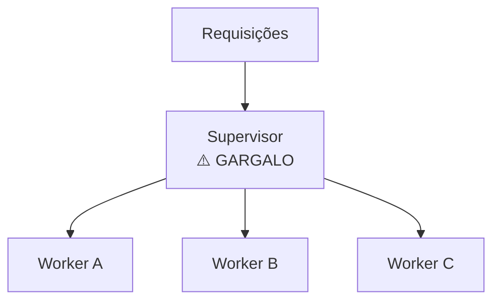

---

### D14 — Workers Redundantes (Venn) (Slide 23)

**Tipo**: Diagrama de Venn
**Descrição**: 2-3 círculos sobrepostos mostrando overlap de responsabilidades
**Mermaid**: Representar com círculos sobrepostos de "Pesquisador", "Analista", "Escritor" com área de interseção destacada.

---

### D15 — MetaGPT SOPs (Slide 26)

**Tipo**: Hierarquia com artefatos
**Descrição**: PM → Architect → Engineer → QA com artefatos fluindo (PRD → design → code → tests)
**Mermaid**:
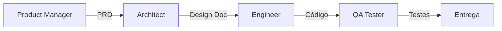

---

### D16 — Crew Formation (Slide 27)

**Tipo**: Flowchart
**Descrição**: Crew = Agentes (role, goal, backstory) + Tasks + Process
**Mermaid**:
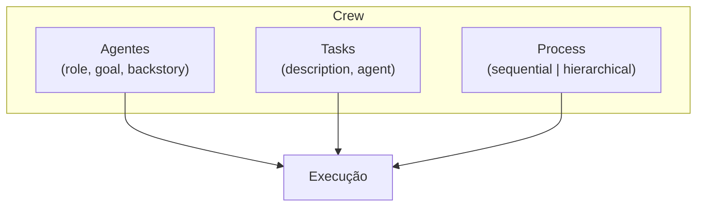

---

### D18 — Swarm vs Supervisor (Tabela) (Slide 33)

**Tipo**: Tabela comparativa
**Descrição**: Tabela com 8 eixos comparando swarm e supervisor (verde/amarelo)
**Mermaid**: Tabela colorida renderizada como imagem.

---

### D19 — Pipeline Fixo vs Dinâmico (Slide 36)

**Tipo**: Comparação
**Descrição**: Esteira linear (fixo) vs esteira com bifurcação (dinâmico)
**Mermaid**:
```mermaid
flowchart LR
    subgraph F["Pipeline Fixo"]
        AF[A] --> BF[B] --> CF[C]
    end
    subgraph D["Pipeline Dinâmico"]
        AD[A] --> D{decide}
        D --> BD[B]
        D --> CD[C]
    end
```

---

### D20 — Orchestrator-Workers Estrela (Slide 37)

**Tipo**: Flowchart estrela
**Descrição**: Orchestrator no centro, workers em volta, síntese no final
**Mermaid**:
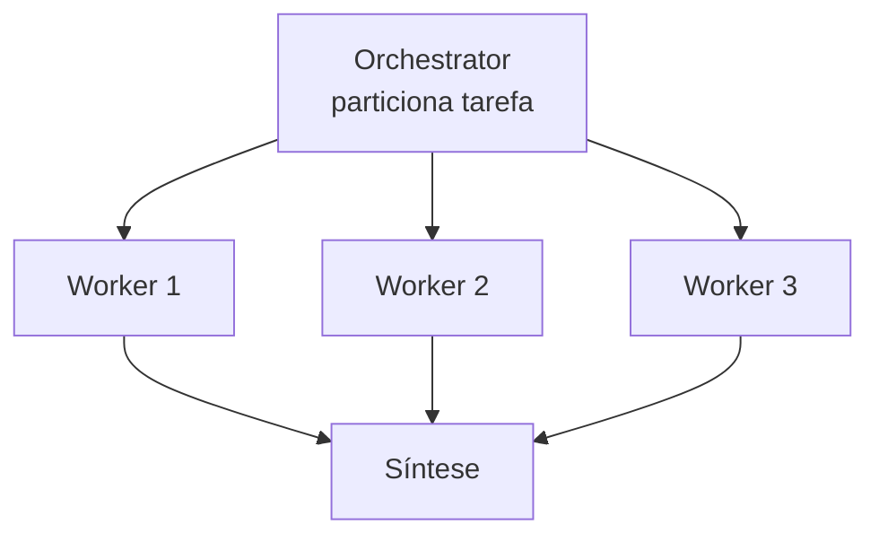

---

### D21 — Pipeline + Hierarchical Composição (Slide 38)

**Tipo**: Flowchart com zoom
**Descrição**: Pipeline onde um step é expandido como hierarchical
**Mermaid**:
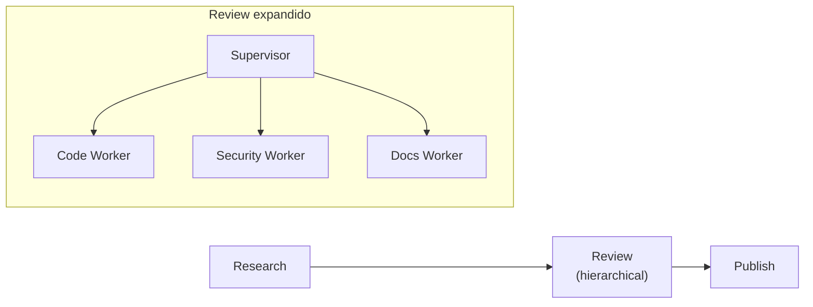

---

### D22 — Event-Driven Pub/Sub (Slide 42)

**Tipo**: Flowchart
**Descrição**: Broker no centro, agentes pub/sub ao redor
**Mermaid**:
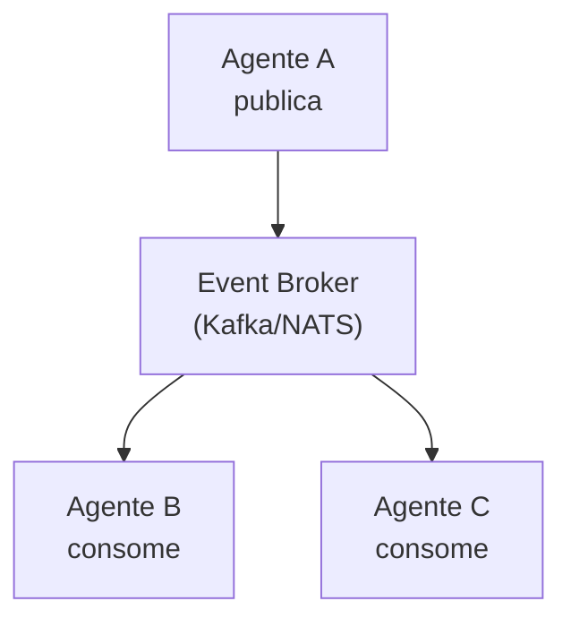

---

### D23 — Actor Model Mailbox (Slide 43)

**Tipo**: Flowchart
**Descrição**: Ator com mailbox, mensagens chegando, estado privado
**Mermaid**:
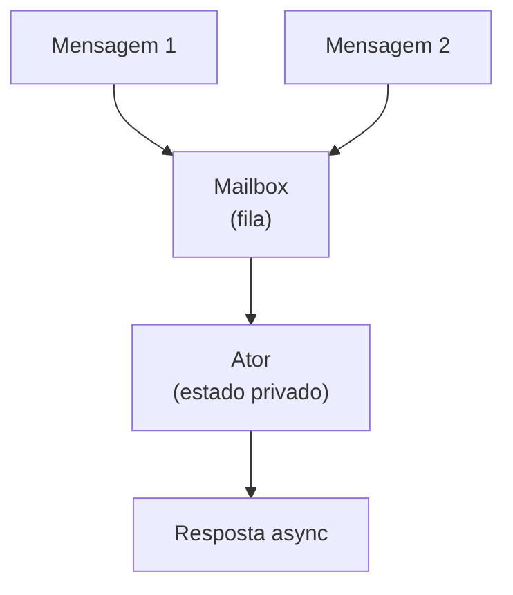

---

### D24 — Agent Mesh P2P (Slide 44)

**Tipo**: Grafo completo
**Descrição**: Nós interconectados (todos com todos)
**Mermaid**:
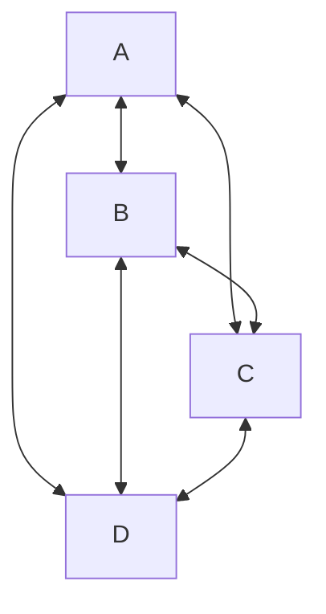

---

### D25 — Blackboard Espaço Compartilhado (Slide 45)

**Tipo**: Flowchart
**Descrição**: Quadro compartilhado com agentes lendo e escrevendo
**Mermaid**:
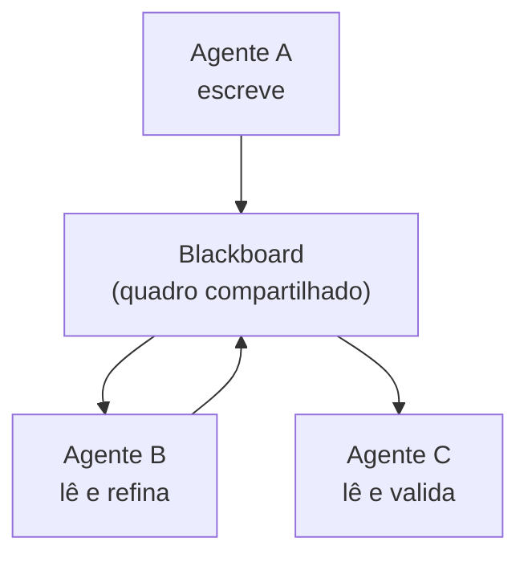

---

### D26 — Tree of Agents LATS (Slide 48)

**Tipo**: Árvore de exploração
**Descrição**: Árvore com nós de seleção, expansão, avaliação
**Mermaid**:
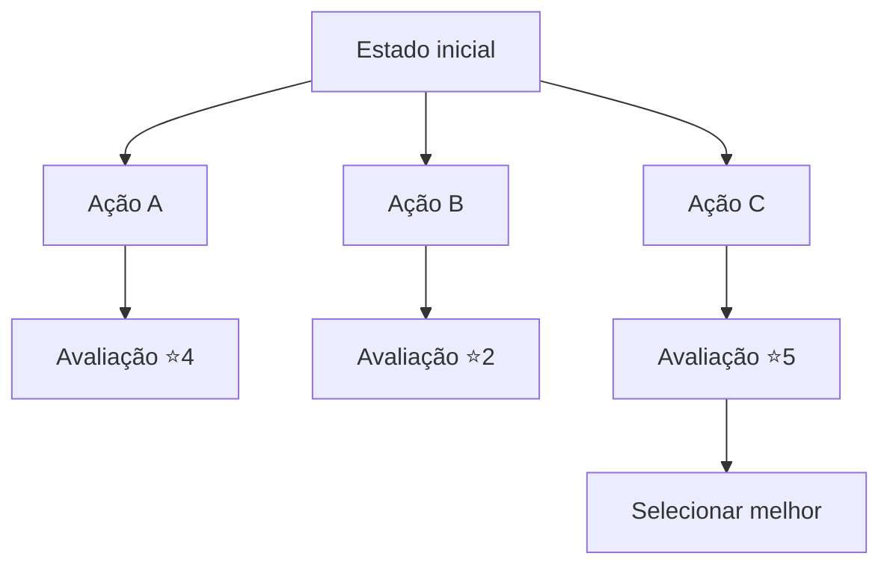

---

### D27 — Recursive Fractal (Slide 49)

**Tipo**: Estrutura fractal
**Descrição**: Meta-agente cria sub-agentes que criam sub-sub-agentes
**Mermaid**:
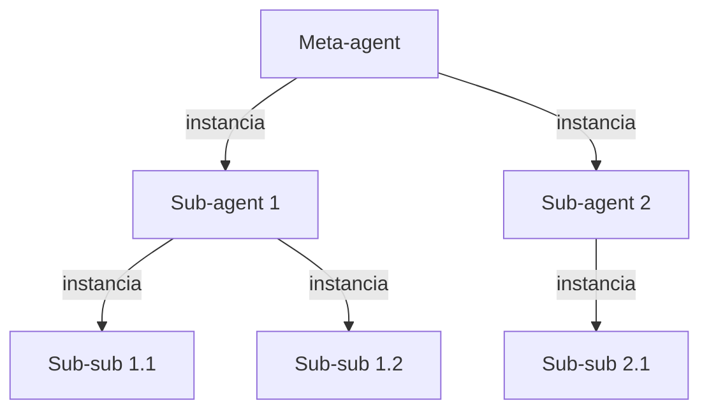

---

### D28 — Recursive Anti-Pattern (Slide 50)

**Tipo**: Comparação
**Descrição**: Árvore crescendo infinitamente (vermelho) vs truncada com max_depth (verde)
**Mermaid**:
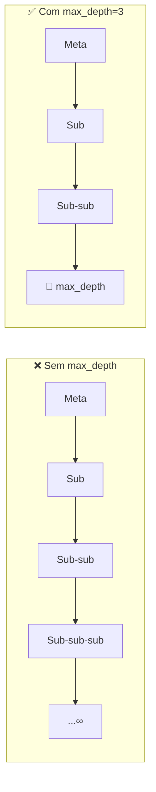

---

### D30 — ADR Template (Slide 55)

**Tipo**: Template documento
**Descrição**: 3 seções: Contexto, Decision, Consequências
**Mermaid**: Representação visual de documento com 3 seções destacadas em cores diferentes.

---

### D31 — Sinais de Evolução Checklist (Slide 56)

**Tipo**: Checklist
**Descrição**: Sinais agrupados por topologia com semáforo (verde/amarelo/vermelho)
**Mermaid**:
```mermaid
flowchart TB
    subgraph SV["Supervisor"]
        S1["🔴 Latência > 30s"]
        S2["🔴 Workers > 7"]
        S3["🟡 Necessita paralelismo"]
    end
    subgraph SW["Swarm"]
        W1["🔴 Loops de handoff"]
        W2["🟡 Estado crescendo"]
        W3["🟡 Necessita síntese"]
    end
    subgraph PL["Pipeline"]
        P1["🟡 Passos imprevisíveis"]
        P2["🟡 Necessita decisão dinâmica"]
    end
```

---

### D32 — MetaGPT Software House (Slide 57)

**Tipo**: Flowchart com artefatos
**Descrição**: Hierarquia completa MetaGPT com fluxo de artefatos
**Mermaid**:
```mermaid
flowchart LR
    IN["'Build a 2048 game'"] --> PM
    subgraph SH["Software House (MetaGPT)"]
        PM["Product Manager"] -->|PRD| AR["Architect"]
        AR -->|Design Doc| EN["Engineer"]
        EN -->|Código| QA["QA Tester"]
        QA -->|Testes| OK["✅ Aprovado"]
    end
    OK --> OUT["Código + Testes + Docs"]
```

---

## Resumo de Produção

| # | Nome | Tipo | Status | Slide |
|---|---|---|---|---|
| D1 | Grid 12 topologias | Grid 4×3 | 🆕 Novo | 8 |
| D2 | Espectro centralizado↔descentralizado | Eixo | 🆕 Novo | 9 |
| D3 | Supervisor e Hierarchical mini | Comparação | ✅ Existe (compactar) | 10 |
| D4 | Pipeline e Orchestrator mini | Comparação | 🆕 Novo | 11 |
| D5 | Swarm, Mesh, Actor mini | Comparação | ✅ Parcial (swarm) | 12 |
| D6 | Tree e Recursive mini | Comparação | 🆕 Novo | 13 |
| D7 | Event-Driven, Blackboard, Hybrid mini | Comparação | 🆕 Novo | 14 |
| D8 | Single Agent com N tools | Estrela | 🆕 Novo | 15 |
| D9 | Supervisor pattern | Flowchart | ✅ Existe | 18 |
| D10 | Supervisor tool calls | Sequência | 🆕 Novo (anotação) | 19 |
| D11 | Hierarchical | Flowchart | ✅ Existe | 20 |
| D12 | 3 níveis vs flat | 3 árvores | 🆕 Novo | 21 |
| D13 | Supervisor gargalo | Flowchart | 🆕 Novo | 22 |
| D14 | Workers redundantes | Venn | 🆕 Novo | 23 |
| D15 | MetaGPT SOPs | Hierarquia | 🆕 Novo | 26 |
| D16 | Crew formation | Flowchart | 🆕 Novo | 27 |
| D17 | Swarm topology | Flowchart | ✅ Existe | 30 |
| D18 | Swarm vs Supervisor tabela | Tabela | 🆕 Novo | 33 |
| D19 | Pipeline fixo vs dinâmico | Comparação | 🆕 Novo | 36 |
| D20 | Orchestrator-Workers estrela | Flowchart | 🆕 Novo | 37 |
| D21 | Pipeline + Hierarchical composição | Flowchart | 🆕 Novo | 38 |
| D22 | Event-driven pub/sub | Flowchart | 🆕 Novo | 42 |
| D23 | Actor model mailbox | Flowchart | 🆕 Novo | 43 |
| D24 | Agent mesh P2P | Grafo | 🆕 Novo | 44 |
| D25 | Blackboard compartilhado | Flowchart | 🆕 Novo | 45 |
| D26 | Tree of Agents LATS | Árvore | 🆕 Novo | 48 |
| D27 | Recursive fractal | Fractal | 🆕 Novo | 49 |
| D28 | Recursive anti-pattern | Comparação | 🆕 Novo | 50 |
| D29 | Matriz de decisão | Matriz | ✅ Existe | 54 |
| D30 | ADR template | Template | 🆕 Novo | 55 |
| D31 | Sinais de evolução | Checklist | 🆕 Novo | 56 |
| D32 | MetaGPT software house | Flowchart | 🆕 Novo | 57 |

**Total**: 4 existentes + 28 novos = 32 diagramas únicos a produzir/manter.
