# ETHAGT11 — Sugestões de Diagramas

> 24 diagramas referenciados no storyboard.
> 3 já existem em `12-Diagrams/ETHAGT11/`. 21 novos a produzir.

---

## Diagramas Existentes (3)

| # | Slide | Arquivo | Descrição |
|---|---|---|---|
| D1 | 9 | `event-driven.mmd` | Pipeline event-driven: producer → Kafka topics → consumers (agentes OCR, validate, index) → vector DB + DLQ |
| D17/D18 | 24, 51, 52 | `saga.mmd` | Saga pattern: iniciar → debitar → creditar → sucesso; falha em creditar → compensar (estornar) |
| D12/D14 | 31, 38 | `durable-execution.mmd` | Durable execution: workflow com activities, checkpoints, HITL via signal, recovery após crash |

---

## Diagramas Novos (21)

### D2 — O Log Imutável (Slide 15)

**Tipo**: Flowchart horizontal
**Descrição**: Log append-only com offsets (0, 1, 2, 3...) e múltiplos consumers lendo em posições diferentes
**Mermaid**:
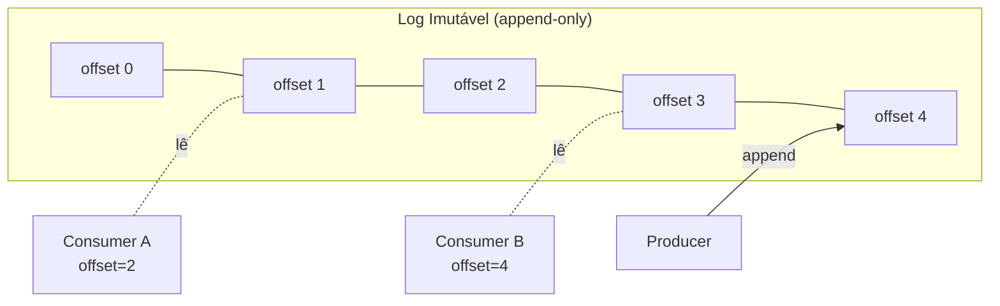
**Estilo**: Log em `etho-accent`; consumers em cores diferentes.

---

### D3 — Kafka: Arquitetura (Slide 16)

**Tipo**: Flowchart
**Descrição**: Topic com 3 partições, cada partição é um log; producers e consumer group
**Mermaid**:
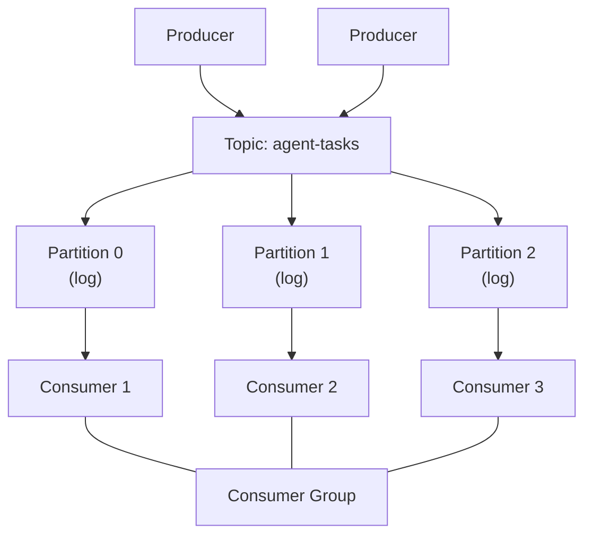

---

### D4 — Kafka: Particionamento e Ordering por Chave (Slide 17)

**Tipo**: Diagrama de chaves
**Descrição**: 3 partições com mensagens coloridas por agent_id (mesma cor = mesma partição)
**Mermaid**:
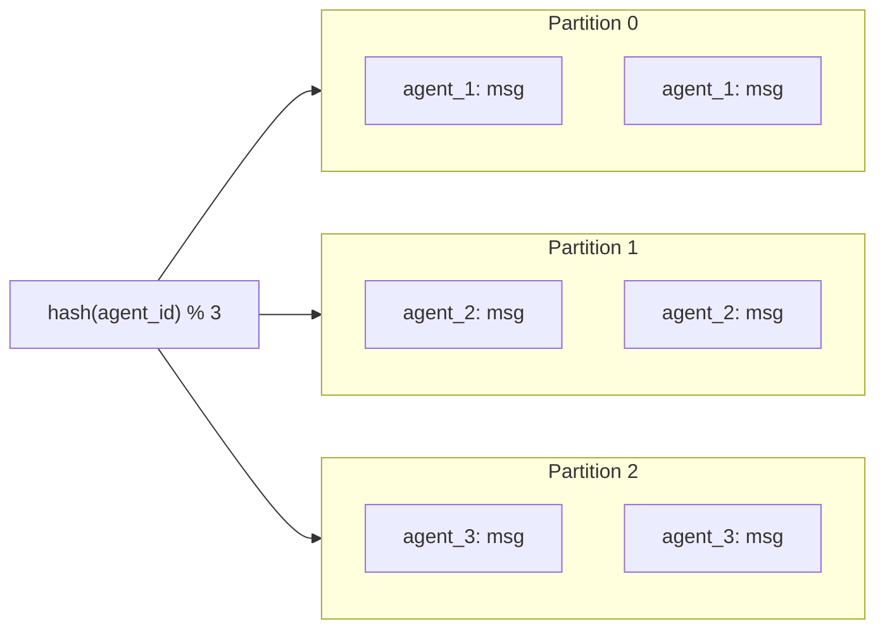
**Estilo**: Mesmo agent_id em mesma cor (azul, verde, laranja).

---

### D5 — Kafka: Consumer Groups e Escala Horizontal (Slide 18)

**Tipo**: Diagrama de atribuição
**Descrição**: 3 partições → 3 consumers em um group, com setas de atribuição
**Mermaid**:
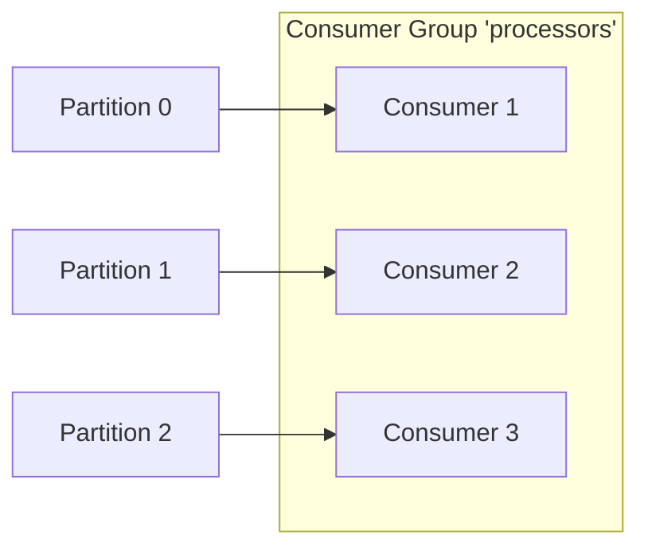

---

### D6 — RabbitMQ: Exchanges, Bindings, Queues (Slide 19)

**Tipo**: Flowchart AMQP
**Descrição**: Exchange → bindings → múltiplas queues → consumers
**Mermaid**:
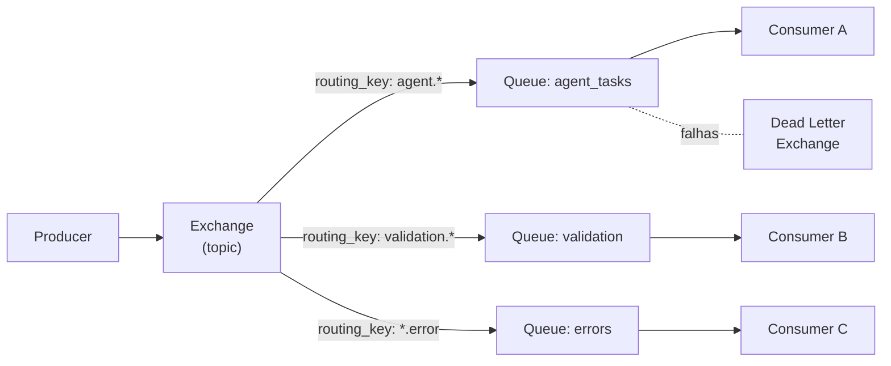

---

### D7 — Comparação Kafka vs RabbitMQ vs NATS (Slide 21)

**Tipo**: Tabela 3 colunas
**Descrição**: Tabela comparativa colorida nos eixos principais
**Mermaid**:
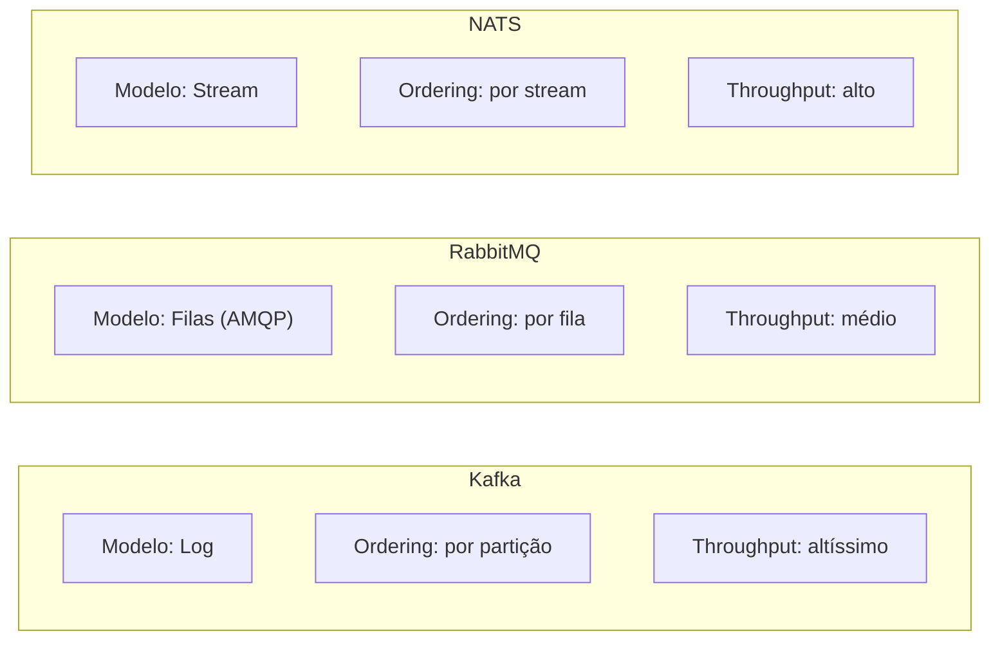

---

### D8 — CQRS (Slide 23)

**Tipo**: Flowchart
**Descrição**: Command → event store → read model → query
**Mermaid**:
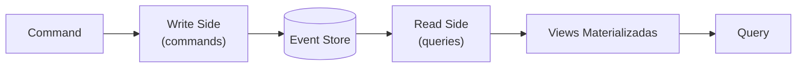

---

### D9 — CloudEvent (JSON Exemplo) (Slide 25)

**Tipo**: Code block
**Descrição**: JSON de um CloudEvent com campos destacados
**Mermaid**:
```json
{
  "specversion": "1.0",
  "id": "evt-12345",
  "source": "/agents/extractor",
  "type": "com.etho.document.extracted",
  "time": "2026-07-07T10:30:00Z",
  "subject": "doc-67890",
  "data": {
    "document_id": "doc-67890",
    "fields": {"name": "João", "value": 1500}
  }
}
```

---

### D10 — Temporal: Arquitetura (Slide 30)

**Tipo**: Flowchart
**Descrição**: Client → Server → Task Queue → Worker
**Mermaid**:
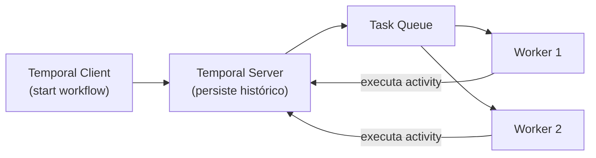

---

### D11 — Comparação Temporal vs Prefect vs Airflow (Slide 35)

**Tipo**: Tabela
**Descrição**: Comparação nos eixos: durable execution, HITL, timers, replay, agendamento
**Mermaid**:
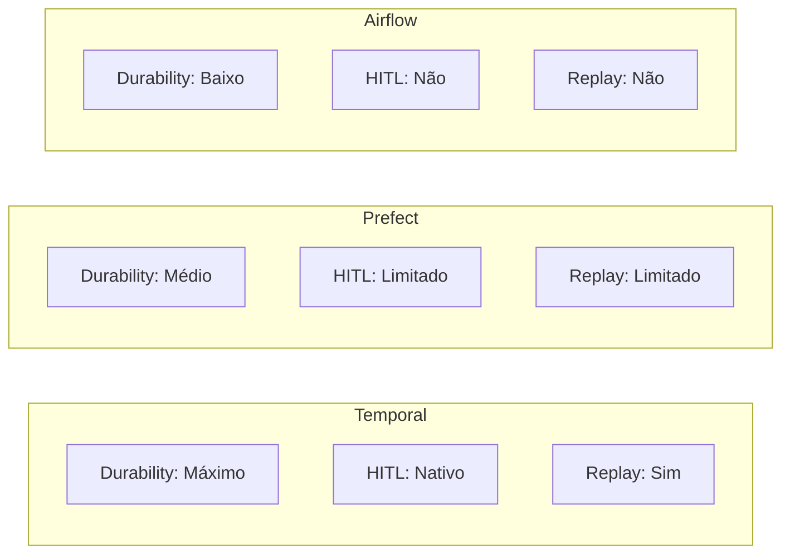

---

### D13 — HITL via Timers e Signals (Slide 40)

**Tipo**: Sequência
**Descrição**: Workflow → pause (await signal) → humano aprova → resume; com timeout
**Mermaid**:
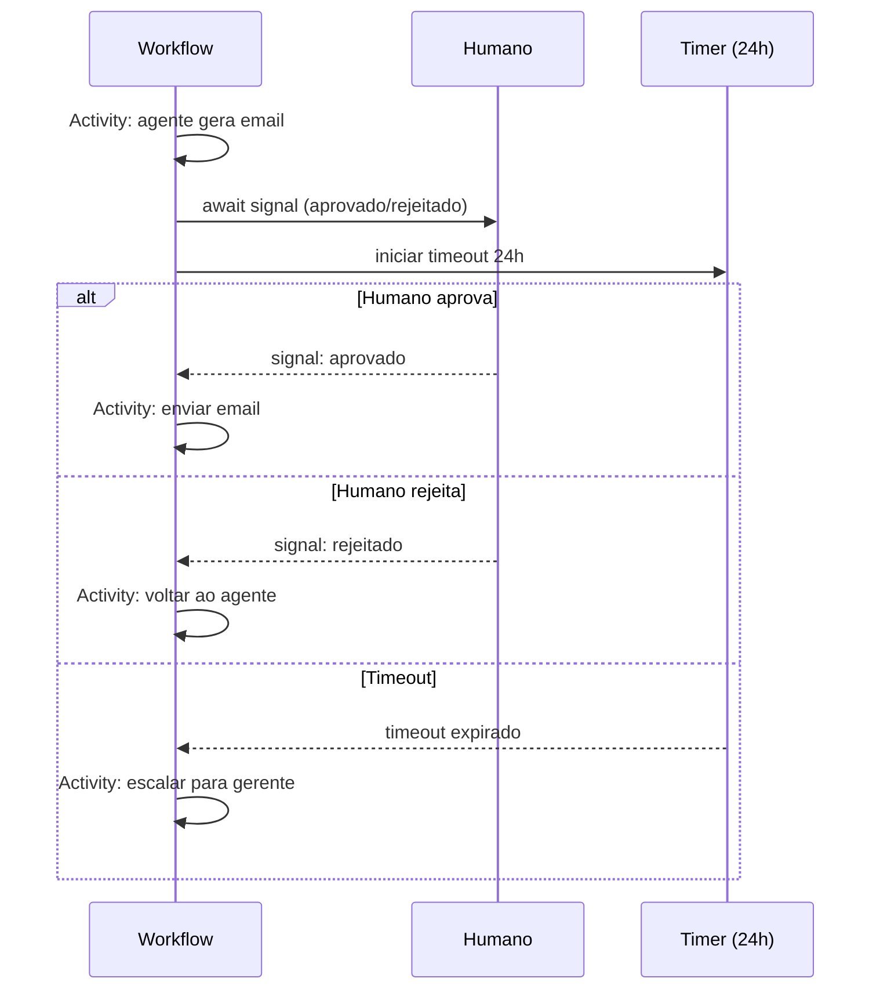

---

### D15 — Non-Determinism Quebrando Replay (Slide 42)

**Tipo**: Comparação
**Descrição**: Replay quebrado (non-determinism) vs replay correto
**Mermaid**:
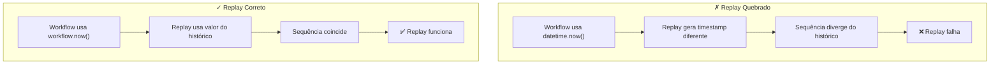

---

### D16 — Determinismo: Código Correto vs Quebrado (Slide 43)

**Tipo**: Code comparison
**Descrição**: Dois snippets lado a lado
**Mermaid**:
```python
# ✗ Quebrado (non-determinístico)
@workflow
async def bad_workflow():
    now = datetime.now()      # NON-DETERMINISTIC
    time.sleep(5)              # BLOQUEIA, não é durable
    result = requests.get(...)  # I/O direto no workflow
```

```python
# ✓ Correto (determinístico)
@workflow
async def good_workflow():
    now = workflow.now()       # DETERMINISTIC (seeded)
    await workflow.sleep(5)    # Durable, não bloqueia
    result = await workflow.execute_activity(
        fetch_data             # I/O vai em activity
    )
```

---

### D19 — Circuit Breaker (State Machine) (Slide 53)

**Tipo**: State diagram
**Descrição**: Estados Closed → Open → Half-Open → Closed/Open
**Mermaid**:
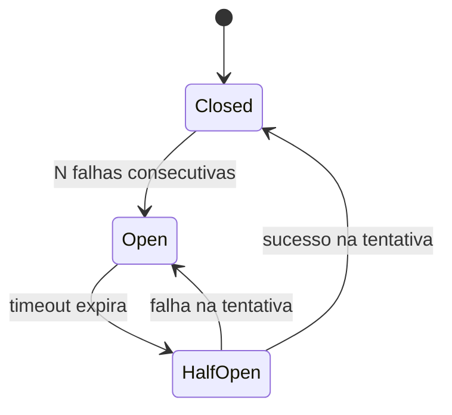

---

### D20 — Exactly-once vs At-least-once vs At-most-once (Slide 56)

**Tipo**: Comparação visual
**Descrição**: 3 modelos de delivery com exemplos
**Mermaid**:
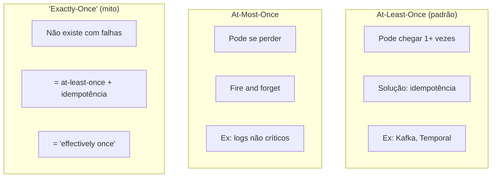

---

### D21 — Sharding de Consumidores (Slide 57)

**Tipo**: Diagrama de paralelismo
**Descrição**: Múltiplas partições → múltiplos consumers em paralelo
**Mermaid**:
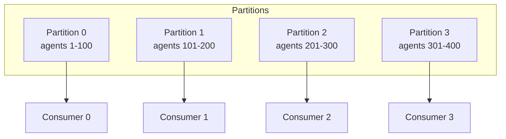

---

### D22 — Distributed Tracing (Slide 58)

**Tipo**: Timeline de spans
**Descrição**: Trace distribuído com spans em múltiplos serviços
**Mermaid**:
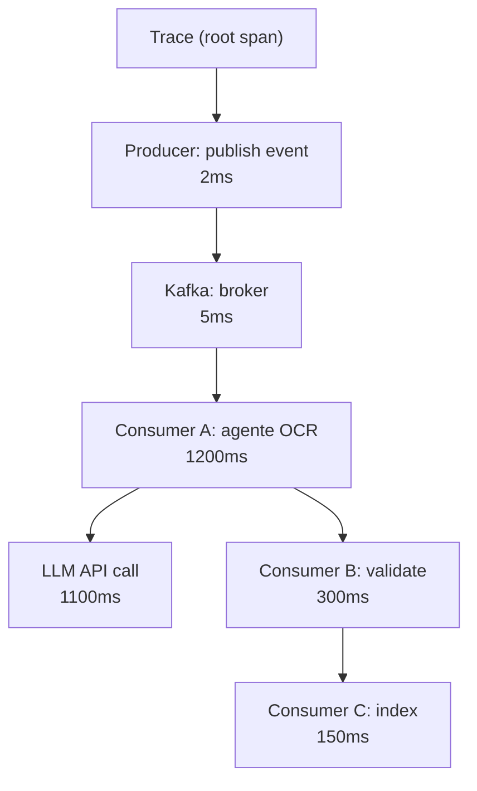
**Estilo**: Cada span em cor diferente por serviço.

---

### D23 — Caso de Estudo: Pipeline Enterprise (Slide 65)

**Tipo**: Flowchart de arquitetura completa
**Descrição**: Pipeline de processamento de documentos com todos os patterns
**Mermaid**:
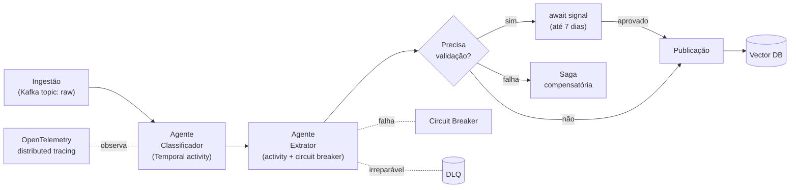

---

### D24 — Mapa da Especialização com ETHAGT11 (Slide 73)

**Tipo**: Mind map radial
**Descrição**: ETHAGT11 no centro com conexões para módulos futuros
**Mermaid**:
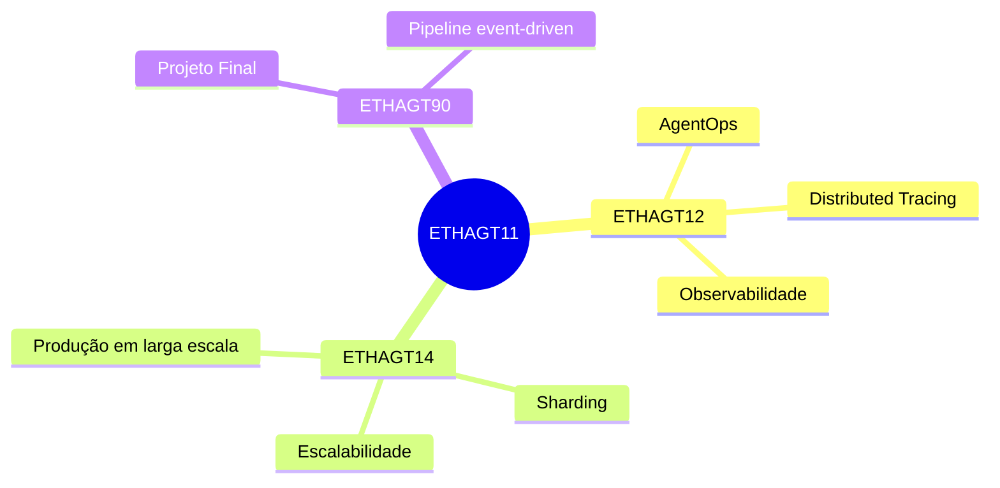

---

## Resumo de Produção

| # | Nome | Tipo | Status | Slide |
|---|---|---|---|---|
| D1 | Pipeline event-driven | Flowchart | ✅ Existe | 9 |
| D2 | O Log imutável | Flowchart | 🆕 Novo | 15 |
| D3 | Kafka: arquitetura | Flowchart | 🆕 Novo | 16 |
| D4 | Kafka: particionamento e ordering | Diagrama | 🆕 Novo | 17 |
| D5 | Kafka: consumer groups | Diagrama | 🆕 Novo | 18 |
| D6 | RabbitMQ: exchanges/bindings | Flowchart | 🆕 Novo | 19 |
| D7 | Comparação Kafka/RabbitMQ/NATS | Tabela | 🆕 Novo | 21 |
| D8 | CQRS | Flowchart | 🆕 Novo | 23 |
| D9 | CloudEvent JSON | Código | 🆕 Novo | 25 |
| D10 | Temporal: arquitetura | Flowchart | 🆕 Novo | 30 |
| D11 | Comparação Temporal/Prefect/Airflow | Tabela | 🆕 Novo | 35 |
| D12 | Durable execution | Sequência | ✅ Existe | 31, 38 |
| D13 | HITL via timers e signals | Sequência | 🆕 Novo | 40 |
| D14 | Durable execution (crash) | Sequência | ✅ = D12 | 38 |
| D15 | Non-determinism quebrando replay | Comparação | 🆕 Novo | 42 |
| D16 | Determinismo: correto vs quebrado | Código | 🆕 Novo | 43 |
| D17 | Saga pattern | Flowchart | ✅ Existe | 24, 51 |
| D18 | Saga: transferência entre contas | Flowchart | ✅ = D17 | 52 |
| D19 | Circuit breaker | State diagram | 🆕 Novo | 53 |
| D20 | Exactly-once vs at-least-once | Comparação | 🆕 Novo | 56 |
| D21 | Sharding de consumidores | Diagrama | 🆕 Novo | 57 |
| D22 | Distributed tracing | Timeline | 🆕 Novo | 58 |
| D23 | Caso de estudo: pipeline enterprise | Flowchart | 🆕 Novo | 65 |
| D24 | Mapa da especialização | Mind map | 🆕 Novo | 73 |

**Total**: 3 existentes (reutilizados em 6 slides) + 21 novos = 24 diagramas referenciados.
