# ETHAGT12 — Sugestões de Diagramas

> 22 diagramas necessários para a apresentação.
> 3 já existem em `12-Diagrams/ETHAGT12/`. 19 novos a produzir.

---

## Diagramas Existentes (3)

| # | Slide | Arquivo | Descrição |
|---|---|---|---|
| D5 | 17 | `trace-anatomy.mmd` | Trace com spans e atributos |
| D14 | 39 | `eval-pipeline.mmd` | Pipeline de eval com CI (gate) |
| D15 | 46 | `benchmark-landscape.mmd` | Landscape dos benchmarks canônicos |

---

## Diagramas Novos (19)

### D1 — Teste Manual vs Produção (Slide 5)

**Tipo**: Gráfico de barras
**Descrição**: Duas barras lado a lado — "Teste manual: 100%" (verde) vs "Produção: 30%" (vermelho)
**Mermaid**:
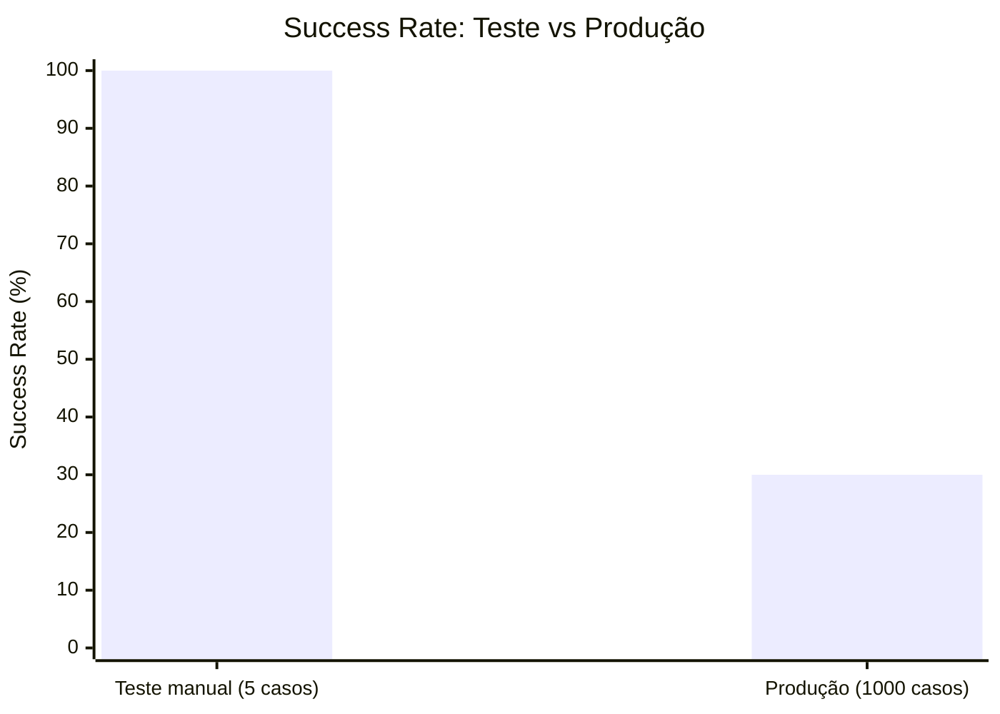
**Estilo**: Barra teste em `etho-success`, produção em `etho-danger`.

---

### D2 — Árvore de Possibilidades (Slide 8)

**Tipo**: Árvore
**Descrição**: 1 prompt → múltiplos caminhos (não-determinismo)
**Mermaid**:
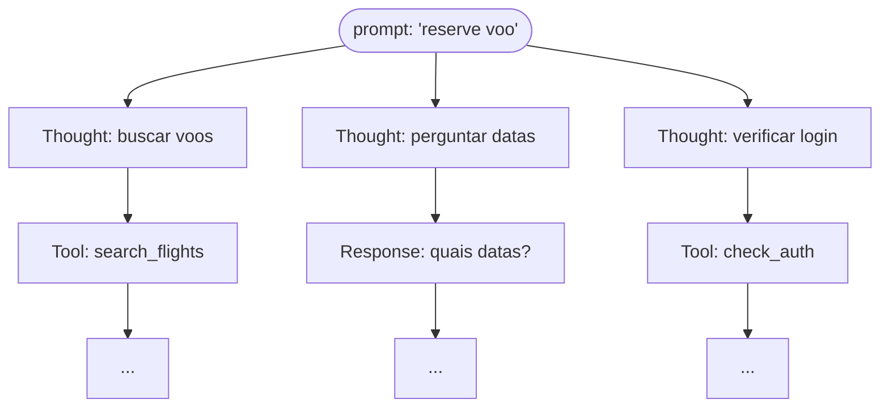

---

### D3 — Agente Cercado por Fontes Mutáveis (Slide 9)

**Tipo**: Flowchart
**Descrição**: Agente no centro, cercado por API, DB, Web, FS
**Mermaid**:
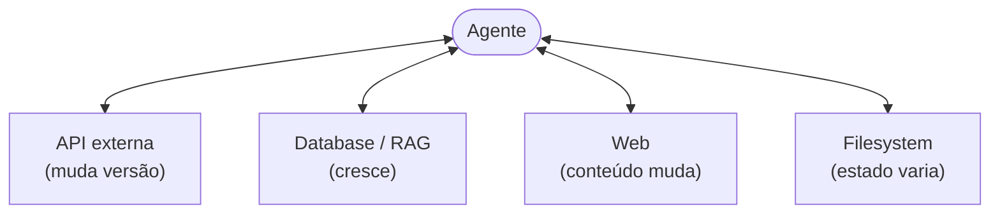

---

### D4 — Árvore de Spans Conceitual (Slide 16)

**Tipo**: Árvore
**Descrição**: Root span → children → leaves, com timing
**Mermaid**:
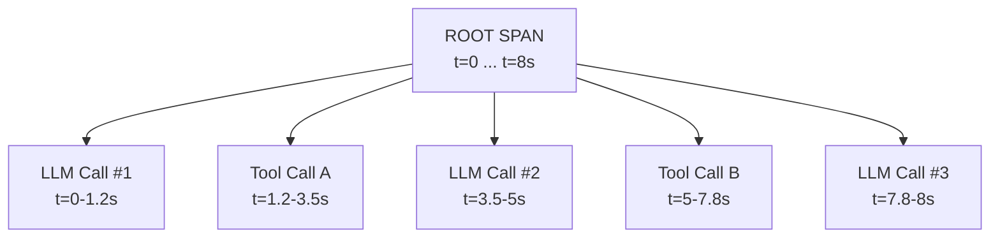

---

### D6 — Span com Atributos GenAI (Slide 18)

**Tipo**: Bloco de código anotado
**Descrição**: Span OTel com atributos GenAI semantic conventions
**Mermaid**:
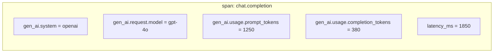

---

### D7 — Comparação LangSmith vs Phoenix vs Langfuse vs OpenLLMetry (Slide 19)

**Tipo**: Tabela 4 colunas
**Descrição**: Tabela comparativa de ferramentas
**Mermaid**:
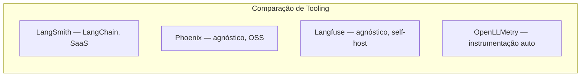

---

### D8 — Logs Estruturados vs Traces (Slide 20)

**Tipo**: Comparação
**Descrição**: Logs (JSON sequencial) vs Traces (árvore hierárquica)
**Mermaid**:
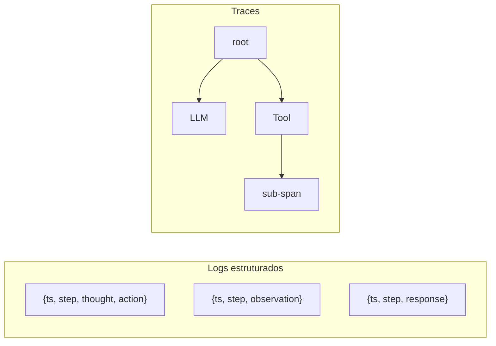

---

### D9 — Funil de Amostragem (Slide 21)

**Tipo**: Funil
**Descrição**: 100% traces → amostragem → 10% armazenados (com erros sempre capturados)
**Mermaid**:
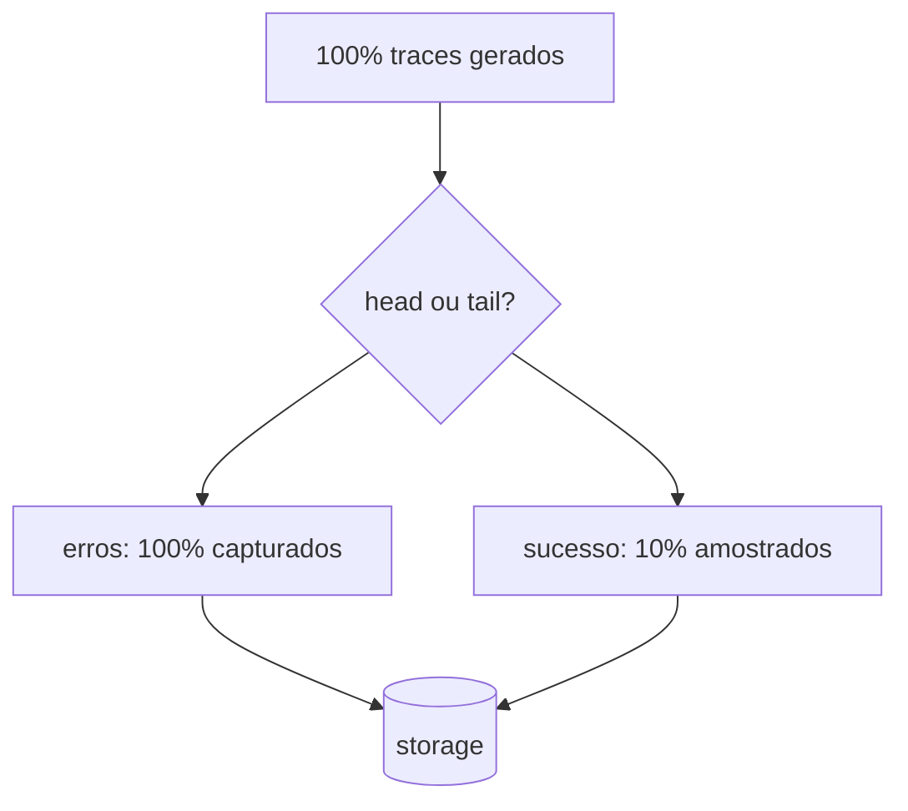

---

### D10 — Dashboard Mínimo de Observabilidade (Slide 22)

**Tipo**: Mock dashboard com 6 painéis (grid 2x3)
**Descrição**: 6 painéis: success rate, latência P50/P95/P99, custo, tool usage, erros, distribuição de steps
**Mermaid**:
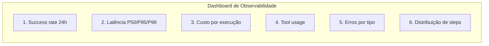

---

### D11 — Latência P50/P95/P99 (Slide 23)

**Tipo**: Gráfico de linha
**Descrição**: Distribuição de latência com marcadores P50, P95, P99
**Mermaid**:
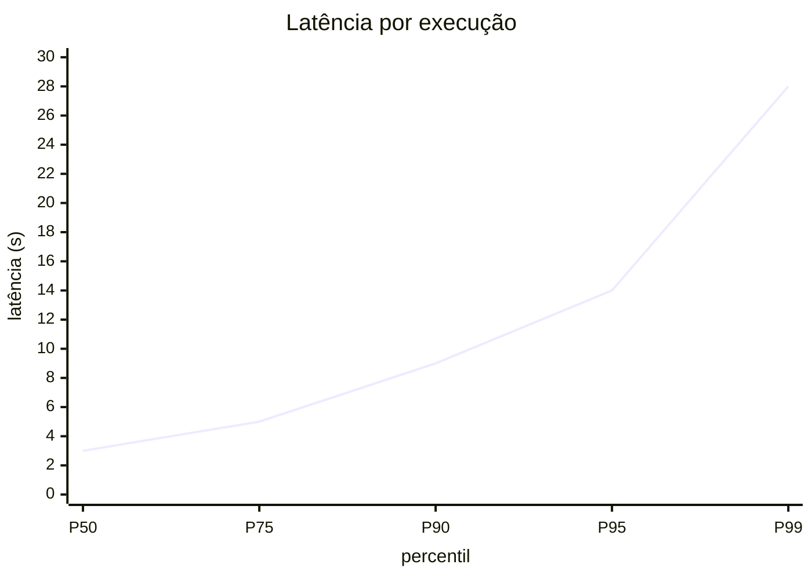

---

### D12 — Fluxo LLM-as-Judge (Slide 30)

**Tipo**: Flowchart
**Descrição**: agent output → judge prompt (com rubrica) → judge LLM → score + justificativa
**Mermaid**:
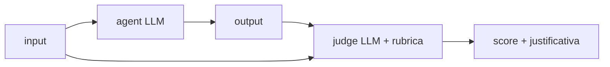

---

### D13 — Exemplo de Golden Case em Código (Slide 34)

**Tipo**: Bloco de código
**Descrição**: Estrutura de golden case em Python
**Mermaid**:
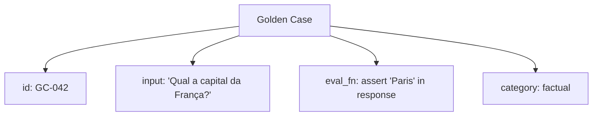

---

### D16 — Fluxo SWE-bench (Slide 47)

**Tipo**: Flowchart
**Descrição**: issue → agente → patch → testes → pass/fail
**Mermaid**:
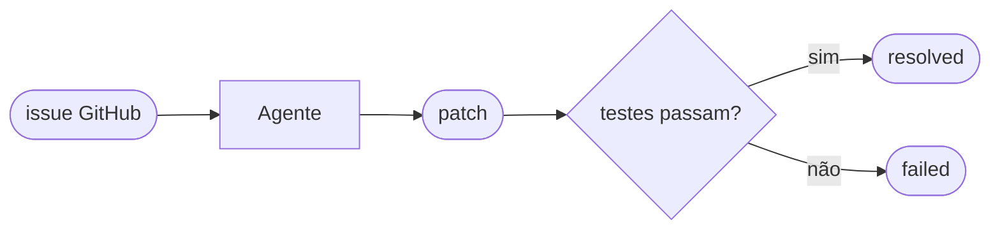

---

### D17 — Arquitetura τ-bench (Slide 49)

**Tipo**: Flowchart
**Descrição**: user simulator ↔ agent ↔ tools
**Mermaid**:
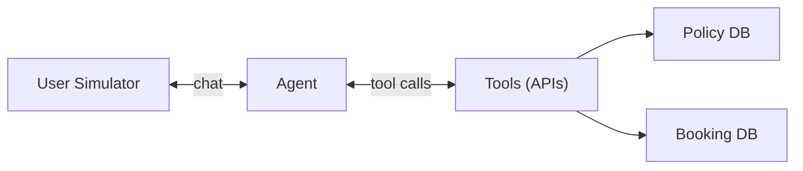

---

### D18 — Grid de Ambientes AgentBench (Slide 50)

**Tipo**: Grid
**Descrição**: 8 ambientes do AgentBench
**Mermaid**:
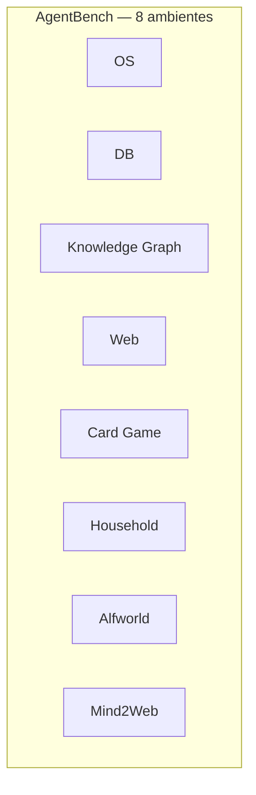

---

### D19 — Shadow Runs e Canary (Slide 58)

**Tipo**: Flowchart
**Descrição**: Shadow (paralelo) → canary (5%) → full (100%)
**Mermaid**:
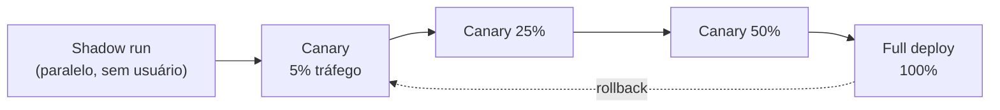

---

### D20 — Gráfico de Pizza de Categorias de Falha (Slide 62)

**Tipo**: Pizza chart
**Descrição**: Distribuição de categorias de falha
**Mermaid**:
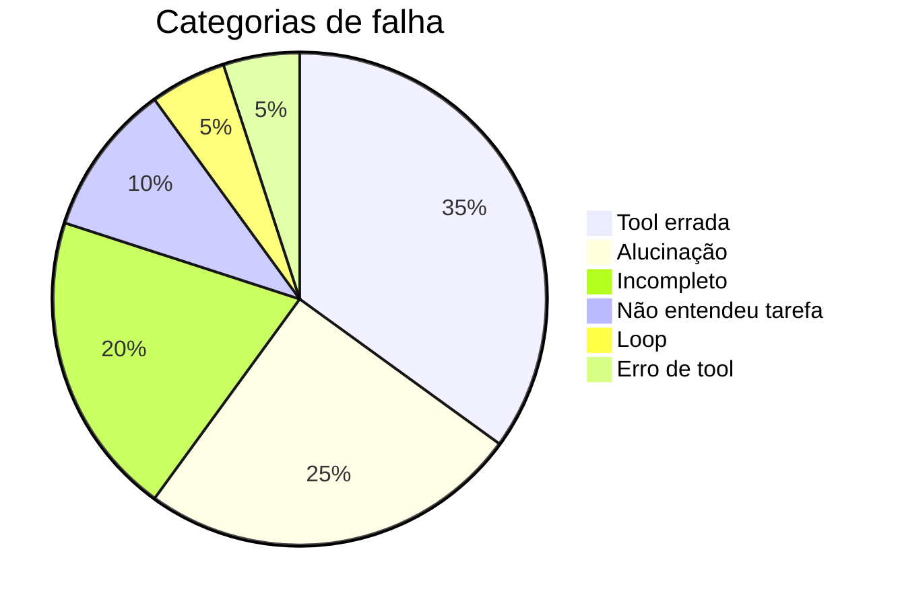

---

### D21 — Ciclo de Melhoria Anthropic (Slide 68)

**Tipo**: Ciclo
**Descrição**: eval → trace → categorizar falhas → corrigir → re-eval
**Mermaid**:
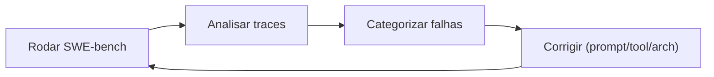

---

### D22 — Mapa da Especialização com ETHAGT12 (Slide 76)

**Tipo**: Mind map radial
**Descrição**: ETHAGT12 no centro com conexões para módulos
**Mermaid**:
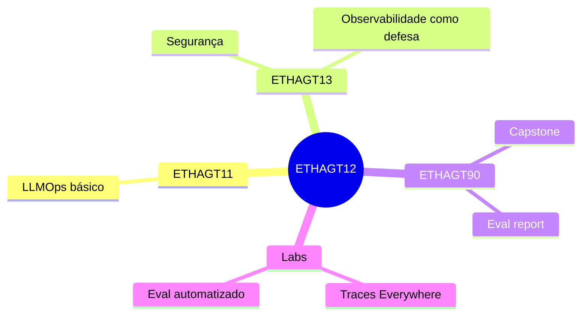

---

## Resumo de Produção

| # | Nome | Tipo | Status | Slide |
|---|---|---|---|---|
| D1 | Teste vs produção | Gráfico barras | 🆕 Novo | 5 |
| D2 | Árvore de possibilidades | Árvore | 🆕 Novo | 8 |
| D3 | Agente + fontes mutáveis | Flowchart | 🆕 Novo | 9 |
| D4 | Árvore de spans conceitual | Árvore | 🆕 Novo | 16 |
| D5 | Anatomia de trace | Flowchart | ✅ Existe | 17 |
| D6 | Span GenAI attributes | Código | 🆕 Novo | 18 |
| D7 | Comparação tooling | Tabela | 🆕 Novo | 19 |
| D8 | Logs vs traces | Comparação | 🆕 Novo | 20 |
| D9 | Funil de amostragem | Funil | 🆕 Novo | 21 |
| D10 | Dashboard 6 painéis | Mock | 🆕 Novo | 22 |
| D11 | Latência P50/P95/P99 | Gráfico | 🆕 Novo | 23 |
| D12 | Fluxo LLM-as-judge | Flowchart | 🆕 Novo | 30 |
| D13 | Golden case em código | Código | 🆕 Novo | 34 |
| D14 | Pipeline eval com CI | Flowchart | ✅ Existe | 39 |
| D15 | Landscape benchmarks | Mind map | ✅ Existe | 46 |
| D16 | Fluxo SWE-bench | Flowchart | 🆕 Novo | 47 |
| D17 | Arquitetura τ-bench | Flowchart | 🆕 Novo | 49 |
| D18 | Grid AgentBench | Grid | 🆕 Novo | 50 |
| D19 | Shadow/canary | Flowchart | 🆕 Novo | 58 |
| D20 | Pizza categorias falha | Pizza | 🆕 Novo | 62 |
| D21 | Ciclo Anthropic | Ciclo | 🆕 Novo | 68 |
| D22 | Mapa especialização | Mind map | 🆕 Novo | 76 |

**Total**: 3 existentes + 19 novos = 22 diagramas a produzir/manter.
