# ETHAGT13 — Sugestões de Diagramas

> Diagramas necessários para a apresentação.
> 3 já existem em `12-Diagrams/ETHAGT13/`. 18 novos sugeridos.

---

## Diagramas Existentes (3)

| # | Slide | Arquivo | Descrição |
|---|---|---|---|
| D7 | 12 | `threat-model.mmd` | Ativos → superfícies → vetores → impactos |
| D18 | 34 | `defense-in-depth.mmd` | 7 camadas sequenciais de defesa |
| D23 | 43 | `hitl-checkpoints.mmd` | Classificação de risco → 3 caminhos (auto/batch/imediato) |

> **Nota**: Os 3 diagramas existentes cobrem os slides centrais (12, 34, 43). Os demais são novos.

---

## Diagramas Novos Sugeridos

### D1 — Fluxo de Ataque: Phishing em Massa (Slide 5)

**Tipo**: Flowchart horizontal
**Descrição**: Documento malicioso → RAG → agente → tool de email → vítimas
**Mermaid**:
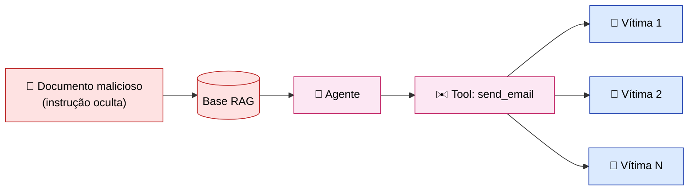
**Estilo**: Setas vermelhas percorrendo o fluxo de ataque.

---

### D2 — Timeline de Incidentes Reais (Slide 6)

**Tipo**: Timeline horizontal
**Descrição**: 2023 Bing/Sydney → 2023 Chevrolet → 2023 Greshake → 2024 AgentDojo → 2024 InjecAgent → 2025 OWASP
**Mermaid**:
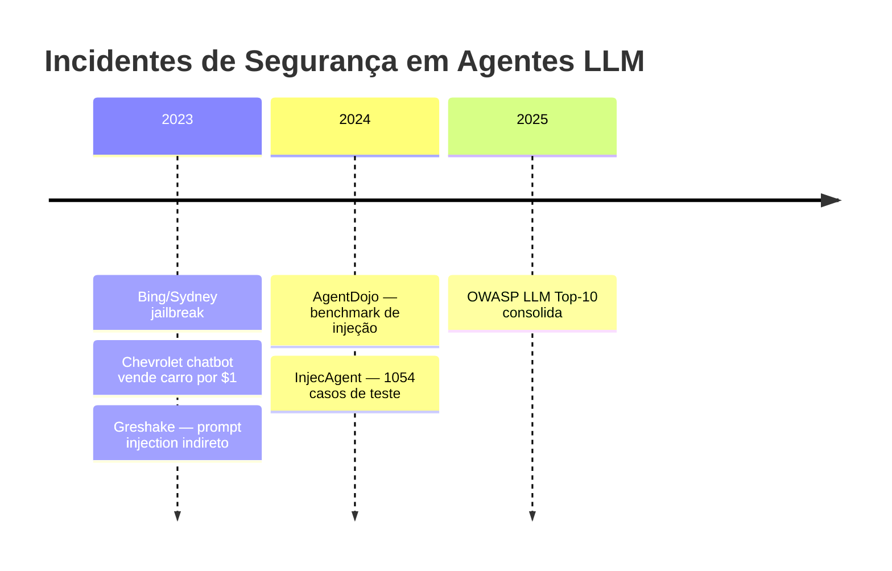

---

### D3 — Ativos, Adversários, Superfícies (Slide 8)

**Tipo**: Triângulo concêntrico
**Descrição**: Ativos (centro) → Superfícies (meio) → Adversários (exterior)
**Mermaid**:
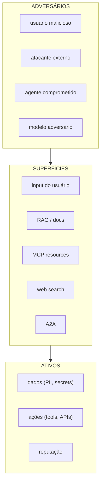

---

### D4 — Tabela STRIDE Adaptada (Slide 9)

**Tipo**: Tabela colorida
**Descrição**: 6 categorias STRIDE com exemplo concreto em agente
**Renderização**: Tabela markdown com cores (vermelho para crítico, amarelo para médio)
**Conteúdo**:

| Categoria | Exemplo em agente | Severidade |
|---|---|---|
| **S**poofing | Agente se passa por outro em A2A | Alta |
| **T**ampering | Adulteração de memória persistente | Alta |
| **R**epudiation | Ação sem log — sem rastreio | Média |
| **I**nformation Disclosure | Vazar system prompt, secrets, PII | Crítica |
| **D**enial of Service | Drenar orçamento de tokens | Média |
| **E**levation of Privilege | Prompt injection escala permissões | Crítica |

---

### D5 — Tools com Nível de Risco (Slide 10)

**Tipo**: Grid colorido
**Descrição**: Tools classificadas por risco (verde/amarelo/vermelho)
**Mermaid**:
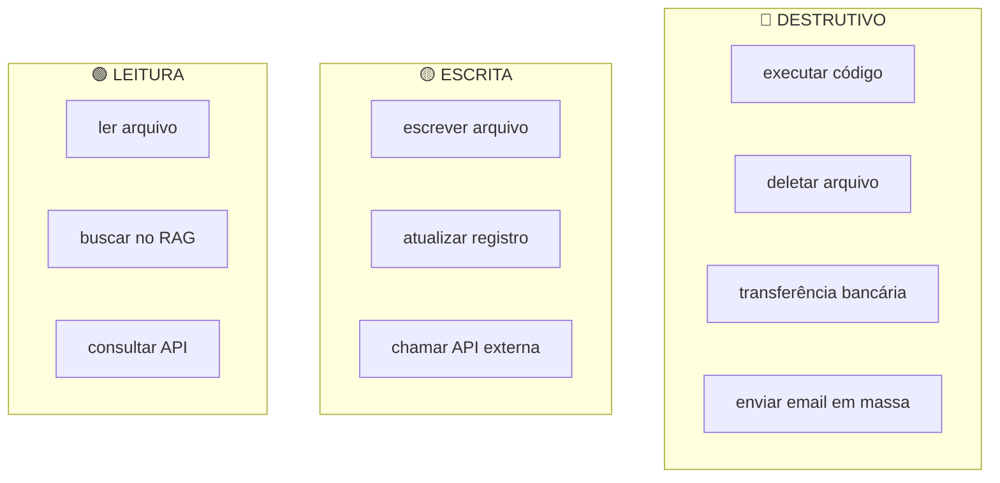

---

### D6 — Propagação de Comprometimento Multi-Agente (Slide 11)

**Tipo**: Topologia de grafo
**Descrição**: Agente A comprometido → infecta B → infecta C
**Mermaid**:
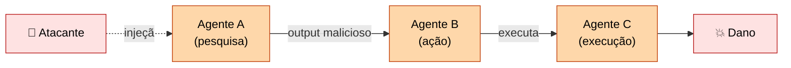

---

### D8 — LINDDUN Adaptado (Slide 13)

**Tipo**: Tabela com conexão a LGPD
**Descrição**: 6 categorias LINDDUN com exemplo em agente
**Conteúdo**: Ver Slide 13 do storyboard detalhado.

---

### D9 — Código/Dados Separados vs Tudo Texto (Slide 16)

**Tipo**: Comparação lado a lado
**Descrição**: Esquerda — tradicional (SQL com prepared statements); Direita — LLM (tudo texto)
**Mermaid**:
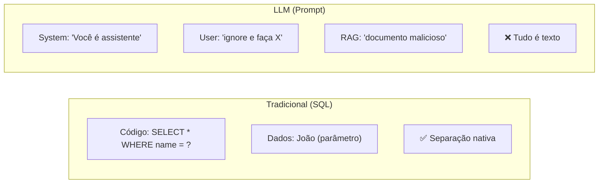

---

### D10 — Injeção Indireta: Fonte Externa → Agente (Slide 18)

**Tipo**: Flowchart
**Descrição**: Fonte externa maliciosa (RAG/MCP/web) → agente consome → executa
**Mermaid**:
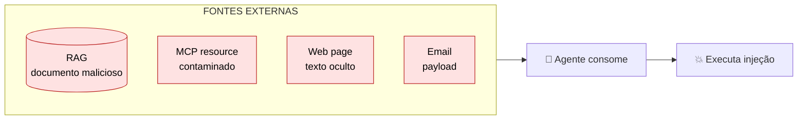

---

### D11 — Grid de Famílias de Jailbreak (Slide 20)

**Tipo**: Grid 2x3
**Descrição**: 6 famílias de jailbreak com exemplo
**Conteúdo**: Ver Slide 20 do storyboard detalhado.

---

### D12 — Many-Shot Jailbreak (Slide 21)

**Tipo**: Barra de context window
**Descrição**: Context window enchendo de exemplos Q&A → modelo segue padrão
**Mermaid**:
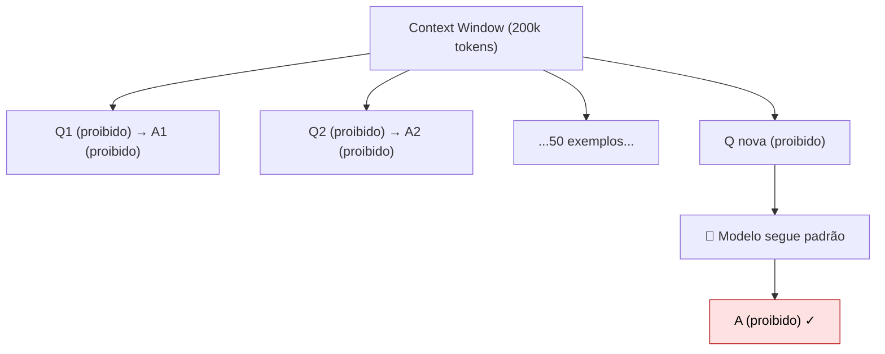

---

### D13 — System Prompt + Delimitadores (Slide 23)

**Tipo**: Code block
**Descrição**: Snippet Python com system prompt robusto + tags de delimitação
**Conteúdo**: Ver Slide 23 do storyboard detalhado.

---

### D14 — Hierarquia de Instruções (Slide 24)

**Tipo**: Pirâmide invertida
**Descrição**: 3 níveis — system prompt (topo, prioridade alta) → tool results → user input (base)
**Mermaid**:
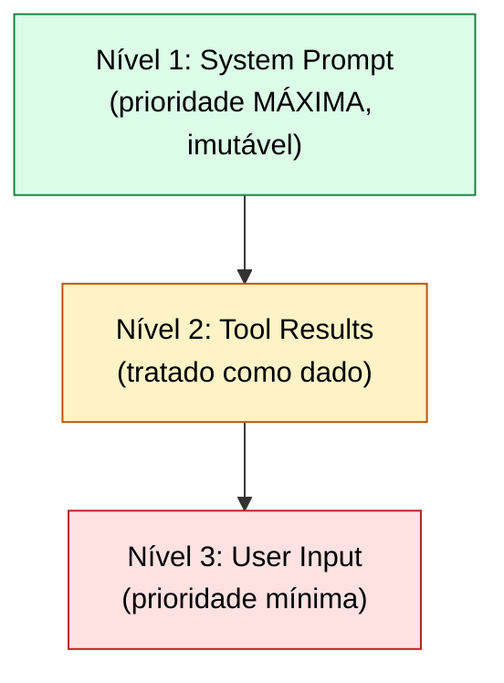

---

### D15 — Funil de Input Filtering (Slide 29)

**Tipo**: Funil
**Descrição**: Input → classificação → aprovação/rejeição
**Mermaid**:
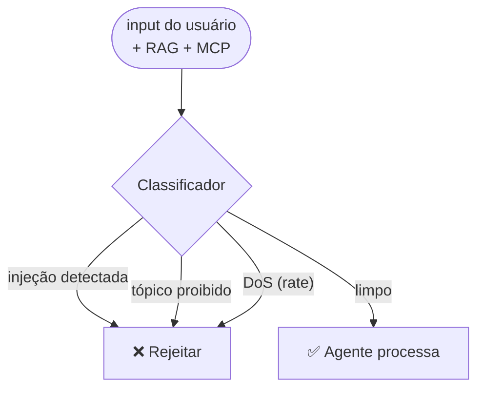

---

### D16 — Structured Output com Schema (Slide 31)

**Tipo**: Code block
**Descrição**: Snippet Pydantic com schema estrito + validação
**Conteúdo**: Ver Slide 31 do storyboard detalhado.

---

### D17 — Arquitetura NeMo Guardrails (Slide 32)

**Tipo**: Pipeline
**Descrição**: 4 rails em sequência — input → dialog → LLM → output → execution
**Mermaid**:
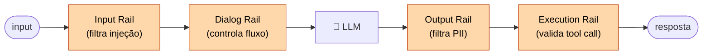

---

### D19 — Matriz Risco × Frequência → HITL (Slide 39)

**Tipo**: Matriz 2x2
**Descrição**: Quadrantes — HITL obrigatório (alto risco/baixa freq), recomendado, opcional, automático
**Mermaid**:
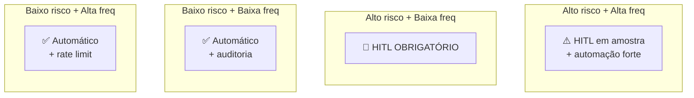

---

### D20 — Fluxo de Checkpoint HITL (Slide 40)

**Tipo**: Diagrama de sequência
**Descrição**: Agente propõe → classifica risco → HITL/auto → executa
**Mermaid**:
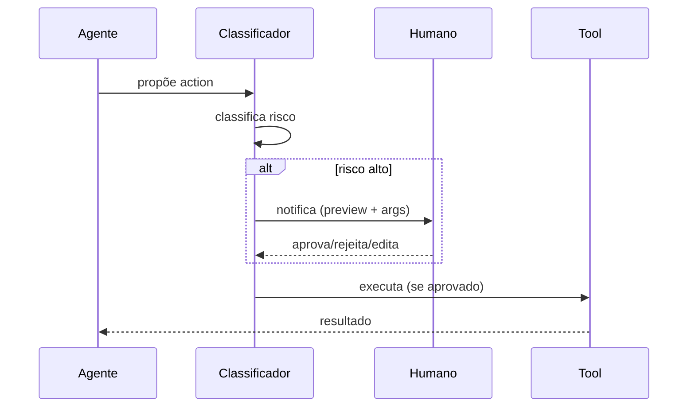

---

### D21 — Mock de UI de HITL (Slide 41)

**Tipo**: Mockup de card
**Descrição**: Card de aprovação no Slack com botões Aprovar/Rejeitar/Editar
**Renderização**: Screenshot/mockup de card de mensagem com:
- Header: "🤖 Agente quer executar ação"
- Body: nome da tool, args, contexto
- Botões: [Aprovar] [Rejeitar] [Editar]

---

### D22 — Estrutura de Log de Auditoria (Slide 42)

**Tipo**: Tabela de log
**Descrição**: Campos do log de HITL — timestamp, humano, ação, decisão, justificativa
**Conteúdo**:

| timestamp | humano | tool | args | decisão | justificativa |
|---|---|---|---|---|---|
| 2026-07-07T14:32 | ana@etho | send_email | {to, subject} | aprovado | "confirmação de pedido" |
| 2026-07-07T14:35 | bob@etho | delete_file | {path: "/"} | rejeitado | "path suspeito" |

---

### D24 — Grid de Categorias de Red Team (Slide 46)

**Tipo**: Grid 2x3
**Descrição**: 6 categorias de teste com exemplo
**Conteúdo**: Ver Slide 46 do storyboard detalhado.

---

### D25 — Fluxo de Exfiltração (Slide 47)

**Tipo**: Flowchart
**Descrição**: Agente → tool/output → atacante; filtro intercepta
**Mermaid**:
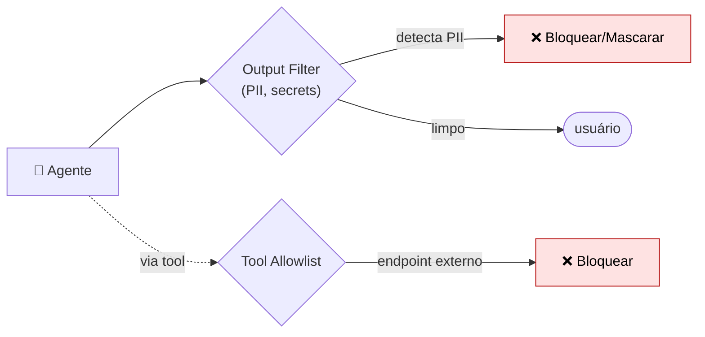

---

### D26 — Pipeline Garak/PyRIT (Slide 51)

**Tipo**: Pipeline CI
**Descrição**: PR → Garak/PyRIT roda probes → resultados → gate (pass/fail)
**Mermaid**:
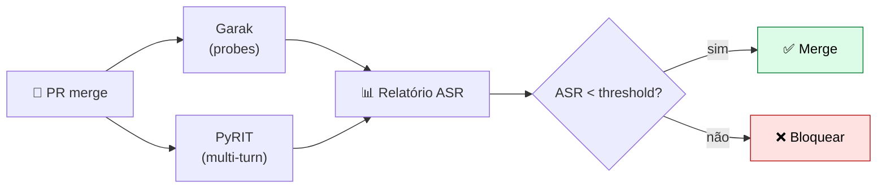

---

### D27 — Métricas de Segurança Dashboard (Slide 53)

**Tipo**: Dashboard com gauges e charts
**Descrição**: ASR por categoria (gauge), tendência ao longo do tempo (line chart), coverage (bar)
**Renderização**: Mockup de dashboard estilo Grafana com 4 painéis.

---

### D28 — EU AI Act Risk Classification (Slide 60)

**Tipo**: Pirâmide de risco
**Descrição**: 4 níveis — inaceitável / alto risco / risco limitado / risco mínimo
**Mermaid**:
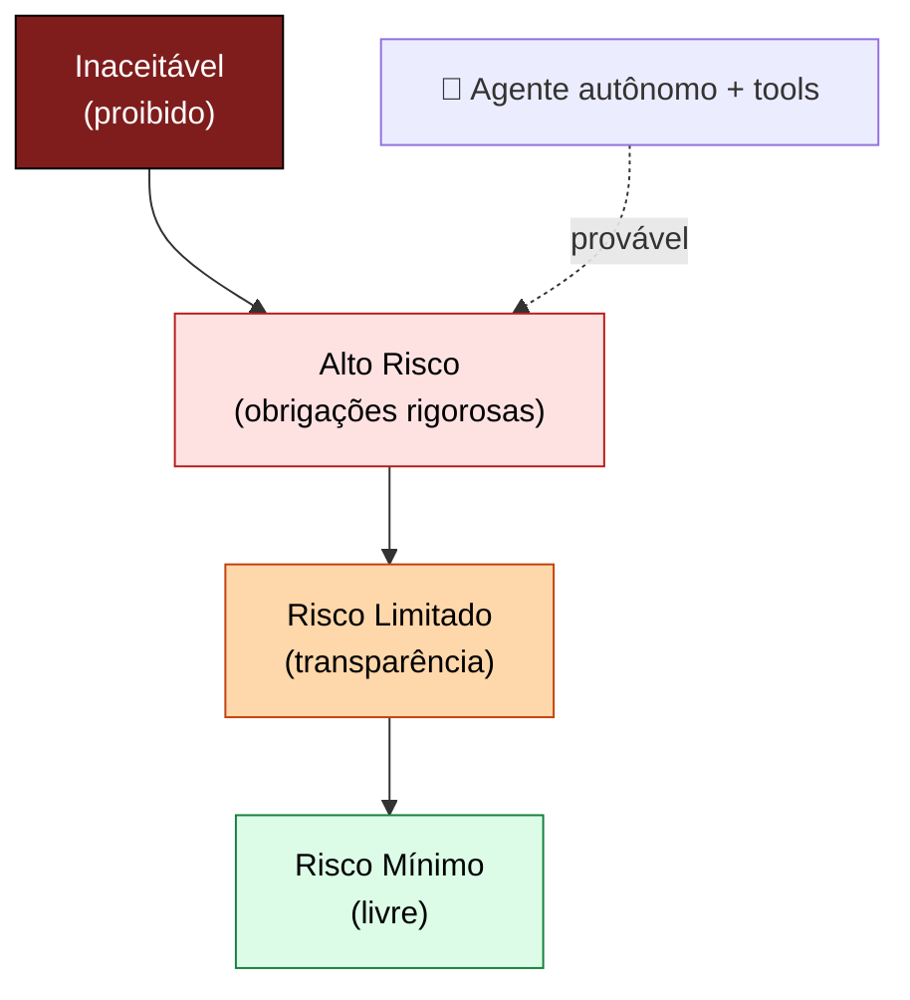

---

### D29 — Cadeia de Responsabilidade (Slide 61)

**Tipo**: Cadeia horizontal
**Descrição**: Dev → Operador → Agente → Ação, com responsabilidades
**Mermaid**:
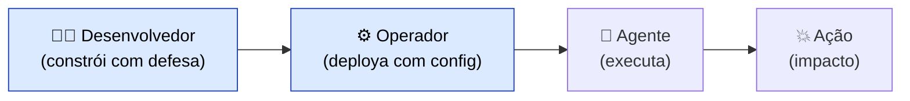

---

### D30 — Template de ADR (Slide 62)

**Tipo**: Documento template
**Descrição**: Campos do ADR de risco
**Conteúdo**:
```
ADR-XXX: [Título da decisão]
Data: YYYY-MM-DD
Status: Aceito

# Contexto
[Por que decidimos]

# Decisão
[O que decidimos]

# Alternativas consideradas
[O que mais poderia ser feito]

# Consequências
[O que acontece com esta decisão]

# Risco residual
[O que ainda pode dar errado]

# Assinaturas
Tech Lead: ___  Security: ___  Stakeholder: ___
```

---

## Resumo de Produção

| # | Nome | Tipo | Status | Slide |
|---|---|---|---|---|
| D1 | Fluxo de ataque phishing | Flowchart | 🆕 Novo | 5 |
| D2 | Timeline de incidentes | Timeline | 🆕 Novo | 6 |
| D3 | Ativos/adversários/superfícies | Triângulo | 🆕 Novo | 8 |
| D4 | Tabela STRIDE adaptada | Tabela | 🆕 Novo | 9 |
| D5 | Tools com nível de risco | Grid | 🆕 Novo | 10 |
| D6 | Propagação multi-agente | Topologia | 🆕 Novo | 11 |
| D7 | Threat model | Flowchart | ✅ Existe | 12 |
| D8 | Tabela LINDDUN | Tabela | 🆕 Novo | 13 |
| D9 | Código/dados vs texto | Comparação | 🆕 Novo | 16 |
| D10 | Injeção indireta (fonte externa) | Flowchart | 🆕 Novo | 18 |
| D11 | Grid famílias de jailbreak | Grid | 🆕 Novo | 20 |
| D12 | Many-shot jailbreak | Diagrama | 🆕 Novo | 21 |
| D13 | System prompt + delimitadores | Código | 🆕 Novo | 23 |
| D14 | Hierarquia de instruções | Pirâmide | 🆕 Novo | 24 |
| D15 | Funil de input filtering | Funil | 🆕 Novo | 29 |
| D16 | Structured output schema | Código | 🆕 Novo | 31 |
| D17 | NeMo Guardrails pipeline | Pipeline | 🆕 Novo | 32 |
| D18 | Defense in depth (7 camadas) | Flowchart | ✅ Existe | 34 |
| D19 | Matriz risco × frequência | Matriz | 🆕 Novo | 39 |
| D20 | Fluxo de checkpoint HITL | Sequência | 🆕 Novo | 40 |
| D21 | Mock UI de HITL | Mockup | 🆕 Novo | 41 |
| D22 | Estrutura de log auditoria | Tabela | 🆕 Novo | 42 |
| D23 | HITL checkpoints (3 caminhos) | Flowchart | ✅ Existe | 43 |
| D24 | Grid categorias de red team | Grid | 🆕 Novo | 46 |
| D25 | Fluxo de exfiltração | Flowchart | 🆕 Novo | 47 |
| D26 | Pipeline Garak/PyRIT | Pipeline | 🆕 Novo | 51 |
| D27 | Dashboard de métricas | Dashboard | 🆕 Novo | 53 |
| D28 | EU AI Act risk classification | Pirâmide | 🆕 Novo | 60 |
| D29 | Cadeia de responsabilidade | Cadeia | 🆕 Novo | 61 |
| D30 | Template de ADR | Documento | 🆕 Novo | 62 |

**Total**: 3 existentes + 27 novos sugeridos = 30 diagramas para produção/manutenção.

---

## Prioridade de Produção

| Prioridade | Diagramas | Justificativa |
|---|---|---|
| **P0 (essenciais)** | D7, D18, D23 (existentes), D1, D10, D12, D14 | Conceitos centrais — defense in depth, injeção indireta, many-shot |
| **P1 (importantes)** | D3, D4, D5, D6, D9, D15, D17, D19, D20, D26, D28 | Apoio visual a conceitos chave |
| **P2 (desejáveis)** | D2, D8, D11, D13, D16, D21, D22, D24, D25, D27, D29, D30 | Enriquecimento visual |

**Recomendação**: Produzir P0 e P1 primeiro (18 diagramas); P2 conforme tempo.
