# ETHAGT14 — Sugestões de Diagramas

> 27 diagramas necessários para a apresentação.
> 3 já existem em `12-Diagrams/ETHAGT14/`. 24 novos a produzir.

---

## Diagramas Existentes (3)

| # | Slide | Arquivo | Descrição |
|---|---|---|---|
| D6 | 12 | `bottleneck-analysis.mmd` | Anatomia de um gargalo (request → LLM → tools → contexto → loop) |
| D17 | 42 | `sharding.mmd` | Sharding por tenant (router → 3 shards → DBs isolados) |
| D24 | 58 | `finops-flow.mmd` | Fluxo FinOps (execução → medir → tag → dashboard → alerta → circuit breaker) |

> **Nota**: Os 3 diagramas existentes cobrem as visualizações centrais de gargalos, distribuição e FinOps. Os demais são novos.

---

## Diagramas Novos (24)

### D1 — Custo Crescente Exponencial vs Otimizado (Slide 5)

**Tipo**: Gráfico de linha dupla
**Descrição**: Eixo Y (custo mensal em escala log), eixo X (nº de usuários). Curva vermelha cresce exponencialmente ("sem otimização"). Curva verde achata após 1.000 usuários ("com caching + routing + FinOps"). Anotação "Zona de Dor" no topo.
**Mermaid**:
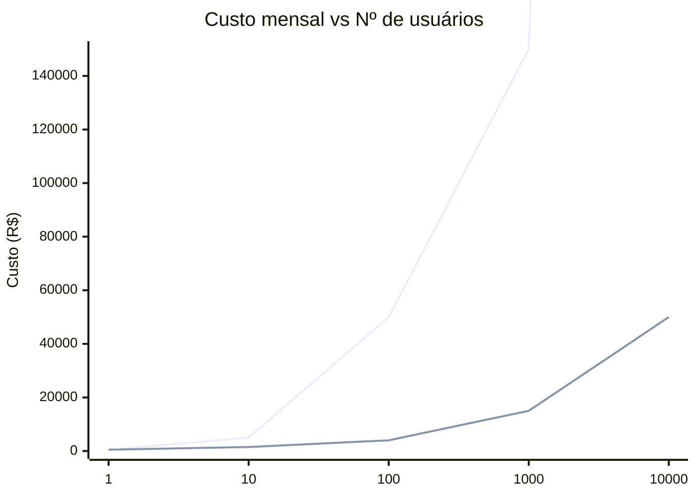
```mermaid
xychart-beta
    title "Custo mensal vs Nº de usuários"
    x-axis [1, 10, 100, 1000, 10000]
    y-axis "Custo (R$)" 0 --> 150000
    line "Sem otimização" [500, 5000, 50000, 150000, 1500000]
    line "Com otimização" [500, 1500, 4000, 15000, 50000]
```
**Estilo**: Curva vermelha em `etho-danger`, verde em `etho-success`.

---

### D2 — Latência por Tipo de Chamada (Slide 8)

**Tipo**: Bar chart
**Descrição**: 4 barras comparando latência total: chat simples (~2s), agente 3-step (~6s), agente 5-step (~15s), agente 10-step (~60s).
**Mermaid**:
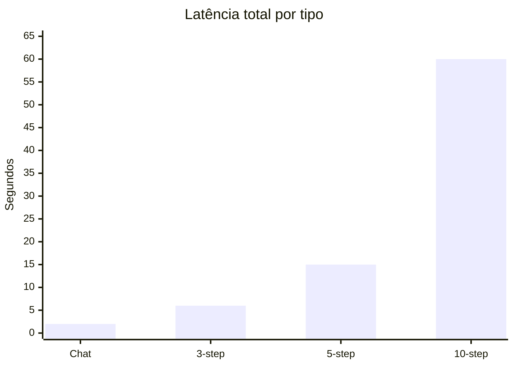
```mermaid
xychart-beta
    title "Latência total por tipo"
    x-axis ["Chat", "3-step", "5-step", "10-step"]
    y-axis "Segundos" 0 --> 65
    bar [2, 6, 15, 60]
```

---

### D3 — Custo por Step (Crescimento Quadrático) (Slide 9)

**Tipo**: Gráfico de área
**Descrição**: Eixo X (steps 1-10), eixo Y (tokens acumulados). Crescimento quadrático (soma triangular). Anotação "≈ n²/2".
**Mermaid**:
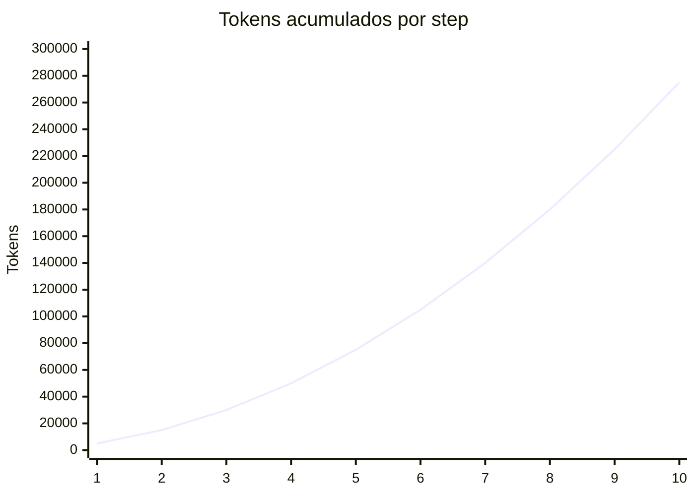
```mermaid
xychart-beta
    title "Tokens acumulados por step"
    x-axis [1, 2, 3, 4, 5, 6, 7, 8, 9, 10]
    y-axis "Tokens" 0 --> 300000
    line [5000, 15000, 30000, 50000, 75000, 105000, 140000, 180000, 225000, 275000]
```

---

### D4 — Rate Limiter com Filas (Slide 10)

**Tipo**: Flowchart
**Descrição**: Requests chegam → token bucket (rate limiter) → se tokens disponíveis, passa; senão, fila. Backoff exponencial ilustrado.
**Mermaid**:
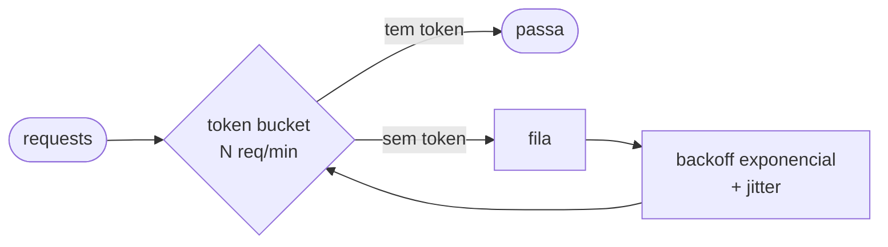
```mermaid
flowchart LR
    Req([requests]) --> Bucket{"token bucket<br/>N req/min"}
    Bucket -- "tem token" --> Pass([passa])
    Bucket -- "sem token" --> Queue["fila"]
    Queue --> Backoff["backoff exponencial<br/>+ jitter"]
    Backoff --> Bucket
```

---

### D5 — Réplicas com Estado Compartilhado (Slide 11)

**Tipo**: Arquitetura
**Descrição**: 3 pods/réplicas conectados a um Redis central (estado compartilhado). Request cai em réplica diferente, busca estado no Redis.
**Mermaid**:
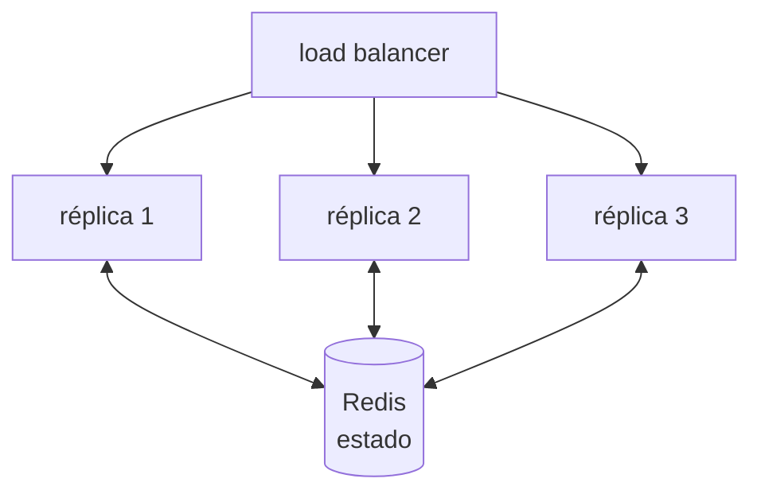
```mermaid
flowchart TB
    LB[load balancer] --> R1[réplica 1]
    LB --> R2[réplica 2]
    LB --> R3[réplica 3]
    R1 <--> Redis[(Redis<br/>estado)]
    R2 <--> Redis
    R3 <--> Redis
```

---

### D7 — Antes vs Depois do Caching (Slide 16)

**Tipo**: Comparação lado a lado
**Descrição**: Esquerda: todas as queries batem no LLM (10 chamadas). Direita: cache intercepta repetições (4 LLM + 6 cache hits).
**Mermaid**:
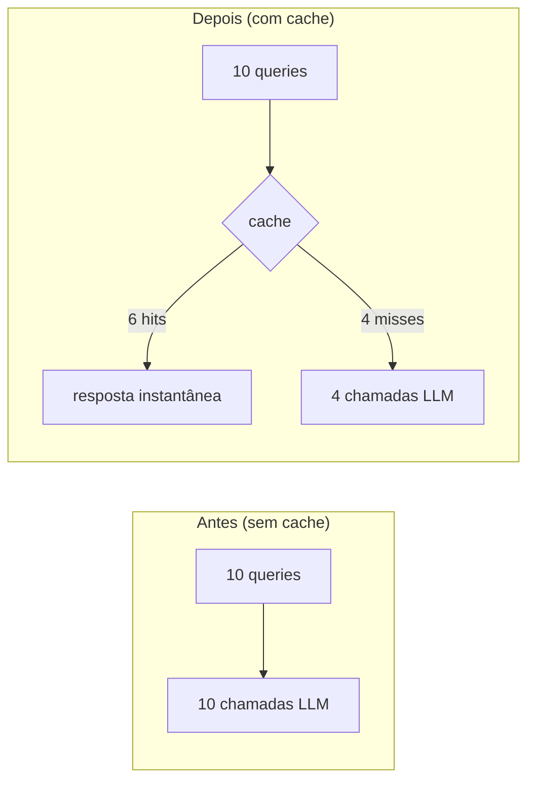
```mermaid
flowchart LR
    subgraph Antes["Antes (sem cache)"]
        Q1[10 queries] --> LLM1[10 chamadas LLM]
    end
    subgraph Depois["Depois (com cache)"]
        Q2[10 queries] --> Cache{cache}
        Cache -- "6 hits" --> R1[resposta instantânea]
        Cache -- "4 misses" --> LLM2[4 chamadas LLM]
    end
```

---

### D8 — Cache Semântico: Conceito (Slide 18)

**Tipo**: Flowchart
**Descrição**: Query → embedding → busca vetorial no cache → se similaridade > threshold, hit; senão, miss → LLM.
**Mermaid**:
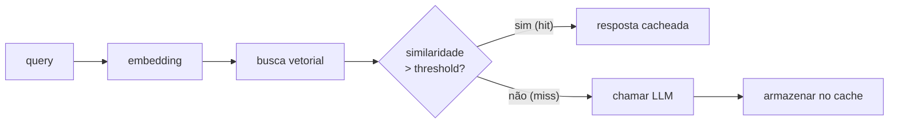
```mermaid
flowchart LR
    Q[query] --> Emb[embedding]
    Emb --> Search[busca vetorial]
    Search --> Dec{similaridade<br/>> threshold?}
    Dec -- "sim (hit)" --> Cached[resposta cacheada]
    Dec -- "não (miss)" --> LLM[chamar LLM]
    LLM --> Store[armazenar no cache]
```

---

### D9 — Cache Semântico: Implementação (Slide 19)

**Tipo**: Código + fluxo lado a lado
**Descrição**: Código Python da função semantic_cache ao lado de fluxo visual.
**Mermaid**:
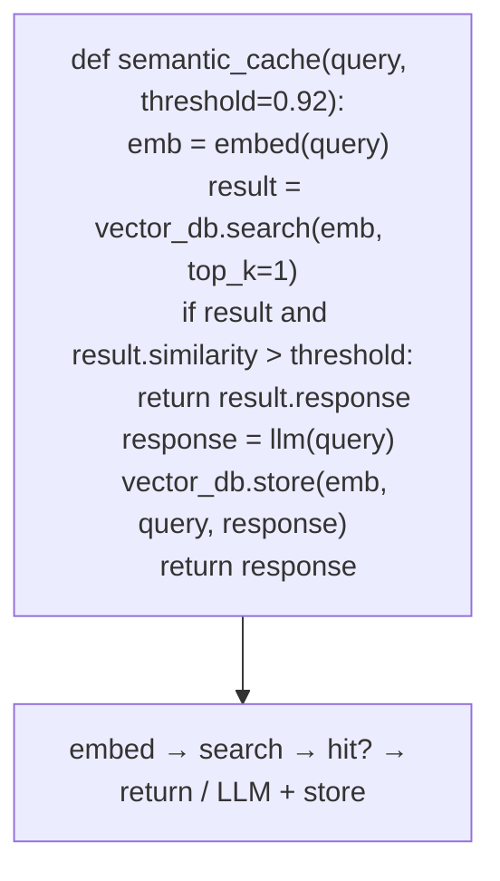
```mermaid
flowchart TB
    Code["def semantic_cache(query, threshold=0.92):<br/>    emb = embed(query)<br/>    result = vector_db.search(emb, top_k=1)<br/>    if result and result.similarity > threshold:<br/>        return result.response<br/>    response = llm(query)<br/>    vector_db.store(emb, query, response)<br/>    return response"]
    Code --> Flow["embed → search → hit? → return / LLM + store"]
```

---

### D10 — Threshold vs Hit Rate vs Erro (Slide 20)

**Tipo**: Gráfico de trade-off
**Descrição**: Eixo X (threshold 0.7-0.99), eixo Y duplo: hit rate (sobe com threshold menor) e erro (desce com threshold maior). Ponto ótimo em ~0.92.
**Mermaid**:
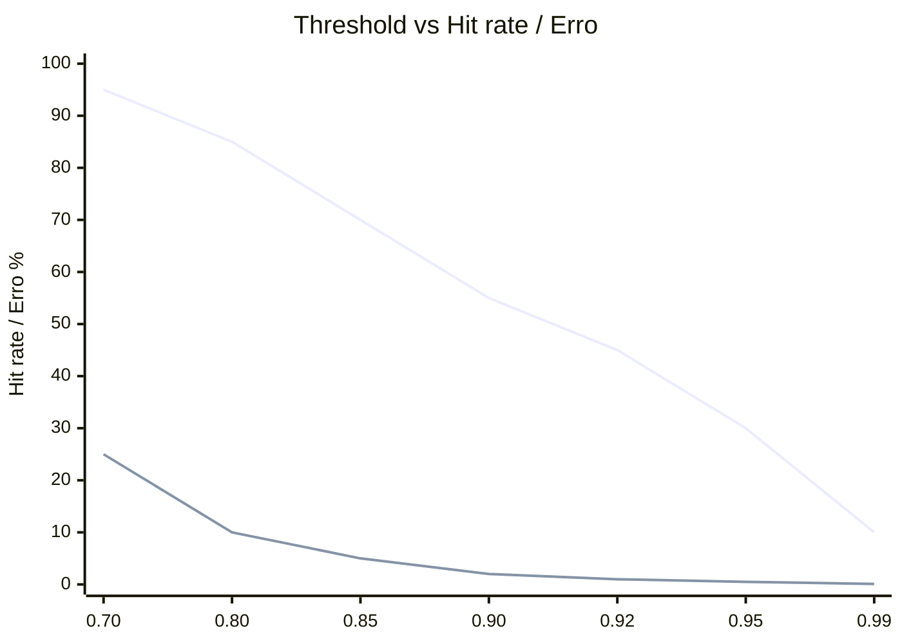
```mermaid
xychart-beta
    title "Threshold vs Hit rate / Erro"
    x-axis [0.70, 0.80, 0.85, 0.90, 0.92, 0.95, 0.99]
    y-axis "Hit rate / Erro %" 0 --> 100
    line "Hit rate" [95, 85, 70, 55, 45, 30, 10]
    line "Erro (falsos positivos)" [25, 10, 5, 2, 1, 0.5, 0.1]
```

---

### D11 — Cache em Camadas L1/L2/L3 (Slide 25)

**Tipo**: Arquitetura em camadas
**Descrição**: Request desce por L1 (memória) → L2 (Redis) → L3 (prompt cache provider) → LLM. Para no primeiro hit.
**Mermaid**:
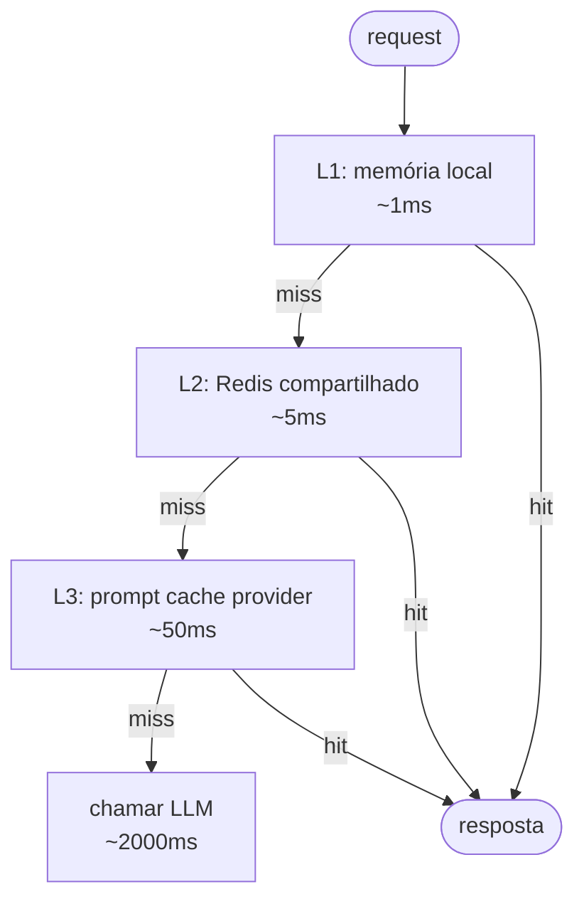
```mermaid
flowchart TB
    Req([request]) --> L1["L1: memória local<br/>~1ms"]
    L1 -- miss --> L2["L2: Redis compartilhado<br/>~5ms"]
    L2 -- miss --> L3["L3: prompt cache provider<br/>~50ms"]
    L3 -- miss --> LLM[chamar LLM<br/>~2000ms]
    L1 -- hit --> Resp([resposta])
    L2 -- hit --> Resp
    L3 -- hit --> Resp
```

---

### D12 — Funil de Routing (Slide 30A)

**Tipo**: Funil
**Descrição**: Queries entram no topo, classifier divide em Haiku (70%), Sonnet (25%), Opus (5%).
**Mermaid**:
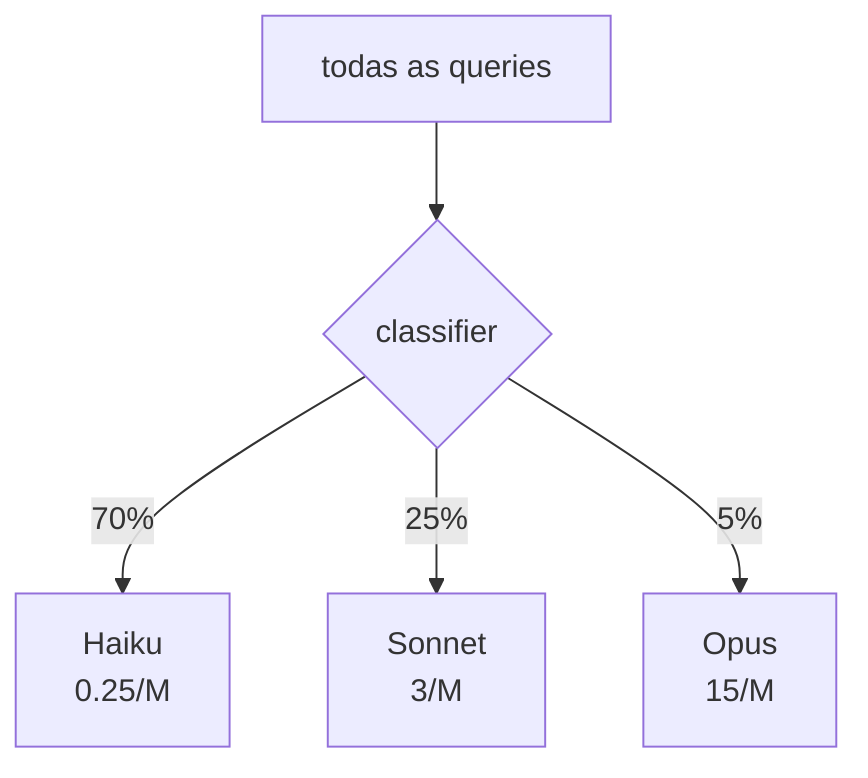
```mermaid
flowchart TB
    Q[todas as queries] --> C{classifier}
    C -- "70%" --> H[Haiku<br/>0.25/M]
    C -- "25%" --> S[Sonnet<br/>3/M]
    C -- "5%" --> O[Opus<br/>15/M]
```

---

### D13 — Speculative Decoding (Slide 33)

**Tipo**: Sequência
**Descrição**: Draft model gera K tokens rápido; target model verifica em paralelo; aceita os corretos, rejeita a partir do primeiro erro.
**Mermaid**:
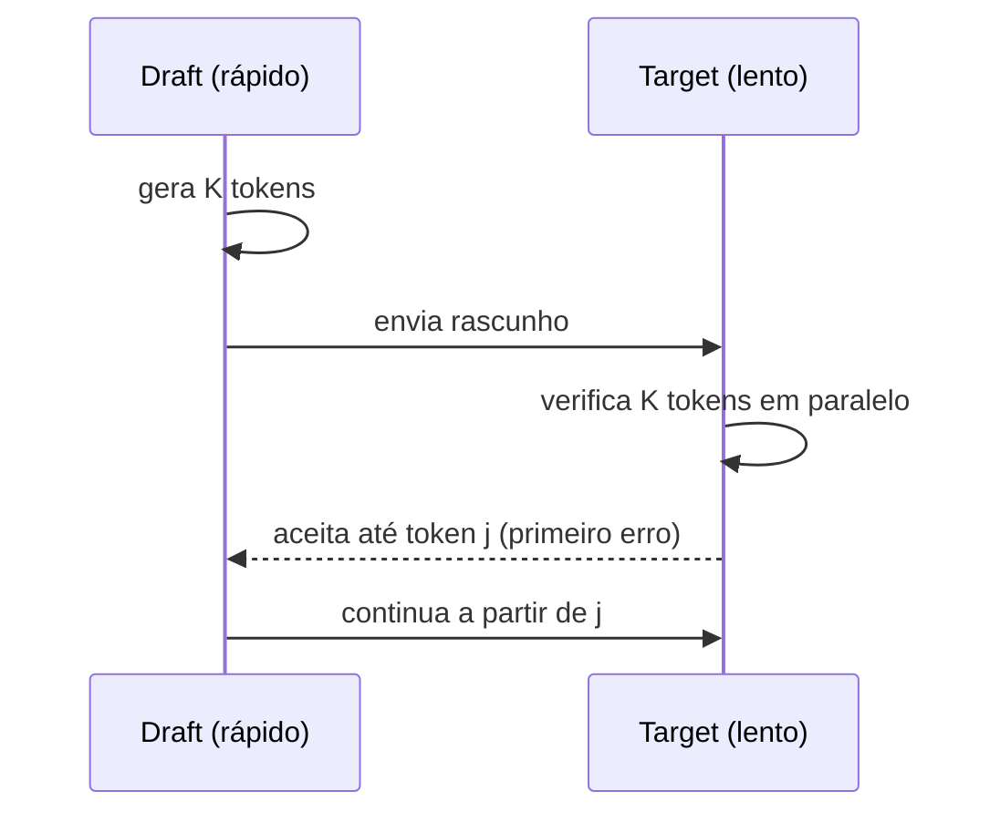
```mermaid
sequenceDiagram
    participant D as Draft (rápido)
    participant T as Target (lento)
    D->>D: gera K tokens
    D->>T: envia rascunho
    T->>T: verifica K tokens em paralelo
    T-->>D: aceita até token j (primeiro erro)
    D->>T: continua a partir de j
```

---

### D14 — Streaming vs Não-Streaming (Slide 34)

**Tipo**: Comparação de timeline
**Descrição**: Esquerda: barra vazia por 10s, depois cheia. Direita: barra preenche gradualmente. Mesmo tempo total, percepção diferente.
**Mermaid**:
```mermaid
gantt
    title Sem streaming vs Com streaming
    dateFormat ss
    axisFormat %Ss
    section Sem streaming
    Usuário espera :0, 10s
    Resposta completa :10s, 1s
    section Com streaming
    Primeiro token :0, 1s
    Tokens gradualmente :1s, 9s
    Resposta completa :10s, 1s
```

---

### D15 — Matriz de Otimização (Impacto vs Esforço) (Slide 36)

**Tipo**: Matriz 2x2
**Descrição**: Eixos: impacto (Y) vs esforço (X). Pontos: caching (alto, baixo), routing (médio, médio), batching (médio, baixo), speculative (alto, alto), fine-tuning (alto, alto).
**Mermaid**:
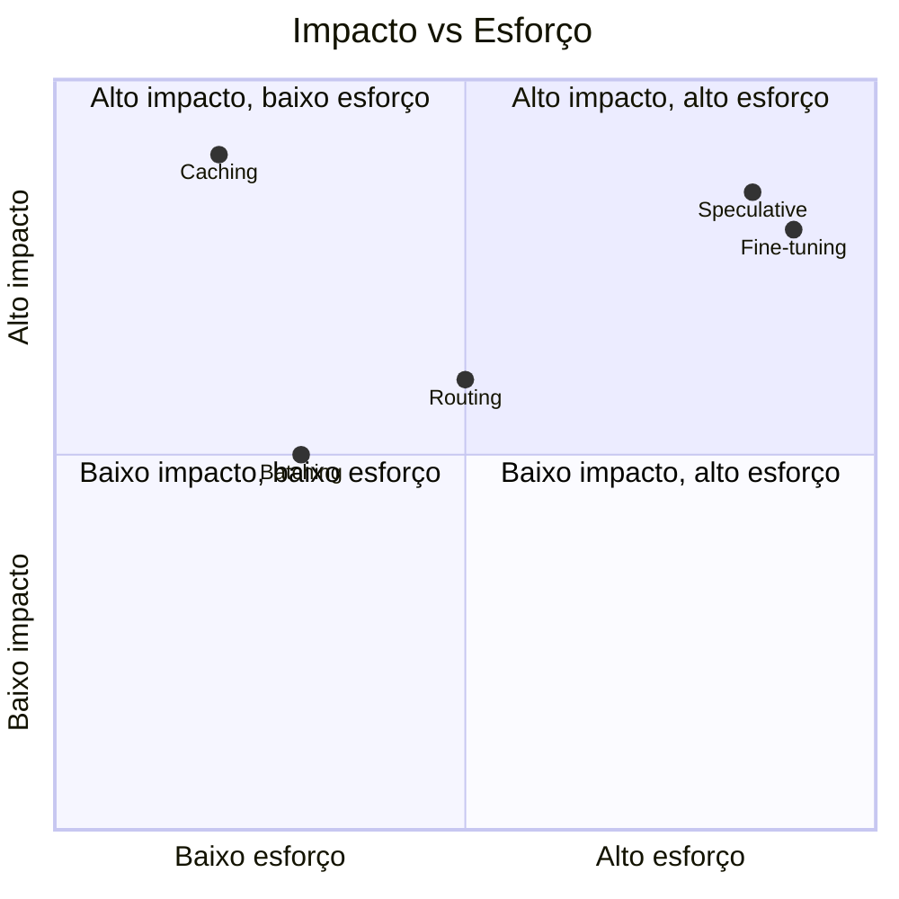
```mermaid
quadrantChart
    title Impacto vs Esforço
    x-axis Baixo esforço --> Alto esforço
    y-axis Baixo impacto --> Alto impacto
    quadrant-1 Alto impacto, alto esforço
    quadrant-2 Alto impacto, baixo esforço
    quadrant-3 Baixo impacto, baixo esforço
    quadrant-4 Baixo impacto, alto esforço
    Caching: [0.2, 0.9]
    Routing: [0.5, 0.6]
    Batching: [0.3, 0.5]
    Speculative: [0.85, 0.85]
    Fine-tuning: [0.9, 0.8]
```

---

### D16 — Stateless vs Stateful Workers (Slide 41)

**Tipo**: Comparação
**Descrição**: Esquerda: stateless — qualquer réplica atende qualquer request. Direita: stateful — request precisa ir para réplica com estado (sticky session).
**Mermaid**:
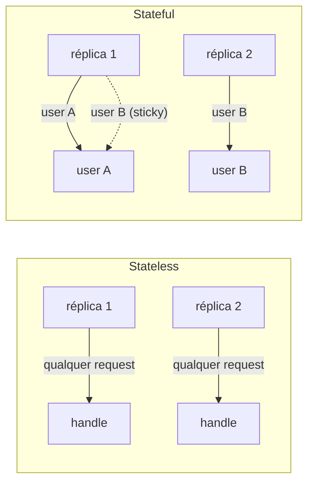
```mermaid
flowchart LR
    subgraph Stateless["Stateless"]
        R1[réplica 1] -- qualquer request --> H1[handle]
        R2[réplica 2] -- qualquer request --> H2[handle]
    end
    subgraph Stateful["Stateful"]
        S1[réplica 1] -- user A --> HA[user A]
        S2[réplica 2] -- user B --> HB[user B]
        S1 -. user B (sticky) .-> HA
    end
```

---

### D18 — Estratégias de Balanceamento (Slide 44)

**Tipo**: Grid 2x2
**Descrição**: 4 estratégias: round-robin (circular), least-connections (menos ocupada), weighted (réplicas potentes recebem mais), consistent hashing (mesmo tenant → mesma réplica).
**Mermaid**:
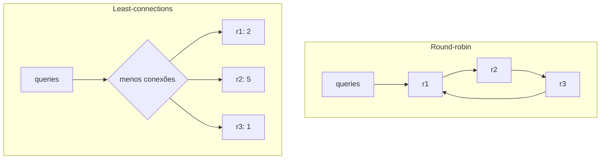
```mermaid
flowchart TB
    subgraph RR["Round-robin"]
        RRQ[queries] --> R1[r1] --> R2[r2] --> R3[r3] --> R1
    end
    subgraph LC["Least-connections"]
        LCQ[queries] --> Min{menos conexões}
        Min --> R4[r1: 2]
        Min --> R5[r2: 5]
        Min --> R6[r3: 1]
    end
```

---

### D19 — Cluster com Leader e Followers (Slide 45)

**Tipo**: Arquitetura em estrela
**Descrição**: Leader no centro, followers ao redor. Leader coordena, followers executam.
**Mermaid**:
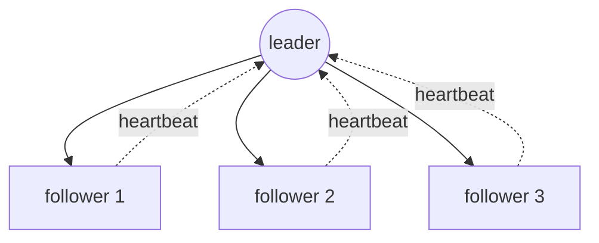
```mermaid
flowchart TB
    Leader((leader))
    Leader --> F1[follower 1]
    Leader --> F2[follower 2]
    Leader --> F3[follower 3]
    F1 -. heartbeat .-> Leader
    F2 -. heartbeat .-> Leader
    F3 -. heartbeat .-> Leader
```

---

### D20 — Mapa Multi-Region + Autoscaling (Slide 46)

**Tipo**: Mapa com setas
**Descrição**: 3 regiões (US, EU, Ásia) em um mapa estilizado, com setas de autoscaling (+ pods) em cada.
**Mermaid**:
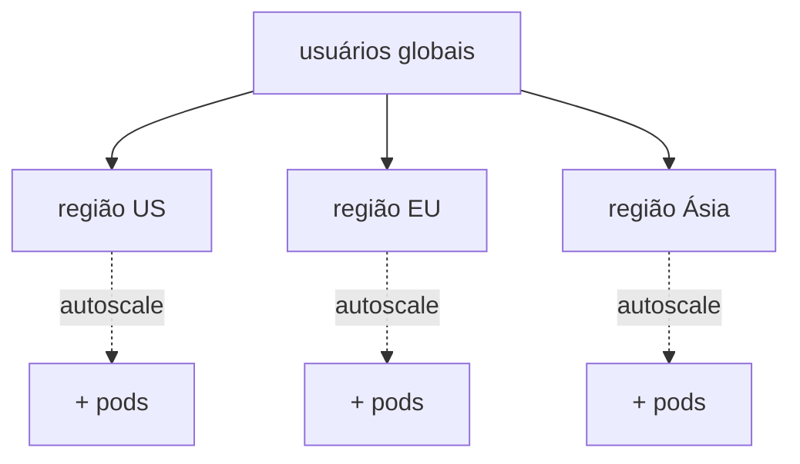
```mermaid
flowchart TB
    Users[usuários globais] --> US[região US]
    Users --> EU[região EU]
    Users --> ASIA[região Ásia]
    US -. autoscale .-> USPlus[+ pods]
    EU -. autoscale .-> EUPlus[+ pods]
    ASIA -. autoscale .-> ASIAPlus[+ pods]
```

---

### D21 — Arquitetura K8s para Agentes (Slide 50)

**Tipo**: Arquitetura em camadas
**Descrição**: Ingress → Service → Pods (com HPA) → DB/Redis.
**Mermaid**:
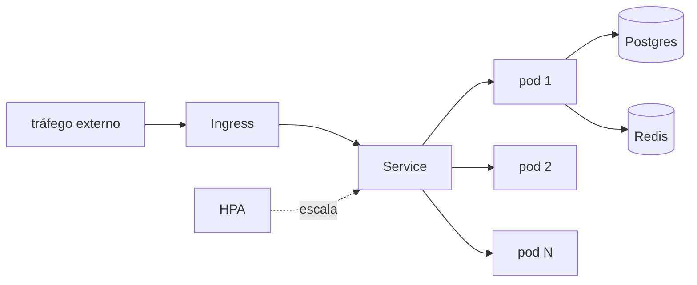
```mermaid
flowchart LR
    Ext[tráfego externo] --> Ingress[Ingress]
    Ingress --> Svc[Service]
    Svc --> P1[pod 1]
    Svc --> P2[pod 2]
    Svc --> P3[pod N]
    P1 --> DB[(Postgres)]
    P1 --> Redis[(Redis)]
    HPA[HPA] -. escala .-> Svc
```

---

### D22 — Pie Chart de Custo Total (Slide 53)

**Tipo**: Pie chart
**Descrição**: LLM 65%, Compute 15%, Memória 10%, Outros (rede, storage, observabilidade) 10%.
**Mermaid**:
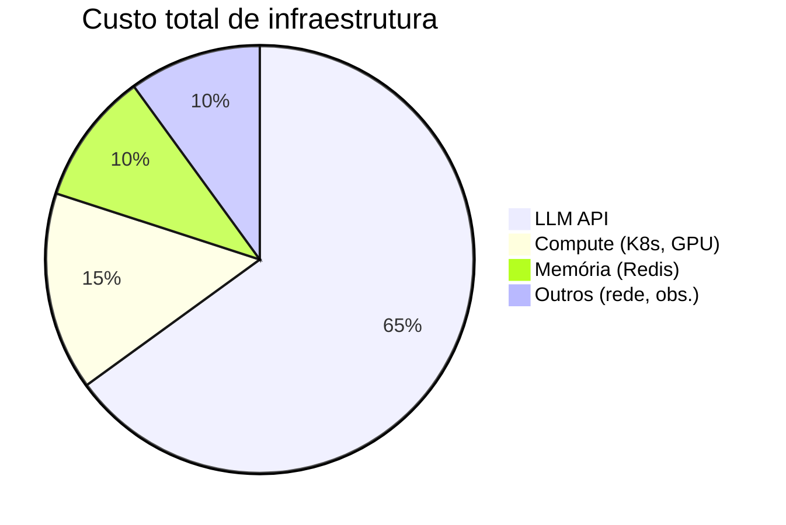
```mermaid
pie title Custo total de infraestrutura
    "LLM API" : 65
    "Compute (K8s, GPU)" : 15
    "Memória (Redis)" : 10
    "Outros (rede, obs.)" : 10
```

---

### D23 — Triângulo Custo × Latência × Qualidade (Slide 57)

**Tipo**: Triângulo
**Descrição**: Triângulo equilátero com Custo, Latência e Qualidade nos vértices. "Pick two" no centro.
**Mermaid**:
```mermaid
flowchart TB
    C((Custo))
    L((Latência))
    Q((Qualidade))
    C --- L
    L --- Q
    Q --- C
    Center["pick two<br/>(não três)"]
    C --- Center
    L --- Center
    Q --- Center
```

---

### D25 — Mockup de Dashboard Grafana (Slide 59)

**Tipo**: Dashboard mockup
**Descrição**: 5 painéis: custo/dia, custo/feature, cache hit rate, top 10 caros, custo/tenant.
**Mermaid**:
```mermaid
flowchart LR
    subgraph Dashboard["FinOps Dashboard"]
        P1["Custo/dia"]
        P2["Custo/feature"]
        P3["Cache hit rate"]
        P4["Top 10 caros"]
        P5["Custo/tenant"]
    end
    Alert[alerta Slack] -. custo > threshold .-> Dashboard
```

---

### D26 — Arquitetura Antes vs Depois (Slide 66)

**Tipo**: Comparação de arquiteturas
**Descrição**: Antes: 1 agente por usuário, sem cache, sempre Sonnet. Depois: cache + routing + sharding + FinOps.
**Mermaid**:
```mermaid
flowchart LR
    subgraph Antes["Antes"]
        U1[usuário] --> A1[agente Sonnet]
        A1 --> LLM1[LLM]
    end
    subgraph Depois["Depois"]
        U2[usuários] --> LB[load balancer]
        LB --> SH[shards]
        SH --> Cache[(cache semântico)]
        SH --> Router{router}
        Router --> H[Haiku]
        Router --> S[Sonnet]
        CB[circuit breaker] -. monitora .-> SH
    end
```

---

### D27 — Mapa da Especialização (Slide 73)

**Tipo**: Mind map radial
**Descrição**: ETHAGT14 no centro com conexões para módulos relacionados.
**Mermaid**:
```mermaid
mindmap
  root((ETHAGT14))
    ETHAGT11
      Pré-requisito
      K8s, Docker
    ETHAGT05
      Memória de Agentes
      Checkpointer
      Estado distribuído
    ETHAGT12
      AgentOps
      Observabilidade
      Traces
    ETHAGT15
      Meta-Agentes
      Auto-otimização
    ETHAGT90
      Capstone
      Projeto real
```

---

## Resumo de Produção

| # | Nome | Tipo | Status | Slide |
|---|---|---|---|---|
| D1 | Custo crescente exponencial vs otimizado | Gráfico | 🆕 Novo | 5 |
| D2 | Latência por tipo de chamada | Bar chart | 🆕 Novo | 8 |
| D3 | Custo por step (crescimento quadrático) | Gráfico | 🆕 Novo | 9 |
| D4 | Rate limiter com filas | Flowchart | 🆕 Novo | 10 |
| D5 | Réplicas com estado compartilhado (Redis) | Arquitetura | 🆕 Novo | 11 |
| D6 | Anatomia de um gargalo | Flowchart | ✅ Existe | 12 |
| D7 | Antes vs depois do caching | Comparação | 🆕 Novo | 16 |
| D8 | Cache semântico: conceito | Flowchart | 🆕 Novo | 18 |
| D9 | Cache semântico: implementação | Código + fluxo | 🆕 Novo | 19 |
| D10 | Threshold vs hit rate vs erro | Gráfico de trade-off | 🆕 Novo | 20 |
| D11 | Cache em camadas L1/L2/L3 | Arquitetura | 🆕 Novo | 25 |
| D12 | Funil de routing (Haiku/Sonnet/Opus) | Funil | 🆕 Novo | 30A |
| D13 | Speculative decoding | Sequência | 🆕 Novo | 33 |
| D14 | Streaming vs não-streaming | Comparação | 🆕 Novo | 34 |
| D15 | Matriz de otimização (impacto vs esforço) | Matriz 2x2 | 🆕 Novo | 36 |
| D16 | Stateless vs stateful workers | Comparação | 🆕 Novo | 41 |
| D17 | Sharding por tenant | Flowchart | ✅ Existe | 42 |
| D18 | Estratégias de balanceamento | Grid 2x2 | 🆕 Novo | 44 |
| D19 | Cluster com leader e followers | Arquitetura | 🆕 Novo | 45 |
| D20 | Mapa multi-region + autoscaling | Mapa | 🆕 Novo | 46 |
| D21 | Arquitetura K8s para agentes | Arquitetura | 🆕 Novo | 50 |
| D22 | Pie chart de custo total | Pie chart | 🆕 Novo | 53 |
| D23 | Triângulo custo × latência × qualidade | Triângulo | 🆕 Novo | 57 |
| D24 | Fluxo FinOps | Flowchart | ✅ Existe | 58 |
| D25 | Mockup de dashboard Grafana | Dashboard | 🆕 Novo | 59 |
| D26 | Arquitetura antes vs depois (caso de estudo) | Comparação | 🆕 Novo | 66 |
| D27 | Mapa da especialização | Mind map | 🆕 Novo | 73 |

**Total**: 3 existentes + 24 novos = 27 diagramas únicos a produzir/manter.
