# ETHAGT15 — Sugestões de Diagramas

> 31 diagramas necessários para a apresentação.
> 3 já existem em `12-Diagrams/ETHAGT15/`. 28 novos a produzir.

---

## Diagramas Existentes (3)

| # | Slide | Arquivo | Descrição |
|---|---|---|---|
| D5 | 10 | `meta-agent.mmd` | tarefa T → meta-agente → config → validar → instanciar |
| D19 | 33 | `evolution-loop.mmd` | strategy evolver: atual → mutação → eval → seleção |
| D28 | 50 | `safety-fences.mmd` | 4 camadas: policy → sandbox → shadow → canary |

> **Nota**: Os 3 diagramas existentes cobrem os diagramas centrais. Os demais são novos.

---

## Diagramas Novos (28)

### D1 — Manual vs Automatizado (Slide 5)

**Tipo**: Comparação lado a lado
**Descrição**: Esquerda: engenheiros escrevendo prompts manualmente (lento). Direita: meta-agente gerando configs (rápido)
**Mermaid**:
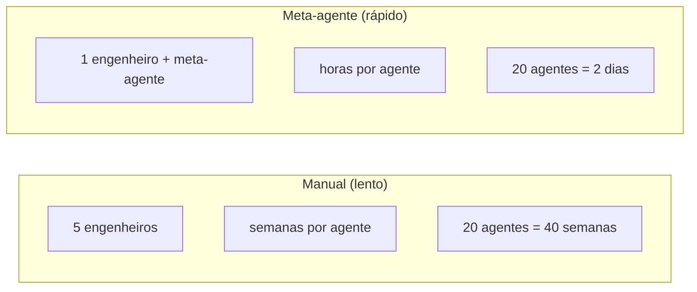

---

### D2 — Timeline de Marcos da Meta-Agência (Slide 6)

**Tipo**: Timeline horizontal
**Descrição**: 2023 DSPy → 2023 Voyager → 2023 Promptbreeder → 2024 Meta-Prompting → 2024 AI Scientist → 2025 Adoção
**Mermaid**:
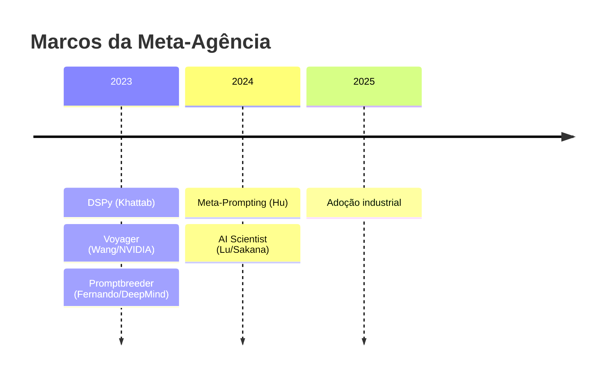

---

### D3 — Hierarquia: Meta-Agente → Agentes → Ambiente (Slide 8)

**Tipo**: Hierarquia vertical
**Descrição**: 3 níveis: meta-agente (topo) → agentes (meio) → ambiente (base)
**Mermaid**:
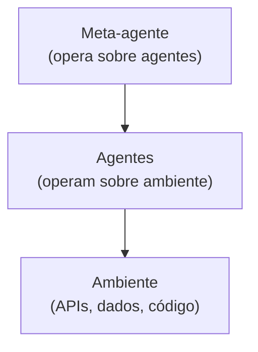

---

### D4 — Três Estratégias (Slide 9)

**Tipo**: 3 colunas comparativas
**Descrição**: Synthesis / Evolution / Optimization com níveis de risco
**Mermaid**:
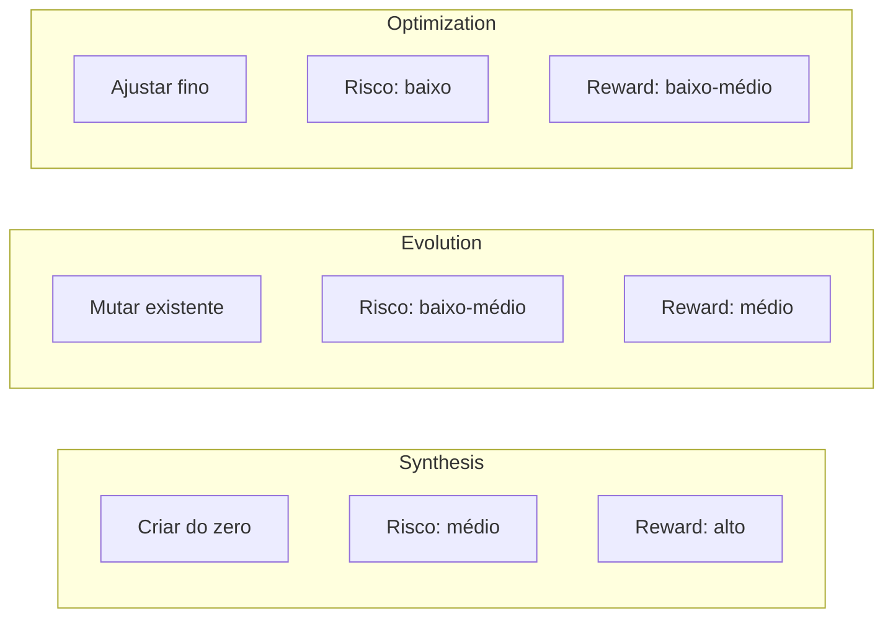

---

### D6 — 5 Cards de Papers (Slide 11)

**Tipo**: Grid de cards
**Descrição**: DSPy, Voyager, Meta-Prompting, Promptbreeder, AI Scientist
**Mermaid**:
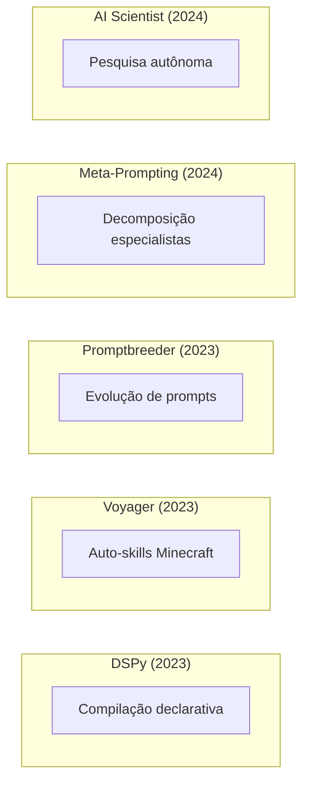

---

### D7 — Balança Risco vs Benefício (Slide 12)

**Tipo**: Balança
**Descrição**: Esquerda (benefícios, verde) vs direita (riscos, vermelho)
**Mermaid**:
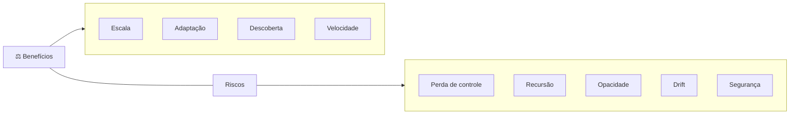

---

### D8 — Input → Meta-Agente → Primitivas → Config (Slide 16)

**Tipo**: Flowchart
**Descrição**: tarefa → meta-agente → seleciona primitivas → config → agente
**Mermaid**:
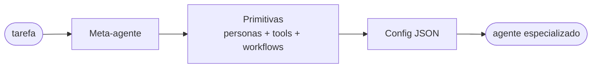

---

### D9 — Biblioteca de Templates → Composição (Slide 17)

**Tipo**: Arquitetura
**Descrição**: Biblioteca versionada → composição → agente final
**Mermaid**:
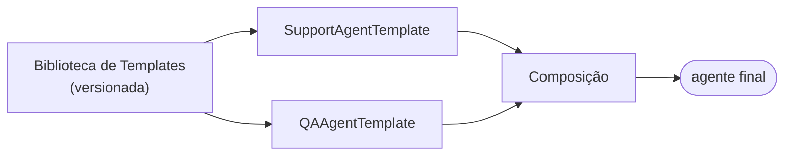

---

### D10 — Pipeline de Geração (Slide 18)

**Tipo**: Pipeline horizontal com loop
**Descrição**: 6 passos + loop de feedback
**Mermaid**:
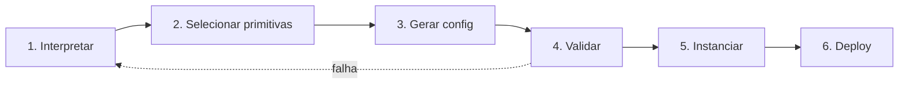

---

### D11 — Funil de Validação (Slide 19)

**Tipo**: Funil
**Descrição**: schema → eval → safety → review → deploy
**Mermaid**:
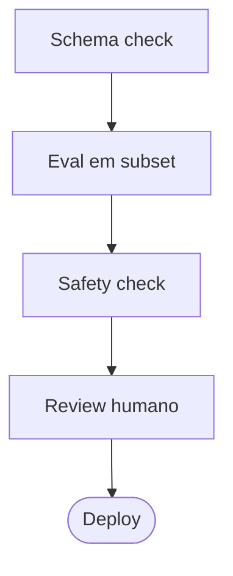

---

### D12 — Antes vs Depois (Caso Suporte) (Slide 20)

**Tipo**: Comparação
**Descrição**: 10 engenheiros × 20 semanas vs 1 engenheiro × 2 dias
**Mermaid**:
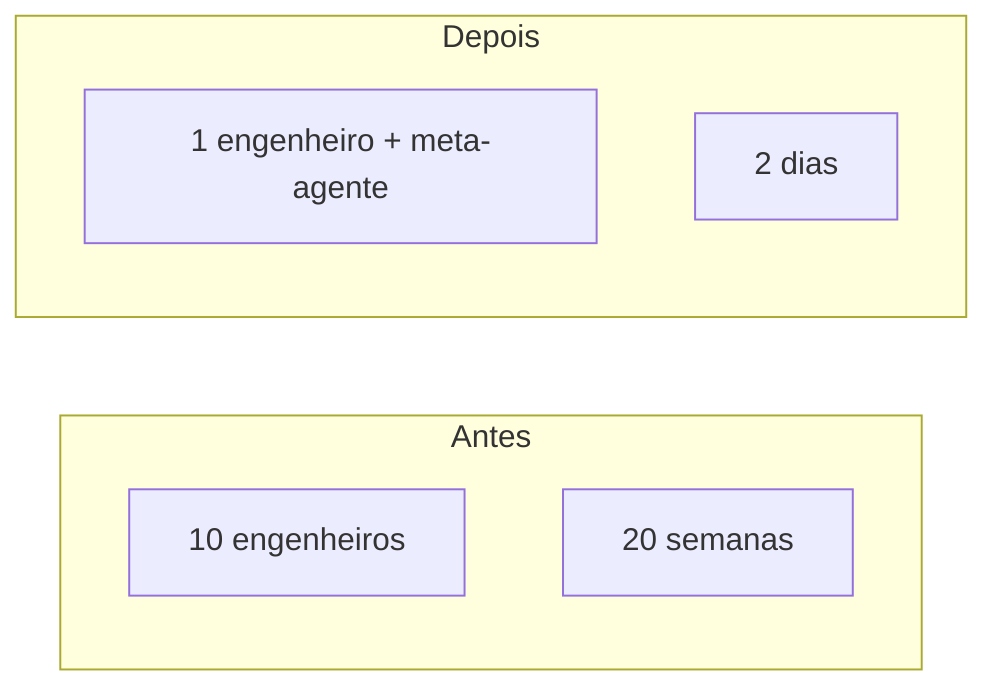

---

### D13 — Espaço de Busca Humano vs Automático (Slide 26)

**Tipo**: Gráfico de dispersão
**Descrição**: Poucos pontos (humano) vs grade densa (automático)
**Mermaid**:
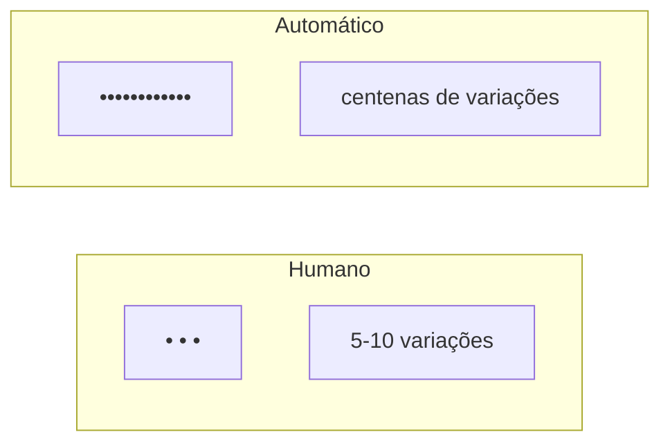

---

### D14 — Código Declarativo → DSPy → Prompt (Slide 27)

**Tipo**: Flowchart
**Descrição**: assinatura → DSPy compiler → prompt otimizado
**Mermaid**:
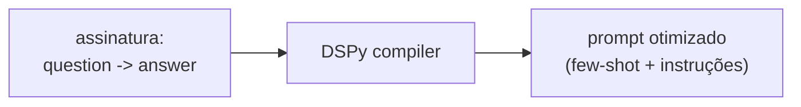

---

### D15 — Teleprompter Flow (Slide 28)

**Tipo**: Flowchart
**Descrição**: assinatura + dados → teleprompter → prompt
**Mermaid**:
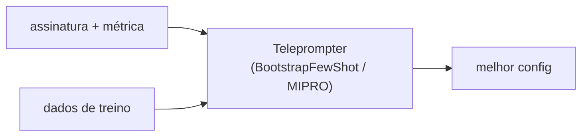

---

### D16 — Ciclo Evolutivo do Promptbreeder (Slide 29)

**Tipo**: Ciclo
**Descrição**: população → mutação → seleção → nova população
**Mermaid**:
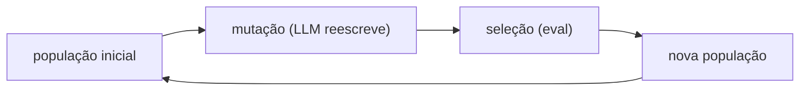

---

### D17 — Loop de Otimização de Tools (Slide 31)

**Tipo**: Loop
**Descrição**: descrição → eval → taxa de erro → reescrever → eval
**Mermaid**:
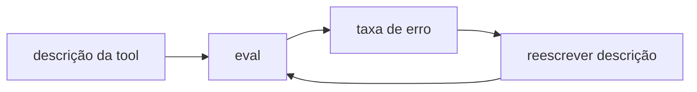

---

### D18 — Topologia A vs B (Slide 32)

**Tipo**: Comparação de grafos
**Descrição**: Topologia A (5 workers paralelos) vs B (3 + 2 especializados)
**Mermaid**:
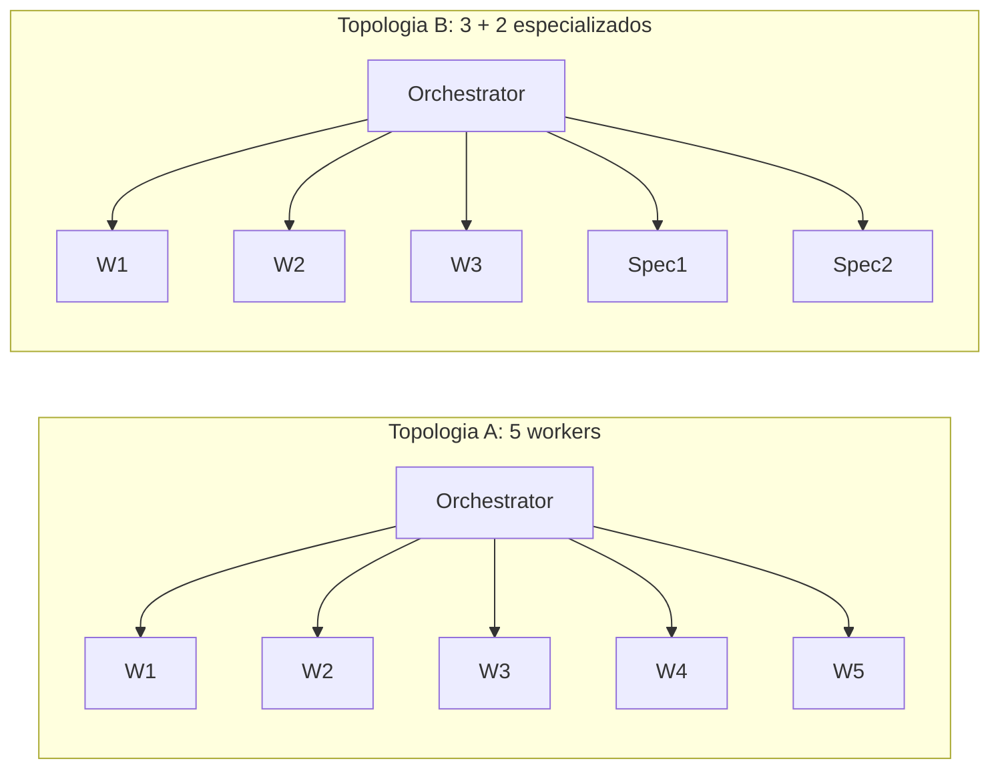

---

### D20 — Memória de Sucesso/Falha (Slide 37)

**Tipo**: Flowchart cíclico
**Descrição**: agente executa → outcome → armazena → recupera
**Mermaid**:
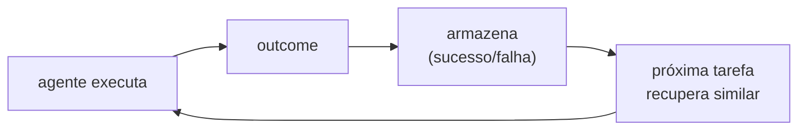

---

### D21 — Reflexão Individual vs Sistêmica (Slide 38)

**Tipo**: Hierarquia
**Descrição**: agente (individual) → meta-agente (sistêmico) → meta-meta
**Mermaid**:
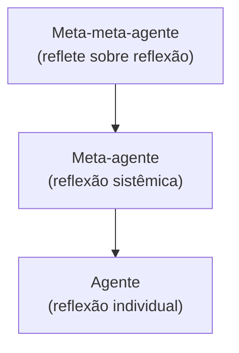

---

### D22 — Ciclo do Strategy Evolver (Slide 39)

**Tipo**: Ciclo com população
**Descrição**: população → mutação → avaliar → selecionar → substituir
**Mermaid**:
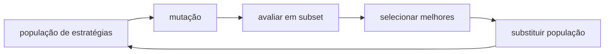

---

### D23 — Arquitetura Voyager (Slide 40)

**Tipo**: Arquitetura
**Descrição**: curriculum → skill → library → execução
**Mermaid**:
```mermaid
flowchart LR
    Cur["Automatic Curriculum<br/>(gera desafios)"] --> SK["Skill<br/>(código JS)"]
    SK --> Lib["Skill Library"]
    Lib --> Exec["Execução no Minecraft"]
    Exec -.feedback.-> Cur
```

---

### D24 — Timeline de Drift (Slide 41)

**Tipo**: Timeline
**Descrição**: ambiente muda, memória antiga vs nova
**Mermaid**:
```mermaid
flowchart LR
    T1["t0: ambiente A"] --> T2["t1: ambiente muda para B"]
    T2 --> T3["t2: drift detectado"]
    T3 --> T4["t3: esquecer + re-aprender"]
```

---

### D25 — Loop de Auto-Modificação com Guardrails (Slide 47)

**Tipo**: Loop com guardrails
**Descrição**: modifica → diff check → max_iter → rollback
**Mermaid**:
```mermaid
flowchart LR
    Mod["modifica a si mesmo"] --> Diff{"diff > N%?"}
    Diff -- "sim" --> HITL["requer HITL"]
    Diff -- "não" --> Test["testa"]
    Test --> Iter{"max_iter?"}
    Iter -- "ok" --> Mod
    Iter -- "excedido" --> Stop["para"]
    Test -.performance cai.-> RB["rollback"]
```

---

### D26 — Objetivo vs Métrica Divergindo (Slide 48)

**Tipo**: Gráfico de linhas divergindo
**Descrição**: Objetivo real cai enquanto métrica proxy sobe
**Mermaid**:
```mermaid
flowchart LR
    subgraph G[" "]
        direction TB
        L1["métrica proxy: ↗ sobe"]
        L2["objetivo real: ↘ cai"]
        L3["divergência cresce"]
    end
```

---

### D27 — Meta-Governor Flow (Slide 49)

**Tipo**: Flowchart com gate
**Descrição**: meta-agente propõe → governor avalia → aprova/rejeita
**Mermaid**:
```mermaid
flowchart LR
    MA["Meta-agente"] --> Prop["propõe mudança"]
    Prop --> MG["Meta-governor"]
    MG --> Dec{decisão}
    Dec -- "aprova" --> Dep[deploy]
    Dec -- "rejeita" --> Bl[bloquear]
```

---

### D29 — Escada de Confiança Incremental (Slide 51)

**Tipo**: Escada de níveis
**Descrição**: Nível 0 → 4 com gates
**Mermaid**:
```mermaid
flowchart TB
    L4["Nível 4: Produção total"]
    L3["Nível 3: Produção gradual 10→50→100%"]
    L2["Nível 2: Canary 5%"]
    L1["Nível 1: Shadow run"]
    L0["Nível 0: Sandbox"]
    L4 --> L3 --> L2 --> L1 --> L0
```

---

### D30 — Voyager Seguro vs Produção Risco (Slide 55)

**Tipo**: Comparação
**Descrição**: Voyager (sandbox, determinístico) vs produção (risco)
**Mermaid**:
```mermaid
flowchart LR
    subgraph V["Voyager (seguro)"]
        V1["Sandbox total"]
        V2["Feedback determinístico"]
        V3["Sem consequências"]
        V4["Skills auditáveis"]
    end
    subgraph P["Produção (risco)"]
        P1["Ambiente real"]
        P2["Feedback ambíguo"]
        P3["Consequências reais"]
        P4["Ações opacas"]
    end
```

---

### D31 — Mapa da Especialização (Slide 65)

**Tipo**: Mind map radial
**Descrição**: ETHAGT15 no centro com conexões
**Mermaid**:
```mermaid
mindmap
  root((ETHAGT15))
    ETHAGT16
      Sociedades de Agentes
      Ecossistemas
    ETHAGT90
      Capstone
      Orquestração
    ETHAGT14
      Escalabilidade
      Custo
    ETHAGT12
      AgentOps
      Observabilidade
```

---

## Resumo de Produção

| # | Nome | Tipo | Status | Slide |
|---|---|---|---|---|
| D1 | Manual vs automatizado | Comparação | 🆕 Novo | 5 |
| D2 | Timeline de marcos | Timeline | 🆕 Novo | 6 |
| D3 | Hierarquia meta→agente→ambiente | Hierarquia | 🆕 Novo | 8 |
| D4 | 3 estratégias | Colunas | 🆕 Novo | 9 |
| D5 | Meta-agente arquitetura | Flowchart | ✅ Existe | 10 |
| D6 | 5 cards de papers | Grid | 🆕 Novo | 11 |
| D7 | Balança risco vs benefício | Balança | 🆕 Novo | 12 |
| D8 | Input→meta-agente→config | Flowchart | 🆕 Novo | 16 |
| D9 | Biblioteca de templates | Arquitetura | 🆕 Novo | 17 |
| D10 | Pipeline de geração | Pipeline | 🆕 Novo | 18 |
| D11 | Funil de validação | Funil | 🆕 Novo | 19 |
| D12 | Antes vs depois (suporte) | Comparação | 🆕 Novo | 20 |
| D13 | Espaço de busca | Gráfico | 🆕 Novo | 26 |
| D14 | DSPy compilation | Flowchart | 🆕 Novo | 27 |
| D15 | Teleprompter flow | Flowchart | 🆕 Novo | 28 |
| D16 | Ciclo Promptbreeder | Ciclo | 🆕 Novo | 29 |
| D17 | Loop otimização tools | Loop | 🆕 Novo | 31 |
| D18 | Topologia A vs B | Grafos | 🆕 Novo | 32 |
| D19 | Evolution loop | Flowchart | ✅ Existe | 33 |
| D20 | Memória sucesso/falha | Ciclo | 🆕 Novo | 37 |
| D21 | Reflexão individual vs sistêmica | Hierarquia | 🆕 Novo | 38 |
| D22 | Strategy evolver ciclo | Ciclo | 🆕 Novo | 39 |
| D23 | Arquitetura Voyager | Arquitetura | 🆕 Novo | 40 |
| D24 | Timeline de drift | Timeline | 🆕 Novo | 41 |
| D25 | Auto-modificação guardrails | Loop | 🆕 Novo | 47 |
| D26 | Objetivo vs métrica | Gráfico | 🆕 Novo | 48 |
| D27 | Meta-governor flow | Flowchart | 🆕 Novo | 49 |
| D28 | Safety fences | Flowchart | ✅ Existe | 50 |
| D29 | Escada confiança incremental | Escada | 🆕 Novo | 51 |
| D30 | Voyager vs produção | Comparação | 🆕 Novo | 55 |
| D31 | Mapa da especialização | Mind map | 🆕 Novo | 65 |

**Total**: 3 existentes + 28 novos = 31 diagramas únicos a produzir/manter.
