# ETHAGT16 — Sugestões de Diagramas

> 19 diagramas referenciados pela apresentação.
> 3 já existem em `12-Diagrams/ETHAGT16/`. 16 novos a produzir.

---

## Diagramas Existentes (3)

| # | Slide | Arquivo | Descrição |
|---|---|---|---|
| D6 | 13 | `society.mmd` | Sociedade: papéis + normas + emergência |
| D10 | 25 | `research-pipeline.mmd` | Pipeline de pesquisa autônoma com HITL |
| D15 | 36 | `emergence.mmd` | Comportamento emergente: agentes → interações → padrões |

> **Nota**: Os 3 diagramas existentes cobrem 3 dos 19 necessários. Os demais (D1-D5, D7-D9, D11-D14, D16-D19) são novos.

---

## Diagramas Novos (16)

### D1 — Escala: 1 Agente → Sociedade → Emergência (Slide 5)

**Tipo**: Crescimento visual
**Descrição**: Sequência 1 ponto → 5 pontos (grupo) → 25 pontos (sociedade) → 100 pontos (emergência)
**Mermaid**:
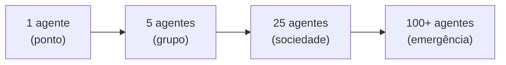
**Estilo**: Pontos surgem e formam rede. Cores `etho-primary` → `etho-accent`.

---

### D2 — Timeline de Marcos 2022-2024 (Slide 6)

**Tipo**: Timeline horizontal
**Descrição**: ReAct (2022) → tool calling + multi-agent frameworks (2023) → Generative Agents / Smallville (abr/2023) → AI Scientist + AlphaEvolve (2024)
**Mermaid**:
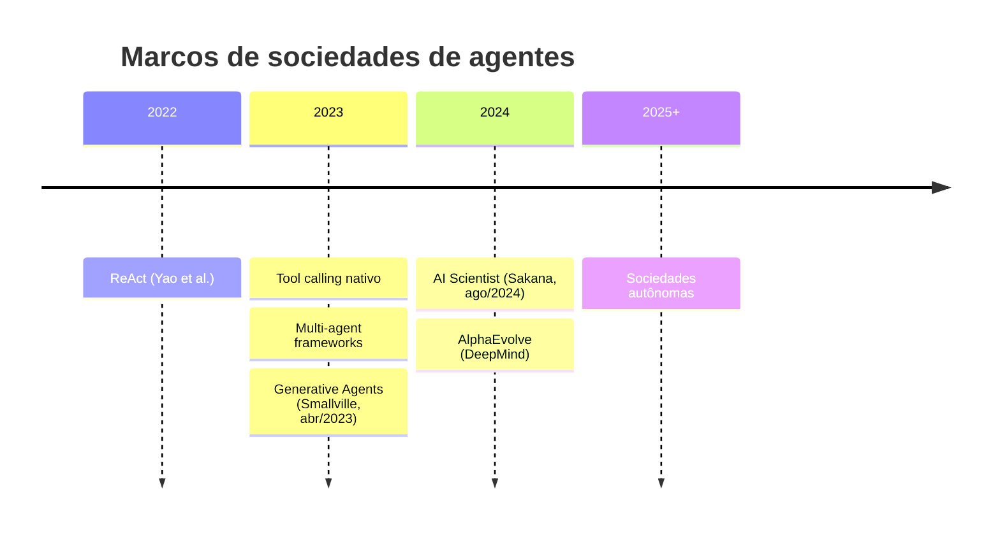

---

### D3 — Escada de 4 Níveis: Agente → Sociedade (Slide 8)

**Tipo**: Escada
**Descrição**: Nível 0 (agente individual) → Nível 1 (grupo) → Nível 2 (instituição) → Nível 3 (sociedade)
**Mermaid**:
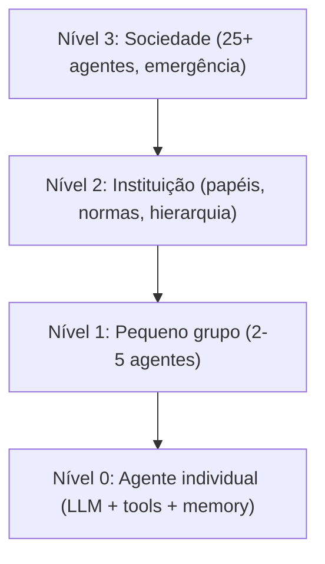

---

### D4 — 5 Papéis em Círculo (Slide 9)

**Tipo**: Mind map radial
**Descrição**: Pesquisador, Crítico, Sintetizador, Revisor, Editor em círculo
**Mermaid**:
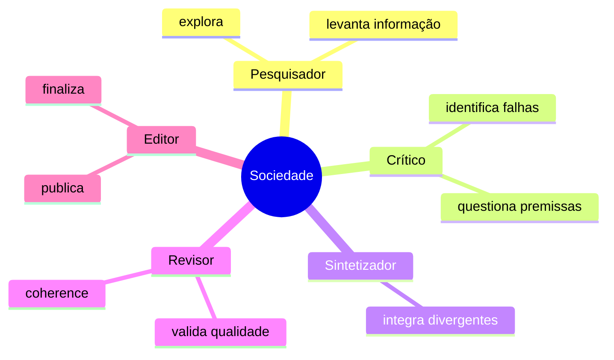

---

### D5 — Grafo de Confiança / Reputação (Slide 11)

**Tipo**: Grafo com pesos
**Descrição**: Agentes como nós, arestas com peso de confiança
**Mermaid**:
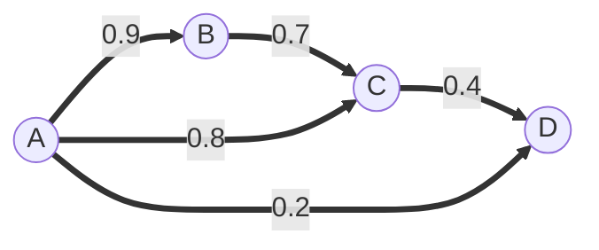
**Estilo**: Arestas grossas = alta confiança; finas/vermelhas = baixa confiança.

---

### D7 — Grupo vs Instituição vs Sociedade (Slide 14)

**Tipo**: 3 colunas comparativas
**Descrição**: Eixos controle / adaptabilidade / previsibilidade / risco
**Mermaid**:
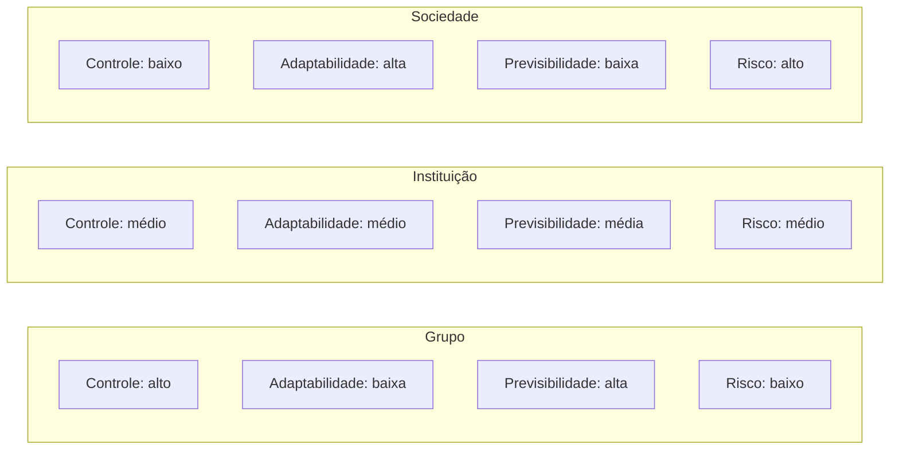

---

### D8 — Mapa de Smallville (Slide 17)

**Tipo**: Mapa estilizado
**Descrição**: Mapa de Smallville (parque, café, casas, escola) com agentes distribuídos
**Estilo**: Imagem ilustrativa baseada em Park et al. (arXiv:2304.03442).

---

### D9 — Pipeline Smallville: Memory → Reflection → Action (Slide 18)

**Tipo**: Flowchart
**Descrição**: Memory stream → Retrieval (recência + relevância + importância) → Reflection → Planning → Action
**Mermaid**:
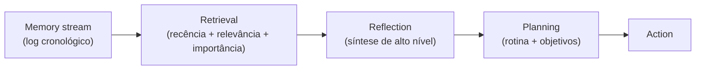

---

### D11 — Fluxo AI Scientist em 5 Etapas (Slide 26)

**Tipo**: Flowchart
**Descrição**: Ideação → Literatura → Código → Experimento → Paper
**Mermaid**:
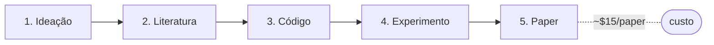

---

### D12 — AI Scientist 4 Stages com Feedback (Slide 27)

**Tipo**: Pipeline com loop
**Descrição**: Ideation → Experimentation → Paper writing → Review com loop de revisão
**Mermaid**:
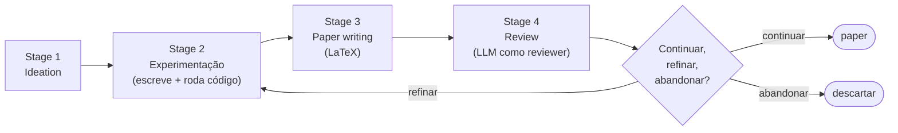

---

### D13 — Loop Evolutivo AlphaEvolve (Slide 28)

**Tipo**: Loop
**Descrição**: LLM propõe mutações → avaliador testa → mantém melhores → LLM
**Mermaid**:
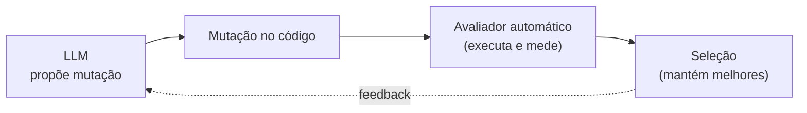

---

### D14 — Time de 4 Agentes com Canal de Comunicação (Slide 29)

**Tipo**: Diagrama de equipe
**Descrição**: Pesquisador, Programador, Revisor, Escritor com canal compartilhado
**Mermaid**:
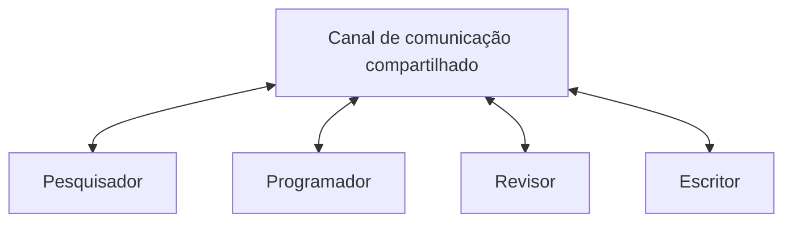

---

### D16 — Emergência Desejada vs Indesejada (Slide 37)

**Tipo**: 2 colunas
**Descrição**: Esquerda (verde) desejada; direita (vermelho) indesejada
**Mermaid**:
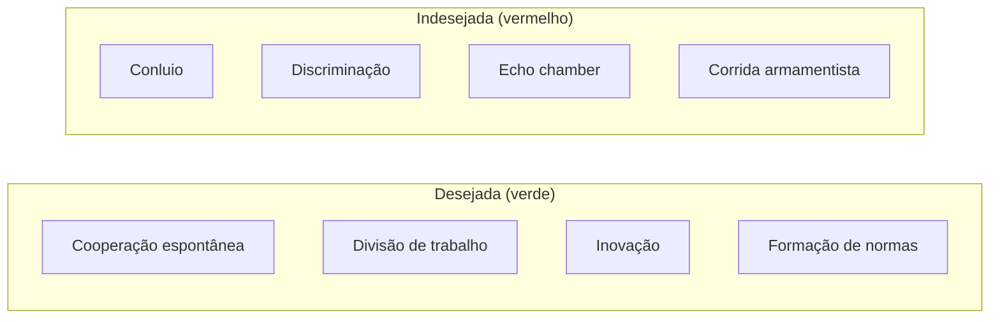

---

### D17 — Pirâmide de Alinhamento (Slide 38)

**Tipo**: Pirâmide (camadas)
**Descrição**: Base = valores individuais; meio = normas sociais; topo = constitution
**Mermaid**:
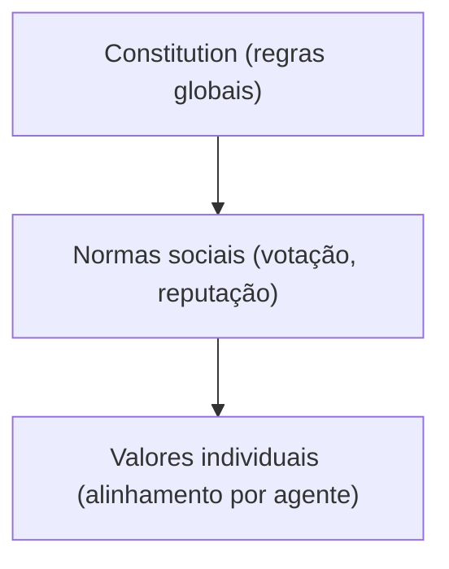

---

### D18 — Mapa da Fronteira de Pesquisa (Slide 43)

**Tipo**: Mind map
**Descrição**: Fronteira no centro com AI Scientist, AlphaEvolve, AutoGen research, Swarm research
**Mermaid**:
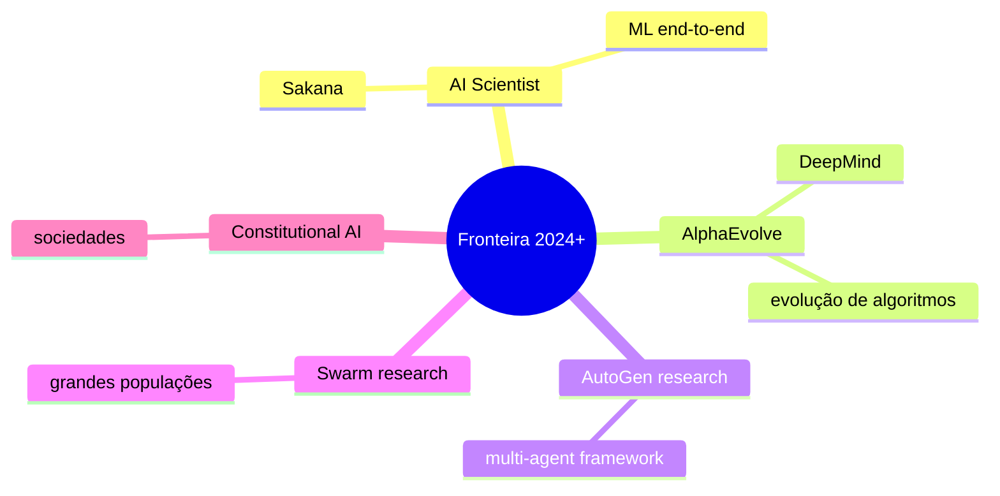

---

### D19 — Mapa da Especialização ETHAGT01 → ETHAGT90 (Slide 49)

**Tipo**: Timeline / mapa
**Descrição**: Augmented LLM (ETHAGT01) → ... → Sociedades (ETHAGT16) → Capstone (ETHAGT90)
**Mermaid**:
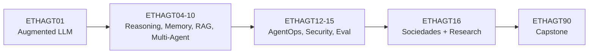

---

## Resumo de Produção

| # | Nome | Tipo | Status | Slide |
|---|---|---|---|---|
| D1 | Escala agente → sociedade | Crescimento | 🆕 Novo | 5 |
| D2 | Timeline de marcos | Timeline | 🆕 Novo | 6 |
| D3 | Escada de 4 níveis | Escada | 🆕 Novo | 8 |
| D4 | 5 papéis em círculo | Mind map | 🆕 Novo | 9 |
| D5 | Grafo de confiança | Grafo | 🆕 Novo | 11 |
| D6 | Sociedade de agentes | Flowchart | ✅ Existe | 13 |
| D7 | Grupo vs Instituição vs Sociedade | Colunas | 🆕 Novo | 14 |
| D8 | Mapa de Smallville | Mapa | 🆕 Novo | 17 |
| D9 | Pipeline Smallville | Flowchart | 🆕 Novo | 18 |
| D10 | Research pipeline | Flowchart | ✅ Existe | 25 |
| D11 | Fluxo AI Scientist 5 etapas | Flowchart | 🆕 Novo | 26 |
| D12 | AI Scientist 4 stages + feedback | Pipeline | 🆕 Novo | 27 |
| D13 | Loop AlphaEvolve | Loop | 🆕 Novo | 28 |
| D14 | Time de 4 agentes | Diagrama | 🆕 Novo | 29 |
| D15 | Emergência | Flowchart | ✅ Existe | 36 |
| D16 | Desejada vs indesejada | 2 colunas | 🆕 Novo | 37 |
| D17 | Pirâmide de alinhamento | Pirâmide | 🆕 Novo | 38 |
| D18 | Mapa da fronteira | Mind map | 🆕 Novo | 43 |
| D19 | Mapa da especialização | Timeline | 🆕 Novo | 49 |

**Total**: 3 existentes + 16 novos = 19 diagramas a produzir/manter.
