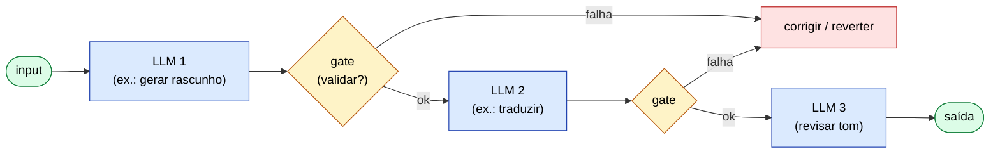
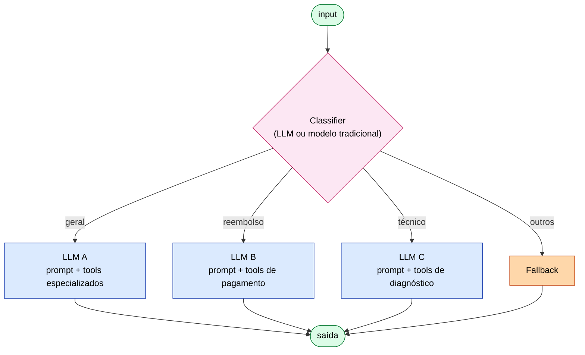
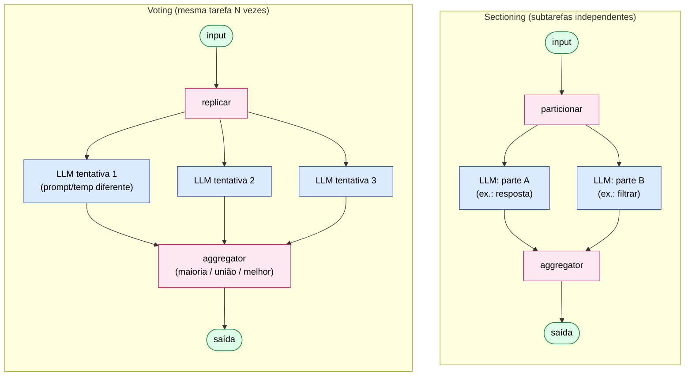
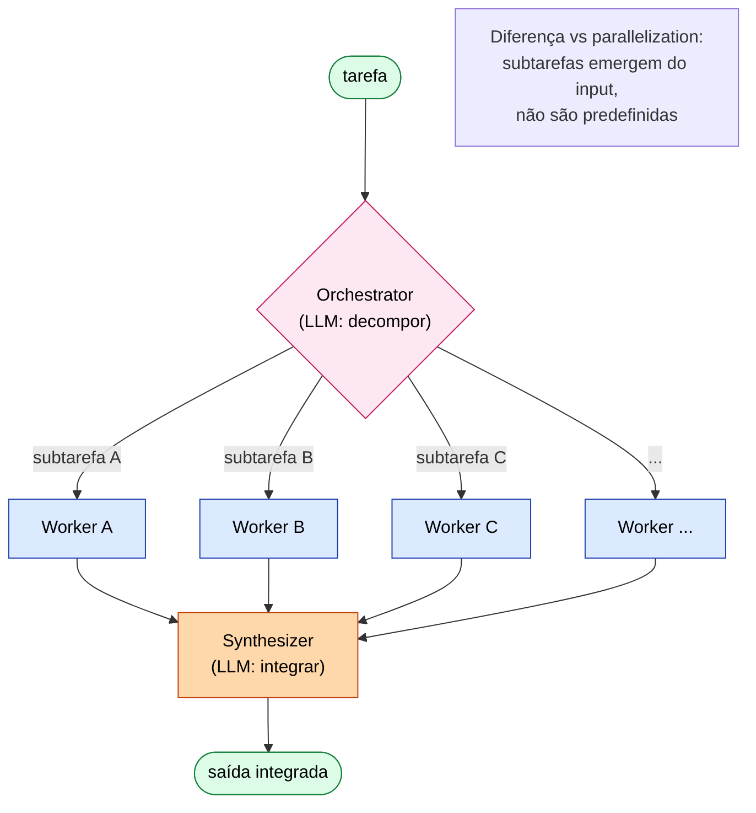
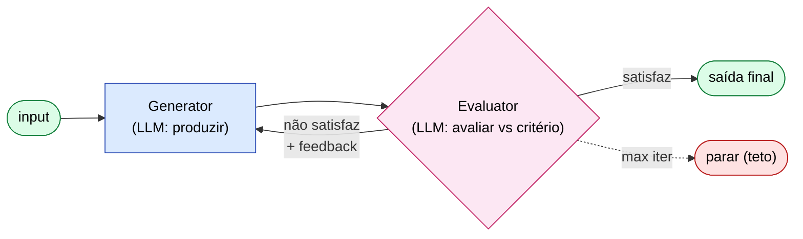

# ETHAGT03 — Padrões de Workflow Agêntico

> **Apostila do curso** · Especialização em Programação Agêntica · Universidade Etho
> Fase A — Fundamentos Agênticos · Carga 30 h · Versão 1.0 · Julho 2026
> *Material de referência duradouro (nível pós-graduação lato sensu). Os slides são auxiliares.*

---

## Sumário

- **Capítulo 1** — Por que workflows antes de agentes
- **Capítulo 2** — Prompt Chaining
- **Capítulo 3** — Routing
- **Capítulo 4** — Parallelization (sectioning e voting)
- **Capítulo 5** — Orchestrator-Workers
- **Capítulo 6** — Evaluator-Optimizer
- **Capítulo 7** — Composições e limites
- **Capítulo 8** — Casos de estudo
- **Capítulo 9** — Referências e leituras

---

## Capítulo 1 — Por que workflows antes de agentes

### 1.1 O princípio da complexidade mínima

ETHAGT01 estabeleceu a distinção canônica entre *workflows* (caminhos de execução predefinidos em código) e *agentes* (o LLM dirige seu próprio processo). Este módulo aprofunda o lado *workflow* do espectro — e o faz por uma razão pragmática forte: **a maioria das tarefas em produção é melhor resolvida por um workflow bem desenhado do que por um agente autônomo.**

A armadilha mais cara da programação agêntica é a *complexidade prematura*: começar com um agente totalmente autônomo por modismo, quando uma chamada única ou um encadeamento simples resolveria com mais previsibilidade, menos custo e menos risco. A Anthropic é taxativa:

> **Princípio (Anthropic).** *Find the simplest solution possible — and only increase complexity when demonstrably needed.* Comece com a solução mais simples possível e só aumente complexidade quando houver evidência de que ela melhora o resultado.

Workflows são a expressão desse princípio: dão a você **poder agêntico** (chamadas a LLM, ferramentas, composição) com **previsibilidade** (caminho fixo, testável, custo previsível). O agente autônomo é reservado para o subconjunto de tarefas onde a imprevisibilidade do caminho é intrínseca — e mesmo aí, com cercas (ETHAGT01, §4.4).

### 1.2 O que você ganha e perde com workflows

| Dimensão | Workflow | Agente autônomo |
|---|---|---|
| Previsibilidade do caminho | Alta (fixo) | Baixa (emerge) |
| Testabilidade | Caminhos enumeráveis, testáveis | Espaço de execução infinito |
| Custo | Previsível (nº fixo de chamadas) | Variável (depende de iterações) |
| Latência | Controlável | Incerta |
| Flexibilidade | Limitada ao roteiro | Alta |
| Debug | Direto (siga o código) | Indireto (analise traces) |
| Adequação | Tarefa bem-understood, repetível | Tarefa aberta, variável |

### 1.3 Mapa dos cinco padrões

A Anthropic cataloga cinco padrões canônicos. Eles não são mutuamente exclusivos — compõem-se (Capítulo 7) — mas vale memorizar *quando cada um brilha*:

| Padrão | Quando brilha | Custo/Latência |
|---|---|---|
| **Prompt Chaining** | Subtarefas lineares fixas com pontos de validação | Latência soma (sequencial) |
| **Routing** | Categorias distintas que precisam de tratamentos especializados | 1 classificação + 1 tratamento |
| **Parallelization** | Subtarefas independentes (sectioning) ou reforço por votação (voting) | Latência = max(paralelas); custo soma |
| **Orchestrator-Workers** | Decomposição *dinâmica* decidida pelo LLM | Orquestrador + N workers + síntese |
| **Evaluator-Optimizer** | Há critério claro de qualidade e o LLM consegue avaliar | Loop variável até convergir |

> **Biblioteca de referência:** [`13-Workflows/`](../../13-Workflows/) contém a documentação canônica de cada padrão e composições.

Os próximos cinco capítulos desenvolvem cada padrão com a mesma estrutura: *o que é · quando usar · implementação · trade-offs · variações*.

---

## Capítulo 2 — Prompt Chaining

### 2.1 O que é

O **Prompt Chaining** (encadeamento de prompts) é o workflow mais simples além da chamada única: uma sequência *linear e predefinida* de chamadas ao LLM, onde a saída de uma etapa alimenta a próxima. A característica distintiva é que há **gates** (portões) entre etapas — pontos de código que podem validar, transformar ou desviar o fluxo antes de continuar.



```
   input ──► [LLM: gerar] ──► gate ──► [LLM: revisar] ──► gate ──► [LLM: reescrever] ──► output
```

### 2.2 Quando usar

- A tarefa se decompõe naturalmente em **passos fixos e conhecidos**.
- Cada passo se beneficia de um **prompt especializado** (foco numa coisa).
- Há **pontos de validação** onde código (não LLM) pode checar qualidade e desviar em caso de problema.
- Vale a pena trocar **latência por qualidade** (a soma sequencial é mais lenta que uma chamada, mas cada etapa é melhor focada).

Exemplo clássico: gerar um documento técnico. Passo 1: gerar o esboço (outline); *gate*: o esboço cobre todos os tópicos obrigatórios?; Passo 2: gerar o rascunho a partir do esboço; *gate*: o rascunho excede o tamanho?; Passo 3: revisar e polir.

### 2.3 Implementação

```python
def prompt_chain(input_text):
    outline = llm("Gere um esboço estruturado para: " + input_text)
    if not cobre_topicos_obrigatorios(outline):
        outline = llm("Complete o esboço com os tópicos faltantes: " + outline)

    draft = llm(f"Escreva o conteúdo completo seguindo este esboço:\n{outline}")
    if len(draft) > MAX_CHARS:
        draft = llm("Resuma para caber em " + str(MAX_CHARS) + " caracteres:\n" + draft)

    final = llm(f"Revise e melhore clareza e tom:\n{draft}")
    return final
```

Note os elementos essenciais: cada chamada LLM é *focada* num objetivo; os gates são *código* (determinísticos), não LLM; o fluxo é *linear e legível*.

### 2.4 Trade-offs

A latência é a soma das etapas (sequencial) — para tarefas sensíveis a tempo, isso pode ser proibitivo. Mas a qualidade tende a ser superior à de uma única chamada "faça tudo", porque cada etapa tem foco e contexto reduzido. A regra: **use chaining quando o ganho de qualidade justificar a latência extra.**

### 2.5 Variação: gates como classificadores

Um gate não precisa ser binário. Pode ser um *classificador* que escolhe o próximo passo: "a saída é técnica ou casual?" → segue para o polidor técnico ou casual. Isso já aproxima o chaining do routing.

---

## Capítulo 3 — Routing

### 3.1 O que é

O **Routing** (roteamento) separa a tarefa em duas fases: (1) um **classificador** categoriza a entrada, e (2) um **tratador especializado** processa a categoria. A vantagem é que cada tratador tem prompt, ferramentas e até *modelo* otimizados para seu tipo de caso — em vez de um prompt genérico que tenta cobrir tudo (e cobre nada bem).



```
                ┌──► tratador cobrança (prompt + tools especializadas)
   input ──► [classificador] ──┼──► tratador técnico
                └──► tratador cancelamento
```

### 3.2 Quando usar

- Há **categorias distintas** de entrada, com tratamentos claramente diferentes.
- Cada categoria se beneficia de **prompt/tools/especialização próprios**.
- A categorização é *razoavelmente confiável* (se o classificador erra muito, o routing falha).

### 3.3 Routing por modelo: otimização de custo

Um uso sofisticado é rotear por **dificuldade**, escolhendo o modelo certo para o caso. Perguntas fáceis vão para um modelo rápido e barato (ex.: Haiku); perguntas difíceis vão para um modelo potente e caro (ex.: Sonnet/Opus). Isso pode reduzir custo drasticamente mantendo qualidade:

```python
def route_by_difficulty(user_query):
    difficulty = classifier(user_query)   # "easy" | "medium" | "hard"
    model = {"easy": "haiku", "medium": "sonnet", "hard": "opus"}[difficulty]
    return llm(user_query, model=model)
```

O trade-off é a qualidade do classificador: se ele subestima a dificuldade (manda caso difícil para o modelo fraco), a qualidade cai. Meça a taxa de erro do classificador e ajuste o limiar.

### 3.4 Routing por prompt/tools especializados

Outra dimensão: cada categoria recebe **diferentes conjuntos de ferramentas**. O tratador de cobrança tem acesso às ferramentas de faturamento; o tratador técnico, às ferramentas de diagnóstico. Isso reduz o catálogo de ferramentas por chamada — o que, como vimos em ETHAGT02 §1.5, reduz custo e melhora a precisão (menos confusão).

### 3.5 Implementação e avaliação do classificador

```python
def routing(user_query):
    category = classify(user_query)
    handler = HANDLERS[category]          # prompt + tools especializados
    return handler(user_query)
```

A métrica crítica é a **acurácia do classificador**. Se 90% dos casos são roteados corretamente, o sistema é viável; se 60%, o routing está pior que um tratador genérico bem feito. Avalie o classificador isoladamente, com um conjunto rotulado, *antes* de confiar nele em produção.

---

## Capítulo 4 — Parallelization (sectioning e voting)

### 4.1 O que é

A **Parallelization** executa múltiplas chamadas LLM *simultaneamente* e agrega os resultados. Há duas variantes com objetivos muito diferentes:

- **Sectioning (particionamento):** divide a tarefa em *subtarefas independentes*, executa cada uma em paralelo e combina. Ex.: resumir um documento longo — particione em seções, resuma cada em paralelo, concatene.
- **Voting (votação):** executa a *mesma tarefa N vezes* (com temperatura/variação) e agrega — vota a melhor resposta ou checa consenso. Útil quando há incerteza e múltiplas amostras aumentam a confiança.



```
   sectioning:                        voting:
            ┌─ LLM: subtarefa A ─┐           ┌─ LLM: tarefa (amostra 1) ─┐
   input ───┼─ LLM: subtarefa B ─┼─►agg   ───┼─ LLM: tarefa (amostra 2) ─┼─►agg(maioria)
            └─ LLM: subtarefa C ─┘           └─ LLM: tarefa (amostra 3) ─┘
```

### 4.2 Quando usar sectioning

- A tarefa tem **partes independentes** que não dependem umas das outras.
- A latência importa: executar em paralelo é mais rápido que em sequência.
- Custo é aceitável: o custo *soma* (N chamadas), mas a latência é o *máximo* (não a soma).

Cuidado com a **dependência oculta**: se as "subtarefas independentes" na verdade precisam umas das outras, a paralelização produz resultados inconsistentes. Verifique a independência *antes* de paralelizar.

### 4.3 Quando usar voting

- Há **incerteza** na resposta e múltiplas amostras ajudam (ex.: perguntas factual/raciocínio).
- Você pode **agregar** de forma significativa (maioria para múltipla escolha; um juiz para texto livre).
- O custo de N amostras é aceitável dado o ganho de confiança.

A variação *self-consistency* (Wang et al.) é exatamente voting sobre Chain-of-Thought: gerar várias cadeias de raciocínio e votar a resposta final — consistente melhora a precisão sobre CoT único.

### 4.4 Implementação

```python
import asyncio

async def parallelization_sectioning(task):
    subtasks = decompor(task)                          # particionamento fixo
    resultados = await asyncio.gather(*[llm_async(s) for s in subtasks])
    return agregar(resultados)

async def parallelization_voting(task, n=5):
    amostras = await asyncio.gather(*[llm_async(task, temperature=0.7) for _ in range(n)])
    return majority_vote(amostras)
```

### 4.5 Guardrails em paralelo

Um padrão valioso: rodar o modelo *e* um modelo guardião em paralelo. Enquanto um gera a resposta, outro avalia se a entrada/saída viola políticas. Se o guardião sinaliza, a resposta é bloqueada ou corrigida. Isso adiciona latência desprezível (corre em paralelo) e segurança considerável.

### 4.6 Erro comum: custo explodindo

A paralelização multiplica chamadas. Cinco amostras em voting = 5× o custo de uma chamada única. Em alto volume, isso escala rápido. Meça sempre custo/benefício: às vezes, 3 amostras capturam 90% do ganho de confiança que 10 dariam, por 30% do custo. O paper *LLMCompiler* (arXiv:2312.04511) formaliza a paralelização estruturada de chamadas LLM.

---

## Capítulo 5 — Orchestrator-Workers

### 5.1 O que é e como difere da parallelization

O **Orchestrator-Workers** tem um LLM *orquestrador* que decompõe a tarefa em subtarefas, delega cada uma a um LLM *trabalhador*, e depois sintetiza os resultados. A diferença crucial frente à parallelization é que **a decomposição é dinâmica** — decidida pelo orquestrador em tempo de execução, não fixa em código.



```
                  ┌─ worker A ─┐
   input ─►[orquestrador: planeja]─►├─ worker B ─┤─►[orquestrador: sintetiza]─► output
                  └─ worker C ─┘
```

### 5.2 Quando usar

- Você **não sabe a priori** quantas subtarefas haverá, nem quais são.
- A decomposição *depende do conteúdo* da entrada (ex.: editar código em N arquivos — quais arquivos depende do que o orquestrador encontra).
- Vale a pena o custo extra do orquestrador (planejamento + síntese) pela flexibilidade.

Casos típicos: coding em múltiplos arquivos (o orquestrador decide quais arquivos mexer); pesquisa em múltiplas fontes (decide quais fontes consultar com base na pergunta).

### 5.3 Implementação

```python
def orchestrator_workers(task):
    plan = llm(f"Decomponha em subtarefas: {task}")          # planejamento dinâmico
    subtasks = parse_subtasks(plan)
    results = [worker(s) for s in subtasks]                  # pode paralelizar workers
    synthesis = llm(f"Sintetize estes resultados:\n{results}")
    return synthesis
```

### 5.4 Variação ReWOO: plano "cego" + paralelismo

O **ReWOO** (Xu et al., arXiv:2305.18323) é uma variação eficiente: o orquestrador faz o plano *inteiro de uma vez* ("cego", sem ver resultados intermediários), e as subtarefas são executadas em paralelo. Isso reduz chamadas ao LLM (o orquestrador não re-planeja a cada passo) ao custo de menos adaptabilidade. A *Plan-and-Solve* (Wang et al., arXiv:2305.04091) é a base teórica: decorrelacionar planejamento e execução.

### 5.5 Trade-off

O orchestrator-workers é mais flexível que a parallelization fixa, mas mais caro (planejamento + síntese) e menos previsível (a decomposição varia). É também o padrão que mais se aproxima do "agente" — de fato, muitos sistemas multi-agente (ETHAGT10) são orchestrator-workers generalizados.

---

## Capítulo 6 — Evaluator-Optimizer

### 6.1 O que é

O **Evaluator-Optimizer** é um loop: um LLM *gera*, outro (ou o mesmo, com prompt diferente) *avalia* e dá feedback, e o gerador *refina*, repetindo até satisfazer um critério. É o equivalente agêntico de um ciclo de revisão humana, automatizado.



```
   ┌──►[gerar]──►[avaliar]──►refinar?──não──►[sair]
   │                    │
   │◄────────sim────────┘
```

### 6.2 Quando usar (e quando não)

Use quando:

- Há um **critério claro e articulável** de qualidade, que o LLM consegue avaliar.
- O feedback é *acionável* — o gerador consegue melhorar com base nele.
- Vale a pena o custo variável do loop.

**Não** use quando o critério é vago ("faça ficar melhor") — o loop não converge e o custo explode. Também não use quando uma chamada bem feita já atinge o critério — o loop seria desperdício.

### 6.3 Critérios e convergência

O segredo do evaluator-optimizer é um **critério mensurável**. Para tradução literária, pode ser "preservar sentido + tom + métrica"; para código, "passa nos testes". Sem critério, o avaliador fica subjetivo e o loop divaga.

A **convergência** precisa de regras de parada:

```python
def evaluator_optimizer(task, max_iter=5, min_score=0.9):
    output = generate(task)
    for i in range(max_iter):
        score, feedback = evaluate(output, task)
        if score >= min_score or feedback is None:
            return output
        output = refine(output, feedback)
    return output
```

Três condições de parada: (1) score atinge o limiar, (2) máximo de iterações, (3) feedback estagnado (o avaliador não tem mais o que dizer — a melhora entre iterações cai abaixo de um delta).

### 6.4 LLM-as-judge

Frequentemente, o avaliador é um LLM julgando outro LLM — o **LLM-as-judge**. Funciona bem quando o critério é articulável, mas tem vieses conhecidos (preferir respostas longas, preferir seu próprio estilo, inconsistência). ETHAGT12 aprofunda como usar LLM-as-judge com rigor. Por ora: use-o, mas valide contra rótulos humanos em uma amostra.

---

## Capítulo 7 — Composições e limites

### 7.1 Padrões se compõem

Os cinco padrões não são ilhas — compõem-se em pipelines reais. Um padrão extremamente comum em suporte ao cliente:

> **Routing → Parallelization → Evaluator-Optimizer**

1. **Routing:** classifica o ticket (cobrança, técnico, cancelamento).
2. **Parallelization:** o tratador escolhido resolve, rodando em paralelo com um guardião de segurança.
3. **Evaluator-Optimizer:** a resposta é avaliada (política, tom, precisão) e refinada antes de enviar.

> **Diagrama de referência:** [`13-Workflows/composition-routing-parallel-evaluator.md`](../../13-Workflows/composition-routing-parallel-evaluator.md)

### 7.2 Quando a composição vira agente

Há uma fronteira fluida: conforme você compõe padrões e adiciona dinamicidade (orquestrador que re-planeja, loops com decisão do modelo), o sistema se aproxima de um agente. O sinal de que você cruzou a fronteira: **o modelo decide o próximo passo em tempo de execução**, em vez de o código decidir. Nesse ponto, pare de fingir que é workflow e abrace o paradigma de agente (ETHAGT01 Cap. 3) — com suas cercas e observabilidade.

### 7.3 Sinais de que você está forçando workflow em problema que pede agente

- O número de *branches* do seu "workflow" está crescendo sem parar (tentando prever todos os casos).
- Você adiciona `if` sobre `if` para lidar com casos que o modelo "deveria" decidir.
- A latência explode porque você encadeia gates demais.
- O sistema falha em casos que um humano resolveria adaptando o caminho.

Nesses sinais, considere: talvez a tarefa *peça* a flexibilidade de um agente. A transição workflow→agente é legítima quando *a evidência* (não a moda) a justifica.

---

## Capítulo 8 — Casos de estudo

### 8.1 Suporte ao cliente em produção (Coinbase, Intercom)

Os casos canônicos de workflow agêntico em produção vêm do suporte ao cliente. Coinbase, Intercom e Thomson Reuters (citados pela Anthropic) aplicam a composição *routing → parallelization → evaluator-optimizer* para triar, resolver e validar respostas — com HITL nas ações destrutivas (reembolsos, cancelamentos). A lição: **a previsibilidade do workflow é o que tornou viável colocar LLMs em atendimento ao cliente**, onde o erro é caro e o volume é alto.

> **Leitura.** Detalhes em [`09-CaseStudies/`](../../09-CaseStudies/).

### 8.2 Lições transversais

1. **Simplicidade escala em produção.** Os sistemas que chegaram a produção usam workflows, não agentes autônomos.
2. **Composição > um padrão gigante.** Pequenos padrões bem testados, compostos, superam um "super-workflow" monolítico.
3. **Meça antes de otimizar.** A escolha entre padrões deve ser guiada por medições de qualidade/custo/latência, não por preferência estética.

---

## Capítulo 9 — Referências e leituras

### 9.1 Bibliografia fundamental

- **Anthropic.** *Building Effective Agents.* 2024. 🏛 Canônica — os 5 workflows. <https://www.anthropic.com/engineering/building-effective-agents>
- **Arunkumar V, Gangadharan G.R., Buyya R.** *Agentic AI: Architectures, Taxonomies, and Evaluation.* arXiv:2601.12560, 2026. 🏛 Canônica — contexto na taxonomia unificada.

### 9.2 Bibliografia complementar

- **Wang, L. et al.** *Plan-and-Solve Prompting.* arXiv:2305.04091. — Base do orchestrator-workers.
- **Xu, B. et al.** *ReWOO.* arXiv:2305.18323. — Plano cego + paralelismo.
- **Kim, S. et al.** *LLMCompiler.* arXiv:2312.04511. — Paralelização estruturada.
- **Wang, X. et al.** *Self-Consistency Improves Chain of Thought Reasoning.* arXiv:2203.11171. — Base do voting.

### 9.3 Recursos práticos

- **LangGraph examples:** `plan-and-execute.ipynb`, `llm-compiler/LLMCompiler.ipynb`, `multi_agent/hierarchical_agent_teams.ipynb`.
- **Towards AI** — *Agent Workflow Patterns: Beyond Anthropic's Playbook* (2025).
- **Biblioteca de workflows:** [`13-Workflows/`](../../13-Workflows/).

### 9.4 Ficha de pesquisa

Fontes completas em [`20-Research/ETHAGT03-pesquisa.md`](../../20-Research/ETHAGT03-pesquisa.md). Última consulta: Julho 2026.

---

## Síntese do módulo

Ao concluir ETHAGT03, você deve ser capaz de:

1. **Implementar** os 5 workflows canônicos e identificar gates programáticos.
2. **Combinar** padrões em pipelines compostos (routing → parallelization → evaluator-optimizer).
3. **Justificar**, com medições, a escolha entre workflow e agente para um cenário.
4. **Diagnosticar** quando uma composição cruzou a fronteira para agente.
5. **Medir** trade-offs de custo/latência/qualidade entre abordagens.

Próximos passos: ETHAGT04 aprofunda o *planejamento* (a base do orchestrator-workers); ETHAGT09/10 levam a composição ao mundo multi-agente; ETHAGT90 integra tudo no Capstone.

---

*Mantido por: Escola de Tecnologia — Universidade Etho · Área de Inteligência Artificial · Versão 1.0 · Julho 2026*
