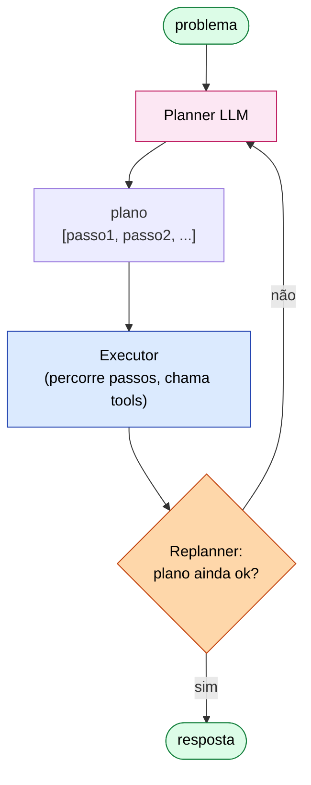
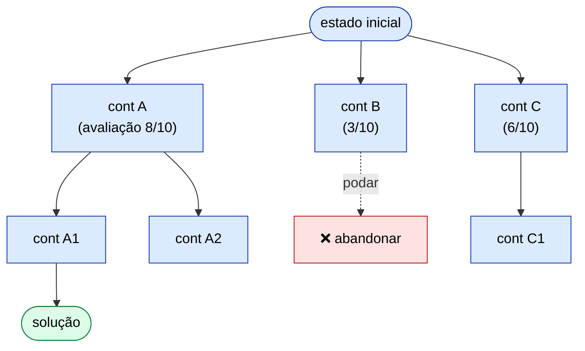
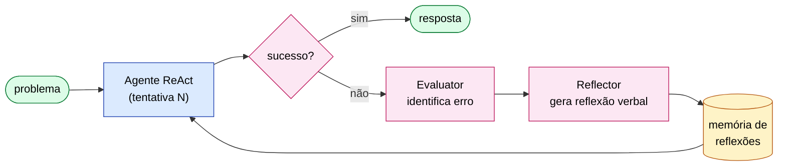

# ETHAGT04 — Reasoning & Planning

> **Apostila do curso** · Especialização em Programação Agêntica · Universidade Etho
> Fase B — Razão, Memória e Conhecimento · Carga 30 h · Versão 1.0 · Julho 2026
> *Material de referência duradouro (nível pós-graduação lato sensu). Os slides são auxiliares.*

---

## Sumário

- **Capítulo 1** — Tipologia do raciocínio
- **Capítulo 2** — Chain-of-Thought e Self-Consistency
- **Capítulo 3** — Plan-and-Execute e ReWOO
- **Capítulo 4** — Tree of Thoughts e LATS
- **Capítulo 5** — Reflexion
- **Capítulo 6** — Self-Discover
- **Capítulo 7** — Inference-Time Reasoning nativo
- **Capítulo 8** — Falhas, loops e orçamento
- **Capítulo 9** — Referências e leituras

---

## Capítulo 1 — Tipologia do raciocínio

### 1.1 Por que raciocínio separa agentes úteis de chatbots

Em ETHAGT01 vimos que o *Brain* (o LLM) é uma das seis componentes da taxonomia unificada, e que o *Planning* é outra. Este módulo é dedicado a essa dupla: **como fazer um agente raciocinar e planejar de forma a resolver tarefas que uma única inferência não consegue.** A tese é que a qualidade de um agente é, em grande medida, função da qualidade do seu raciocínio — e que raciocínio é uma *engenharia*, não um acidente do modelo.

A distinção com um chatbot é nítida: um chatbot responde; um agente *raciocina sobre como chegar à resposta*, decompondo o problema, considerando alternativas, corrigindo-se. Este módulo cataloga as estratégias para injetar essa capacidade — do *Chain-of-Thought* simples aos modelos de raciocínio nativo (o1/o3) — com seus trade-offs de qualidade, custo e latência.

### 1.2 Dimensões do raciocínio

Para não nos perdermos na selva de nomes (CoT, ToT, LATS, Reflexion...), organizamos as estratégias em três eixos:

| Eixo | Pólo A | Pólo B |
|---|---|---|
| **Momento** | Raciocínio *antes* da ação (planeja, depois executa) | Raciocínio *durante* a ação (pensa-a-cada-passo, ReAct) |
| **Estrutura** | Linear (uma cadeia) | Em árvore / grafo (explora alternativas, retrocede) |
| **Auto-correção** | Sem reflexão (uma passada) | Com reflexão (critica e melhora) |

Cada estratégia que veremos ocupa uma posição nesse espaço tridimensional. CoT é linear, sem reflexão, raciocínio-durante. Plan-and-Execute é linear, sem reflexão, raciocínio-antes. ToT é em árvore. Reflexion adiciona auto-correção. Manter esse mapa mental ajuda a *escolher* em vez de memorizar.

### 1.3 O casamento reasoning + tools

Um ponto crítico e frequentemente mal-entendido: **raciocínio e uso de ferramentas não competem — cooperam.** O ReAct (ETHAGT01) já mostrava isso: o raciocínio (Thought) decide *qual* ferramenta usar, e a observação da ferramenta *alimenta* o próximo passo de raciocínio. As estratégias deste módulo são, em última análise, formas de *organizar* essa cooperação — quando planejar antes, quando explorar alternativas, quando refletir sobre falhas.

---

## Capítulo 2 — Chain-of-Thought e Self-Consistency

### 2.1 Chain-of-Thought (CoT)

O **Chain-of-Thought** (Wei et al., *Chain-of-Thought Prompting Elicits Reasoning in Large Language Models*, NeurIPS 2022; arXiv:2201.11903) é a descoberta fundacional: pedir ao modelo que raciocine *passo a passo* antes de dar a resposta final melhora drasticamente a precisão em tarefas de raciocínio (aritmética, lógica, multi-step).

A versão *zero-shot* é trivial e poderosa — basta adicionar ao prompt:

```
Vamos pensar passo a passo.
```

A versão *few-shot* fornece exemplos de cadeias de raciocínio. Por que funciona? A hipótese é que decompor o problema em passos reduz a carga cognitiva de cada inferência: o modelo não precisa "dar um salto" gigante, mas vários passos pequenos e verificáveis. É o efeito de *distribuir* o raciocínio por mais tokens.

> **Princípio.** *Reasoning is compute.* Raciocínio explícito troca tokens (custo/latência) por qualidade. Esse é o trade-off fundamental de todo este módulo.

### 2.2 Quando CoT ajuda (e quando não)

CoT ajuda em tarefas que *genuinamente requerem* raciocínio multi-step: matemática, lógica, planejamento, dedução. Em tarefas que são recuperação factual simples ("qual a capital da França?"), CoT *adiciona custo sem benefício* — e às vezes introduz erros (o modelo "raciocina" sobre algo que deveria só saber). A regra: **aplique CoT onde há raciocínio a fazer; não onde há fato a recuperar.**

### 2.3 Self-Consistency

O **Self-Consistency** (Wang et al., *Self-Consistency Improves Chain of Thought Reasoning*, ICLR 2023; arXiv:2203.11171) é um aprimoramento: em vez de uma cadeia, gerar *várias* (com temperatura alta, para diversidade) e **votar** a resposta final mais frequente. A intuição: cadeias erradas tendem a errar de formas *diversas*, enquanto a correta é *consistente* — então a maioria converge para o certo.

```python
def self_consistency(prompt, n=5):
    cadeias = [llm(prompt, temperature=0.7) for _ in range(n)]
    respostas = [extrair_resposta_final(c) for c in cadeias]
    return mais_frequente(respostas)
```

Isso é, claro, o padrão *voting* de ETHAGT03 aplicado ao CoT. O custo é N× o de uma cadeia; o ganho de precisão é frequentemente significativo em raciocínio matemático. Vale quando N amostras são baratas relativamente ao custo do erro.

---

## Capítulo 3 — Plan-and-Execute e ReWOO

### 3.1 Raciocínio antes da ação

Até aqui, o raciocínio acontece *durante* a ação (pensa-a-cada-passo, estilo ReAct). Há uma alternativa: raciocinar *antes* — planejar todos os passos no início e executar em seguida. Isso é a família **Plan-and-Execute**.



```
   input ──►[planner: gera plano]──►[executor: executa cada passo]──► output
```

### 3.2 Plan-and-Execute

A forma canônica (LangGraph `plan-and-execute`; base teórica em *Plan-and-Solve*, Wang et al., arXiv:2305.04091):

1. Um LLM **planner** recebe a tarefa e gera uma lista de passos.
2. Um **executor** executa cada passo (podendo usar ferramentas/ReAct internamente).
3. Opcionalmente, um **re-planner** revisa o progresso e ajusta o plano restante.

```python
def plan_and_execute(task):
    plan = planner(task)                      # ["passo1...", "passo2...", ...]
    resultados = []
    for passo in plan:
        resultados.append(executor(passo))
        if precisa_replanear(resultados):
            plan = re_planner(task, resultados, plan)
    return synthesizer(resultados)
```

**Vantagens:** eficiência (o planner raciocina uma vez, não a cada passo); clareza (o plano é um artefato visível e auditável); paralelismo potencial (passos independentes). **Desvantagens:** rigidez — se a realidade diverge do plano, a execução pode falhar sem re-planejamento. Daí a importância do *re-planner*.

### 3.3 ReWOO: plano "cego" + evidências paralelas

O **ReWOO** (Xu et al., *ReWOO: Reasoning with Outsourced Auxiliary LLMs*, arXiv:2305.18323) é uma otimização radical do plan-and-execute: o planner gera o plano *inteiro sem ver nenhuma evidência* ("cego"), incluindo *variáveis* que representam saídas futuras de ferramentas. Depois, as chamadas de ferramenta são resolvidas em *paralelo*, e um solucionador final preenche as variáveis.

```
plano:  E1 = search("X")
        E2 = search("Y")
        E3 = combine(E1, E2)
```

A vantagem é drástica redução de chamadas ao LLM (o planner não re-raciocina entre passos) e paralelismo. A desvantagem é que o plano cego pode ser mal formulado se a tarefa exige adaptação. **Use ReWOO quando a tarefa é previsível o suficiente para planejar cegamente; evite quando o caminho depende fortemente do que se encontra.**

### 3.4 Quando re-planejar

O critério de re-planejamento é a engenharia crucial do plan-and-execute. Sinais de que é hora de re-planear:

- Um passo falhou (a ferramenta retornou erro que invalida o plano).
- Uma evidência contradiz uma premissa do plano.
- O progresso estagnou.

Sem re-planejamento, o plan-and-execute é um workflow rígido (ETHAGT03). Com re-planejamento supervisionado, ele se aproxima de um agente adaptativo.

---

## Capítulo 4 — Tree of Thoughts e LATS

### 4.1 Raciocínio em árvore

O **Tree of Thoughts** (Yao et al., *Tree of Thoughts: Deliberate Problem Solving with Large Language Models*, NeurIPS 2023; arXiv:2305.10601) abandona a linearidade: em vez de uma cadeia, o modelo explora uma *árvore* de estados de raciocínio, avaliando cada um e expandindo os mais promissores, com *backtracking* (retrocesso) quando um ramo se mostra infrutífero.



```
                    [estado inicial]
                   /       |        \
           [ramo A]    [ramo B]    [ramo C]
            (score 0.9)  (0.3)      (0.5)
              /   \
        ...      ...     ← expande o melhor (A), poda o pior (B)
```

### 4.2 Como funciona

A cada passo, o ToT: (1) *gera* vários próximos estados candidatos a partir do atual, (2) *avalia* cada um (um LLM dá um score de quão promissor é), (3) *expande* os melhores (busca BFS/DFS com poda). Se um ramo leva a um beco, retrocede.

### 4.3 Quando vale (e o custo)

ToT brilha em problemas com *espaço de busca* e onde a *avaliação* de estados é confiável: quebra-cabeças (24 game, palavras cruzadas), planejamento criativo, raciocínio matemático difícil. O custo é alto: cada nó da árvore é uma chamada LLM, e uma árvore de profundidade 3 com ramificação 3 já são ~13 chamadas só para gerar, mais as de avaliação.

**Regra:** ToT é a "artilharia pesada" — reserve-a para problemas onde CoT/ReAct já falharam e onde vale pagar o custo pela qualidade.

### 4.4 LATS: MCTS + LLM

O **LATS** (Language Agent Tree Search, Zhou et al., NeurIPS 2024; arXiv:2310.01757) une ToT com *Monte Carlo Tree Search* e com *ação*: cada nó da árvore é um estado do agente após uma ação, e a busca usa MCTS (com seleção UCB, expansão, simulação, backpropagation) guiada por avaliações do LLM. É a estratégia mais sofisticada desta família — e a mais cara. O LATS alcança resultados de estado da arte em benchmarks como HotPotQA e em coding, mas é computacionalmente intensivo.

---

## Capítulo 5 — Reflexion

### 5.1 Aprender com o próprio erro

O **Reflexion** (Shinn et al., *Reflexion: Language Agents with Verbal Reinforcement Learning*, NeurIPS 2023; arXiv:2303.11366) adiciona a quarta dimensão do nosso mapa (§1.2): **auto-correção**. A ideia é dar ao agente a capacidade de *criticar a si mesmo* após uma falha e registrar a lição numa *memória de erros* que consulta nas tentativas seguintes.



### 5.2 O loop de três atores

O Reflexion estrutura o agente em três papéis:

1. **Actor:** o agente que age (pode ser ReAct, ToT, etc.) e produz um trace.
2. **Evaluator:** avalia o resultado (contra o ground truth, um juiz, ou testes) e decide se houve falha.
3. **Self-Reflection:** após uma falha, um LLM *reflete* — "por que errei? o que deveria ter feito?" — e produz uma lição em linguagem natural, armazenada na memória.

```python
def reflexion(task, max_attempts=3):
    memoria = []
    for attempt in range(max_attempts):
        trace = actor(task, memoria)              # a memória alimenta o prompt
        if evaluator(trace) == "sucesso":
            return trace
        licao = self_reflect(trace, task)
        memoria.append(licao)                     # "na próxima, verifique X antes de Y")
    return trace
```

### 5.3 Por que funciona

A intuição é que a *lição verbal* é uma representação *compacta e acionável* do erro — mais útil que simplesmente re-rolar. O agente não repete o erro porque a memória o avisa. Isso é uma forma de "reinforcement learning verbal": o reforço não é um gradiente, é uma instrução em linguagem natural.

### 5.4 Convergência e limites

O Reflexion precisa de um *critério de avaliação* confiável (senão, o self-reflection pode racionalizar em círculos). Precisa também de um *limite de tentativas* (senão, pode refletir indefinidamente). E a memória cresce — em tarefas longas, é preciso gerenciá-la (sumarizar lições antigas). A regra: **Reflexion é poderoso quando há avaliação confiável e a tarefa admite aprendizado verbal; é desperdício em tarefas onde uma passada bem feita já resolve.**

---

## Capítulo 6 — Self-Discover

### 6.1 Compor a própria estratégia

O **Self-Discover** (Major et al., *Self-Discover: Large Language Models Self-Compose Reasoning Structures*, ICML 2024; arXiv:2402.03620) vai um passo além: em vez de aplicar uma estratégia de raciocínio *pré-definida* (CoT, ToT...), o agente *compõe sua própria estratégia*, selecionando e combinando primitivas de raciocínio (decompor, buscar alternativas, verificar, etc.) com base na tarefa.

### 6.2 Como funciona

1. O modelo recebe a tarefa e um *catálogo de primitivas* de raciocínio.
2. Ele *descobre* (em linguagem natural) qual estrutura de raciocínio faz sentido para *esta* tarefa específica.
3. Ele aplica a estrutura descoberta.

### 6.3 Quando usar

Self-Discover é adequado para problemas *novos ou heterogêneos*, onde não há um padrão pronto que se saiba ser o melhor. Para problemas bem-known (matemática padrão), CoT/ToT são mais previsíveis. Como toda meta-estratégia, Self-Discover adiciona um custo inicial (a fase de descoberta) — só vale quando a tarefa é complexa o suficiente para justificar essa "meta-cognição".

---

## Capítulo 7 — Inference-Time Reasoning nativo

### 7.1 A mudança de paradigma

Até 2024, raciocínio era algo que se *promptava*: você escrevia "pense passo a passo" e torcia. Com os **modelos de raciocínio nativo** — a série OpenAI o1/o3, Claude com *extended thinking* — o raciocínio passa a ser uma *capacidade treinada* que o modelo executa internamente, gerando uma cadeia de pensamento *oculta* (ou semi-oculta) antes da resposta. O lançamento do o1 (*Learning to Reason with LLMs*, OpenAI, set/2024) marcou essa transição.

### 7.2 O que muda no design do agente

Com um reasoning model nativo, várias das técnicas desta apostila mudam de papel:

- **Você não prompta CoT.** O modelo já raciocina internamente; adicionar "pense passo a passo" pode ser redundante ou até prejudicial.
- **Tools viram ainda mais centrais.** Como o modelo já raciocina bem, o gargalo vira *a ação* — as ferramentas são onde o valor está.
- **Há um orçamento de "thinking tokens".** Mais raciocínio = mais qualidade *e* mais custo/latência. Você ajusta o orçamento como um parâmetro.
- **Latência aumenta.** O raciocínio interno leva tempo; tarefas sensíveis a latência precisam de mitigação (modelos menores, caching, routing por dificuldade).

### 7.3 Reasoning model vs prompting: quando escolher

| Situação | Recomendação |
|---|---|
| Raciocínio difícil, latência aceitável | Reasoning model nativo |
| Tarefa simples/factual | Modelo padrão (reasoning é desperdício) |
| Volume alto, custo crítico | Routing: difícil→reasoning, fácil→padrão |
| Você não tem reasoning model | ToT/Reflexion promptados aproximam |

A fronteira é fluida: conforme reasoning models barateiam, eles tendem a substituir muitas das técnicas promptadas. Mas *entender* as técnicas promptadas (este módulo) continua valendo — você precisa saber o que o modelo faz internamente para usá-lo bem.

---

## Capítulo 8 — Falhas, loops e orçamento

### 8.1 Detecção e quebra de loops

Raciocínio iterativo (ReAct, ToT, Reflexion) pode *entrar em loop*: o agente repete o mesmo passo, ou oscila entre dois estados. Defesas:

- **Limite de iterações/passos** (hard cap).
- **Detecção de repetição:** se o mesmo pensamento/ação aparece N vezes, force uma mudança (re-planeje, peça ajuda humana).
- **Orçamento de tokens:** pare quando o gasto excede o orçamento.

### 8.2 Orçamento como restrição de primeira classe

Em produção, raciocínio é *caro*. Trate tokens e passos como um **orçamento**: defina-o por tarefa, meça o consumo, alerte ao estourar. Um agente que "raciocina para sempre" não é inteligente — é um vazamento de dinheiro.

### 8.3 Re-planejamento supervisionado

Em sistemas críticos, não confie no auto-re-planejamento irrestrito: supervisione. Se o agente re-planeja demais (sinal de que está perdido), intervenha (HITL) ou termine com um resultado parcial explícito, em vez de deixar rodar.

### 8.4 Avaliação comparativa

A única forma de escolher entre estratégias é *medir*. Mantenha um benchmark de tarefas representativas e compare: success rate, custo, latência, robustez. O projeto deste módulo pede exatamente isso — medir a diferença entre padrões em um subconjunto do GAIA.

---

## Capítulo 9 — Referências e leituras

### 9.1 Bibliografia fundamental

- **Wei, J. et al.** *Chain-of-Thought Prompting Elicits Reasoning in Large Language Models.* NeurIPS 2022. arXiv:2201.11903. 🏛
- **Yao, S. et al.** *ReAct.* ICLR 2023. arXiv:2210.03629. 🏛 (revisão de ETHAGT01)
- **Yao, S. et al.** *Tree of Thoughts: Deliberate Problem Solving with Large Language Models.* NeurIPS 2023. arXiv:2305.10601. 🏛
- **Shinn, N. et al.** *Reflexion.* NeurIPS 2023. arXiv:2303.11366. 🏛
- **Zhou, A. et al.** *Language Agent Tree Search (LATS).* NeurIPS 2024. arXiv:2310.01757. 🏛

### 9.2 Bibliografia complementar

- **Wang, X. et al.** *Self-Consistency.* ICLR 2023. arXiv:2203.11171.
- **Wang, L. et al.** *Plan-and-Solve.* ACL 2023. arXiv:2305.04091.
- **Xu, B. et al.** *ReWOO.* arXiv:2305.18323.
- **Major, V. et al.** *Self-Discover.* ICML 2024. arXiv:2402.03620.
- **OpenAI.** *Learning to Reason with LLMs* (o1 launch, set/2024).

### 9.3 Recursos práticos

- **LangGraph examples:** `plan-and-execute.ipynb`, `lats/lats.ipynb`, `reflexion/reflexion.ipynb`, `rewoo/`, `self-discover/`.
- **Yang et al.** *SWE-agent.* arXiv:2405.15793 — coding com raciocínio.

### 9.4 Ficha de pesquisa

Fontes em [`20-Research/ETHAGT04-pesquisa.md`](../../20-Research/ETHAGT04-pesquisa.md). Última consulta: Julho 2026.

---

## Síntese do módulo

Ao concluir ETHAGT04, você deve ser capaz de:

1. **Posicionar** qualquer estratégia de raciocínio no mapa (momento × estrutura × auto-correção).
2. **Implementar** CoT, Self-Consistency, Plan-and-Execute, ReWOO, ToT, LATS, Reflexion, Self-Discover.
3. **Escolher** entre reasoning model nativo e prompting promptado, com trade-offs explícitos.
4. **Gerenciar** falhas, loops e orçamento de raciocínio.
5. **Avaliar** comparativamente estratégias em um benchmark.

Próximos passos: ETHAGT05 (Memória) aprofunda a *memória de erros* do Reflexion; ETHAGT06 (RAG) conecta raciocínio com recuperação; ETHAGT09/10 levam o raciocínio ao mundo multi-agente.

---

*Mantido por: Escola de Tecnologia — Universidade Etho · Área de Inteligência Artificial · Versão 1.0 · Julho 2026*
