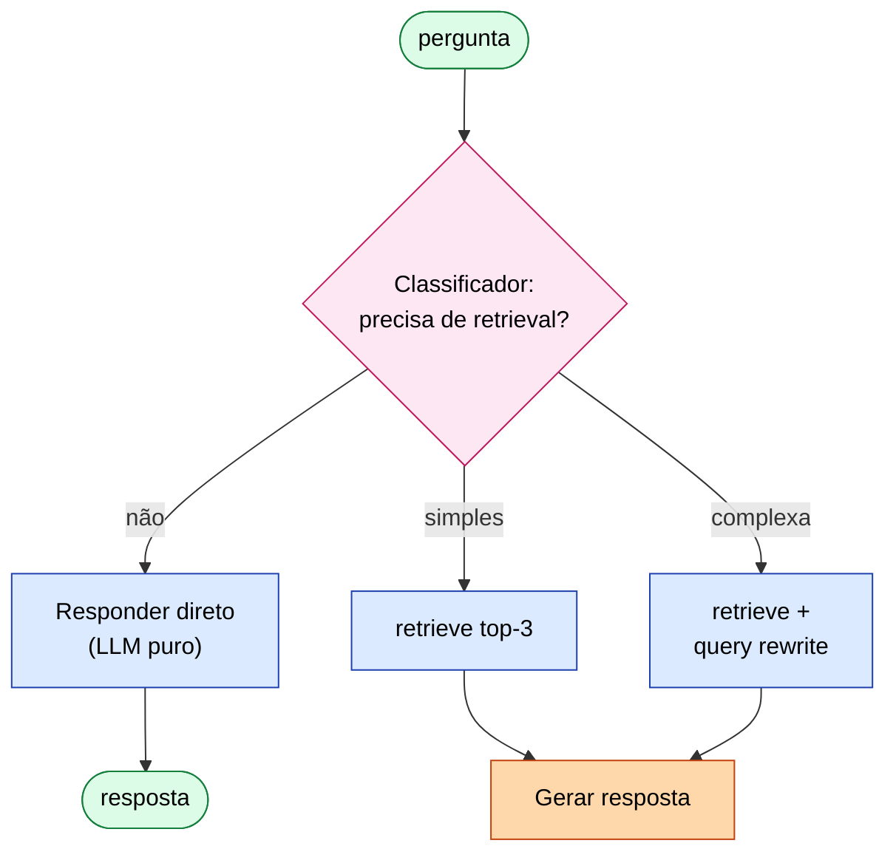
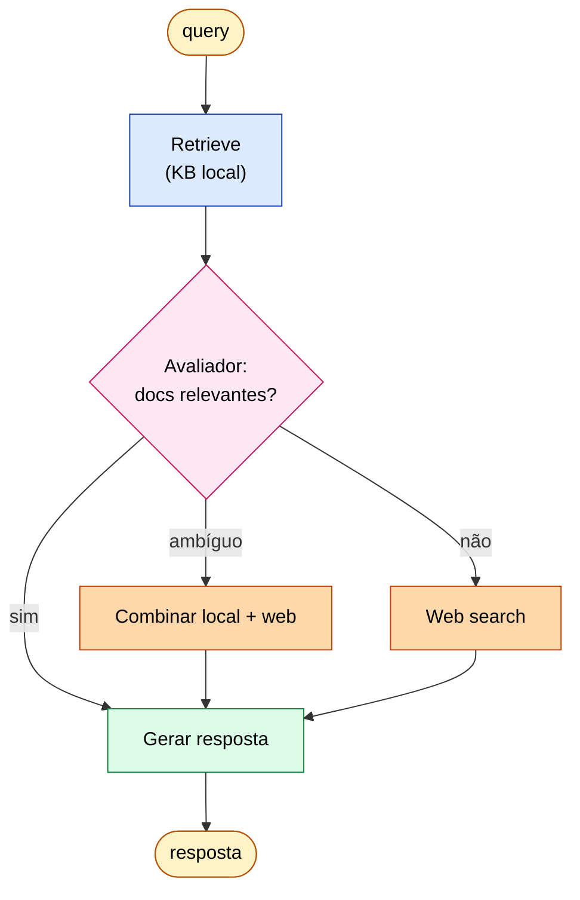
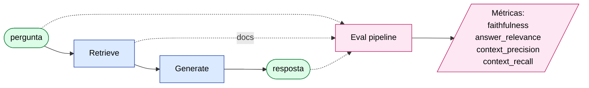

# ETHAGT06 — RAG Agêntico

> **Apostila do curso** · Especialização em Programação Agêntica · Universidade Etho
> Fase B — Razão, Memória e Conhecimento · Carga 30 h · Versão 1.0 · Julho 2026
> *Material de referência duradouro (nível pós-graduação lato sensu). Os slides são auxiliares.*

---

## Sumário

- **Capítulo 1** — Por que o RAG ingênuo falha
- **Capítulo 2** — Adaptive RAG
- **Capítulo 3** — Corrective RAG (CRAG)
- **Capítulo 4** — Self-RAG
- **Capítulo 5** — Agentic RAG
- **Capítulo 6** — Engenharia de qualidade
- **Capítulo 7** — Avaliação de RAG
- **Capítulo 8** — Casos de estudo
- **Capítulo 9** — Referências e leituras

---

## Capítulo 1 — Por que o RAG ingênuo falha

### 1.1 Do RAG ao RAG agêntico

Em ETHAGT01 (§2.2) introduzimos a distinção entre RAG *ingênuo* (recuperação estática, externa ao modelo) e RAG *agêntico* (o modelo decide quando e o que recuperar). Este módulo aprofunda essa distinção e evolui do baseline para sistemas onde o agente *dirige* a recuperação. A motivação é empírica: **o RAG ingênuo, embora simples, falha sistematicamente em casos que importam**, e a evolução para RAG agêntico é o caminho para robustez em produção.

### 1.2 O RAG ingênuo (baseline)

O **RAG original** (Lewis et al., *Retrieval-Augmented Generation*, NeurIPS 2020; arXiv:2005.11401) é simples: (1) parte o corpus em *chunks*, (2) computa um embedding por chunk, (3) armazena num vector store, (4) na consulta, embeda a pergunta, recupera os K chunks mais similares, (5) injeta no prompt e gera a resposta. Este pipeline fixo é o *naive RAG*.

> **Padrão:** [`15-RAG/naive-rag.md`](../../15-RAG/naive-rag.md).

### 1.3 Classes de falha do RAG ingênuo

Na prática, o naive RAG degrada em casos recorrentes:

- **Chunking ruim:** cortar no meio de uma ideia destrói o sentido; chunks grandes demais diluem a relevância.
- **Embedding errado:** um embedding genérico não captura jargão de domínio; sinônimos não casam.
- **Sem re-ranking:** os K recuperados por similaridade não são os mais *relevantes* — similaridade vetorial ≠ relevância.
- **Sem query rewriting:** a pergunta do usuário não é uma boa query de busca (coloquial vs termos do documento).
- **Sem avaliação:** sem métricas, você não sabe se o RAG está bom — só "parece funcionar".
- **Dados difíceis:** tabelas, multilíngue, multimodal — o naive RAG achata tudo em texto, perdendo estrutura.

### 1.4 O anti-pattern "vector DB resolve tudo"

A crença de que "jogue tudo num vector database e está resolvido" é o anti-pattern mais caro do RAG. Vector search é *uma* etapa de recuperação, não um sistema. A evolução para RAG agêntico consiste justamente em *adicionar inteligência ao redor* da recuperação: decidir *se* recuperar, *como* recuperar, *se o recuperado é bom*, e *corrigir* quando não é.

---

## Capítulo 2 — Adaptive RAG

### 2.1 Decidir quando e quanto recuperar

O primeiro salto além do naive RAG é a **adaptatividade**: nem toda pergunta precisa de recuperação, e nem toda recuperação precisa do mesmo esforço. O **Adaptive RAG** adiciona um *roteador* que decide:

- **Responder direto** (pergunta trivial, o modelo já sabe).
- **Recuperar uma vez** (pergunta factual simples).
- **Recuperar várias vezes / multi-hop** (pergunta complexa que exige combinar fontes).



Isso é, essencialmente, o padrão *routing* (ETHAGT03) aplicado à recuperação — classificando a complexidade da pergunta e roteando para o tratador adequado.

### 2.2 Implementação

```python
def adaptive_rag(pergunta):
    complexidade = classificador(pergunta)   # "trivial" | "simples" | "complexa"
    if complexidade == "trivial":
        return llm(pergunta)                 # sem recuperação
    if complexidade == "simples":
        docs = retrieve(pergunta, k=3)
        return llm(pergunta, context=docs)
    return agentic_rag(pergunta)             # multi-hop (Capítulo 5)
```

### 2.3 Por que adaptar

Adaptar economiza custo e latência nas perguntas triviais (não recupera desnecessariamente) e melhora qualidade nas complexas (recupera mais/iterativamente). O trade-off é a qualidade do classificador: se ele erra a complexidade, o sistema erra o esforço. Meça a acurácia do roteador isoladamente.

---

## Capítulo 3 — Corrective RAG (CRAG)

### 3.1 Avaliar e corrigir o recuperado

O **Corrective RAG** (Yan et al., *Corrective Retrieval Augmented Generation*, ICML 2024; arXiv:2401.15884) adiciona uma etapa crucial: depois de recuperar, *avalie* se os documentos são relevantes antes de usá-los. Se não forem, *corrija* — tipicamente, buscando em uma fonte alternativa (web).



### 3.2 Os três caminhos

O CRAG classifica os documentos recuperados em três estados e age conforme:

1. **Correto (relevante):** refina (extrai as partes mais úteis) e usa.
2. **Ambíguo:** usa parte + complementa com busca na web.
3. **Incorreto (irrelevante):** descarta e busca na web como fallback.

```
   pergunta ──► retrieve(docs) ──► [avalia relevância] ──┬─ relevante: refina + usa
                                    │                     ├─ ambíguo: usa + web
                                    │                     └─ irrelevante: web only
```

### 3.3 O gatilho de fallback

A inovação conceitual do CRAG é tratar a recuperação como *falível* e ter um plano B. A busca na web como fallback amplia a cobertura para tópicos fora do corpus. Implementação: um avaliador (LLM ou modelo de relevância) pontua cada documento; abaixo de um limiar, aciona-se o fallback.

> **Padrão:** [`15-RAG/corrective-rag.md`](../../15-RAG/corrective-rag.md).

---

## Capítulo 4 — Self-RAG

### 4.1 O modelo decide recuperar e criticar

O **Self-RAG** (Asai et al., *Learning to Retrieve, Generate, and Critique through Self-Reflection*, ICLR 2024; arXiv:2310.11511) é a abordagem mais integrada: um modelo *treinado* para emitir *tokens de reflexão* que controlam todo o processo — decidir *se* recuperar, avaliar a *relevância* do recuperado, e *criticar* a própria resposta (grounding).

### 4.2 Tokens de reflexão

O Self-RAG original treina o modelo a emitir marcadores especiais:

- `[Retrieve]`: devo recuperar para esta pergunta?
- `[Relevant]`: o documento recuperado é relevante?
- `[Supported]`: a resposta é sustentada pelos documentos (sem alucinação)?

Esses tokens tornam o controle da recuperação *interno* ao modelo, não externo.

### 4.3 Adaptação por prompting

Como nem todos têm um modelo Self-RAG treinado, a adaptação prática é *simular* os tokens de reflexão via prompting: pedir ao modelo que, em cada passo, decida explicitamente se precisa recuperar, avalie a relevância do recuperado e verifique se a resposta é sustentada. É menos robusto que o modelo treinado, mas captura o espírito — e é acessível com qualquer modelo.

> **Padrão:** [`15-RAG/self-rag.md`](../../15-RAG/self-rag.md).

---

## Capítulo 5 — Agentic RAG

### 5.1 O agente dirige todo o processo

O **Agentic RAG** é o ponto de convergência: a recuperação deixa de ser um pipeline e vira um *conjunto de ferramentas* que um agente usa em loop. O agente *planeja* a busca (que fontes, que queries), *refina* queries com base no que encontra, *combina* fontes (multi-hop), e *decide parar* quando tem informação suficiente.

> **Padrão:** [`15-RAG/agentic-rag.md`](../../15-RAG/agentic-rag.md).

### 5.2 Multi-hop: cadeias de recuperação

Perguntas complexas exigem *múltiplos hops* de recuperação: a resposta à primeira busca gera uma subpergunta que exige outra busca. Ex.: "Quem dirigia o filme que ganhou o Oscar de 2023?" → hop 1: qual filme ganhou o Oscar 2023? → hop 2: quem dirigia esse filme? O agente encadeia recuperações, cada uma informada pela anterior.

```python
def agentic_rag(pergunta):
    agente = Agent(tools=[search_internal, search_web, search_kg], system=RAG_PROMPT)
    return agente.run(pergunta)   # o agente decide quantos hops, quando parar
```

### 5.3 Fontes múltiplas como ferramentas

No Agentic RAG, cada fonte é uma ferramenta distinta: busca interna (vector store), busca na web, consulta a knowledge graph (ETHAGT07), busca em SQL. O agente escolhe a fonte certa por tarefa — e aqui reaparece o princípio de ACI (ETHAGT02): descreva bem cada ferramenta de busca para o agente saber quando usar qual.

### 5.4 Trade-off

Agentic RAG é o mais flexível e preciso em casos complexos, mas também o mais caro e imprevisível (o caminho varia). Use-o quando a complexidade da pergunta justifica — para perguntas simples, Adaptive/naive RAG bastam com menos custo.

---

## Capítulo 6 — Engenharia de qualidade

Independente do padrão agêntico, a *qualidade* da recuperação depende da engenharia das etapas individuais. Este capítulo cataloga as técnicas de maior impacto.

### 6.1 Chunking inteligente

Como partir o corpus é decisivo. Estratégias:

- **Semântico:** partir por estrutura lógica (seções, parágrafos, headings), não por tamanho fixo — preserva sentido.
- **Hierárquico:** manter chunks pequenos *e* um resumo do contexto pai, para casar granularidade e contexto.
- **Late-chunking:** embedar o documento inteiro primeiro (contexto rico) e só depois particionar — captura contexto que o chunking precoce perde.
- **Contextual (Anthropic):** prefixar cada chunk com um resumo do documento de origem, ancorando o chunk no seu contexto.

### 6.2 Re-ranking

A recuperação vetorial traz candidatos *similares*, não necessariamente *relevantes*. Um **re-ranker** (Cohere Rerank, bge-reranker, Jina) reordena os candidatos por relevância, tipicamente com um cross-encoder mais preciso (e mais caro) que o retriever. O padrão típico: retrieve K grande (ex.: 20), re-rank para os top-N pequenos (ex.: 5).

### 6.3 Query rewriting e HyDE

A pergunta do usuário raramente é a query ideal de busca. Técnicas:

- **Query rewriting:** o LLM reescreve a pergunta em termos mais alinhados ao corpus.
- **HyDE** (Gao et al., *Hypothetical Document Embeddings*, arXiv:2212.10496): o LLM gera um documento *hipotético* que seria a resposta ideal, e busca por documentos *similares a esse documento hipotético* — casando por semântica da resposta, não da pergunta.

### 6.4 Hybrid search

Combinar busca **densa** (vetorial, boa em semântica) com busca **esparsa** (BM25/keyword, boa em termos exatos e nomes próprios). A combinação captura casos que cada uma sozinha perde (nomes de produtos, códigos, siglas não casam bem por embedding).

### 6.5 Multimodal

Para corpus com imagens e tabelas, o RAG precisa lidar com multimodalidade: embeddings de imagem (CLIP), recuperação de tabelas como texto estruturado, ou modelos multimodais que processam imagem+texto juntos. O naive RAG perde isso; o agêntico pode ter ferramentas especializadas por modalidade.

> **Padrões:** [`15-RAG/multimodal-rag.md`](../../15-RAG/multimodal-rag.md), [`15-RAG/graph-rag.md`](../../15-RAG/graph-rag.md).

---

## Capítulo 7 — Avaliação de RAG

### 7.1 Por que avaliar (e como)

Sem avaliação sistemática, "melhorar o RAG" é adivinhação. A avaliação de RAG mede *tanto a recuperação quanto a geração*, com métricas específicas. A falta de eval é um dos anti-patterns mais comuns — e o mais caro, porque esconde regressões.



### 7.2 As métricas canônicas (estilo Ragas)

| Métrica | Mede | Quando importa |
|---|---|---|
| **Faithfulness** (fidelidade) | A resposta é sustentada pelos documentos recuperados? (anti-alucinação) | Sempre — resposta sem grounding é inaceitável |
| **Answer relevance** | A resposta responde à pergunta? | Sempre |
| **Context precision** | Os documentos recuperados são relevantes? | Qualidade da recuperação |
| **Context recall** | Documentos relevantes foram recuperados? (cobertura) | Faltam informações? |

Um sistema RAG de qualidade visa, tipicamente, faithfulness ≥ 0.85 e context recall ≥ 0.80 (critério de sucesso do projeto deste módulo).

### 7.3 Frameworks e LLM-as-judge

Ferramentas como **Ragas**, **TruLens** e **DeepEval** implementam essas métricas, frequentemente usando *LLM-as-judge* (um LLM avalia outro). O LLM-as-judge tem vieses conhecidos (preferir respostas longas, inconsistência); mitigue com rubricas estruturadas, múltiplos juízes e validação contra rótulos humanos em amostra.

> **Padrão:** [`15-RAG/eval.md`](../../15-RAG/eval.md). ETHAGT12 aprofunda avaliação de agentes.

### 7.4 Dataset de holdout

Mantenha um conjunto de perguntas *rotuladas* (com a resposta esperada e os documentos relevantes) que *não* muda entre iterações. Esse *holdout* permite detectar regressões: se você muda o chunking e a faithfulness cai, você sabe. Sem holdout estável, as métricas flutuam sem significado.

---

## Capítulo 8 — Casos de estudo

### 8.1 RAG enterprise em assistentes

Os casos de produção (assistentes de documentação enterprise, suporte) mostram que o salto de naive para agêntico RAG é o que torna o sistema *confiável*: a correção (CRAG) evita respostas baseadas em documentos irrelevantes; o agentic multi-hop resolve perguntas que exigem combinar fontes. A lição recorrente: **a recuperação é o gargalo de qualidade — investir nela paga mais que escalar o modelo.**

> **Leitura.** Detalhes em [`09-CaseStudies/`](../../09-CaseStudies/).

### 8.2 GraphRAG: do local ao global

O **GraphRAG** (Edge et al., Microsoft, 2024; arXiv:2404.16130) usa um knowledge graph extraído do corpus como camada de recuperação, permitindo responder perguntas *globais* ("quais os temas principais deste corpus?") que o RAG vetorial não consegue — porque não há chunk específico que as responda. É o tema de fronteira que ETHAGT07 aprofunda.

### 8.3 Lições transversais

1. **Recuperação é o gargalo.** Mais engineering na recuperação que no modelo.
2. **Sem eval, não há RAG confiável.** Meça sempre.
3. **Agência traz correção.** Deixar o agente avaliar e corrigir a recuperação é o caminho para robustez.

---

## Capítulo 9 — Referências e leituras

### 9.1 Bibliografia fundamental

- **Lewis, P. et al.** *Retrieval-Augmented Generation.* NeurIPS 2020. arXiv:2005.11401. 🏛 — RAG original.
- **Asai, A. et al.** *Self-RAG.* ICLR 2024. arXiv:2310.11511. 🏛
- **Yan, S. et al.** *Corrective RAG (CRAG).* ICML 2024. arXiv:2401.15884. 🏛
- **Edge, D. et al.** *GraphRAG: From Local to Global.* Microsoft, 2024. arXiv:2404.16130. 🏛

### 9.2 Bibliografia complementar

- **Gao, L. et al.** *HyDE.* arXiv:2212.10496.
- **Anthropic.** *Contextual Retrieval.* 2024.
- **Ragas** — <https://docs.ragas.io/>.

### 9.3 Recursos práticos

- **LangGraph examples:** `adaptive_rag`, `crag`, `self_rag`, `agentic_rag`.
- **Re-rankers:** Cohere Rerank, bge-reranker, Jina Reranker.
- **Biblioteca de padrões RAG:** [`15-RAG/`](../../15-RAG/) (8 padrões).

### 9.4 Ficha de pesquisa

Fontes em [`20-Research/ETHAGT06-pesquisa.md`](../../20-Research/ETHAGT06-pesquisa.md). Última consulta: Julho 2026.

---

## Síntese do módulo

Ao concluir ETHAGT06, você deve ser capaz de:

1. **Diagnosticar** as classes de falha do RAG ingênuo.
2. **Implementar** Adaptive RAG, CRAG, Self-RAG e Agentic RAG.
3. **Aplicar** engenharia de qualidade (chunking, re-ranking, query rewriting, hybrid search).
4. **Construir** um pipeline de avaliação (faithfulness, context recall/precision).
5. **Produzir** um sistema RAG multi-tenant seguro e avaliado.

Próximos passos: ETHAGT07 aprofunda knowledge graphs e vector databases como substrato de conhecimento; ETHAGT90 integra RAG agêntico no Capstone.

---

*Mantido por: Escola de Tecnologia — Universidade Etho · Área de Inteligência Artificial · Versão 1.0 · Julho 2026*
