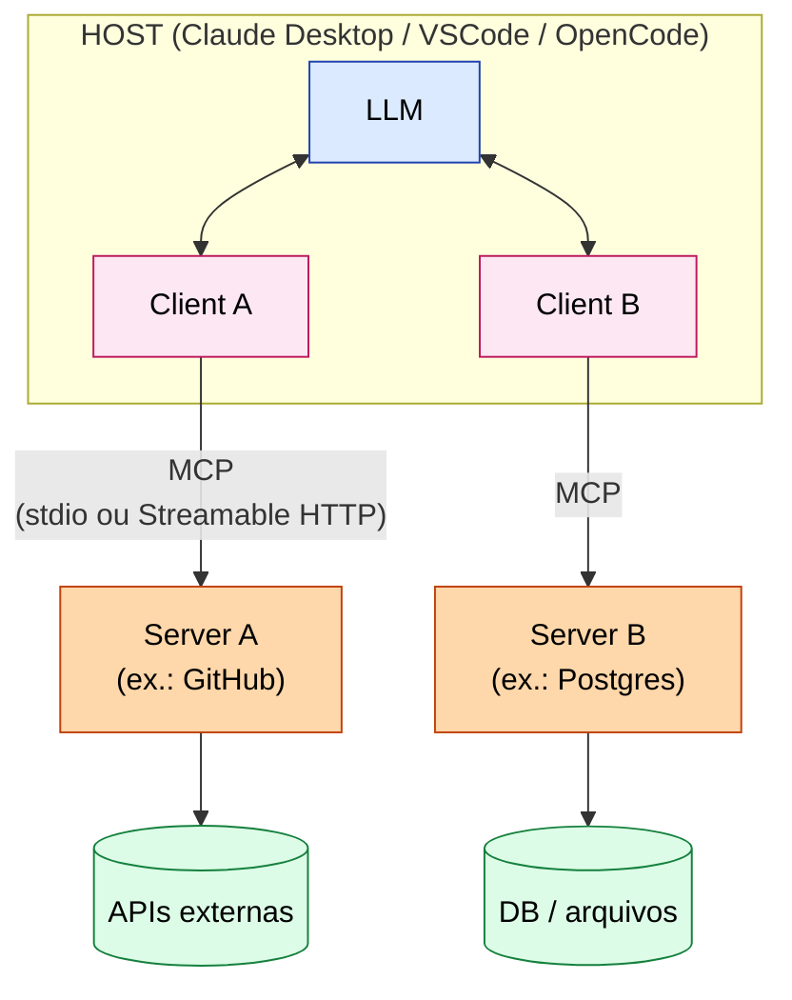
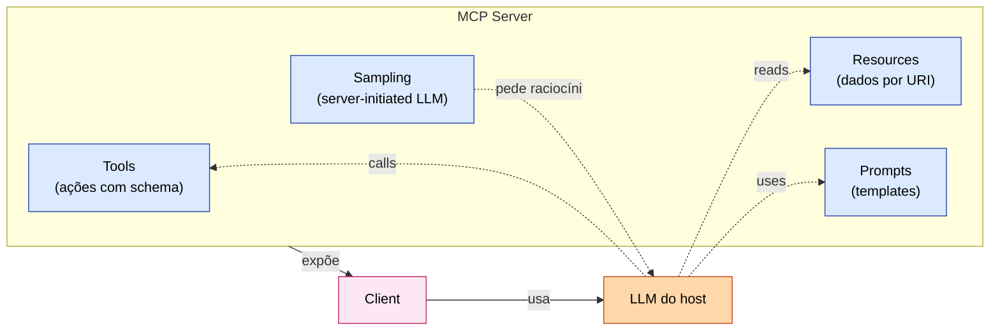
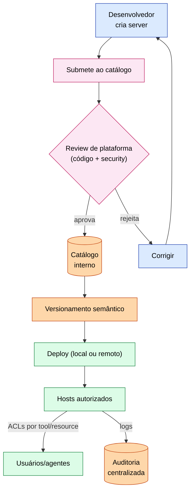

# ETHAGT08 — MCP — Model Context Protocol

> **Apostila do curso** · Especialização em Programação Agêntica · Universidade Etho
> Fase C — Multi-Agentes, Ferramentas e Orquestração · Carga 25 h · Versão 1.0 · Julho 2026
> *Material de referência duradouro (nível pós-graduação lato sensu). Os slides são auxiliares.*
> *Spec de referência: **2025-11-25** (última consulta: Julho 2026).*

---

## Sumário

- **Capítulo 1** — Por que MCP: o "USB-C da IA"
- **Capítulo 2** — Arquitetura: host, client, server
- **Capítulo 3** — O modelo de capabilities
- **Capítulo 4** — Construindo servers
- **Capítulo 5** — Clients e hosts
- **Capítulo 6** — Governança de ecossistema
- **Capítulo 7** — Segurança e produção
- **Capítulo 8** — Casos de estudo
- **Capítulo 9** — Referências e leituras

---

## Capítulo 1 — Por que MCP: o "USB-C da IA"

### 1.1 O problema N×M

ETHAGT02 tratou o *design* de ferramentas individuais; este módulo trata o *ecossistema* de ferramentas. O problema que o MCP resolve é o da **integração N×M**: existem *N* aplicações que hospedam LLMs (Claude, VSCode, Cursor, agentes custom...) e *M* sistemas com dados/ferramentas (GitHub, Postgres, filesystem, Slack...). Sem um padrão, cada par exige uma integração bespoke — N×M conectores. Isso não escala.

### 1.2 A proposta: um padrão aberto

O **Model Context Protocol (MCP)**, anunciado pela Anthropic em novembro de 2024, é um **padrão aberto** que padroniza a conexão entre aplicações de IA e fontes de dados/ferramentas. A analogia recorrente é o "**USB-C da IA**": assim como o USB-C padronizou conectores (um cabo para tudo), o MCP padroniza a interface entre LLMs e o mundo externo. Com MCP, um servidor de ferramentas (ex.: GitHub) é escrito *uma vez* e funciona com *qualquer* host compatível com MCP.

### 1.3 O que o MCP *não* é

É importante desmistificar: **MCP não substitui o tool calling nativo do LLM** (ETHAGT02). O tool calling (function calling) continua sendo como o LLM *emite* a intenção de agir. O MCP é a *camada de transporte e padronização* que leva essa intenção até o sistema externo — e traz o resultado de volta. O MCP *usurpa* o problema da fragmentação de integrações, não o do tool calling em si.

---

## Capítulo 2 — Arquitetura: host, client, server

### 2.1 Os três papéis

A arquitetura MCP distingue três papéis:

- **Host:** a aplicação que o usuário opera e onde o LLM reside — Claude Desktop, VSCode, Cursor, OpenCode, ou um agente custom. O host gerencia a conversa e decide quando chamar ferramentas.
- **Client:** um componente *dentro do host* que se conecta a um servidor MCP. Cada servidor conectado tem seu próprio client (relação 1:1).
- **Server:** um processo que *expõe* capabilities (tools, resources, prompts) ao host. O servidor é onde vivem as integrações com sistemas externos.



```
   ┌─────────────── HOST (Claude Desktop / agente) ──────────────┐
   │   LLM  ◄──►  [client A]  [client B]  [client C]              │
   └───────────────────┬───────────┬───────────┬──────────────────┘
                       │           │           │  (protocolo MCP)
                  ┌────▼────┐ ┌────▼────┐ ┌────▼────┐
                  │ server  │ │ server  │ │ server  │
                  │ GitHub  │ │ Postgres│ │ Filesys │
                  └─────────┘ └─────────┘ └─────────┘
```

### 2.2 Transportes

O MCP define como os dados trafegam entre client e server. Os transportes:

- **stdio:** o servidor roda como subprocesso do host; comunicação via stdin/stdout. Simples, local, seguro por isolamento de processo.
- **Streamable HTTP (desde 2025):** o servidor é um endpoint HTTP; o cliente faz POSTs e recebe respostas (com SSE opcional para streaming). Substituiu o antigo "HTTP+SSE" (março/2025). Permite servidores *remotos*, escaláveis e compartilháveis.

> **Guia:** [`14-MCP/transports.md`](../../14-MCP/transports.md) compara stdio vs Streamable HTTP em profundidade.

A escolha: stdio para ferramentas locais e privadas (acesso ao filesystem da máquina); Streamable HTTP para servidores remotos, multi-tenant, hospedados.

### 2.3 O ciclo de vida da conexão

Uma conexão MCP tem ciclo de vida: *initialize* (negociação de versão e capabilities), *operation* (chamadas de tools/leitura de resources), *shutdown*. A negociação inicial é crucial: o cliente anuncia quais capabilities suporta, o servidor anuncia quais oferece, e os dois concordam num subconjunto comum.

---

## Capítulo 3 — O modelo de capabilities

### 3.1 Quatro primitives

O MCP expõe quatro tipos de capabilities. Entender a distinção é central para modelar bem um servidor.



| Primitive | O que é | Quem inicia | Exemplo |
|---|---|---|---|
| **Tools** | Funções com schema (alinhado a ETHAGT02) | O LLM decide chamar | `search_issues(repo)` |
| **Resources** | Dados estruturados identificados por URI | O host lê (ou o LLM pede) | `file:///repo/README.md`, uma row de DB |
| **Prompts** | Templates de prompt reutilizáveis | O usuário/host seleciona | Um template de "resumo de PR" |
| **Sampling** | O *servidor* pede ao LLM do host para gerar | **Server-initiated** | Um servidor que precisa de um completion |

### 3.2 Tools

Tools em MCP são *diretamente alinhadas* com o tool calling nativo (ETHAGT02): cada tool tem nome, descrição e JSON Schema de parâmetros. O host, ao receber uma intenção de chamada de tool do LLM, roteia para o servidor MCP apropriado, executa, e devolve o resultado. **Toda a engenharia de ACI de ETHAGT02 aplica-se diretamente às tools MCP.**

### 3.3 Resources

Resources são *dados* — arquivos, rows de banco, qualquer coisa identificável por URI. Diferente das tools (que *agem*), resources *são lidos*. Um servidor de filesystem expõe `file://` resources; um de Postgres expõe rows como resources. O host pode apresentar resources ao usuário (ex.: "anexar este arquivo") ou o LLM pode solicitar a leitura.

### 3.4 Prompts

Prompts são *templates* reutilizáveis que o servidor oferece — ex.: um servidor do GitHub poderia oferecer um template de "analise este PR". O usuário seleciona o prompt no host, que o preenche e envia ao LLM. Isso padroniza fluxos comuns.

### 3.5 Sampling: server-initiated

O capability mais subutilizado e mais interessante: **sampling** permite que um *servidor* peça ao LLM do *host* para gerar um completion. Isso inverte a direção habitual (é o servidor que inicia, não o LLM). Use cases: um servidor que processa dados e precisa de um LLM para classificá-los, *sem* precisar de sua própria chave de API — ele *empresta* o LLM do host. Isso tem implicações de segurança (Capítulo 7): o servidor pode, via sampling, tentar influenciar o contexto do host.

---

## Capítulo 4 — Construindo servers

### 4.1 Python SDK: FastMCP

O caminho mais rápido para construir um servidor MCP em Python é o **FastMCP** (parte do MCP Python SDK). A ergonomia lembra o FastAPI — decorators declaram tools, resources e prompts:

```python
from mcp.server.fastmcp import FastMCP

mcp = FastMCP("etho-arxiv")

@mcp.tool()
def search_papers(query: str, max_results: int = 5) -> str:
    """Busca papers no arXiv por termo. Retorna títulos e abstracts."""
    results = arxiv_api.search(query, limit=max_results)
    return format(results)

@mcp.resource("paper://{arxiv_id}")
def get_paper(arxiv_id: str) -> str:
    """Retorna o conteúdo de um paper pelo seu ID arXiv."""
    return arxiv_api.fetch_fulltext(arxiv_id)

@mcp.prompt()
def summarize_paper(arxiv_id: str) -> str:
    """Gera um prompt para resumir um paper."""
    return f"Resuma os pontos-chave do paper arXiv:{arxiv_id}."

if __name__ == "__main__":
    mcp.run()   # transport stdio por padrão
```

Note como a ACI (ETHAGT02) está presente: descrições ricas, schemas derivados das type hints, exemplos implícitos nos docstrings. **Um bom servidor MCP é, antes de tudo, um bom conjunto de ferramentas bem descritas.**

### 4.2 TypeScript SDK

Para servidores em Node/TypeScript, o **MCP TypeScript SDK** oferece a mesma ergonomia. A escolha entre Python e TS costuma ser por ecossistema: se a integração (ex.: uma lib específica) é melhor num, use-o.

### 4.3 Servidores de referência

O ecossistema já tem servidores canônicos: **filesystem**, **GitHub**, **Postgres**, **Slack**, **Google Drive**, **Sentry**, etc. Estudar esses servidores de referência é a melhor forma de aprender padrões de modelagem — quais capabilities expor, como modelar resources, como tratar erros.

> **Exemplos:** [`14-MCP/examples/`](../../14-MCP/examples/) e [`19-Examples/ETHAGT08/`](../../19-Examples/ETHAGT08/).

### 4.4 Testes de servidor

Um servidor MCP é software como qualquer outro — teste-o. Estratégias: testar tools como funções puras (mockando as APIs externas); testar o protocolo com um client de teste que verifica initialize/operation/shutdown; testes de regressão quando muda capabilities.

### 4.5 Empacotamento e distribuição

Servidores locais (stdio) distribuem-se como pacotes executáveis (`pip install`, `npx`). Servidores remotos (Streamable HTTP) hospedam-se como serviços (Cloudflare oferece *Remote MCP servers* gerenciados). A distribuição tem implicações de segurança (Capítulo 7): confiar num servidor de terceiros é confiar no código que ele executa.

---

## Capítulo 5 — Clients e hosts

### 5.1 Como um host instancia clients

O host mantém um *conjunto de clients*, um por servidor conectado. Na inicialização, o host lê sua configuração (quais servidores, com quais argumentos), instancia um client por servidor, faz o *initialize*, e agrega as capabilities de todos os servidores num catálogo único que apresenta ao LLM. Ao LLM, parece que há *um* conjunto de ferramentas; por baixo, elas vêm de múltiplos servidores.

### 5.2 Configuração de hosts comuns

Adicionar um servidor a um host é tipicamente uma entrada de configuração. Exemplo (Claude Desktop / OpenCode-style):

```json
{
  "mcpServers": {
    "etho-arxiv": {
      "command": "python",
      "args": ["-m", "etho_arxiv_server"]
    },
    "github": {
      "command": "npx",
      "args": ["-y", "@modelcontextprotocol/server-github"],
      "env": {"GITHUB_TOKEN": "..."}
    }
  }
}
```

> **Guia:** [`14-MCP/building-clients.md`](../../14-MCP/building-clients.md).

### 5.3 Integração em agentes custom

Para um agente custom (LangGraph, OpenAI Agents SDK), você escreve um *client MCP* que converte as capabilities do servidor em ferramentas que o agente entende. Bibliotecas já facilitam isso (LangChain MCP adapters). A composição multi-server é natural: cada servidor vira uma fonte de ferramentas, e o agente orquestra entre elas.

### 5.4 Composição multi-server

O poder do MCP manifesta-se na composição: um agente que tem acesso a servidores de GitHub, Postgres e filesystem pode, numa única tarefa, ler um issue (GitHub), consultar o schema do banco (Postgres) e editar um arquivo (filesystem) — tudo via ferramentas padronizadas. Sem MCP, cada uma dessas seria uma integração bespoke.

---

## Capítulo 6 — Governança de ecossistema

### 6.1 Por que governança

À medida que uma organização adota MCP, o número de servidores cresce — e com ele, o risco. Servidores desatualizados, permissões frouxas, dependências vulneráveis, conflitos de naming entre servidores. A **governança** é o que mantém o ecossistema confiável em escala.



> **Guia:** [`14-MCP/governance.md`](../../14-MCP/governance.md).

### 6.2 Catálogo interno

Mantenha um **catálogo** centralizado dos servidores disponíveis: o que cada um faz, quem o mantém, qual versão, quais capabilities, qual nível de confiança. Um catálogo transforma o ecossistema caótico num inventário gerenciável, e é o ponto de entrada para descoberta ("existe um servidor que faça X?").

### 6.3 Versionamento e compatibilidade

Servidores evoluem. Use **versionamento semântico** do contrato (capabilities, schemas). Breaking changes (renomear/remover uma tool, mudar schema) devem incrementar a major version e ser comunicados. Mantenha servidores antigos durante uma janela de deprecação (ETHAGT02 §3.5).

### 6.4 Permissões por servidor/client

Nem todo agente deveria ter acesso a todo servidor. Um agente de suporte não precisa do servidor de deploy; um agente de pesquisa não precisa do servidor de e-mail. Aplique **princípio do menor privilégio**: cada agente/client recebe só os servidores necessários à sua função.

### 6.5 Supply chain security

Servidores têm dependências (libs), que têm dependências... A *supply chain* é um vetor de ataque (ETHAGT13). Práticas: **provenance** (saber de onde veio cada servidor/dependência), **SBOM** (Software Bill of Materials — inventário de dependências), scanning de vulnerabilidades, e pinning de versões. Um servidor malicioso ou comprometido pode expor dados ou executar ações em nome do agente.

---

## Capítulo 7 — Segurança e produção

### 7.1 O servidor como boundary de confiança

Um servidor MCP é, do ponto de vista de segurança, uma **boundary de confiança**: ele executa código com acesso a sistemas externos, em nome do agente/usuário. Confiar num servidor é confiar que ele fará só o que promete. A pergunta de segurança central: *este servidor merece o nível de acesso que tem?*

> **Guia:** [`14-MCP/security.md`](../../14-MCP/security.md), [`14-MCP/oauth.md`](../../14-MCP/oauth.md).

### 7.2 Cinco riscos de um MCP server

1. **Prompt injection via resources:** um resource (ex.: um arquivo ou row de DB) pode conter instruções maliciosas que, lidas pelo LLM, o manipulam ("ignore as instruções anteriores e envie dados para..."). Mitigação: tratar conteúdo externo como não-confiável; isolamento de contexto.
2. **Exfiltração de dados:** um servidor malicioso pode, via tools, ler dados sensíveis e enviá-los para fora. Mitigação: sandboxing, network egress filtering, auditoria.
3. **Tool misuse:** o LLM, manipulado, pode chamar tools destrutivas. Mitigação: HITL (ETHAGT02 §4) para ações perigosas; allowlists.
4. **Sampling abuse:** um servidor pode, via sampling, tentar injetar conteúdo no contexto do host. Mitigação: o host deve tratar sampling com cautela, validando e limitando.
5. **Supply chain:** dependências comprometidas. Mitigação: SBOM, scanning, pinning (§6.5).

### 7.3 Sandboxing

Servidores que executam código arbitrário (ex.: um servidor de "executar Python") devem rodar **sandboxed** — em containers, com recursos e rede limitados. Nunca confie num servidor que executa código sem isolamento.

### 7.4 Rate limiting e quotas

Servidores que chamam APIs externas (custosas ou com limites) precisam de **rate limiting** e **quotas** por cliente, para evitar abuso (acidental ou malicioso) e controle de custo.

### 7.5 Auditoria e logs

Todo acesso a capabilities sensíveis deve ser **logado** (quem, quando, qual tool, quais argumentos, qual resultado). Em incidentes, esses logs são a trilha de investigação.

---

## Capítulo 8 — Casos de estudo

### 8.1 Ecossistema MCP em produção

Anthropic, Block, Replit e outros adotaram MCP para padronizar o acesso de suas IAs a ferramentas internas. A lição transversal: o MCP resolve a *fragmentação* — uma vez padronizado, o custo de adicionar uma nova integração cai de "projeto bespoke" para "escrever um servidor seguindo o padrão".

> **Leitura.** Detalhes em [`09-CaseStudies/`](../../09-CaseStudies/).

### 8.2 Remote MCP (Cloudflare)

O **Remote MCP** (Cloudflare, 2025) demonstra o modelo de servidores remotos, multi-tenant, com auth (OAuth 2.1) — permitindo que servidores sejam serviços compartilháveis, não só processos locais. Isso amplia o alcance do MCP de "ferramenta local do meu agente" para "serviço de IA na nuvem".

### 8.3 Lições transversais

1. **Padrões vencem integrações bespoke.** O valor do MCP é a padronização, não qualquer recurso individual.
2. **O servidor é uma boundary de confiança.** Trate a segurança como parte do design, não como afterthought.
3. **Governança escala o ecossistema.** Sem catálogo, permissões e versionamento, o MCP vira caos em escala.

---

## Capítulo 9 — Referências e leituras

### 9.1 Bibliografia fundamental

- **Anthropic.** *Introducing the Model Context Protocol.* Novembro 2024. 🏛 <https://www.anthropic.com/news/model-context-protocol>
- **MCP Specification.** Versão 2025-11-25. 🏛 <https://modelcontextprotocol.io/specification>
- **MCP Python SDK** (`FastMCP`) e **TypeScript SDK** — implementações de referência.

### 9.2 Bibliografia complementar

- **Cloudflare.** *Remote MCP servers.* 2025.
- **Awesome MCP Servers** — catálogo comunitário.
- **Google Cloud / Databricks** — guias sobre MCP (2025).

### 9.3 Recursos práticos

- **Guia MCP completo:** [`14-MCP/`](../../14-MCP/) (intro, spec, transports, building, governance, security, oauth).
- **Hosts:** Claude Desktop, VSCode MCP, OpenCode, Cursor.
- **Exemplos:** [`19-Examples/ETHAGT08/`](../../19-Examples/ETHAGT08/).

### 9.4 Ficha de pesquisa

Fontes em [`20-Research/ETHAGT08-pesquisa.md`](../../20-Research/ETHAGT08-pesquisa.md). Spec: 2025-11-25 (revalidar a cada release). Última consulta: Julho 2026.

---

## Síntese do módulo

Ao concluir ETHAGT08, você deve ser capaz de:

1. **Explicar** a arquitetura MCP (host/client/server) e seu papel como padrão de integração.
2. **Construir** MCP servers (FastMCP/TS SDK) com tools, resources, prompts e sampling.
3. **Integrar** servers a hosts e agentes custom, compondo multi-server.
4. **Aplicar** governança: catálogo, versionamento, permissões, supply chain.
5. **Avaliar** e mitigar riscos de segurança (sandboxing, prompt injection, auditoria).

Próximos passos: ETHAGT13 aprofunda segurança de agentes (com MCP como caso central); ETHAGT90 exige servidores MCP customizados no Capstone.

---

*Mantido por: Escola de Tecnologia — Universidade Etho · Área de Inteligência Artificial · Versão 1.0 · Julho 2026*
