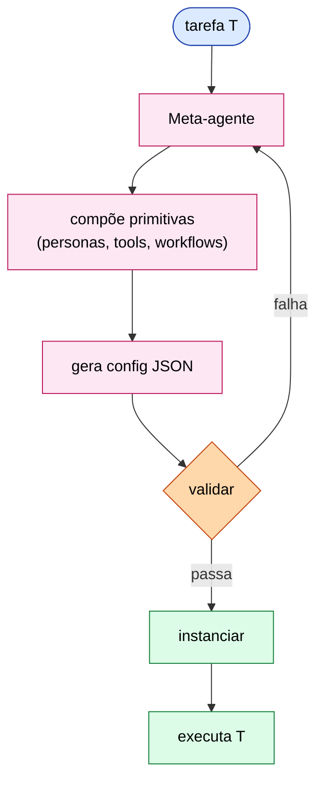
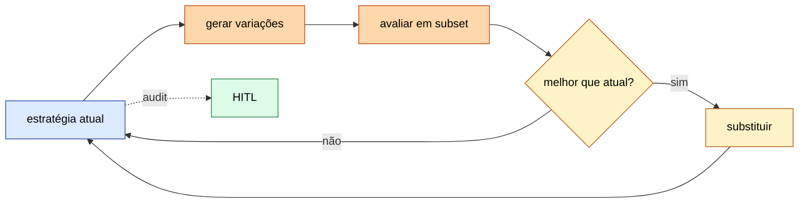
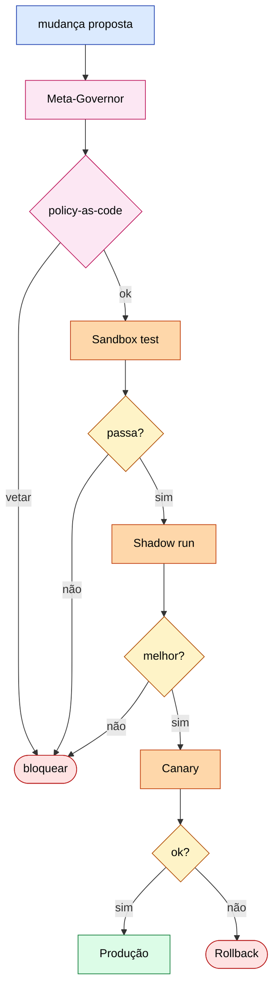

# ETHAGT15 — Meta-Agentes & Sistemas Autoaprendentes

> **Apostila do curso** · Especialização em Programação Agêntica · Universidade Etho
> Fase D — Produção, Governança e Fronteira · Carga 15 h · Versão 1.0 · Julho 2026
> *Material de referência duradouro (nível pós-graduação lato sensu). Os slides são auxiliares.*

---

## Sumário

- **Capítulo 1** — O que é meta-agência
- **Capítulo 2** — Geração de agentes
- **Capítulo 3** — Otimização automatizada
- **Capítulo 4** — Auto-aprendizado contínuo
- **Capítulo 5** — Riscos e governança
- **Capítulo 6** — Casos de estudo
- **Capítulo 7** — Referências e leituras

---

## Capítulo 1 — O que é meta-agência

### 1.1 Agentes que operam sobre agentes

A Fase D culmina na fronteira. Este módulo trata dos **meta-agentes**: agentes que criam, configuram, otimizam e evoluem *outros* agentes. É a aplicação recursiva da ideia de agência — em vez de um agente resolver uma tarefa, um agente *constrói o agente* que resolve a tarefa. A analogia é com a metaprogramação: assim como escrevemos código que escreve código, aqui escrevemos agentes que escrevem agentes.

### 1.2 Por que meta-agência

A motivação é prática: projetar agentes manualmente é *trabalho intensivo e frágil*. Um humano ajusta prompts, escolhe tools, calibra parâmetros — e o resultado é específico a uma tarefa. Um meta-agente pode *automatizar* esse processo: dado um objetivo e um conjunto de avaliação, ele busca a configuração de agente que melhor o atinge. Em domínios novos ou voláteis (onde a configuração ideal muda), a otimização automatizada supera o ajuste manual.

### 1.3 Três estratégias

| Estratégia | O que o meta-agente faz |
|---|---|
| **Synthesis** | Gera um agente novo (prompts, tools, topologia) para uma tarefa |
| **Evolution** | Evolui uma população de agentes, selecionando os melhores |
| **Optimization** | Otimiza componentes (prompts, descrições de tools) de um agente existente |

### 1.4 Risco vs benefício

A meta-agência é poderosa *e* perigosa. Um sistema que se auto-modifica pode *drift* (desviar-se do objetivo), *recursar* sem controle, ou introduzir vulnerabilidades. O Capítulo 5 trata a governança; por ora, registre o princípio orientador: **toda meta-agência precisa de cercas — orçamento, profundidade, vetos.** Meta-agência sem cercas não é poderosa, é perigosa.

---

## Capítulo 2 — Geração de agentes

### 2.1 O meta-agente como arquiteto

A forma mais direta de meta-agência: um **meta-agente arquiteto** que, dada uma descrição de tarefa, produz um agente especializado — escrevendo seu prompt de sistema, selecionando/compondo tools, e definindo sua topologia. O agente gerado é então *avaliado* antes de ser usado.



### 2.2 Templates e composição

A geração raramente é "do zero": o meta-agente trabalha com *templates* (esqueletos de agente) e *primitivas* (padrões de ETHAGT03/04) que compõem. Dada uma tarefa, ele seleciona o template apropriado, instancia as primitivas certas, e customiza. Isso é mais robusto que gerar tudo livremente — a composição de blocos testados reduz o espaço de falha.

### 2.3 Validação do agente gerado

O ponto crítico: um agente gerado *não deve ir a produção sem avaliação*. O meta-agente produz o agente; um pipeline de eval (ETHAGT12) o avalia contra um conjunto; só se passar, é deployado. Sem essa porta, a geração automatizada introduz regressões imprevisíveis. A regra: **confiança incremental** — sandbox, eval, canary, produção.

---

## Capítulo 3 — Otimização automatizada

### 3.1 Otimização de prompts: DSPy

O **DSPy** (Khattab et al., *DSPy: Compiling Declarative LLM Calls*, arXiv:2310.03714) é a ferramenta canônica de otimização automatizada de prompts. Em vez de escrever prompts manualmente, você declara o *pipeline* (passos e assinaturas) e um otimizador *compila* os prompts que maximizam uma métrica de avaliação. É o equivalente de um compilador para prompts: você descreve o *o quê*, o DSPy encontra o *como*.

```python
import dspy

class QAPair(dspy.Signature):
    question = dspy.InputField()
    answer = dspy.OutputField(desc="resposta concisa")

qa = dspy.ChainOfThought(QAPair)
otimizador = dspy.BootstrapFewShot(metric=resposta_correta)
qa_otimizado = otimizador.compile(student=qa, trainset=exemplos)
```

### 3.2 Promptbreeder e Meta-Prompting

Outras abordagens de otimização de prompts:

- **Promptbreeder** (Fernando et al., arXiv:2309.16797): evolução de prompts via mutação e seleção, tratando prompts como "genes".
- **Meta-Prompting** (Hu et al., arXiv:2311.11402): um meta-modelo que compõe múltiplos especialistas num único prompt eficaz.

### 3.3 Otimização de tools e topologia

A otimização não se limita a prompts:

- **Tools:** reescrever descrições de tools (ACI, ETHAGT02) para melhorar a taxa de uso correto — exatamente o que o workbench de ETHAGT02 mede, agora automatizado.
- **Topologia:** qual worker agregar a um sistema hierarchical? Qual padrão de workflow (ETHAGT03) se encaixa? Um meta-agente pode *experimentar* topologias e medir.

### 3.4 Quando otimizar automaticamente

A otimização automatizada vale quando:

- A tarefa tem um conjunto de avaliação confiável (sem métrica, não há o que otimizar).
- O volume justifica (o ganho se repete muitas vezes).
- O espaço de configuração é grande demais para explorar manualmente.

Quando a tarefa é única ou pequena, o ajuste manual é mais rápido.

---

## Capítulo 4 — Auto-aprendizado contínuo

### 4.1 Aprender com sucesso e falha

Um meta-agente pode *acumular aprendizado* ao longo do tempo: cada execução bem-sucedida reforça o que funciona; cada falha, uma lição (a memória de erros do Reflexion, ETHAGT04 §5, elevada a nível de sistema). Esse aprendizado é armazenado e consultado em futuras configurações.



### 4.2 Reflexion em nível de sistema

Em vez de um agente refletir sobre *sua* falha, o *sistema* reflete sobre *padrões* de falha: "nesta classe de tarefa, a topologia X falha consistentemente — troquemos por Y". É a meta-cognição do sistema: aprender não apenas a fazer a tarefa, mas a *configurar-se* melhor para a tarefa.

### 4.3 Strategy evolver

A evolução de estratégias (*strategy evolver*) mantém uma *população* de estratégias (configurações de agente), testa-as, e seleciona as melhores para "reproduzir" (com mutação). Gerações sucessivas melhoram — um algoritmo evolutivo aplicado à configuração de agentes.

### 4.4 Quando esquecer (drift)

Aprender tudo para sempre é prejudicial: o mundo muda, estratégias antigas ficam obsoletas, e memórias desatualizadas poluem o raciocínio. O sistema precisa de **políticas de esquecimento** (ETHAGT05 §3.4): decaimento de confiança em aprendizados antigos, invalidação quando o ambiente muda. O drift de *objetivos* (goal drift) — o sistema otimizando para algo que já não é o objetivo real — é um risco relacionado (Capítulo 5).

### 4.5 "Auto-aprendizado contínuo sempre melhora?"

Não. O auto-aprendizado pode *degradar* se: a métrica de avaliação for falha (otimiza para o errado), o ambiente mudar (aprendizados obsoletos), ou houver *overfitting* ao conjunto de avaliação (memoriza casos em vez de generalizar). A melhoria requer avaliação confiável, diversidade de casos e vigilância contra overfitting.

---

## Capítulo 5 — Riscos e governança

### 5.1 Recursão e auto-modificação

O risco mais característico da meta-agência: **recursão descontrolada**. Um meta-agente que cria agentes que criam agentes... pode explode em complexidade e custo. A defesa: *profundidade máxima* (limite de níveis de meta), *orçamento* (limite de agentes gerados), e *base cases* explícitos (critério de parada da recursão).



### 5.2 Goal drift

O sistema pode *drift* de objetivos: otimizar para a métrica de avaliação em vez do objetivo real (Goodhart's law — "quando uma métrica vira alvo, deixa de ser boa métrica"). Detecção: monitore divergência entre a métrica otimizada e indicadores independentes do objetivo real; revisões humanas periódicas da direção.

### 5.3 Meta-governor e vetos

Um padrão de governança robusto: um **meta-governor** — um componente (humano ou automático) que *audita* as modificações do meta-agente antes de aplicá-las, com poder de **veto**. Toda auto-modificação significativa passa pelo governor; alterações perigosas são vetadas. É a versão meta do HITL (ETHAGT13 §4).

### 5.4 Confiança incremental

Nenhum agente auto-gerado vai direto a produção. A *confiança incremental* é o caminho: sandbox (ambiente isolado) → eval (conjunto golden) → canary (fração do tráfego) → produção (com monitoramento contínuo). Cada etapa ganha confiança; qualquer regressão volta estágios.

### 5.5 Segurança: vetos e alinhamento

A auto-modificação introduz vetores de segurança novos: um meta-agente pode (intencionalmente ou não) gerar agentes que contornam salvaguardas. A defesa em profundidade de ETHAGT13 aplica-se, com ênfase em *allowlists* estritas para o que o meta-agente pode mudar (ex.: pode otimizar prompts, *não* pode mudar permissões de tools). O alinhamento de valores — garantir que o sistema otimize para o que *queremos*, não para o que *pedimos* — é um problema em aberto, mitigado (não resolvido) por supervisão humana.

---

## Capítulo 6 — Casos de estudo

### 6.1 Voyager: auto-skills no Minecraft

O **Voyager** (Wang et al., arXiv:2305.16291) é o caso canônico de auto-aprendizado: um agente que *aprende skills* no Minecraft — escreve código para uma skill, testa, e se funcionar, *armazena na biblioteca* de skills para reutilizar. Gerações de exploração acumulam capacidades. A lição: a *biblioteca de skills* (memória procedural, ETHAGT05 §5.4) é o que sustenta o aprendizado cumulativo — sem memória, cada geração recomeça do zero.

> **Leitura.** [`09-CaseStudies/`](../../09-CaseStudies/) e [`19-Examples/`](../../19-Examples/) (DSPy).

### 6.2 Lições transversais

1. **Meta-agência automatiza o trabalho intensivo** de projetar agentes — com ganho mensurável.
2. **Confiança é incremental.** Eval antes de deploy; sandbox antes de produção.
3. **Cercas são não-negociáveis.** Orçamento, profundidade, vetos, meta-governor.
4. **Overfitting e drift são inimigos.** Vigie a métrica e o objetivo.

---

## Capítulo 7 — Referências e leituras

### 7.1 Bibliografia fundamental

- **Khattab, O. et al.** *DSPy: Compiling Declarative LLM Calls.* arXiv:2310.03714. 🏛
- **Fernando, C. et al.** *Promptbreeder.* arXiv:2309.16797.
- **Hu, S. et al.** *Meta-Prompting.* arXiv:2311.11402.

### 7.2 Bibliografia complementar

- **Wang, G. et al.** *Voyager: An Open-Ended Embodied Agent with LLMs.* arXiv:2305.16291. 🏛 (auto-skills)
- **Park, J.S. et al.** *Generative Agents.* arXiv:2304.03442.

### 7.3 Recursos práticos

- **DSPy** docs; **Atlas**; **Promptbreeder** refs.
- **Exemplo runnable:** [`19-Examples/`](../../19-Examples/) (DSPy).

### 7.4 Ficha de pesquisa

Fontes em [`20-Research/ETHAGT15-pesquisa.md`](../../20-Research/ETHAGT15-pesquisa.md). Última consulta: Julho 2026.

---

## Síntese do módulo

Ao concluir ETHAGT15, você deve ser capaz de:

1. **Definir** meta-agência e suas estratégias (synthesis, evolution, optimization).
2. **Implementar** um sistema onde um agente gera/otimiza agentes, com validação antes de deploy.
3. **Aplicar** otimização automatizada (DSPy) de prompts/tools/topologia.
4. **Construir** auto-aprendizado contínuo com memória e esquecimento.
5. **Identificar** riscos (recursão, drift, segurança) e aplicar cercas (meta-governor, vetos).

Próximo passo: ETHAGT16 leva a meta-agência à escala de *sociedades* e sistemas de pesquisa autônoma — a fronteira final antes do Capstone.

---

*Mantido por: Escola de Tecnologia — Universidade Etho · Área de Inteligência Artificial · Versão 1.0 · Julho 2026*
