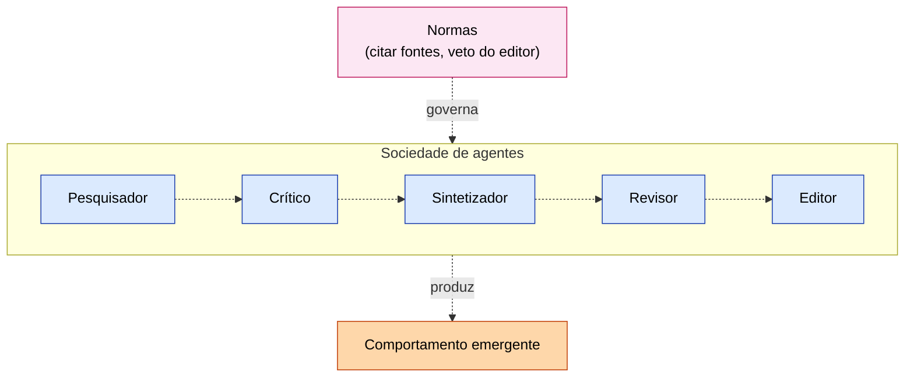
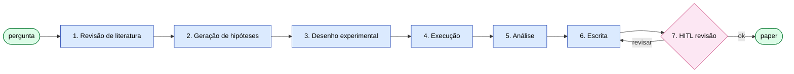
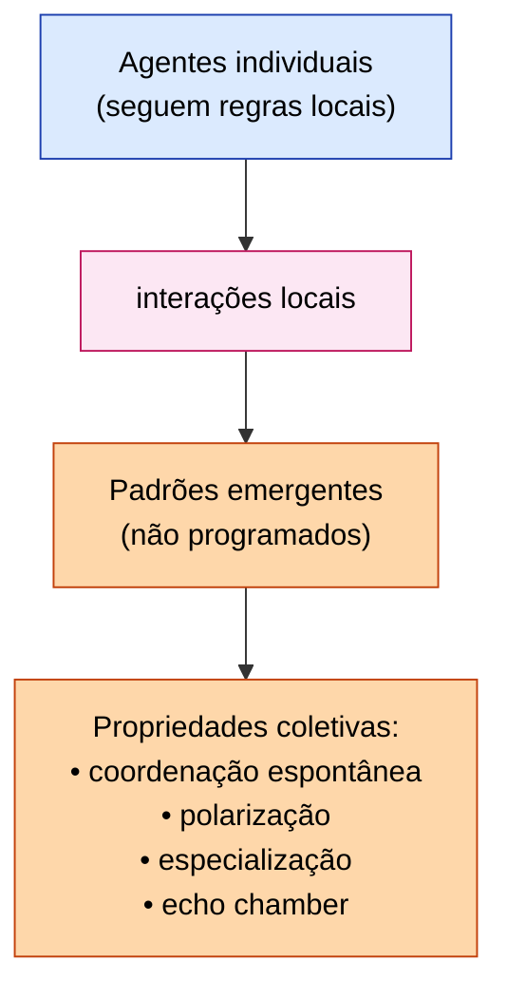

# ETHAGT16 — Sociedades de Agentes & Autonomous Research Systems

> **Apostila do curso** · Especialização em Programação Agêntica · Universidade Etho
> Fase D — Produção, Governança e Fronteira · Carga 15 h · Versão 1.0 · Julho 2026
> *Material de referência duradouro (nível pós-graduação lato sensu). Os slides são auxiliares.*

---

## Sumário

- **Capítulo 1** — Sociedades de agentes
- **Capítulo 2** — Simulações sociais
- **Capítulo 3** — Autonomous Research Systems
- **Capítulo 4** — Emergência e alinhamento
- **Capítulo 5** — Fronteira e ética
- **Capítulo 6** — Casos de estudo
- **Capítulo 7** — Referências e leituras

---

## Capítulo 1 — Sociedades de agentes

### 1.1 Da equipe à sociedade

ETHAGT09-10 trataram *equipes* de agentes — poucos, com papéis definidos, cooperando numa tarefa. Este módulo dá o salto para **sociedades**: sistemas com *muitos* agentes, interagindo de forma contínua, desenvolvendo *normas, reputação e instituições*. É a fronteira onde a multi-agência encontra a simulacra social e a pesquisa autônoma — e é o módulo que *diferencia* esta Especialização, cobrindo a fronteira do estado da arte.

### 1.2 Pequenos grupos → instituições → sociedades

Há uma escalada conceitual:

- **Pequenos grupos:** poucos agentes, cooperação direta (ETHAGT09).
- **Instituições:** agentes organizados em estruturas persistentes (papéis, hierarquias) — MetaGPT (ETHAGT10).
- **Sociedades:** populações de agentes com interação contínua, normas emergentes, economia e cultura.

A cada nível, novos fenômenos surgem — notadamente a **emergência** (Capítulo 4): comportamentos do todo que não estão em nenhuma parte.

### 1.3 Papéis, normas, reputação, confiança

Sociedades de agentes, como sociedades humanas, precisam de *mecanismos de coordenação em larga escala*:

- **Papéis:** quem faz o quê (especialização).
- **Normas:** regras compartilhadas de comportamento (explícitas ou emergentes).
- **Reputação:** histórico de cada agente — confiável ou não? A reputação guia com quem interagir.
- **Confiança:** construída (ou perdida) ao longo de interações repetidas.

Esses mecanismos permitem que sociedades de agentes *coordenem sem um supervisor central* — a coordenação é *distribuída*, emergente das interações.

### 1.4 Modelos de referência

Os modelos canônicos de sociedades de agentes: **Generative Agents** (Park et al., "Smallville"), **AgentVerse** (Chen et al.), **ChatArena**. Cada modela uma população de agentes com personalidades, memórias e interações, observando o que emerge.

---

## Capítulo 2 — Simulações sociais

### 2.1 O sandbox social (Smallville)

O experimento seminal é **Smallville** (Park et al., *Generative Agents*, UIST 2023; arXiv:2304.03442): 25 agentes virtuais numa vila, cada um com uma *persona*, *memória* (a memory stream de ETHAGT05 §7.1), e rotinas. Eles interagem, formam relações, planejam, e *comportamentos sociais emergem* — uma festa de São Patrício surge organicamente porque um agente convida outros. É a demonstração de que memória rica + agentes suficientes produzem *simulacra de comportamento social*.

### 2.2 Casos de uso

Simulações sociais têm aplicações potenciais:

- **Policy simulation:** simular o efeito de uma política numa população antes de implementá-la.
- **Market:** modelar dinâmicas de mercado com agentes consumidores/empresas.
- **Opinião pública:** como ideias se espalham e polarizam numa população.

### 2.3 Limites e críticas

As simulações sociais têm limites sérios que precisam ser honestos:

- **Validade ecológica:** agentes LLM *imitam* humanos, mas não *são* humanos. Extrapolá-los para previsão de comportamento humano real é arriscado — os vieses do modelo viram vieses da simulação.
- **Custo:** simular populações grandes é caro (muitos agentes, muita interação, muita memória).
- **Reprodutibilidade:** o não-determinismo torna resultados difíceis de reproduzir.

A regra: **simulações sociais são ferramentas exploratórias, não oráculos.** Use-as para *insight* e *geração de hipóteses*, não para previsão definitiva.

---

## Capítulo 3 — Autonomous Research Systems

### 3.1 O cientista de IA

A aplicação mais ambiciosa de sociedades de agentes é a **pesquisa autônoma**: um sistema que, dada uma pergunta, conduz o ciclo científico — revisão de literatura, formulação de hipótese, desenho e execução de experimento, análise, e redação de relatório — com supervisão humana mínima. É a fronteira que o Capstone desta Especialização integra.

### 3.2 O pipeline de pesquisa

Um sistema de pesquisa autônoma tipicamente segue:

1. **Pergunta:** o input (uma questão técnica ou científica).
2. **Revisão de literatura:** busca e síntese do estado da arte (Agentic RAG, ETHAGT06).
3. **Hipótese:** formulação de uma hipótese testável.
4. **Experimento:** desenho e execução (pode ser código, simulação, análise de dados).
5. **Análise:** interpretação dos resultados.
6. **Relatório:** redação com fontes e limitações.

Cada etapa pode ser um agente especializado, coordenados numa topologia (frequentemente hierarchical + orchestrator-workers, ETHAGT10).

### 3.3 Sistemas de referência

- **AI Scientist** (Sakana, Lu et al., arXiv:2408.06292): conduz descoberta científica aberta — gera ideia, código de experimento, executa, escreve paper. Demonstrou a viabilidade (com ressalvas sérias de qualidade).
- **AlphaEvolve** (DeepMind, 2024): evolui código/algoritmos via um ciclo evolutivo com avaliação automática.
- **Multi-agent research labs:** sistemas que estruturam a pesquisa como colaboração de especialistas (pesquisador, crítico, sintetizador, revisor, editor).

### 3.4 O que funciona e o que falha

A experiência acumulada mostra um padrão honesto:

- **Funciona:** síntese de literatura, geração de hipóteses plausíveis, automação de experimentos *bem-definidos*, redação estruturada.
- **Falha (ainda):** julgamento científico profundo, originalidade real, validação experimental rigorosa, reconhecimento de *quando a própria abordagem está errada*.

O AI Scientist, por exemplo, produz papers que *parecem* científicos mas frequentemente têm falhas que um revisor humano detectaria. A pesquisa autônoma é uma *ferramenta de amplificação* do pesquisador humano, não um substituto — por enquanto.

---

## Capítulo 4 — Emergência e alinhamento

### 4.1 Comportamento emergente

A característica fascinante e perigosa das sociedades de agentes é a **emergência**: comportamentos do *todo* que não estão em nenhuma *parte*. A festa de São Patrício em Smallville não foi programada — emergiu das interações. Em sistemas de pesquisa, insights podem emergir da colaboração que nenhum agente individual teria.

### 4.2 Quando a soma é diferente das partes

A emergência é o *potencial* das sociedades de agentes — mas também o *risco*. Comportamentos emergentes podem ser *benéficos* (insight, solução criativa) ou *deletérios* (polarização, coordenação para o objetivo errado, "mob behavior"). A questão central: *como garantir que o comportamento emergente seja alinhado com o que queremos?*

### 4.3 Alinhamento de valores em populações

O **alinhamento** — garantir que agentes ajam de acordo com valores e objetivos humanos — é desafiador num agente, e *mais* numa sociedade. Cada agente pode estar "alinhado" individualmente, mas a interação produz desalinhamento sistêmico. Mecanismos: normas compartilhadas (explicitamente alinhadas), supervisão (um agente/humano de oversight), e *constituições* (Constitutional AI aplicado ao nível da sociedade).

### 4.4 Avaliação de emergência

Como avaliar se o comportamento emergente é o desejado? Não basta avaliar cada agente — precisa avaliar o *sistema*. Isso é difícil: a emergência é, por definição, não-prevista. Estratégias: simulação extensiva (rodar muitas vezes, observar), métricas de nível sistêmico (convergência para o objetivo? distribuição de comportamentos?), e supervisão humana de amostras.

### 4.5 "Sociedades de agentes sempre convergem?"

Não. Podem *divergir* (polarização), *oscilar* (sem estabilidade), ou *convergir para o errado* (consenso em resposta incorreta). A convergência não é garantida — depende da topologia, das normas, e dos mecanismos de resolução de conflito (ETHAGT09 §5).

---

## Capítulo 5 — Fronteira e ética

### 5.1 Onde a pesquisa está agora

A fronteira (2026) move-se rapidamente: sistemas de pesquisa cada vez mais autônomos, simulações sociais mais ricas, meta-agentes mais capazes (ETHAGT15). Mas a *qualidade* do que produzem ainda fica aquém do humano experiente — a autonomia cresce mais rápido que a confiabilidade. Esta é a tensão central da fronteira.

### 5.2 Questões éticas

A pesquisa autônoma levanta questões éticas sérias:

- **Autoria:** quem é autor de um paper gerado por IA? O humano que supervisionou? A ferramenta? Ninguém?
- **Automação de pesquisa:** quais papéis científicos são automatizáveis, e o que isso significa para pesquisadores?
- **Integridade:** IA pode fabricar resultados plausíveis (alucinação) que poluem o registro científico. A verificação humana torna-se *mais* crítica, não menos.
- **Responsible AI:** sistemas autônomos poderosos exigem governança ainda mais rigorosa (ETHAGT13).

### 5.3 O que NÃO fazer

Há linhas que a ética e a prudência recomendam não cruzar:

- **Autopropagação:** sistemas que se replicam sem limite (vírus de agentes) — perigosos e irresponsáveis.
- **Sistemas sem supervisão em domínios de alto risco:** pesquisa autônoma em biologia, química perigosa, etc., sem oversight humano rigoroso.
- **Implantar comportamento emergente não-avaliado** em produção que afeta pessoas.

A regra da fronteira: **maior autonomia exige maior governança.** Não inverta essa relação.

---

## Capítulo 6 — Casos de estudo

### 6.1 AI Scientist (Sakana)

O **AI Scientist** é o caso de estudo mais instrutivo: demonstrou que o *ciclo completo* de pesquisa (ideia → código → experimento → paper) é automatizável — mas também que a *qualidade* é variável e frequentemente insuficiente sem revisão humana séria. A lição honesta: a autonomia é *demonstrada*, a confiabilidade é *o problema em aberto*.

> **Leitura.** [`09-CaseStudies/`](../../09-CaseStudies/) e Research KB ([`20-Research/`](../../20-Research/)).

### 6.2 Lições transversais

1. **A fronteira move-se rápido, mas a confiabilidade fica atrás.** Maior autonomia ≠ maior confiança.
2. **Emergência é potencial e risco.** Avalie o sistema, não só as partes.
3. **Pesquisa autônoma amplifica, não substitui.** O pesquisador humano é mais crítico, não menos.
4. **Maior autonomia exige maior governança.** Nunca inverta.

---

## Capítulo 7 — Referências e leituras

### 7.1 Bibliografia fundamental

- **Park, J.S. et al.** *Generative Agents: Interactive Simulacra of Human Behavior.* UIST 2023. arXiv:2304.03442. 🏛
- **Lu, C. et al.** *The AI Scientist: Towards Fully Automated Open-Ended Scientific Discovery.* Sakana, arXiv:2408.06292. 🏛
- **Chen, W. et al.** *AgentVerse.* arXiv:2308.10848. 🏛

### 7.2 Bibliografia complementar

- **DeepMind.** *AlphaEvolve.* 2024.
- **AutoGen** — aplicações de pesquisa.

### 7.3 Recursos práticos

- **Frameworks:** LangGraph, AutoGen, ambientes de simulação.
- **Exemplos:** [`19-Examples/`](../../19-Examples/).

### 7.4 Ficha de pesquisa

Fontes em [`20-Research/ETHAGT16-pesquisa.md`](../../20-Research/ETHAGT16-pesquisa.md). Revalidar a cada 6 meses (fronteira evolui rápido). Última consulta: Julho 2026.

---

## Síntese do módulo — e da Fase D

Ao concluir ETHAGT16, você deve ser capaz de:

1. **Modelar** sociedades de agentes (papéis, normas, reputação, confiança) e simulações sociais (com consciência dos limites).
2. **Construir** um protótipo de sistema de pesquisa autônoma (pergunta → relatório).
3. **Discutir** emergência, alinhamento e avaliação de sistemas multi-agente em escala.
4. **Conhecer** a fronteira (AI Scientist, AlphaEvolve, research labs) e suas questões éticas.
5. **Aplicar** o princípio: maior autonomia exige maior governança.

Com ETHAGT16, conclui-se a **Fase D** — e toda a formação dos 16 módulos. Você passou do bloco fundamental (Fase A), à razão/memória/conhecimento (Fase B), aos sistemas multi-agente coordenados (Fase C), e à produção rigorosa e fronteira (Fase D). O que resta é o **Capstone (ETHAGT90)**: integrar tudo numa plataforma de pesquisa autônoma — exatamente a fronteira deste módulo, em escala de projeto.

---

*Mantido por: Escola de Tecnologia — Universidade Etho · Área de Inteligência Artificial · Versão 1.0 · Julho 2026*
