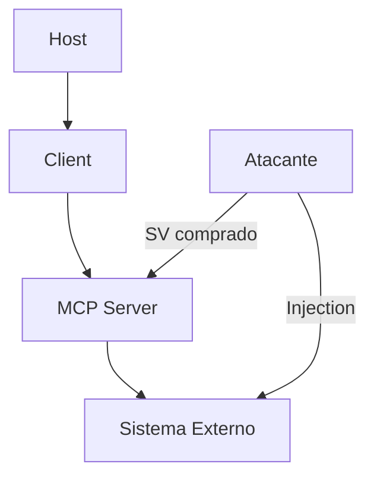

# Segurança MCP

> Riscos, mitigações e red team no ecossistema MCP.

## Principais Riscos

| Risco | Descrição | Mitigação |
|-------|-----------|-----------|
| Tool injection | Server malicioso expõe tools perigosas | Approval matrix + catálogo signed |
| Resource poisoning | Resource contém prompt injection | Input sanitization + guardian |
| Supply chain | Server comprometido via dependência | SBOM + checksums |
| Data exfiltration | Server coleta dados do host | Network isolation + audit |
| Induced action | Agente é induzido a chamar tool perigosa | HITL em tools write + guardian |

## Threat Model

## Boas Práticas

1. **Princípio do menor privilégio**: só tools necessárias
2. **Isolamento**: server em processo separado (container)
3. **Approval matrix**: tools write exigem aprovação humana
4. **Audit logging**: toda tool call registrada
5. **Red team regular**: testar injeção, exfiltração, escalação

## Referências
- ETHAGT13 — Segurança de Agentes
- MCP Security spec: [spec/modelcontextprotocol.io](https://modelcontextprotocol.io/specification)
