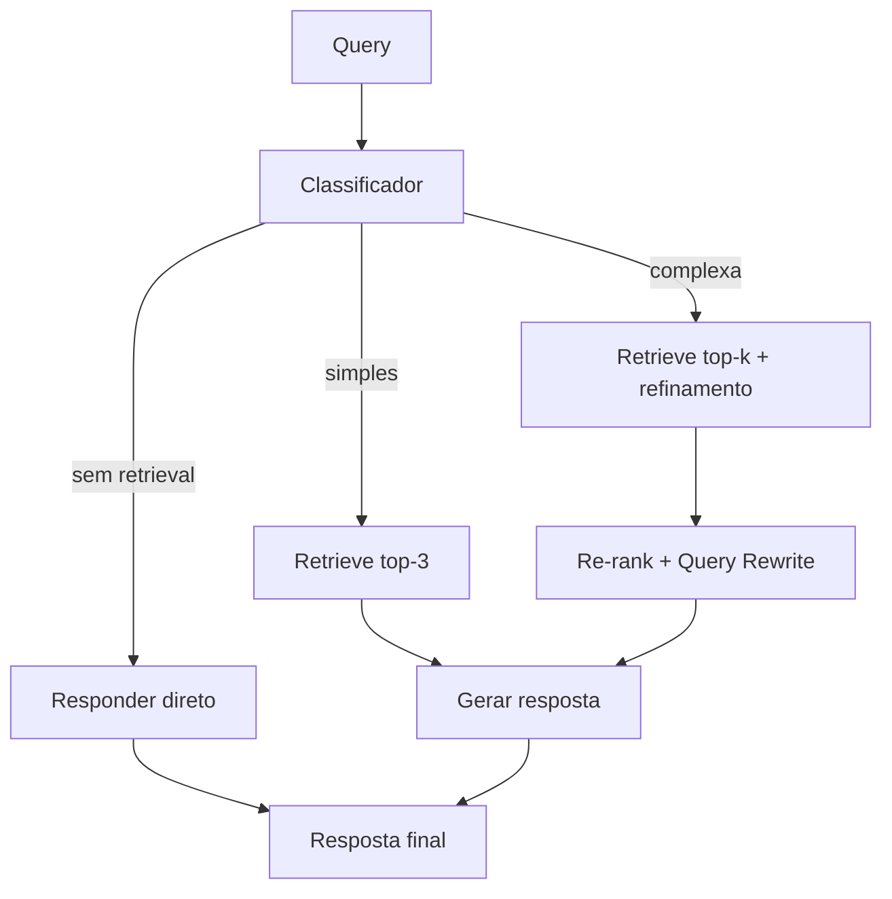

# Adaptive RAG

## Propósito

O sistema decide **se** deve recuperar documentos e **quantos** recuperar, com base na complexidade da pergunta. Substitui o pipeline fixo do Naive RAG por uma etapa de classificação que roteia a query para diferentes estratégias.

## Quando usar

- Volume alto de perguntas onde muitas **não** precisam de retrieval (e.g., saudações, perguntas sobre o sistema).
- Carga de queries com ampla variação de complexidade (desde factuais simples até analíticas).
- Cenários onde o custo de retrieval (latência + tokens) é significativo e deve ser otimizado.
- Assistentes que combinam conhecimento interno com capacidade de conversa geral.

## Arquitetura

## Fluxo passo a passo

1. **Classificação**: a query é analisada por um classificador (LLM few-shot, modelo tradicional ou heurística).
2. **Roteamento**:
   - *Sem retrieval*: responder com conhecimento do próprio modelo (saudações, meta).
   - *Simples*: retrieval top-3 direto, sem refinamento.
   - *Complexa*: retrieval expandido com re-ranking e/ou query rewrite.
3. **Execução**: a estratégia selecionada é executada.
4. **Geração**: o LLM produz a resposta com ou sem contexto recuperado.

## Implementação do classificador

- **LLM few-shot**: prompt com exemplos de cada categoria; flexível mas mais caro.
- **Modelo tradicional**: SVM, Random Forest ou rede rasa sobre embeddings da query.
- **Heurística**: regras simples — comprimento da query, presença de palavras-chave (e.g., "como", "o que é", "comparar").

## Considerações de implementação

- A classificação deve ser rápida (< 100ms idealmente) para não anular o ganho de evitar retrieval.
- O limiar entre "simples" e "complexa" deve ser calibrado com dados reais do domínio.
- É possível ter mais de 3 categorias (e.g., "análise", "sumarização", "comparação").
- LangGraph: `examples/rag/langgraph_adaptive_rag.ipynb`.

## Trade-offs e quando NÃO usar

- **Classificação errada**: um falso positivo (classifica como complexo o que é simples) aumenta custo sem benefício. Falso negativo degrada a resposta.
- **Domínio homogêneo**: se ~100% das perguntas precisam de retrieval, a classificação é overhead inútil.
- **Custo do classificador**: se o próprio classificador usa LLM, parte da economia se perde.
- **Mutabilidade**: as categorias e limiares precisam ser reavaliados conforme a base e o perfil de uso mudam.

## Referências-chave

- Jeong, S. et al. *Adaptive-RAG: Learning to Adapt Retrieval-Augmented Large Language Models through Question Complexity*. arXiv:2403.14403.
- LangGraph: `examples/rag/langgraph_adaptive_rag.ipynb`.
- Lewis, P. et al. *Retrieval-Augmented Generation*. NeurIPS 2020.
