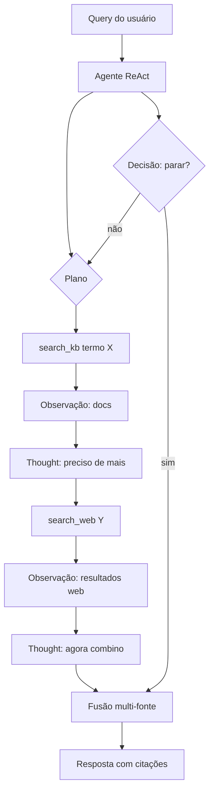

# Agentic RAG

## Propósito

Um **agente autônomo** dirige todo o processo de recuperação e geração: planeja a estratégia de busca, refina queries, decide quando parar, escolhe entre múltiplas fontes e combina resultados. É o extremo do espectro de controle do modelo sobre o pipeline de RAG.

## Quando usar

- Perguntas **multi-hop** que exigem encadeamento de facts de múltiplos documentos.
- Cenários com **múltiplas fontes heterogêneas** (vector DB + web search + SQL + APIs).
- Necessidade de **adaptação dinâmica**: o agente decide a estratégia conforme descobre o que precisa.
- Qualidade máxima é prioridade sobre custo e latência.

## Arquitetura

## Fluxo passo a passo

1. **Recepção**: o agente recebe a pergunta e elabora um plano inicial.
2. **Ciclo ReAct**: o agente executa ações de busca (KB, web, APIs), observa resultados e refina o plano.
3. **Multi-hop retrieval**: encadeia buscas — a resposta de uma busca vira query para a próxima.
4. **Decisão de parada**: o agente decide quando tem informação suficiente para responder.
5. **Combinação de fontes**: resultados de diferentes fontes são fundidos e deduplicados.
6. **Geração**: resposta final com citações e referências às fontes utilizadas.

## Considerações de implementação

- **Framework**: LangGraph (StateGraph com nós e arestas), CrewAI, AutoGen.
- **Ferramentas**: `search_kb` (vector DB), `search_web`, `calculate`, `sql_query`, `read_document`.
- **Memória**: o agente precisa manter estado do que já descobriu para não refazer buscas.
- **Limite de iterações**: definir max_steps para evitar loops infinitos e custos incontroláveis.
- **Observabilidade**: logs detalhados de cada passo (thought, action, observation).

## Trade-offs e quando NÃO usar

- **Custo**: cada ciclo ReAct gera múltiplos tokens de raciocínio + chamadas de ferramenta.
- **Latência**: perguntas simples demoram mais que em pipelines fixos.
- **Imprevisibilidade**: o número de passos varia; orçamento de tokens é difícil de estimar.
- **Casos simples**: perguntas factuais diretas — usar Naive ou Adaptive RAG é mais eficiente.
- **Manutenção**: a lógica do agente (prompts, ferramentas, limites) exige calibração contínua.

## Referências-chave

- Yao, S. et al. *ReAct: Synergizing Reasoning and Acting in Language Models*. ICLR 2023. arXiv:2210.03629.
- LangGraph: `examples/rag/langgraph_agentic_rag.ipynb`.
- Lewis, P. et al. *Retrieval-Augmented Generation*. NeurIPS 2020.
- Gao, L. et al. *HyDE: Precise Zero-Shot Dense Retrieval without Relevance Labels*. arXiv:2212.10496.
