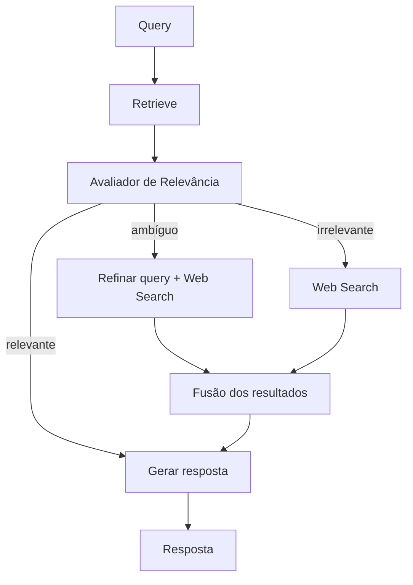

# Corrective RAG (CRAG)

## Propósito

Avaliar a **qualidade dos documentos recuperados** e tomar ações corretivas quando irrelevantes ou ambíguos. Proposto por Yan et al. (arXiv:2401.15884), CRAG adiciona um avaliador (*relevance judge*) entre o retrieval e a geração.

## Quando usar

- Base de conhecimento local pode estar desatualizada ou incompleta.
- Qualidade da resposta é crítica (e.g., jurídico, saúde, finanças).
- Há acesso a fontes alternativas (web search, APIs externas).
- O custo de fallback para web search é aceitável para o caso de uso.

## Arquitetura

## Fluxo passo a passo

1. **Retrieval**: busca inicial na base local (vector DB).
2. **Avaliação**: um LLM ou modelo treinado pontua cada documento recuperado por relevância em relação à query.
3. **Decisão**:
   - *Relevante* (score alto): prossegue para geração.
   - *Ambíguo* (score médio): refina a query e complementa com web search.
   - *Irrelevante* (score baixo): descarta docs locais, usa apenas web search.
4. **Fusão**: quando há múltiplas fontes, os resultados são combinados com deduplicação.
5. **Geração**: o LLM produz a resposta final usando o contexto consolidado.

## Implementação do avaliador

- **LLM-as-judge**: prompt que pede classificação binária (relevante/não) ou gradual (0–1).
- **Modelo especializado**: fine-tune de BERT ou RoBERTa para relevância (e.g., *T5 relevance scorer*).
- **Threshold**: definir cutoff para cada categoria com base em validação empírica.

## Considerações de implementação

- O avaliador adiciona latência e custo de LLM — essencial otimizar (modelos menores para avaliação).
- Web search pode ser substituído por outras fontes: APIs internas, SQL databases, conhecimento estruturado.
- A fusão de fontes requer cuidado com contradições entre documentos locais e web.
- CRAG pode ser combinado com Adaptive RAG (classificar antes de recuperar).

## Trade-offs e quando NÃO usar

- **Custo dobrado**: retrieval + avaliação + possível web search = latência e custo maiores.
- **Falsa correção**: avaliador mal calibrado pode descartar docs relevantes ou aceitar irrelevantes.
- **Web search imprevisível**: qualidade e disponibilidade da fonte externa não são garantidas.
- **Domínio estável**: se a base local é completa e atualizada, CRAG adiciona complexidade sem ganho.

## Referências-chave

- Yan, S. et al. *Corrective Retrieval Augmented Generation (CRAG)*. arXiv:2401.15884. ICML 2024.
- LangGraph: `examples/rag/langgraph_crag.ipynb`.
- Lewis, P. et al. *Retrieval-Augmented Generation*. NeurIPS 2020.
