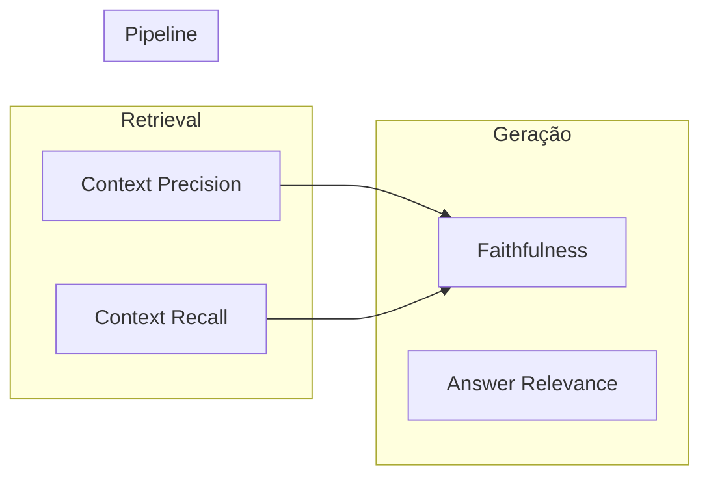

# Avaliação de RAG (RAG Evaluation)

## Propósito

Medir objetivamente a qualidade de um sistema RAG nas dimensões de **retrieval** e **geração**, identificar regressões entre versões e garantir que o sistema atende aos requisitos de negócio antes de ir para produção.

## Por que métricas específicas?

Métricas tradicionais (BLEU, ROUGE) não capturam falhas de RAG: um texto pode ter alta similaridade lexical com a resposta esperada mas conter alucinação, ou ser fluente mas irrelevante para a consulta.

## Métricas principais

### Retrieval

| Métrica | O que mede | Como |
|---|---|---|
| **Context Precision** | Os chunks recuperados são realmente relevantes? Proporção de chunks relevantes no top-k. | LLM-as-judge ou relevância binária anotada |
| **Context Recall** | O retrieval trouxe todos os chunks necessários para responder? | LLM verifica se cada claim da resposta pode ser rastreada aos chunks |
| **MRR** (Mean Reciprocal Rank) | O primeiro chunk relevante está no topo do ranking? | Posição do primeiro relevante |
| **nDCG** (Normalized Discounted Cumulative Gain) | Relevância graduada com desconto por posição | Scores de relevância com decaimento |

### Geração

| Métrica | O que mede | Como |
|---|---|---|
| **Faithfulness** | A resposta é fiel aos documentos recuperados? (sem alucinação) | LLM decompõe resposta em claims e verifica suporte nos docs |
| **Answer Relevance** | A resposta responde à pergunta do usuário? | LLM avalia se a resposta é pertinente e completa |

## Ferramentas

### Ragas
- Framework open source mais adotado.
- Implementa faithfulness, answer relevance, context precision e recall.
- Usa LLM-as-judge como oráculo.
- Suporta integração com LangChain, LlamaIndex.

### TruLens
- Foco em **observabilidade**: traces de cada etapa do pipeline.
- RAG Triad: Answer Relevance, Context Relevance, Groundedness (equivalente a faithfulness).
- Dashboard para visualização e debugging.

### DeepEval
- Testes unitários para LLM/RAG.
- Assertivas programáticas: `assert llm_output.contains("termo")`.
- Suporta métricas customizadas e integração CI/CD.

## LLM-as-Judge: vieses e mitigações

O uso de um LLM como avaliador é conveniente mas introduz vieses sistemáticos:

| Viés | Descrição | Mitigação |
|---|---|---|
| **Position bias** | Preferência pela primeira ou última opção | Rotação aleatória da ordem |
| **Verbosity bias** | Preferência por respostas mais longas | Controlar comprimento, usar rubricas curtas |
| **Self-preference** | Preferência por respostas do mesmo modelo | Usar judge diferente do gerador |
| **Style bias** | Preferência por formatação (markdown vs prosa) | Normalizar formato antes da avaliação |
| **Confirmation bias** | Concordar com a resposta do sistema | Avaliação cega (sem identificar o sistema) |

Estratégias de mitigação:
- **Múltiplos judges**: usar 3+ LLMs e agregar scores (votação majoritária ou média).
- **Rubricas explícitas**: critérios detalhados no prompt reduzem ambiguidade.
- **Calibração humana**: comparar scores do LLM-judge com anotação humana periódica.
- **Balanced Budget** (Kabir Soumik, 2026): combinar múltiplas estratégias de debiasing.

## Golden Dataset

Conjunto de holdout curado manualmente:

- 100–200 pares (pergunta, resposta ideal, chunks relevantes).
- Cobertura de casos típicos e borda (edge cases).
- Executado a cada mudança de pipeline (chunking, embedding, prompt, modelo).
- **Regression gate**: se métricas caem abaixo do threshold, o deploy é bloqueado.

## Considerações de implementação

- **Pipeline eval automatizado**: rodar golden dataset em CI (GitHub Actions, Jenkins).
- **Monitoramento contínuo**: logar faithfulness e relevance em produção para detectar drift.
- **Custo**: eval com LLM-as-judge é caro — usar modelos menores (e.g., GPT-4o-mini, Llama-3) como judge reduz custo.
- **Interpretabilidade**: métricas isoladas não contam a história completa — combinar com inspeção visual de exemplos.

## Trade-offs e quando NÃO usar

- **Eval sem golden dataset**: métricas isoladas podem dar falsa sensação de segurança.
- **LLM-as-judge sozinho**: sem calibração humana, vieses não detectados corrompem a avaliação.
- **Over-optimization**: otimizar cegamente para uma métrica pode degradar outras dimensões.
- **Custo do eval**: para protótipos iniciais, eval pode consumir mais recursos que o próprio sistema.

## Referências-chave

- Es, S. et al. *RAGAS: Automated Evaluation of Retrieval Augmented Generation*. arXiv:2309.15217.
- TruLens: [trulens.org](https://trulens.org)
- DeepEval: [docs.confident-ai.com](https://docs.confident-ai.com)
- Kabir Soumik, S. *Judging the Judges: A Systematic Evaluation of Bias Mitigation Strategies in LLM-as-a-Judge Pipelines*. TMLR 2026. arXiv:2604.23178.
- Zheng, L. et al. *Judging LLM-as-a-Judge with MT-Bench and Chatbot Arena*. NeurIPS 2023. arXiv:2306.05685.
