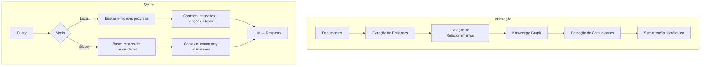

# Graph RAG

## Propósito

RAG sobre **knowledge graph**: documentos são transformados em um grafo de entidades, relacionamentos e comunidades, que são sumarizadas hierarquicamente. Proposto por Edge et al. (Microsoft, arXiv:2404.16130). Para perguntas que exigem visão global ou multi-hop, GraphRAG supera vector RAG tradicional.

## Quando usar

- Perguntas **globais** sobre o corpus: "Quais são os temas principais?", "Que tendências emergem?"
- Consultas **multi-hop** que exigem travessia de relações entre entidades.
- Datasets grandes (1M+ tokens) onde a recuperação por similaridade vetorial perde o panorama geral.
- Cenários onde a **estrutura relacional** dos dados é tão importante quanto o conteúdo textual.

## Arquitetura

## Fluxo passo a passo — Pipeline de construção (Microsoft GraphRAG)

1. **Extrair entidades**: LLM identifica pessoas, lugares, organizações, conceitos em cada chunk.
2. **Extrair relacionamentos**: LLM identifica pares (sujeito, predicado, objeto) entre entidades.
3. **Construir grafo**: entidades são nós, relacionamentos são arestas, textos originais são anexados.
4. **Detectar comunidades**: algoritmos de community detection (Leiden) agrupam entidades coesas.
5. **Sumarizar comunidades**: LLM gera relatórios de comunidade — descrições concisas do que cada grupo representa.
6. **Indexar**: embeddings de entidades, relacionamentos e community reports.

## Local Search vs Global Search

| Aspecto | Local Search | Global Search |
|---|---|---|
| **Entrada** | Query específica sobre entidade | Query temática/abrangente |
| **Método** | Embedding da query → entidades próximas → travessia | Reports de comunidade → resposta parcial por comunidade → sumarização |
| **Cobertura** | Subgrafo local ao redor das entidades | Toda a hierarquia de comunidades |
| **Custo** | Menor (um LLM call + graph traversal) | Maior (N calls para N comunidades + sumarização) |
| **Exemplo** | "O que a empresa X fez em 2024?" | "Quais tendências de IA emergiram?" |

## Considerações de implementação

- **Custo de indexação**: GraphRAG é computacionalmente caro na fase de construção do grafo (múltiplas chamadas de LLM).
- **Prompt tuning**: Microsoft recomenda auto-tuning dos prompts de extração para cada domínio.
- **Gleaning**: múltiplas passagens de extração para capturar entidades perdidas (configurável via `max_gleanings`).
- **DRIFT Search**: evolução que combina local e global search com custo reduzido (Microsoft, 2024).

## Trade-offs e quando NÃO usar

- **Custo proibitivo**: GraphRAG indexing pode ser inviável para equipes sem orçamento de LLM.
- **Complexidade operacional**: pipeline de construção tem múltiplas etapas e falhas intermediárias.
- **Query local simples**: para perguntas factuais diretas, vector RAG é mais barato e mais rápido.
- **Dados não-relacionais**: se o corpus não tem entidades e relações claras (e.g., logs, código), o grafo resultante é pobre.

## Referências-chave

- Edge, D. et al. *From Local to Global: A Graph RAG Approach to Query-Focused Summarization*. arXiv:2404.16130. 2024.
- Microsoft GraphRAG: [github.com/microsoft/graphrag](https://github.com/microsoft/graphrag)
- Microsoft Research: *Introducing DRIFT Search*. 2024.
- Traag, V. A. et al. *From Louvain to Leiden: guaranteeing well-connected communities*. Scientific Reports, 2019.
