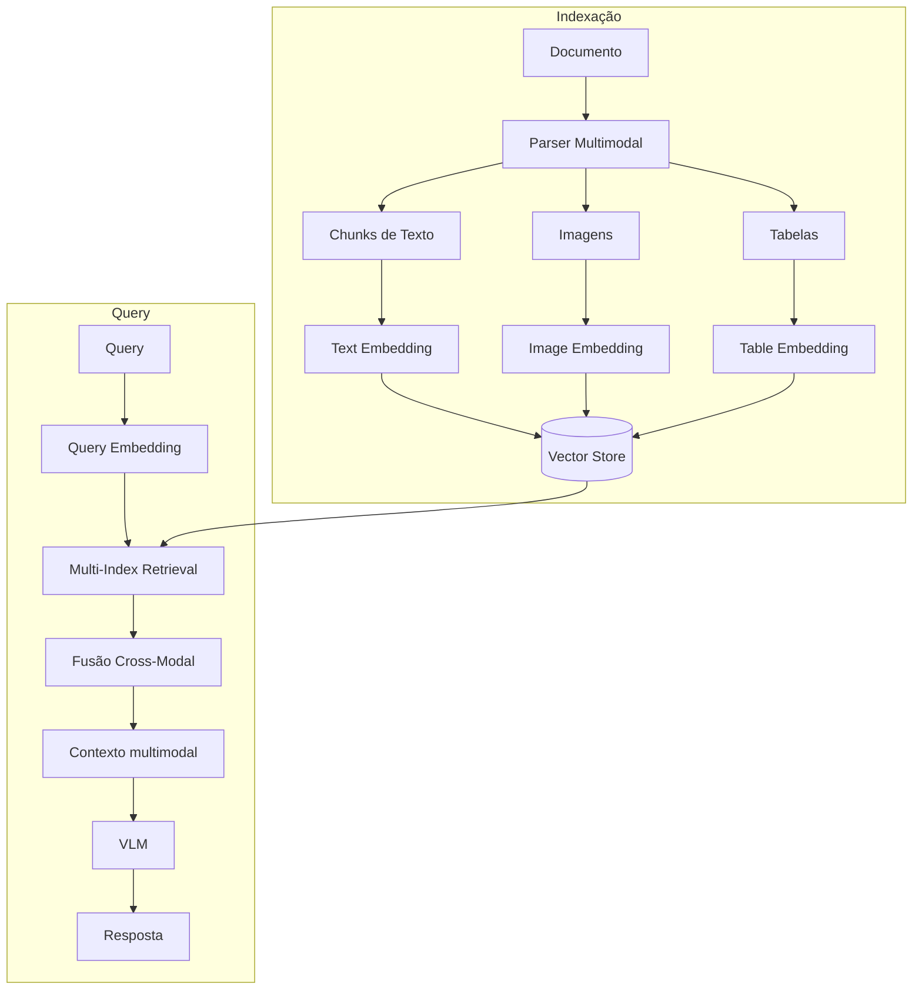

# Multimodal RAG

## Propósito

Estender o pipeline de RAG para recuperar e processar **múltiplas modalidades** além de texto: imagens, tabelas, diagramas, áudio e vídeo. O sistema indexa cada modalidade em um espaço vetorial compartilhado ou paralelo e alimenta um modelo de linguagem multimodal (VLM) para geração.

## Quando usar

- Documentos contêm **informação crítica em imagens** (gráficos, diagramas, screenshots, infográficos).
- **Tabelas complexas** que perdem estrutura quando convertidas para texto plano.
- Documentos scaneados (PDFs sem camada de texto) onde OCR não é suficiente.
- Catálogos de produtos com imagens que carregam informação não descrita em texto.
- Relatórios financeiros, manuais técnicos, prontuários médicos com exames de imagem.

## Arquitetura

## Fluxo passo a passo

1. **Parsing multimodal**: o documento é processado por um parser que extrai texto, imagens e tabelas como elementos separados.
2. **Extração**: cada modalidade é convertida em representação indexável:
   - Texto: chunking semântico.
   - Imagens: descrição via VLM (sumarização) OU embedding direto via CLIP/SigLIP.
   - Tabelas: serialização estruturada (JSON, HTML table) + embedding.
3. **Indexação paralela**: cada elemento é embedado e armazenado em vector store com metadados de tipo e fonte.
4. **Retrieval**: a query é embedada e busca-se nas dimensões de texto e imagem simultaneamente.
5. **Fusão cross-modal**: resultados de diferentes modalidades são combinados com scores normalizados.
6. **Geração**: um VLM (e.g., GPT-4V, Qwen3-VL) recebe o contexto multimodal e produz a resposta.

## Abordagens de embedding visual

| Abordagem | Descrição | Prós | Contras |
|---|---|---|---|
| **Sumarização via VLM** | Gera descrição textual da imagem e embeda o texto | Simples, usa stack existente | Perde detalhes visuais finos |
| **Embedding direto** | CLIP, SigLIP, ColPali — embeda imagem em espaço compartilhado | Preserva informação visual | Requer modelo específico |
| **Multi-vector** | LangChain MultiVector Retriever — summaries + chunks brutos | Flexível, bom para tabelas | Mais complexo de gerenciar |

## Considerações de implementação

- **Parser adequado**: ferramentas como Unstructured, Marker, Docling, PyMuPDF para extração robusta.
- **Custo de VLM**: descrever imagens via VLM na indexação é caro; embedding direto reduz custo.
- **Latência**: retrieval multimodal é mais lento que text-only (múltiplos índices, fusão de scores).
- **Armazenamento**: embeddings de imagem são maiores que text embeddings; planejar capacidade.

## Trade-offs e quando NÃO usar

- **Text-only suficiente**: se ~95% das perguntas são respondidas por texto, multimodal é overhead.
- **Custo alto**: parsing, VLM calls e armazenamento de imagem elevam significativamente o custo.
- **Qualidade do parser**: extração mal feita gera ruído em todas as modalidades.
- **Modelo gerador**: sem um VLM capaz de processar imagens, o retrieval multimodal não tem utilidade.

## Referências-chave

- Lewis, P. et al. *Retrieval-Augmented Generation*. NeurIPS 2020.
- Radford, A. et al. *CLIP: Learning Transferable Visual Models from Natural Language Supervision*. ICML 2021.
- LangChain: *Semi-Structured and Multi-Modal RAG* cookbook, 2024.
- Joshi, P. et al. *Robust Multi Model RAG Pipeline For Documents Containing Text, Table & Images*. ICAAIC, 2024.
- Lumer, E. et al. *Comparison of Text-Based and Image-Based Retrieval in Multimodal RAG*. arXiv:2511.16654, 2025.
