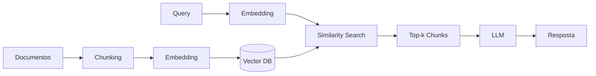

# Naive RAG

## Propósito

Linha de base (*baseline*) do paradigma RAG. Pipeline fixo e sequencial: chunking → embedding → retrieval top-k → geração. Sem adaptações, correções ou reflexão do modelo. Serve como ponto de partida para diagnóstico e comparação com padrões mais avançados.

## Quando usar

- Prototipagem rápida de provas de conceito.
- Domínios onde as perguntas são factuais e diretas (e.g., FAQ, documentação técnica bem estruturada).
- Bases de conhecimento com documentos homogêneos e bem formatados.
- Cenários onde latência é crítica e o custo computacional deve ser mínimo.

## Arquitetura

## Fluxo passo a passo

1. **Ingestão**: documentos são carregados e segmentados em chunks (tamanho fixo ou semântico).
2. **Indexação**: cada chunk é convertido em vetor via modelo de embedding (e.g., text-embedding-3-small, bge-base).
3. **Armazenamento**: vetores são indexados em vector database (e.g., Chroma, Qdrant, Pinecone).
4. **Retrieval**: a query do usuário é embedada e busca-se os top-k chunks mais similares (cosine similarity ou dot product).
5. **Augmentation**: os chunks recuperados são concatenados como contexto no prompt do LLM.
6. **Geração**: o LLM produz a resposta fundamentada nos chunks fornecidos.

## Considerações de implementação

- **Chunk size**: tipicamente 256–1024 tokens; depende do modelo de embedding e do contexto do LLM.
- **Overlap**: 10–20% entre chunks para evitar perda de contexto em bordas.
- **Top-k**: valores comuns entre 3 e 10; k muito alto introduz ruído.
- **Metadata**: anexar fonte, seção e timestamp a cada chunk para rastreabilidade.
- **Embedding model**: deve ser escolhido de acordo com o domínio (e.g., jurídico, médico, técnico).

## Trade-offs e quando NÃO usar

- **Perguntas multi-hop**: o pipeline fixo não itera; a resposta depende de um único retrieval.
- **Queries mal formuladas**: não há rewrite; a qualidade do retrieval depende da query original.
- **Retrieval irrelevante**: chunks ruins contaminam a geração sem chance de correção.
- **Base desatualizada**: não há fallback para fontes externas (web search).
- **Consultas que não precisam de retrieval**: o pipeline sempre executa, desperdiçando tokens e latência.

## Referências-chave

- Lewis, P. et al. *Retrieval-Augmented Generation for Knowledge-Intensive NLP Tasks*. NeurIPS 2020. arXiv:2005.11401.
- Gao, Y. et al. *Retrieval-Augmented Generation for Large Language Models: A Survey*. arXiv:2312.10997.
- Anthropic. *Contextual Retrieval*. 2024.
