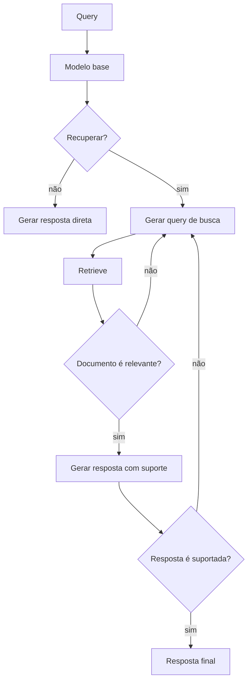

# Self-RAG

## Propósito

O próprio modelo — por meio de **tokens de reflexão** especiais (*reflection tokens*) — decide quando recuperar, qual query usar, se o documento recuperado é relevante e se a resposta gerada é suportada pelos documentos. Proposto por Asai et al. (arXiv:2310.11511).

## Quando usar

- Tarefas onde a **calibração da confiança** na resposta é crítica.
- Redução de alucinação: o modelo só responde quando há suporte documental.
- Cenários que exigem justificativa explícita das decisões de retrieval e geração.
- Aplicações onde o modelo precisa "pensar em voz alta" sobre o que sabe e o que precisa buscar.

## Arquitetura

## Fluxo passo a passo

1. **Decisão de retrieval**: o modelo emite um token `Retrieve` ou `NoRetrieve` com base na query.
2. **Geração de query**: se `Retrieve`, o modelo produz a query otimizada para busca.
3. **Retrieval**: busca na base com a query gerada.
4. **Avaliação de relevância**: token `IsRel` ou `NotRel` para cada documento.
5. **Geração**: resposta condicionada aos documentos relevantes.
6. **Autoavaliação**: token `IsSup` (suportado) ou `NotSup` (não suportado) valida a resposta.
7. **Iteração**: se `NotSup`, o modelo pode refazer o retrieval.

## Implementação

- **Self-RAG original**: fine-tune de um modelo (LLaMA, Mistral) com dados anotados com tokens de reflexão.
- **Self-RAG via prompting**: aproximação do comportamento sem fine-tune, usando instruções no prompt para que o modelo simule o ciclo de reflexão.

## Considerações de implementação

- O fine-tune requer dataset anotado com decisões de retrieval e relevância — caro de produzir.
- A abordagem via prompting é mais acessível mas menos robusta que o fine-tune.
- Os tokens de reflexão permitem interpretabilidade: é possível inspecionar cada decisão do modelo.
- Self-RAG adiciona latência devido às múltiplas chamadas ao modelo.

## Trade-offs e quando NÃO usar

- **Complexidade de treinamento**: fine-tune é inviável sem recursos e dados adequados.
- **Custo em inferência**: múltiplos ciclos de decisão aumentam tokens de saída e latência.
- **Overhead de prompting**: em modelos de API, forçar o padrão de reflexão é frágil e depende do obey do modelo.
- **Casos triviais**: perguntas simples onde retrieval é desnecessário — Self-RAG adiciona complexidade sem benefício.

## Referências-chave

- Asai, A. et al. *Self-RAG: Learning to Retrieve, Generate, and Critique through Self-Reflection*. arXiv:2310.11511. ICLR 2024.
- LangGraph: `examples/rag/langgraph_self_rag.ipynb`.
- Lewis, P. et al. *Retrieval-Augmented Generation*. NeurIPS 2020.
