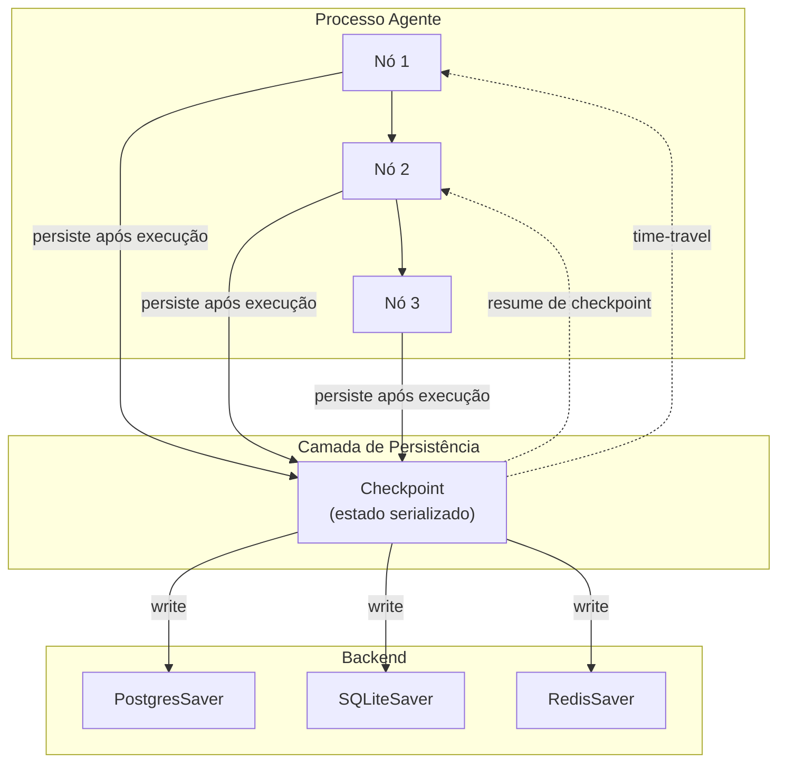

# Checkpointer — Persistência de Estado do Agente

O checkpointer é a **camada de persistência** que permite interromper, retomar, reproduzir e fazer time-travel na execução do agente.

## Quando usar

- Agentes que executam por horas ou dias (long-running)
- Human-in-the-loop (HITL) — pausar execução aguardando input humano
- Debug temporal — voltar a estados anteriores para explorar alternativas
- Resiliência — recuperar de falhas sem perder progresso

## Arquitetura



## Implementação

### Backends suportados

| Backend | Caso de uso | Características |
|---|---|---|
| `MemorySaver` | Desenvolvimento local | Nada persistente, apenas RAM |
| `SQLiteSaver` | Single-process, prototipação | Simples, zero configuração |
| `PostgresSaver` | Produção multi-process | Concorrência, transações ACID |
| `RedisSaver` | Baixa latência | Cache distribuído, alta velocidade |

### Serialização

O estado do agente deve ser **serializável**. Formatos comuns:

```python
# TypedDict (simples)
class AgentState(TypedDict):
    messages: list
    next_node: str

# Pydantic (validação)
class AgentState(BaseModel):
    messages: list[AnyMessage]
    next_node: str = "start"
    metadata: dict = {}
```

### Schema versioning

Estado evolui com o código. Sem versionamento, checkpoints antigos quebram:

```python
class AgentStateV1(BaseModel):
    state_version: int = 1
    messages: list[AnyMessage]

class AgentStateV2(BaseModel):
    state_version: int = 2
    messages: list[AnyMessage]
    user_profile: dict | None = None  # novo campo opcional
```

Estratégias:
- **Campos opcionais** com default — compatível com versões anteriores
- **Migração explícita** — script que lê V1, transforma em V2
- **Version tag** no checkpoint para rotear ao parser correto

## Considerações

- Serialização **deve ser consistente** — evite objetos não pickle-áveis
- Checkpoints frequentes aumentam custo de I/O — ajuste intervalo por nó
- Em multi-agente, cada agente pode ter seu próprio checkpointer isolado
- Time-travel exige que nodes sejam **puros** (determinísticos) para replay fiel

## Trade-offs

| Quando usar | Quando evitar |
|---|---|
| Agentes com estado complexo | Agentes stateless (consulta única) |
| Fluxos HITL | Pipelines batch sem pausa |
| Debug e auditoria necessários | Cenários onde performance de write é crítica |
| Long-running (> 1 min) | Micro-agentes efêmeros |

## Referências

- LangGraph Docs — *Persistence* (https://langchain-ai.github.io/langgraph/concepts/persistence/)
- LangGraph Checkpointer implementations: `MemorySaver`, `SqliteSaver`, `PostgresSaver`, `RedisSaver`
- ETHAGT05 Capítulo 3 — Checkpointer e estado persistente
