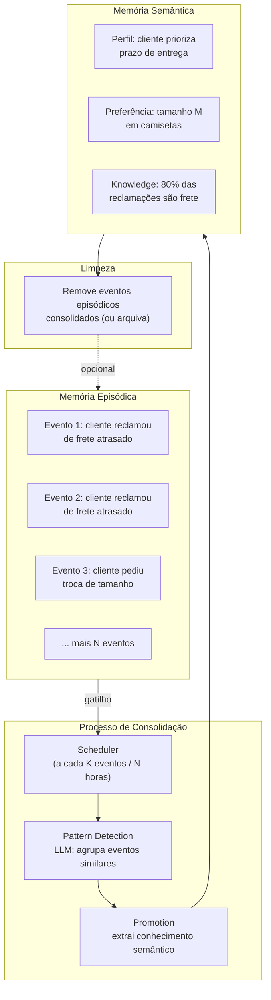

# Consolidation — Promoção de Memória Episódica para Semântica

Consolidação é o processo que **transforma eventos episódicos em conhecimento semântico reutilizável**, análogo ao papel do sono na memória humana.

## Quando usar

- Agentes que acumulam grandes volumes de eventos episódicos
- Necessidade de detectar padrões recorrentes no comportamento do usuário
- Redução do volume de memória episódica sem perder informações relevantes
- Sistemas que aprendem e se adaptam com o tempo

## Arquitetura



## Implementação

### Pattern detection

```python
def consolidate(episodic_events: list[Event]) -> list[SemanticFact]:
    # Agrupar por entidade
    by_entity = group_by(episodic_events, key="entities")

    facts = []
    for entity, events in by_entity.items():
        if len(events) < MIN_PATTERN_THRESHOLD:
            continue

        pattern = llm.invoke(
            f"Analise estes eventos sobre {entity}:\n{events}\n"
            f"Identifique padrões, preferências e fatos recorrentes:"
        )
        facts.append(SemanticFact(entity=entity, content=pattern))
    return facts
```

### Scheduling

A consolidação deve rodar **fora da hot path** da execução do agente:

- **Time-based**: a cada 24h (humano), a cada 1h (sistema crítico)
- **Event-count-based**: a cada N episódios (ex: 50)
- **Idle trigger**: quando o sistema está ocioso

```python
class ConsolidationScheduler:
    def __init__(self, interval_events=50):
        self.interval = interval_events
        self.last_count = 0

    def should_run(self, current_event_count):
        return (current_event_count - self.last_count) >= self.interval

    async def run(self, episodic_store, semantic_store):
        events = await episodic_store.get_unconsolidated()
        facts = consolidate(events)
        await semantic_store.bulk_insert(facts)
        await episodic_store.mark_consolidated(events)
        self.last_count += len(events)
```

### Episodic → Semantic promotion

A promoção extrai **knowledge statements** dos eventos:

| Eventos (episódica) | Conhecimento (semântica) |
|---|---|
| "reclamou do frete" x3 | "prioriza prazo de entrega" |
| "pediu tamanho M" x2 | "usa camiseta tamanho M" |
| "cancelou ao ver frete" x1 | "frete é fator de decisão" |

## Considerações

- **Threshold mínimo**: um evento isolado não deve virar conhecimento semântico
- **Revisão periódica**: conhecimento semântico também pode ficar obsoleto — precisa de eviction
- **Contexto temporal**: fatos podem ser time-bound ("em 2025 preferia X, agora prefere Y")
- **Custo**: consolidação usa LLM — agende em lote para amortizar custo

## Trade-offs

| Quando usar | Quando evitar |
|---|---|
| Agentes de longo prazo (semanas+) | Agentes de sessão única |
| Detecção de padrões necessária | Todos os eventos são únicos |
| Volume alto de eventos episódicos | Poucos eventos (< 100 total) |
| Aprendizado contínuo | Sistema com fatos estáticos |

## Referências

- ETHAGT05 Capítulo 5.3 — Consolidação episódica → semântica
- Tulving (1972) — base neurocientífica da consolidação
- Shinn et al. *Reflexion* (arXiv:2303.11366) — padrões de falhas como learning signal
- Kumaran et al. *The Neuroscience of Memory Consolidation* (Nature Reviews, 2016)
