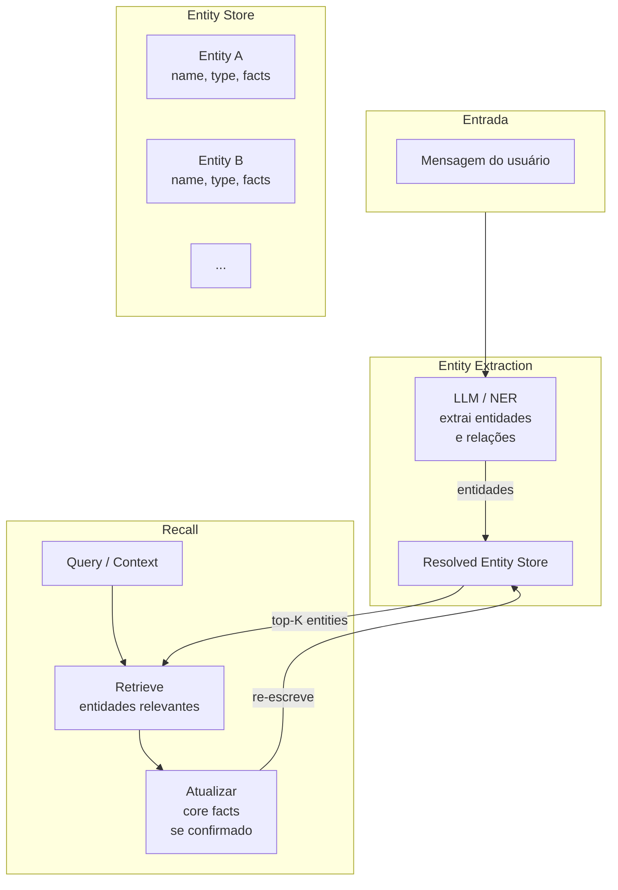

# Entity Memory — Memória Centrada em Entidades

Entity memory organiza o armazenamento em torno de **entidades** (pessoas, lugares, objetos, conceitos), mantendo um perhl estruturado e atualizável para cada uma, inspirado no MemGPT e Zep.

## Quando usar

- Agentes que interagem com múltiplos usuários e precisam lembrar preferências individuais
- Cenários com entidades mutáveis (perfil de usuário que evolui)
- Personagens persistentes em jogos ou simulacros (Generative Agents)
- Assistente pessoal com memória de longo prazo por contato/tópico

## Arquitetura



## Estrutura de entidade

```python
class Entity:
    id: str
    name: str
    type: str  # "user", "product", "location", "concept"
    facts: dict[str, str | list]  # { "preferencia": "vegano", "pedidos": ["ORD-1"] }
    relationships: list[Relation]  # [("comprou", Product), ("reclamou_de", Issue)]
    core_memory: str | None  # resumo comprimido (estilo MemGPT)
    updated_at: datetime
```

### Semântica de atualização

Diferente de vetores imutáveis, entity memory precisa de **update semantics**:

- **Core facts**: substituídos quando nova evidência conflita
- **Append-only list**: histórico de interações (cresce, não substitui)
- **Merge semântico**: LLM decide se novo fato contradiz ou complementa

```python
def update_entity(entity, new_fact):
    if entity.conflicts(new_fact):
        resolved = llm.invoke(
            f"Fato antigo: {entity.facts}\nNovo fato: {new_fact}\n"
            f"Resolva a contradição mantendo o mais recente:"
        )
        entity.facts = resolved
    else:
        entity.facts.append(new_fact)
```

## MemGPT approach

MemGPT trata o LLM como **OS com memória paginada**:

- **Core memory** (sempre em contexto): poucos KB por entidade principal
- **Archival memory** (disco): histórico completo, recuperado via recall
- **Page fault**: quando o LLM detecta que falta informação, ele mesmo invoca recall

## Zep approach

Zep oferece memória de longo prazo como **serviço**:

- Extração automática de entidades via NLP
- Graph memory conectando entidades por sessão
- API para adicionar, buscar e atualizar memórias

## Considerações

- **Extração de entidades**: usar NER clássico ou LLM — LLM é mais flexível, mas mais caro
- **Resolução de coreferência**: "ele" → "João" precisa ser resolvido antes de persistir
- **Privacidade**: entidades podem conter PII — redação obrigatória antes de armazenar
- **Consistência**: dois agentes podem atualizar a mesma entidade simultaneamente (race condition)

## Trade-offs

| Quando usar | Quando evitar |
|---|---|
| Perfis de usuário que evoluem | Dados puramente episódicos (logs) |
| Relações entre entidades importantes | Cenários com entidade única |
| Simulacros / jogos / personagens | Pipeline de dados batch |
| Assistente pessoal | Agente de busca única |

## Referências

- Packer et al. *MemGPT: Towards LLMs as Operating Systems* (arXiv:2310.08560)
- Park et al. *Generative Agents* (arXiv:2304.03442)
- Zep — *Long-term memory for AI assistants* (https://zep.ai)
- ETHAGT05 Capítulo 2 e 5 — Entity-centric memory
- Tulving (1972) — base da taxonomia de memória semântica
