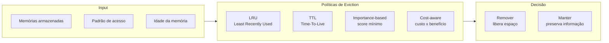
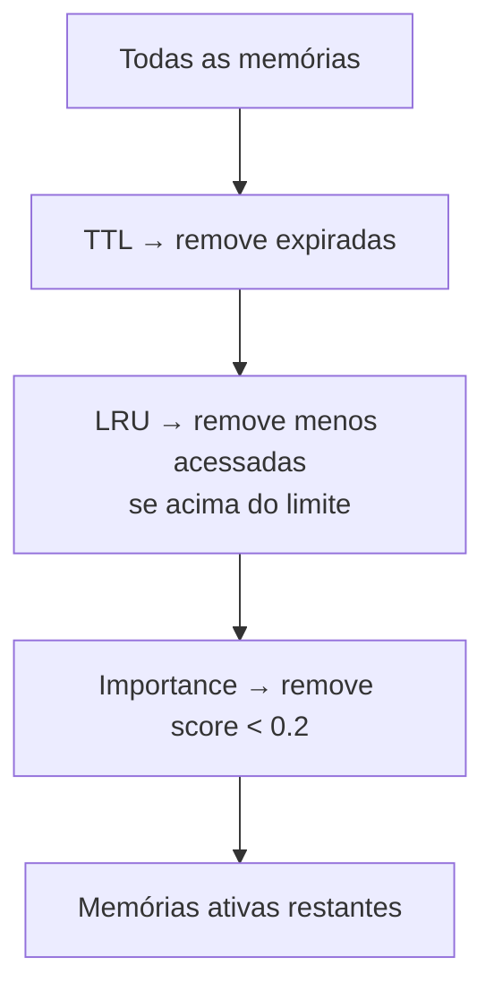

# Eviction — Políticas de Expurgo de Memória

Eviction define **quais memórias remover e quando**, evitando que o armazenamento cresça indefinidamente enquanto preserva informações de maior valor.

## Quando usar

- Armazenamento com capacidade limitada (vector DB, context window, cache)
- Memórias com relevância decrescente ao longo do tempo
- Conformidade regulatória (retenção máxima de dados)
- Otimização de custo de armazenamento e busca

## Taxonomia de políticas



### LRU — Least Recently Used

Remove memórias que não são acessadas há mais tempo.

```python
class LRUEviction:
    def __init__(self, max_size: int):
        self.max_size = max_size
        self.access_log: dict[str, datetime] = {}

    def on_access(self, memory_id: str):
        self.access_log[memory_id] = now()

    def evict(self) -> list[str]:
        if len(self.access_log) <= self.max_size:
            return []
        sorted_memories = sorted(
            self.access_log.items(),
            key=lambda x: x[1]
        )
        to_remove = sorted_memories[:len(sorted_memories) - self.max_size]
        return [m[0] for m in to_remove]
```

Adequado para: memória episódica com padrão de acesso temporal localizado.

### TTL — Time-To-Live

Cada memória tem um **tempo de expiração** fixo.

```python
memory_entry["ttl"] = datetime.now() + timedelta(days=30)
```

Adequado para: dados temporários, sessões expiradas, cache de respostas.

### Importance-based

Cada memória recebe um **score de importância** (0.0 a 1.0). Memórias abaixo do threshold são removidas.

```python
def score_memory(entry) -> float:
    score = 0.0
    if entry["access_count"] > 5:           score += 0.3
    if entry["outcome"] == "success":        score += 0.2
    if "user_preference" in entry["tags"]:   score += 0.3
    if is_recent(entry["timestamp"], days=7):score += 0.2
    return min(score, 1.0)
```

### Cost-aware

Considera o **custo de re-descobrir** a informação versus o custo de mantê-la:

```python
def should_evict(entry) -> bool:
    cost_to_store = embedding_size * storage_cost
    cost_to_recompute = llm_call_cost + latency_penalty
    value = entry["importance"] * entry["access_frequency"]
    return (cost_to_store * value) < (cost_to_recompute / 10)
```

## Hierarquia de eviction

Combine políticas em camadas:



## Considerações

- **Importância pode ser dinâmica** — re-avalie periodicamente (consolidation pode alterar)
- **Eviction não é deleção** — memórias podem ser arquivadas (cold storage) em vez de deletadas
- **Metadata filter por política**: tags como `retain: true` impedem eviction de memórias críticas
- **GDPR/LGPD**: direito ao esquecimento exige deleção real, não apenas eviction lógico
- **Monitoramento**: track `eviction_rate`, `hit_rate` pós-eviction para ajustar políticas

## Trade-offs

| Política | Quando usar | Quando evitar |
|---|---|---|
| **LRU** | Padrão de acesso temporal | Memórias importantes raramente acessadas |
| **TTL** | Dados temporários previsíveis | Conhecimento de longa duração |
| **Importance** | Valor desigual entre memórias | Score difícil de definir ou subjetivo |
| **Cost-aware** | Custo de armazenamento relevante | Cenários onde precisão > custo |

## Referências

- ETHAGT05 Capítulo 6 — Produção: consistência, privacidade, custo
- Tanenbaum & Bos — *Modern Operating Systems* (cache eviction policies clássicas)
- Packer et al. *MemGPT* — page eviction como análogo a OS memory management
- LangGraph — checkpointer eviction policies in persistence layer
