# Summarization — Compressão de Histórico

Sumarização converte o histórico extenso de interações em **resumos concisos**, liberando espaço na context window sem perder informações críticas.

## Quando usar

- Conversas longas que excedem o limite da context window
- Agentes que precisam reter essência de múltiplas sessões
- Redução de custo de tokens em chamadas de LLM
- Preparação de contexto para memória episódica persistente

## Arquitetura

```mermaid
flowchart LR
    subgraph Working["Working Memory"]
        W1["Mensagem 1"]
        W2["Mensagem 2"]
        W3["..."]
        WN["Mensagem N"]
    end

    subgraph Trigger["Trigger de Sumarização"]
        T1["Contagem de turnos<br/>atingiu K"]
        T2["Context window<br/>acima de 70%"]
        T3["Fim de sessão"]
    end

    subgraph Summarizer["Processo"]
        S1["Extrair mensagens<br/>mais antigas"]
        S2["LLM: gerar resumo<br/>preservando decisões"]
        S3["Armazenar resumo<br/>+ timestamp"]
    end

    Working -->|"gatilho"| Trigger
    Trigger --> S1
    S1 --> S2
    S2 --> S3

    subgraph Result["Resultado"]
        R1["Resumo comprimido"]
        R2["Mensagens recentes<br/>(working atual)"]
    end

    S3 --> Result
```



## Estratégias de sumarização

### Janela deslizante
Manter as últimas N mensagens como working memory; descartar (ou resumir) o restante.

### Sumarização em cascata
```python
def summarize_cascade(history, max_tokens=4000):
    if token_count(history) <= max_tokens:
        return history

    oldest = history[:-10]  # tudo exceto últimas 10
    recent = history[-10:]

    summary = llm.invoke(f"Resuma o histórico abaixo:\n{oldest}")
    return [summary] + recent
```

### Sumarização com checkpoint
Resumos são persistidos no checkpointer, permitindo reconstruir o contexto de sessões anteriores.

## Considerações

- **Preserve decisões**, não apenas tópicos — o agente precisa saber o que foi decidido
- **Timestamp** cada resumo para permitir ordenação temporal
- Resumos muito longos perdem o propósito — defina limite de tokens (ex: 500-1000)
- Considere **múltiplos níveis** de detalhe (summary curto + summary detalhado)
- Teste a qualidade do resumo: ele permite responder perguntas sobre o passado?

## Trade-offs

| Quando usar | Quando evitar |
|---|---|
| Sessões longas (> 50 turnos) | Sessões curtas (< 10 turnos) |
| Custo de tokens é preocupação | Precisão absoluta é necessária |
| Memória episódica persistente | Cenários regulados (auditoria literal) |

## Referências

- ETHAGT05 Capítulo 2 — Working memory e gestão de contexto
- Packer et al. *MemGPT* — sumarização em cascata como core mechanism
- LangGraph — summarization patterns in persistence docs
