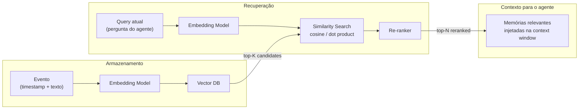

# Vector Recall — Recuperação por Similaridade

Vector recall permite que o agente **busque memórias episódicas por similaridade semântica**, usando embeddings armazenados em um vector database.

## Quando usar

- Agentes que precisam lembrar de interações passadas relevantes
- Cenários onde busca textual exata é insuficiente
- Personalização baseada em histórico do usuário
- Recuperação de decisões e outcomes anteriores

## Arquitetura



## Implementação

### O que armazenar

```python
memory_entry = {
    "timestamp": "2026-07-06T14:30:00Z",
    "user_id": "u_123",
    "type": "interaction",
    "summary": "cliente solicitou reembolso do pedido ORD-456",
    "outcome": "reembolso aprovado",
    "entities": ["ORD-456", "cliente@x.com"],
    "embedding": [...]  # vector float[]
}
```

### Metadata filtering

Sempre inclua **metadados estruturados** para filtrar antes da similaridade:

```python
results = vector_store.similarity_search(
    query=embed(question),
    k=20,
    filter={
        "user_id": user_id,
        "type": {"$in": ["interaction", "decision"]},
        "timestamp": {"$gte": seven_days_ago}
    }
)
```

### Re-ranking

Cosine similarity nem sempre reflete relevância contextual. Adicione uma etapa de re-ranking:

- Use um cross-encoder (modelo menor) para pontuar relevância
- Considere **recência** como fator de boost
- Penalize memórias conflitantes com o estado atual

```python
reranked = cross_encoder.rank(
    query=question,
    candidates=[m["summary"] for m in top_k_results]
)
final = [top_k_results[i] for i in reranked[:5]]
```

## Quando vector recall falha

- **Fatos estruturados** (relações): knowledge graph é superior
- **Fatos que mudam**: vector DB não tem invalidação nativa
- **Procedimentos**: memória procedural é mais adequada que episódica

## Considerações

- **Custo**: cada insert gasta uma chamada de embedding; cada recall também
- **Latência**: similaridade em escala requer índices aproximados (HNSW, IVFFlat)
- **Staleness**: memórias antigas podem ser irrelevantes — considere time-decay no score
- **Hit rate**: monitore quantas memórias recuperadas são efetivamente usadas

## Trade-offs

| Quando usar | Quando evitar |
|---|---|
| Recall semântico necessário | Consultas exatas e estruturadas |
| Dados não-estruturados (texto livre) | Relações complexas entre entidades |
| Personalização por histórico | Fatos imutáveis (prefira KB) |

## Referências

- ETHAGT05 Capítulo 4 — Memória vetorial para recall episódico
- LangChain — Vector store memory
- Pinecone, Weaviate, Qdrant — vector DB providers
- Re-ranking: Nogueira & Cho (2019) — *Cross-Encoder for passage re-ranking*
