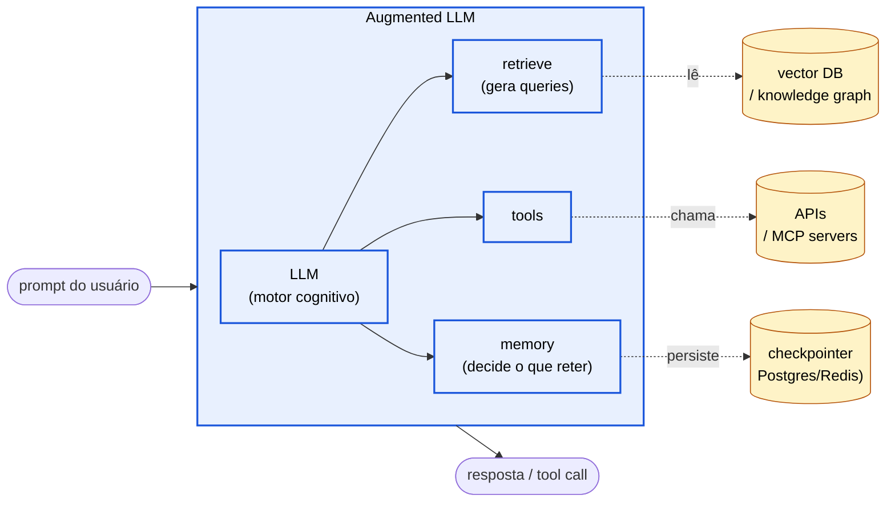

# Diagramas

## Augmented LLM

```mermaid
%% ETHAGT01 — O Augmented LLM (bloco fundamental)
%% Fonte: Anthropic, Building Effective Agents (2024)
flowchart LR
    subgraph AL["Augmented LLM"]
        direction TB
        LLM["LLM<br/>(motor cognitivo)"]
        LLM --> R["retrieve<br/>(gera queries)"]
        LLM --> T["tools<br/(escolhe e chama)"]
        LLM --> M["memory<br/>(decide o que reter)"]
    end
    R -.lê.-> V[("vector DB<br/>/ knowledge graph")]
    T -.chama.-> API[("APIs<br/>/ MCP servers")]
    M -.persiste.-> CP[("checkpointer<br/>Postgres/Redis)")]

    Prompt([prompt do usuário]) --> AL
    AL --> Resp([resposta / tool call])

    classDef blk fill:#e8f0fe,stroke:#1a56db,stroke-width:2px,color:#000
    classDef ext fill:#fef3c7,stroke:#b45309,stroke-width:1px,color:#000
    class AL,LLM,R,T,M blk
    class V,API,CP,Ext ext
```
